# Trees
A binary tree is a data structure in which each node has at most two children, referred to as the left child and the right child. 
Binary trees are used in various applications, such as searching, sorting, and hierarchical data structures like file systems.

## Terminologies
- **Node**: An element in the tree.
- **Root**: The top node of the tree.
- **Leaf**: The node with no children.
- **Edge**: The connection between two nodes.

Example:
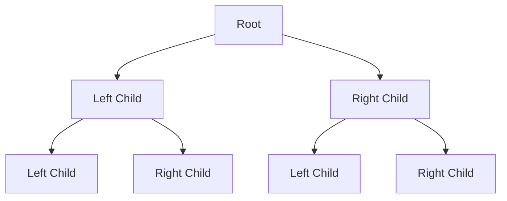

## Types:
### Full Binary Tree
Every node has either 0 or 2 children.
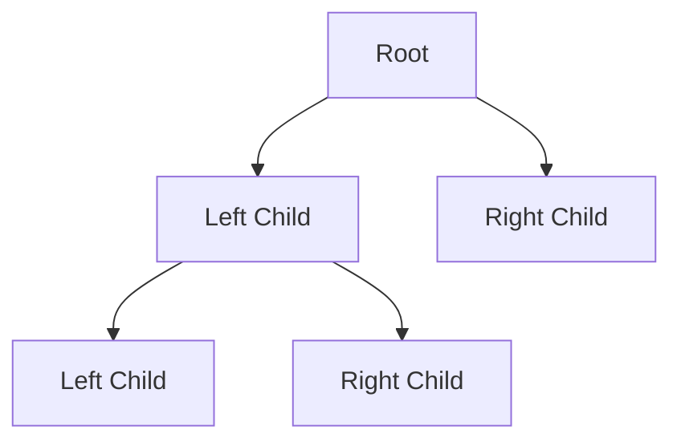

### Complete Binary Tree
All levels are completely filled except possibly the last level, which is filled from left to right.
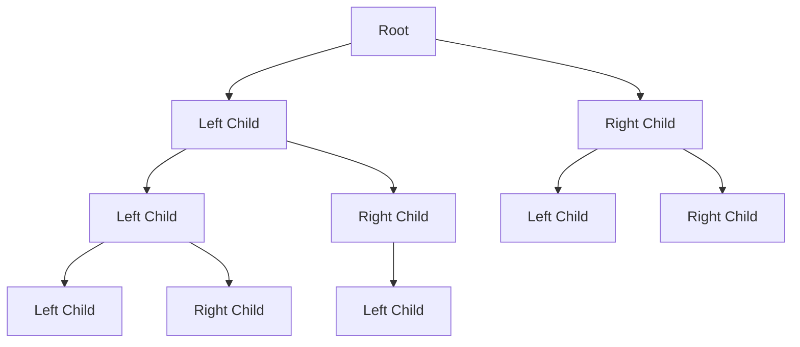

### Perfect Binary Tree
All the internal nodes have two children, and all leaves are at the same level.


### Balanced Binary Tree
The height of the left and right subtrees of any node differ by atmost one.
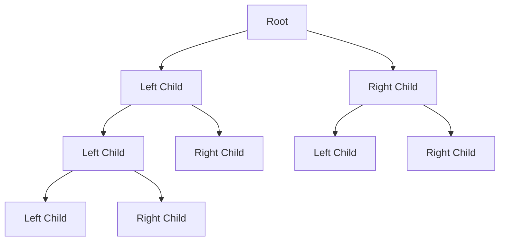

## Basic Structure
### Node class
Each node in the binary tree is represented by an instance of the `Node` class.
```python
class Node:
    def __init__(self, val):
        self.val = val
        self.left = None
        self.right = None
```

### Traversals
For the graph:
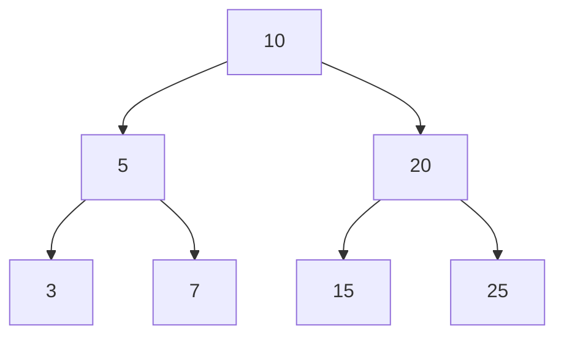
There are following traversals:
- **In-order Traversal**: Order(Left, Root, Right) - 3, 5, 7, 10, 15, 20, 25
- **Pre-order Traversal**: Order(Root, Left, Right) - 10, 5, 3, 7,20, 15, 25
- **Post-order Traversal**: Order(Left, Right, Root) - 3, 7, 5, 15, 25, 20, 10
- **Level-order Traversal**: Nodes level by level from left to right - 10, 5, 20, 3, 7, 15, 25

Code
```python
class BinaryTree:
    def __init__(self):
        self.root = None
    
    # In-order Traversal 
    def in_order_traversal(self, root):
        if root:
            self.in_order_traversal(root.left)
            print(root.val, end=', ')
            self.in_order_traversal(root.right)
    
    # Pre-order Traversal
    def pre_order_traversal(self, root):
        if root:
            print(root.val, end=', ')
            self.pre_order_traversal(root.left)
            self.pre_order_traversal(root.right)
    
    # Post-order Traversal
    def post_order_traversal(self, root):
        if root:
            self.post_order_traversal(root.left)
            self.post_order_traversal(root.right)
            print(root.val, end = ', ')
    
    # Level-order Traversal
    def level_order_traversal(self, root):
        if root is None:
            return
        queue = deque()
        queue.append(root)

        while queue:
            node = queue.popleft()
            print(node.val, end=', ')
            if node.left:
                queue.append(node.left)
            if node.right:
                queue.append(node.right)
```
**Fact: Inorder Traversal of a BST is always ordered.**

## Problems
### Binary Tree Level Order Traversal
Given the root of a binary tree, return the level order traversal of its nodes' values. (i.e., from left to right, level by level).

Example:
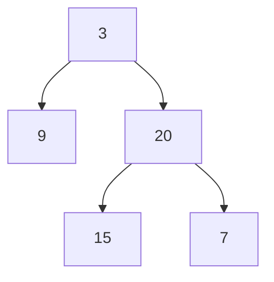
```
Input: root = [3,9,20,null,null,15,7]
Output: [[3],[9,20],[15,7]]
```
#### Intuition
- This would be similar to the BFS or level-order traversal that we have seen earlier.
- The only difference would be that we would empty the queue for at once for each level and populate it with the children.

Code
```python
def level_order(root):
    if root is None:
        return []
    
    queue = deque()
    queue.append(root)
    result = []

    while queue:
        level_nodes = []
        level_size = len(queue)

        for _ in range(level_size):
            node = queue.popleft()
            level_nodes.append(node.val)
            if node.left:
                queue.append(node.left)
            if node.right:
                queue.append(node.right)
        
        results.append(level_nodes)

    return result
```

### Binary Tree Right Side View
Given the root of a binary tree, imagine yourself standing on the right side of it, return the values of the nodes you can see ordered from top to bottom.

Example:

```
Input: root = [3,9,20,null,null,15,7]
Output: [3, 20, 7]
```

#### Intuition
This would be a small modification on the existing level order traversal, where for each level we have to just add the last node to the result.

```python
def rightSideView(root):
    if root is None:
        return []
    
    result = []
    queue = deque()
    queue.append(root)

    while queue:
        level_size = len(queue)

        for i in range(level_size):
            node = queue.popleft()

            # Add to the result for the last node in the level
            if i == level_size - 1:
                result.append(node.val)
            if node.left:
                queue.append(node.left)
            if node.right:
                queue.append(node.right)
    
    return result
```

### [Populating Next Right Pointers in Each Node](https://leetcode.com/problems/populating-next-right-pointers-in-each-node)
You are given a perfect binary tree where all leaves are on the same level, and every parent has two children. The binary tree has the following definition:
```
struct Node {
  int val;
  Node *left;
  Node *right;
  Node *next;
}
```
Populate each next pointer to point to its next right node. If there is no next right node, the next pointer should be set to `NULL`.

Initially, all next pointers are set to `NULL`.

Example
```
       1 -> NULL  
      / \  
     2 -> 3 -> NULL  
    / \  / \  
   4->5->6->7-> NULL

Input: root = [1,2,3,4,5,6,7]
Output: [1,#,2,3,#,4,5,6,7,#]

Explanation: Given the above perfect binary tree (Figure A), your function should populate each next pointer to point to its next right node, just like in Figure B. The serialized output is in level order as connected by the next pointers, with '#' signifying the end of each level.
```

#### Intuition
- **Level Order Traversal**: Level order traversal processes nodes level by level, which aligns perfectly with the requirement to connect nodes at the same level. It ensures that we have access to all nodes at a given level before moving on to the next level.
- **Connect Nodes**: For each node at the current level, set its next pointer to the next node in the queue if it is not the last node in that level. Enqueue the left and right children of each node to the queue for processing in the next level.
- **Handle End of Levels**: Ensure the last node in each level points to `NULL` by naturally avoiding setting the next pointer for the last node in the queue.

Code
```python
def connect(root):  
    # If the tree is empty, there is nothing to connect  
    if root is None:  
        return None  
      
    # Initialize the queue with the root node to start level order traversal  
    queue = deque()  
    queue.append(root)  
      
    # Perform level order traversal using the queue  
    while queue:  
        # Get the number of nodes at the current level  
        level_len = len(queue)  
          
        # Process all nodes at the current level  
        for i in range(level_len):  
            # Pop a node from the front of the queue  
            node = queue.popleft()  
              
            # Connect the node's next pointer to the next node in the queue if it is not the last node in this level  
            if i < (level_len - 1):  
                node.next = queue[0]  
              
            # Enqueue the left and right children of the node to process in the next level  
            if node.left:  
                queue.append(node.left)  
            if node.right:  
                queue.append(node.right)  
      
    # Return the root of the modified tree  
    return root
```

### [Vertical Order Traversal](https://leetcode.com/problems/vertical-order-traversal-of-a-binary-tree)*
Given the `root` of a binary tree, calculate the **vertical order traversal** of the binary tree.

For each node at position `(row, col)`, its left and right children will be at positions `(row + 1, col - 1)` and `(row + 1, col + 1)` respectively. The root of the tree is at `(0, 0)`.

The **vertical order traversal** of a binary tree is a list of top-to-bottom orderings for each column index starting from the leftmost column and ending on the rightmost column. There may be multiple nodes in the same row and same column. In such a case, sort these nodes by their values.
Return the ***vertical order traversal of the binary tree***.

#### Concept
In order to find the top view or the bottom view of the tree we use `horizontal distance` - the horizontal distance is updated as follows:
- left child: -1 from the current node's horizontal distance
- right child: +1 from the current node's horizontal distance

The origin of the horizontal distance is the root which is 0, the left child of the root would have -1 and the right would have +1.
For the top view, just take the first node in all the horizontal distance, for the bottom view take the last one.

#### Intuition
- In this problem we would handle both the `horizontal distance` and the `vertical distance`, but the grouping would be done by horizontal distance as it would act as the column and then we can go row-wise for each column.
- Once we have grouped all the nodes by their horizontal distance, ensure that we sort it by the vertical distance to maintain the order.

Code
```python
def verticalTraversal(root):
    horizontal_distance_map = defaultdict(list)
    
    def solve(root, vertical_distance, horizontal_distance):
        if root is None:
            return
        horizontal_distance_map[horizontal_distance].append((vertical_distance, root.val))
        if root.left:
            solve(root.left, vertical_distance+1, horizontal_distance -1)
        if root.right:
            solve(root.right, vertical_distance+1, horizontal_distance+1)
    
    solve(root, 0, 0)
    result = []
    for horizontal_distance in sorted(horizontal_distance_map.keys()):
        horizontal_distance_map[horizontal_distance].sort()
        result.append([val for vertical_distance, val in horizontal_distance_map[horizontal_distance]])
    
    return result
```

### Boundary Traversal
Given a Binary Tree, find its Boundary Traversal. The traversal should be in the following order: 

- **Left boundary nodes**: defined as the path from the root to the left-most node ie- the leaf node you could reach when you always travel preferring the left subtree over the right subtree. 
- **Leaf nodes**: All the leaf nodes except for the ones that are part of left or right boundary.
- **Reverse right boundary nodes**: defined as the path from the right-most node to the root. The right-most node is the leaf node you could reach when you always travel preferring the right subtree over the left subtree. Exclude the root from this as it was already included in the traversal of left boundary nodes.

#### Intuition
The intuition behind the solution involves breaking down the traversal into three parts:
- Left Boundary: Traverse the left boundary starting from the root, moving down to the left-most node, and excluding any leaf nodes.
- Leaf Nodes: Traverse all leaf nodes, ensuring not to include any nodes that are part of the left or right boundary.
- Right Boundary: Traverse the right boundary starting from the right-most leaf node, moving up to the root, and then reverse this list to maintain the correct order.

Code
```python
def boundaryOfBinaryTree(root):
    if not root:  
        return []  
        
    def isLeaf(node):  
        return not node.left and not node.right  
        
    def addLeftBoundary(node):  
        while node:  
            if not isLeaf(node):  
                boundary.append(node.val)  
            if node.left:  
                node = node.left  
            else:  
                node = node.right  
        
    def addLeaves(node):  
        if isLeaf(node):  
            boundary.append(node.val)  
            return  
        if node.left:  
            addLeaves(node.left)  
        if node.right:  
            addLeaves(node.right)  
        
    def addRightBoundary(node):  
        stack = []  
        while node:  
            if not isLeaf(node):  
                stack.append(node.val)  
            if node.right:  
                node = node.right  
            else:  
                node = node.left  
        while stack:  
            boundary.append(stack.pop())  
        
    boundary = []  
        
    if not isLeaf(root):  
        boundary.append(root.val)  
        
    if root.left:  
        addLeftBoundary(root.left)  
        
    addLeaves(root)  
        
    if root.right:  
        addRightBoundary(root.right)  
        
    return boundary
```

##### Iterative In-Order Traversal
The solution can be made more efficient by avoiding the need to store the entire in-order traversal in a list. Instead, using an iterative approach with a stack to perform the in-order traversal and stop as soon as you reach the kth smallest element. 

```python
def kthSmallest(root: TreeNode, k: int) -> int:  
    stack = []  
    current = root  
    count = 0  
      
    while stack or current:  
        # Go to the leftmost node  
        while current:  
            stack.append(current)  
            current = current.left  
          
        # Process the node  
        current = stack.pop()  
        count = count + 1  
          
        # If we've reached the kth node  
        if count == k:  
            return current.val  
          
        # Go to the right subtree  
        current = current.right
```

### [Construct Binary Tree from Preorder and Inorder Traversal](https://leetcode.com/problems/construct-binary-tree-from-preorder-and-inorder-traversal)
Given two integer arrays preorder and inorder where preorder is the preorder traversal of a binary tree and inorder is the inorder traversal of the same tree, construct and return the binary tree.

Example:
```
Input: preorder = [3,9,20,15,7], inorder = [9,3,15,20,7]
Output: [3,9,20,null,null,15,7]
```


#### Intuition
- **Preorder traversal** provides the root of the tree first.
- **Inorder traversal** provides the relative positions of nodes in the left and right subtrees.
- Using the root from the preorder array, we can split the inorder array into left and right subtrees. Recursively applying this process will help us reconstruct the entire tree.

Code
```python
def buildTree(preorder, inorder):
    if not preorder or inorder:
        return None

    # The first element in preorder is the root  
    root_val = preorder[0]  
    root = TreeNode(root_val)

    # Find the index of the root in inorder  
    root_index_in_inorder = inorder.index(root_val)  

    # Elements to the left of root_index_in_inorder are in the left subtree  
    left_inorder = inorder[:root_index_in_inorder]  
    # Elements to the right of root_index_in_inorder are in the right subtree  
    right_inorder = inorder[root_index_in_inorder + 1:]

    # The number of elements in the left subtree is len(left_inorder)  
    left_preorder = preorder[1:1 + len(left_inorder)]  
    right_preorder = preorder[1 + len(left_inorder):]

    # Recursively build the left and right subtrees  
    root.left = buildTree(left_preorder, left_inorder)  
    root.right = buildTree(right_preorder, right_inorder)  
  
    return root
```

### Invert Binary Tree
Given the root of a binary tree, invert the tree, and return its root.
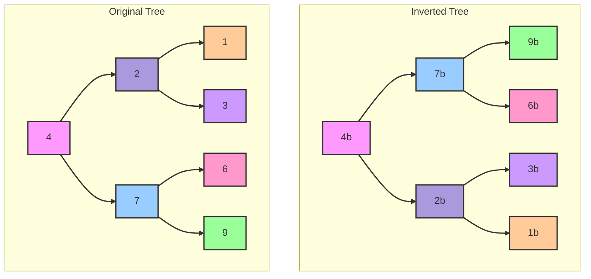

### Intuition
- We have to swap the children of the current node
- We we have recursively swap the left and right subtrees.

Code
```python
def invertTree(root):  
    # Base case: if the node is null, return null  
    if root is None:  
        return None  
      
    # Recursive case:  
    # Swap the left and right children  
    root.left, root.right = root.right, root.left  
      
    # Recursively invert the left and right subtrees  
    invertTree(root.left)  
    invertTree(root.right)  
      
    # Return the root node (which now represents the inverted tree)  
    return root
```

### [Maximum Depth of Binary Tree](https://leetcode.com/problems/maximum-depth-of-binary-tree)*
Given the root of a binary tree, return its maximum depth.

A binary tree's maximum depth is the number of nodes along the longest path from the root node down to the farthest leaf node.

#### Intuition
Check the height of both left and right subtree and choose the maximum one for the current node and do this recursively.

Code
```python
def max_depth(root):
    # Base condition: if root is None return 0 - tree empty
    if root is None:
        return 0
    return 1 + max(max_depth(root.left), max_depth(root.right))
```

### [Balanced Binary Tree](https://leetcode.com/problems/balanced-binary-tree)
Given a binary tree, determine if it is height-balanced.
`height-balanced`: A height-balanced binary tree is a binary tree in which the depth of the two subtrees of every node never differs by more than one.

Example 1:
```
Input: root = [3, 9, 20, null, null, 15, 7]
Output: true
```


Example 2:
Input: root = [1, 2, 2, 3, 3, null, null, 4, 4]
Output: False
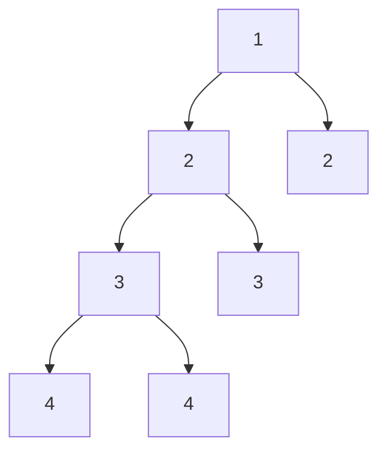
Explanation: The difference between the height of left and right subtree at root is: |3 - 1| = 2 (which is greater than 1, thus it is not balanced).

#### Intuition
- Compare the height of the left and the right subtree and check if the `absolute difference` is lesser than 1.
- Also we need to keep track if any of the subtrees are imbalanced as that would also mean that the entire tree as a whole is not balanced.

Code
```python
def is_balanced(root):
    def solve(root):
        if root is None:
            return (True, 0) # we use a tuple to pass both the height as well the balance status

        is_left_balanced, left_height = solve(root.left)
        is_right_balanced, right_height = solve(root.right)

        # Tree would be balanced only if left is balanced, right is balanced and the height difference of the left and right subtree is less than equal to 1  
        is_balanced = is_left_balanced and is_right_balanced and abs(left_height - right_height) <= 1

        return (is_balanced, 1 + max(left_height, right_height))

    is_balanced, _ = solve(root)
    return is_balanced
```
### [Same Tree](https://leetcode.com/problems/same-tree)
Given the roots of two binary trees p and q, write a function to check if they are the same or not.

Two binary trees are considered the same if they are structurally identical, and the nodes have the same value.

Example 1:
```
Input: p = [1, 2, 3], q = [1, 2, 3]
Output: true
``` 

#### Intuition
- Check for the node by node for both the graph.
- Recursively traverse to both the subtrees and check if both the left subtrees are same and both the right subtrees are same.

Code
```python
def is_same_tree(p, q):
    if p is None and q is None:
        return True
    if p is None or q is None:
        return False
    if p.val != q.val:
        return False
    return is_same_tree(p.left, q.left) and is_same_tree(p.right, q.right)
```

### [Subtree of Another Tree](https://leetcode.com/problems/subtree-of-another-tree)
Given the roots of two binary trees root and subRoot, return true if there is a subtree of root with the same structure and node values of subRoot and false otherwise.

A subtree of a binary tree tree is a tree that consists of a node in tree and all of this node's descendants. The tree tree could also be considered as a subtree of itself.

Explanation:
```
Input: root = [3, 4, 5, 1, 2], subRoot = [4, 1, 2]
Output: True
```
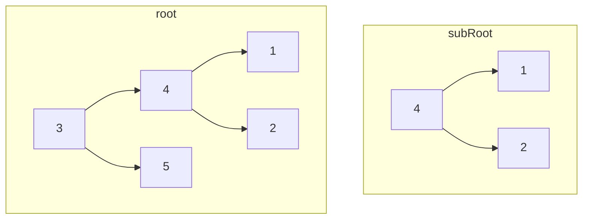

#### Intuition
- If the nodes match - we can do the `isSameTree` match that we have already seen earlier - taking node from the main graph and root from the subRoot
- Else, try with the left and the right subtree.

```python
def isSubTree(root, subRoot):
    if root is None:
        return False

    if root.val == subRoot.val and isSameTree(root, subRoot):
        return True
    return isSubTree(root.left, subRoot) and isSubTree(root.right, subRoot) 
```

### Lowest Common Ancestor of a Binary Tree
Given a binary tree, find the lowest common ancestor (LCA) of two given nodes in the tree.

*The lowest common ancestor is defined between two nodes p and q as the lowest node in T that has both p and q as descendants (where we allow a node to be a descendant of itself).*

Example
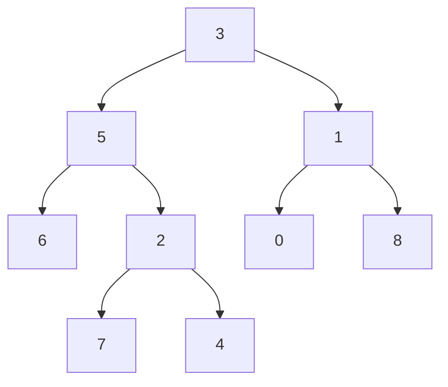
```
Input: root = [3,5,1,6,2,0,8,null,null,7,4], p = 5, q = 1
Output: 3
Explanation: The LCA of nodes 5 and 1 is 3.
```

#### Intuition
To find the lowest common ancestor of two nodes p and q in a binary tree, we can use a recursive approach. The idea is to traverse the tree from the root and look for the nodes p and q. We can use the following logic:
- **Base Case**: If the current node is None, return None. This means we have reached the end of a path without finding either p or q.
- If the current node is either p or q, return the current node. This means we have found one of the nodes.
- **Recursion**: Recursively search for p and q in the left and right subtrees.
- **Result Combination**:
  - If both the left and right recursive calls return non-None results, it means p and q are found in different subtrees of the current node, so the current node is their LCA.
  - If only one of the recursive calls returns a non-None result, return that result because it means both p and q are located in one subtree.

Code
```python
def lca(root, p, q):
    # Base case  
    if not root:  
        return None  
    if root == p or root == q:  
        return root  
        
    # Recursively find p and q in the left and right subtrees  
    left = lca(root.left, p, q)  
    right = lca(root.right, p, q)  
        
    # If both left and right are not None, it means p and q are found in different subtrees  
    if left and right:  
        return root  
        
    # Otherwise, return the non-None child  
    return left if left else right 
```

### [Diameter of Binary Tree](https://leetcode.com/problems/diameter-of-binary-tree)
Given the root of a binary tree, return the length of the diameter of the tree.
The diameter of a binary tree is the length of the longest path between any two nodes in a tree. This path may or may not pass through the root.
The length of a path between two nodes is represented by the number of edges between them.

Example:
```
Input: root = [1, 2, 3, 4, 5]
Output: 3
```
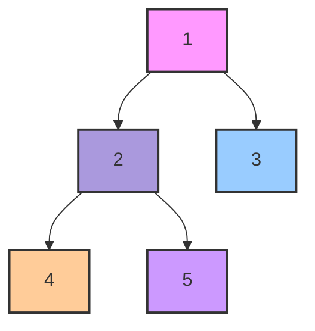
Explanation: Diameter: 4->2->1->3 = 3

#### Intuition
The diameter of a binary tree is the length of the longest path between any two nodes. This path may or may not pass through the root. To solve this problem, we need to consider the following:
- The longest path might pass through the root.
- The longest path might be entirely within the left subtree.
- The longest path might be entirely within the right subtree.

To find the longest path passing through any node, we can use the height (or depth) of the subtrees. The longest path through any node is the sum of the heights of its left and right subtrees.

```python
def diameter_binary_tree(root):
    # initialize maximum diameter
    max_diameter = [0]

    def depth(root):
        if not root:
            return 0
        
        # Recursively get the height of the left and the right subtrees
        left_height = depth(root.left)
        right_height = depth(root.right)

        # The diameter passign through this node is left_height + right_height
        max_diameter[0] = max(max_diameter[0], left_height + right_height)

        # Return the height of the current node
        return max(left_height, right_height) + 1
    
    depth(root)
    return max_diameter[0]
```

### [Binary Tree Maximum Path Sum](https://leetcode.com/problems/binary-tree-maximum-path-sum)
Refer DP on Trees in Dynamic Programming

### [Cound Good Nodes in Binary Tree](https://leetcode.com/problems/count-good-nodes-in-binary-tree)*
Given a binary tree `root`, a node `X` in the tree is named **good** if in the path from root to `X` there are no nodes with a value greater than `X`.

Return the number of **good** nodes in the binary tree.

Example:
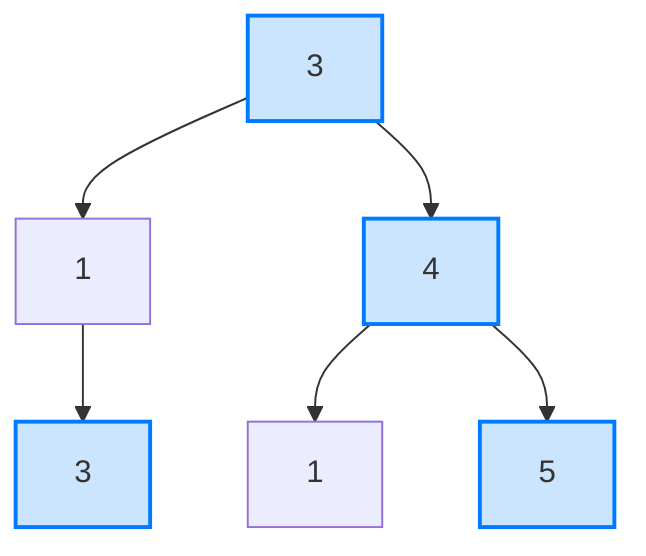
```
Input: root = [3,1,4,3,null,1,5]
Output: 4

Explanation: Nodes in blue are good.
Root Node (3) is always a good node.
Node 4 -> (3,4) is the maximum value in the path starting from the root.
Node 5 -> (3,4,5) is the maximum value in the path
Node 3 -> (3,1,3) is the maximum value in the path.
```

#### Intuition
A node in a binary tree is considered "good" if the value of the node is greater than or equal to the maximum value encountered on the path from the root to that node. The root node is always considered a good node since there are no other nodes on the path from the root to itself.

To find all the good nodes in a binary tree, we can use Depth-First Search (DFS) to traverse the tree while keeping track of the maximum value encountered along the path. At each node, if the node's value is greater than or equal to the maximum value so far, it's considered a good node.

Code
```python
def goodNodes(root: TreeNode) -> int:
    def dfs(node, max_val):  
        if not node:  
            return 0
            
        # Check if the current node is a good node  
        is_good = node.val >= max_val  
        count = 1 if is_good else 0  
            
        # Update the maximum value for the path  
        new_max_val = max(max_val, node.val)  
            
        # Recur for left and right subtrees  
        count = count + dfs(node.left, new_max_val)  
        count = count + dfs(node.right, new_max_val)  
            
        return count  
    
    return dfs(root, root.val)
```

### [Serialize and Deserialize Binary Tree](https://leetcode.com/problems/serialize-and-deserialize-binary-tree)
Serialization is the process of converting a data structure or object into a sequence of bits so that it can be stored in a file or memory buffer, or transmitted across a network connection link to be reconstructed later in the same or another computer environment.

Design an algorithm to serialize and deserialize a binary tree. There is no restriction on how your serialization/deserialization algorithm should work. You just need to ensure that a binary tree can be serialized to a string and this string can be deserialized to the original tree structure.

Clarification: The input/output format is the same as how LeetCode serializes a binary tree. You do not necessarily need to follow this format, so please be creative and come up with different approaches yourself.

Example:
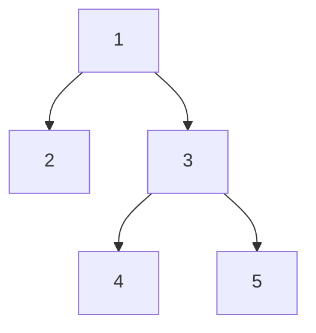
```
Input: root = [1,2,3,null,null,4,5]
Output: [1,2,3,null,null,4,5]
```

#### Intuition
To serialize and deserialize a binary tree, we can use a level-order traversal approach with a marker for null nodes. This way, we can reconstruct the exact tree structure during deserialization.

- **Serialization**: Use level-order traversal to convert the tree into a string. Use a marker (e.g., #) to represent null nodes.
- **Deserialization**: Use the serialized string to reconstruct the binary tree by reading the values in the same level-order sequence.

Code
```python
class Codec:  
    def serialize(self, root):  
        """Encodes a tree to a single string."""  
        if not root:  
            return ""  
          
        result = []  
        queue = deque([root])  
          
        while queue:  
            node = queue.popleft()  
            if node:  
                result.append(str(node.val))  
                queue.append(node.left)  
                queue.append(node.right)  
            else:  
                result.append("#")  
          
        return ','.join(result)
  
    def deserialize(self, data):  
        """Decodes your encoded data to tree."""  
        if not data:  
            return None  
        
        values = data.split(',')  
        root = TreeNode(int(values[0]))  
        queue = deque([root])  
        index = 1  
        
        while queue:  
            node = queue.popleft()  
            
            if values[index] != "#":  
                node.left = TreeNode(int(values[index]))  
                queue.append(node.left)  
            index += 1  
            
            if values[index] != "#":  
                node.right = TreeNode(int(values[index]))  
                queue.append(node.right)  
            index += 1  
        
        return root
```

### [Path Sum II](https://leetcode.com/problems/path-sum-ii)
Given the `root` of a binary tree and an integer `targetSum`, return all root-to-leaf paths where the sum of the node values in the path equals `targetSum`. Each path should be returned as a list of the node values, not node references.
A **root-to-leaf path** is a path starting from the root and ending at any leaf node. A **leaf** is a node with no children.

#### Intuition
Perform in-order traversal on the binary tree and keep appending to the path till you encounter a leaf node and then check for the path sum. If equal add to the result else continue with the rest of the traversal.

Code
```python
def pathSum(root, targetSum):
    if root is None:
        return []
    
    result = []

    def dfs(root, path):
        path.append(root.val)

        if root.left is None and root.right is None and sum(path) == targetSum:
            result.append(path[:])
        
        if root.left:
            dfs(root.left, path)
        
        if root.right:
            dfs(root.right, path)
        
        path.pop()
    
    dfs(root, [])
    return result
```

### Flatten Binary Tree to Linked List
Given the root of a binary tree, flatten the tree into a "linked list":
- The "linked list" should use the same `TreeNode` class where the right child pointer points to the next node in the list and the left child pointer is always null.
- The "linked list" should be in the same order as a pre-order traversal of the binary tree.

Example:
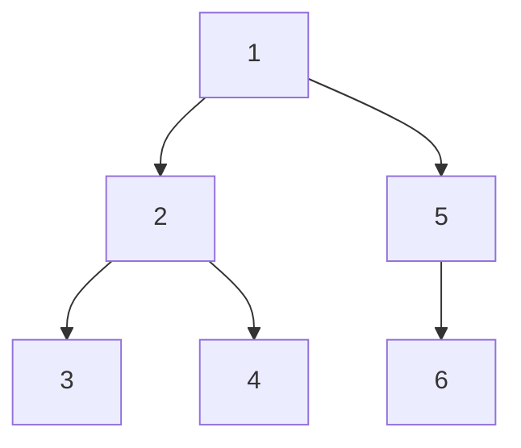
To
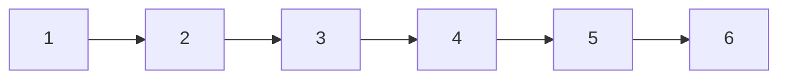

#### Intuition
- **Base Condition**: If the root is None, there is nothing to flatten, so we return immediately.
- **Recursive Hypothesis**:
  - We recursively flatten both the left and the right subtrees.
  - After these recursive calls, we can assume that the left and right subtrees of the current node (root) are already flattened.
- **Induction Step**:
  - **Move Left Subtree to Right**: Assign the left subtree to the right pointer of the current node (root). This effectively moves the entire left subtree to the right.
  - **Traverse to End of New Right Subtree**: Traverse to the end of the newly assigned right subtree (which was originally the left subtree). Finally, attach the original right subtree (stored in temp) to the end of the current right subtree.


Code
```python
def flatten(root):
    """
    Do not return anything, modify root in-place instead.
    """
    # Base Condition
    if not root:
        return

    # Hypothesis - flatten both the left and the right subtree
    self.flatten(root.left)
    self.flatten(root.right)

    # Induction - Move the left subtree to the right, set the left child to None
    temp = root.right
    root.right = root.left
    root.left = None

    # Traverse to the end of the right subtree and attach the original right subtree to the end of the new right subtree
    curr = root
    while curr.right:
        curr = curr.right
    
    curr.right = temp
```

## Binary Search Tree
A binary tree in which each node has a key, and every node's key is greater than the keys in its left subtree and less than the keys in its right subtree.
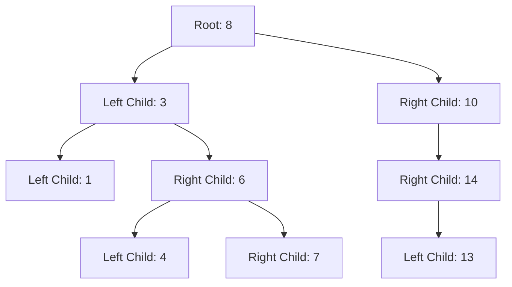

### [Validate Binary Search Tree](https://leetcode.com/problems/validate-binary-search-tree)
Given the root of a binary tree, determine if it is a valid binary search tree (BST).

A valid BST is defined as follows:
- The left subtree of a node contains only nodes with keys less than the node's key.
- The right subtree of a node contains only nodes with keys greater than the node's key.
- Both the left and right subtrees must also be binary search trees.

#### Intuition
- To validate if a binary tree is a BST, we need to ensure that for every node, all nodes in its left subtree are less than the node's value, and all nodes in its right subtree are greater than the node's value. 
- We can achieve this by using a recursive approach where we pass down the allowable range for node values.

For each node, we:
- Check if the node’s value is within the allowable range.
- Recursively validate the left subtree with an updated range where the upper bound is the current node’s value.
- Recursively validate the right subtree with an updated range where the lower bound is the current node’s value.

Code
```python
def is_valid_BST(root):
    def validate(root, low, high):
        # An empty tree is a valid BST
        if not root:
            return True

        # The current node's value must be between low and high  
        if not (low < node.val < high):
            return False
        
        # The left and right subtree must also be valid
        return validate(node.left, low, node.val) and validate(node.right, node.val, high)
    
    # For the root the boundary would be the maximum possible
    return validate(root, float('-inf'), float('inf'))
```

### [Convert Sorted Array to Binary Search Tree](https://leetcode.com/problems/convert-sorted-array-to-binary-search-tree)
Given an integer array `nums` where the elements are sorted in **ascending order**, convert it to a *height-balanced binary search tree*.

Example
```mermaid
graph TD;  
    A[0]  
    B[-3]  
    C[9]  
    D[-10]  
    E[5]  
  
    A --> B  
    A --> C  
    B --> D  
    C --> E
```
```
Input: nums = [-10,-3,0,5,9]
Output: [0,-3,9,-10,null,5]
Explanation: [0,-10,5,null,-3,null,9] is also accepted  
```

#### Intuition
- **Balanced BST Requirement**: To create a height-balanced binary search tree (BST) where for any given node, the depths of its two subtrees should not differ by more than one.
- **Recursive Solution**:
  - Given the sorted nature of the array, the **middle** element naturally becomes the `root` of the BST. 
  - This is because the middle element divides the array into two halves, ensuring that the `left` half contains elements **less** than the `root` and the `right` half contains elements **greater** than the `root`.
  - Recursively apply this logic to the `left` and `right` halves to construct the `left` and `right` subtrees, respectively.
- **Base Condition**: When the left pointer crosses the right pointer.

Code
```python
def sortedArrayToBST(nums):  
    n = len(nums)  
      
    # Helper function to construct the BST recursively  
    def solve(left, right):  
        # Base case: if the left index exceeds the right, return None (no tree)  
        if left > right:  
            return None  
          
        # Find the middle element to be the root of the current subtree  
        mid = left + (right - left) // 2  
        root = TreeNode(nums[mid])  
          
        # Recursively construct the left subtree using the left half of the current segment  
        root.left = solve(left, mid - 1)  
          
        # Recursively construct the right subtree using the right half of the current segment  
        root.right = solve(mid + 1, right)  
          
        return root  
      
    # Start the recursion with the entire array  
    return solve(0, n - 1)
```

### [Lowest Common Ancestor of a Binary Search Tree](https://leetcode.com/problems/lowest-common-ancestor-of-a-binary-search-tree)*
Given a binary search tree (BST), find the lowest common ancestor (LCA) node of two given nodes in the BST.

According to the definition of LCA on Wikipedia: “The lowest common ancestor is defined between two nodes p and q as the lowest node in T that has both p and q as descendants (where we allow a node to be a descendant of itself).”

Example:
```
Input: root = [6,2,8,0,4,7,9,null,null,3,5], p = 2, q = 8
Output: 6
```
```mermaid 
graph TD  
    A[6]  
    B[2]  
    C[8]  
    D[0]  
    E[4]  
    F[7]  
    G[9]  
    H[3]  
    I[5]  
    A --> B  
    A --> C  
    B --> D  
    B --> E  
    C --> F  
    C --> G  
    E --> H  
    E --> I
```
Explanation: The LCA of nodes 2 and 8 is 6.

#### Intuition
- **Binary Search Tree Property**:
  - In a BST, the left subtree of a node contains only nodes with values less than the node's value.
  - The right subtree of a node contains only nodes with values greater than the node's value.
- **Navigating the Tree**:
  - If both nodes p and q are greater than the current node, then the LCA must be in the right subtree.
  - If both nodes p and q are less than the current node, then the LCA must be in the left subtree.
  - If one node is on one side (left) and the other node is on the other side (right) of the current node, then the current node is the LCA.

Code
```python
def lca(root, p, q):
    if p.val < root.val and q.val < root.val:
        return lca(root.left, p, q)
    if p.val > root.val and q.val > root.val:
        return lca(root.right, p, q)
    return root
```

### [Kth Smallest Element in BST](https://leetcode.com/problems/kth-smallest-element-in-a-bst)
Given the root of a binary search tree, and an integer k, return the kth smallest value (1-indexed) of all the values of the nodes in the tree.

Example:
```
Input: root = [3,1,4,null,2], k = 1
Output: 1
```
```mermaid
graph TD  
    A3[3]  
    B1[1]  
    C4[4]  
    D2[2]  
      
    A3 --> B1  
    A3 --> C4  
    B1 --> D2
```

#### Naive Solution
##### Intuition
- To find the kth smallest element in a BST, we can take advantage of the in-order traversal property of BSTs. **In-order traversal of a BST visits the nodes in ascending order**. 
- Therefore, performing an in-order traversal and keeping track of the count of nodes visited will allow us to find the kth smallest element.

Code
```python
def kthSmallest(root, k):
    # Helper function to perform in-order traversal  
    def in_order_traversal(node):  
        if node is None:  
            return []  
  
        # Traverse the left subtree, then the current node, and finally the right subtree  
        return in_order_traversal(node.left) + [node.val] + in_order_traversal(node.right)  
      
    # Perform in-order traversal to get all elements in sorted order  
    sorted_elements = in_order_traversal(root)  
      
    # Return the k-1th element since k is 1-indexed  
    return sorted_elements[k-1]
```

#### Optimal Solution
##### Intuition
The naive solution performs a full in-order traversal of the tree, which can be inefficient for large trees. Instead, we can optimize the approach by performing an in-order traversal but stopping as soon as we reach the k-th smallest element. This way, we avoid traversing the entire tree.
In-Order Traversal with Early Stopping using a counter to keep track of the number of nodes visited and stop the traversal as soon as the counter reaches k.

Code
```python
def kthSmallest(root, k):  
    # Initialize the counter and the result  
    count = 0  
    result = None  
      
    # Helper function to perform in-order traversal with early stopping  
    def in_order_traversal(node):  
        nonlocal count, result  
        if node is None or result is not None:  
            return  
          
        # Traverse the left subtree  
        in_order_traversal(node.left)  
          
        # Visit the current node  
        count += 1  
        if count == k:  
            result = node.val  
            return  
          
        # Traverse the right subtree  
        in_order_traversal(node.right)  
      
    # Start the in-order traversal  
    in_order_traversal(root)  
      
    return result
```

**For the Kth Largest Element in BST, traverse the right subtree, then root and then the left subtree - Reverse Inorder Traversal**

### Inorder Successor of BST
Given a BST, and a reference to a Node x in the BST. Find the Inorder Successor of the given node in the BST.

Example
```mermaid
graph TD;  
    A[2] --> B[1]  
    A[2] --> C[3]  
    style A fill:#f9f,stroke:#333,stroke-width:4px;
```
```
K(data of x) = 2
Output: 3 
Explanation: 
Inorder traversal : 1 2 3 
Hence, inorder successor of 2 is 3.
```

#### Intuition
In a Binary Search Tree (BST), the inorder traversal visits nodes in ascending order. The inorder successor of a node x is the node that appears immediately after x in this traversal. To find the inorder successor, we can leverage the properties of the BST:
- **Right Subtree Check**: If x has a right subtree, the inorder successor is the leftmost node in that right subtree. This is because the leftmost node in the right subtree is the smallest node that is greater than x.
- **Ancestor Check**: If x does not have a right subtree, the inorder successor is one of its ancestors. Specifically, it is the nearest ancestor for which x is in the left subtree. This is because such an ancestor is the next node in the ascending order traversal.

Code
```python
def inorderSuccessor(root, x):
    successor = None
    
    def inorder(root):
        nonlocal successor
        if root.data > x.data:
            successor = root
            if root.left:
                inorder(root.left)
        else:
            if root.right:
                inorder(root.right)
    
    inorder(root)
    return successor
```

### [Closest Nodes Query in BST](https://leetcode.com/problems/closest-nodes-queries-in-a-binary-search-tree)
You are given the root of a binary search tree and an array queries of size n consisting of positive integers.

Find a 2D array answer of size `n` where `answer[i] = [mini, maxi]`:
- mini is the largest value in the tree that is smaller than or equal to queries[i]. If a such value does not exist, add -1 instead.
- maxi is the smallest value in the tree that is greater than or equal to queries[i]. If a such value does not exist, add -1 instead.

Return the array answer.

#### Intuition
In a Binary Search Tree (BST), for any given node, all nodes in the left subtree are smaller and all nodes in the right subtree are larger. This property allows us to efficiently find the floor and ceil values for any given query by traversing the tree.
- **Floor Value**: The largest value in the BST that is smaller than or equal to the given value. To find this, we move to the right subtree whenever the current node's value is smaller than the query value.
- **Ceil Value**: The smallest value in the BST that is greater than or equal to the given value. To find this, we move to the left subtree whenever the current node's value is greater than the query value.

Code
```python
def closestNodes(root, queries):
    def find_floor_and_ceil(root, val):
        nonlocal floor, ceil
        if not root:
            return
        if root.val == val:
            floor = ceil = root.val
        elif root.val < val:
            # If the current node's value is less than the query value
            floor = root.val # update floor
            find_floor_and_ceil(root.right, val) # move to the right subtree
        else:
            # If the current node's value is greater than the query value
            ceil = root.val # update ceil
            find_floor_and_ceil(root.left, val) # move to the left subtree
    
    result = []
    for val in queries:
        floor, ceil = -1, -1
        find_floor_and_ceil(root, val)
        result.append([floor, ceil])
    
    return result
```

### [Binary Search Tree Iterator](https://leetcode.com/problems/binary-search-tree-iterator)
Implement the `BSTIterator` class that represents an iterator over the in-order traversal of a binary search tree (BST):
- **BSTIterator(TreeNode root)**: Initializes an object of the BSTIterator class. The root of the BST is given as part of the constructor. The pointer should be initialized to a non-existent number smaller than any element in the BST.
- **boolean hasNext()**: Returns true if there exists a number in the traversal to the right of the pointer, otherwise returns false.
- **int next()**: Moves the pointer to the right, then returns the number at the pointer.

Notice that by initializing the pointer to a non-existent smallest number, the first call to next() will return the smallest element in the BST.
You may assume that next() calls will always be valid. That is, there will be at least a next number in the in-order traversal when next() is called.

#### Intuition
The Binary Search Tree (BST) Iterator needs to simulate an in-order traversal of the BST. In an in-order traversal, nodes are visited in ascending order (left-root-right). To efficiently implement this, we use a stack to track the nodes. Here's the intuition behind the solution:
- **Stack Usage**: The stack is used to simulate the recursion stack of an in-order traversal. We push all left children of the current node onto the stack.
- **Initialization**: When the iterator is initialized, we push all the left children of the root onto the stack. This ensures that the smallest element is on top of the stack.
- **next() Method**: The next element is the top of the stack. After popping the top element, we push all the left children of its right child onto the stack.
- **hasNext() Method**: This method checks if there are any elements left to visit by checking if the stack is empty.

Code
```python
class BSTIterator:
    def __init__(self, root: Optional[TreeNode]):
        self.stack = []
        self._push_all(root)
    
    def _push_all(self, root):
        while root:
            self.stack.append(root)
            root = root.left

    def next(self) -> int:
        node = self.stack.pop()
        self._push_all(node.right)
        return node.val

    def hasNext(self) -> bool:
        return len(self.stack) != 0
```

### [Two Sum IV - Input is a BST](https://leetcode.com/problems/two-sum-iv-input-is-a-bst)
Given the `root` of a binary search tree and an integer `k`, return `true` *if there exist two elements in the BST such that their sum is equal to `k`*, or `false` otherwise.

#### Intuition
To solve the problem, we can use a two-pointer technique, which is commonly used in array problems to find pairs that sum up to a target value. Here, we adapt this technique to work with the BST by utilizing two iterators:
- **BST Iterator**: This iterator traverses the BST in ascending order (in-order traversal).
- **Reverse BST Iterator**: This iterator traverses the BST in descending order (reverse in-order traversal).

The main idea is to simulate the two-pointer approach using the two iterators by moving them according to the condition until they cross or reach the target sum.

The rationale behind this approach is that by traversing the BST from both ends simultaneously, we can efficiently narrow down the potential pairs of values that may sum up to k. This method avoids the need for a full traversal of the tree for each potential pair, thus optimizing the search process.

Code
```python
def findTarget(root, k):  
    # Define an iterator to traverse the BST in ascending order  
    class BSTIterator:  
        def __init__(self, root):  
            self.stack = []  
            self._push_all(root)  
          
        def _push_all(self, root):  
            # Push all the left children to the stack  
            while root:  
                self.stack.append(root)  
                root = root.left  
          
        def next(self):  
            # Pop the top element from the stack and push its right child and all left children  
            node = self.stack.pop()  
            self._push_all(node.right)  
            return node.val  
          
        def has_next(self):  
            return len(self.stack) > 0  
  
    # Define an iterator to traverse the BST in descending order  
    class ReverseBSTIterator:  
        def __init__(self, root):  
            self.stack = []  
            self._push_all(root)  
          
        def _push_all(self, root):  
            # Push all the right children to the stack  
            while root:  
                self.stack.append(root)  
                root = root.right  
          
        def next(self):  
            # Pop the top element from the stack and push its left child and all right children  
            node = self.stack.pop()  
            self._push_all(node.left)  
            return node.val  
          
        def has_next(self):  
            return len(self.stack) > 0  
  
    # Initialize the two iterators  
    bst = BSTIterator(root)  
    rev_bst = ReverseBSTIterator(root)  
  
    # Get the smallest and largest values from the BST  
    left = bst.next()  
    right = rev_bst.next()  
  
    # Two-pointer technique to find two elements that sum up to k  
    while left < right:  
        s = left + right  
        if s == k:  
            return True  
        elif s < k:  
            if not bst.has_next():  
                return False  
            left = bst.next()  
        else:  
            if not rev_bst.has_next():  
                return False  
            right = rev_bst.next()  
  
    return False
```

### [Maximum Sum BST in Binary Tree](https://leetcode.com/problems/maximum-sum-bst-in-binary-tree)
Given a binary tree root, return the maximum sum of all keys of any sub-tree which is also a Binary Search Tree (BST).

Assume a BST is defined as follows:
- The left subtree of a node contains only nodes with keys less than the node's key.
- The right subtree of a node contains only nodes with keys greater than the node's key.
- Both the left and right subtrees must also be binary search trees.

Example
```mermaid
graph TD;  
    A[1]  
    B[4]  
    C[3]  
    D[2]  
    E[4]  
    F[2]  
    G[5]  
    H[4]  
    I[6]  
  
    A --> B  
    A --> C  
    B --> D  
    B --> E  
    C --> F  
    C --> G  
    G --> H  
    G --> I  
  
    subgraph BST
        direction TB  
        C  
        F  
        G  
        H  
        I  
    end  
```

```
Input: root = [1,4,3,2,4,2,5,null,null,null,null,null,null,4,6]
Output: 20
Explanation: Maximum sum in a valid Binary search tree is obtained in root node with key equal to 3.
```

#### Intuition
- **Binary Search Tree (BST) Properties**: A BST is a binary tree where for each node, all values in the left subtree are smaller, and all values in the right subtree are larger.
- **Tree Traversal**: Use postorder traversal (left, right, root) to visit nodes. This helps validate and compute the sum of a subtree after visiting all its children.
- **Validity Check**: For each node, determine if the subtree rooted at that node is a valid BST by ensuring the maximum value in the left subtree is less than the node’s value and the minimum value in the right subtree is greater than the node’s value.
- **Sum Calculation**: If a subtree is a valid BST, calculate its sum by adding the values of all nodes in the subtree. Keep track of the maximum sum encountered.
- **Aggregate Results**: Update the maximum sum whenever a new valid BST with a greater sum than previously found is encountered.

```python 
def maxSumBST(self, root: Optional[TreeNode]) -> int:  
    def solve(node):  
        nonlocal max_sum  
        if node is None:  
            # Base case: If the node is None, it's a valid BST with sum 0 and extreme min/max values  
            return True, 0, float('inf'), float('-inf')  # isBST, sum, min, max  
        
        # Recursively check the left and right subtrees  
        left_is_bst, left_sum, left_min, left_max = solve(node.left)  
        right_is_bst, right_sum, right_min, right_max = solve(node.right)  
            
        # Check if the current node's subtree is a valid BST  
        if left_is_bst and right_is_bst and left_max < node.val < right_min:  
            # Calculate the current subtree's sum  
            current_sum = left_sum + node.val + right_sum  
            # Update the maximum sum if the current subtree's sum is greater  
            max_sum = max(max_sum, current_sum)  
            # Return the status of BST, current subtree sum, and updated min/max values  
            return True, current_sum, min(left_min, node.val), max(right_max, node.val)  
            
        # If it's not a valid BST, return False and reset sum and extreme min/max values  
        return False, 0, float('-inf'), float('inf')  
        
    # Initialize the maximum sum to 0  
    max_sum = 0  
    # Start the recursive solve function from the root  
    solve(root)  
    # Return the maximum sum of all valid BSTs found  
    return max_sum    
```
