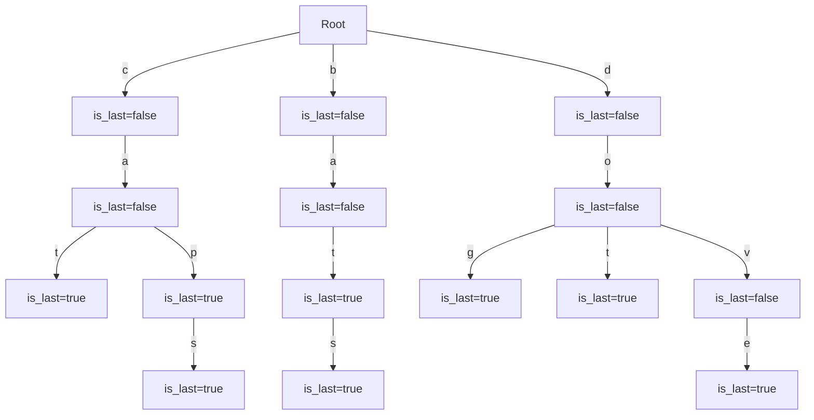

# Tries
A Trie (pronounced as "try") is a type of search tree—an ordered data structure used to store a dynamic set or associative array where the keys are usually strings. 

## Components of Trie:
- **Node**:
  - dictionary to store the children from this node 
  - flag to mark whether it is the last character of an input
  - doesn't store the actual character
- **Edges**:
  - each edge represents the transition from current character to the next possible one in the string.
  - the edge is labelled with a character from the input
- **Children**:
  - store the character as key and the child node as value possible from the current node.
- **Root**:
  - Empty node with the children declared marking the starting of the inputs.

## Diagram:
Here's an example of a Mermaid diagram for a trie containing the words "cat," "cap," and "bat":



## Identification
Look at the following keywords in the problem:
- dictionary
- prefix tree
- word search

## Code
The node definition for a trie would look like:
```python
class TrieNode:
    def __init__(self, is_last=False):
        # flag to check if this node represents the end of a word 
        self.is_last = is_last
        # dictionary to store children nodes where the key is a character and the value is another TrieNode
        self.characters = dict()
```

The code for a Trie with insertion and search would look like:
```python
class Trie:
    def __init__(self):
        self.root = TrieNode()
    
    def insert(self, word):
        node = self.root

        for char in word:
            # if the character is not already a child of the current node, add it 
            if char not in node.characters:
                node.characters[char] = TrieNode()
            node = node.characters[char]
        
        # mark the last node as the end of the word
        node.is_last = True
    
    def search(self, word):
        node = self.root

        for char in word:
            # if the character is not found among the children of the current node, the word doesn't exist
            if char not in node.characters:
                return False
            node = node.characters[char]
        
        # check if the last node marks the end of a word 
        return node.is_last
    
    def prefix_search(self, prefix):
        node = self.root

        for char in prefix:
            # if the character is not found among the children of the current node, the prefix doesn't exist  
            if char not in node.characters:
                return False
            node = node.characters[char]
        
        # if we successfully traverse the prefix, it exists in the trie
        return True
```

## Problems
### [Word Search II](https://leetcode.com/problems/word-search-ii)
Given an  `m x n` board of characters and a list of strings `words`, return *all words* on the board.

#### Intuition
- We can consider `trie` as a graph and we perform **DFS** for all possible strings in the board i.e. for each (row, col) combination we can traverse the trie.
- Add the words that exist in the trie in the result.

Code
```python
def find_words(board, words):
    # Create a trie with the dictionary of words provided
    root = TrieNode()
    for word in words:
        node = root
        for char in word:
            if char not in node.characters:
                node.characters[char] = TrieNode()
            node = node.characters[char]
        node.is_last = True

    m, n = len(board), len(board[0])
    directions = [(1, 0), (-1, 0), (0, 1), (0, -1)]
    visited = set()
    result = set()

    def dfs(row, col, node, curr):
        visited.add((row, col))
        char = board[row][col]
        node = node.characters[char]
        curr.append(char)
        if node.is_last:
            # If it's the end of a word, add it to the result
            result.add("".join(curr))
        
        for direction in directions:
            n_row, n_col = row + direction[0], col + direction[1]
            if 0<=n_row<m and 0<=n_col<n and (n_row, n_col) not in visited and board[n_row][n_col] in node.characters:
                dfs(n_row, n_col, node, curr)
        visited.remove((row, col))
        curr.pop()
    
    for row in range(m):
        for col in range(n):
            if board[row][col] in root.characters:
                dfs(row, col, root, [])
    
    return list(result)
```

### Longest word with all prefixes
Given an array of `words` and another array of `prefixes`. Return the longest word with all its prefixes available.

Example
```
words = ["apple", "app", "apricot", "banana"]  
prefixes = ["a", "ap", "app", "appl", "apric", "ban", "bana", "banan"]  
```
In this example, "apple" has all its prefixes ("a", "ap", "app", "appl") available in the prefixes array.

#### Intuition
- We already know that using `trie` we can check for the prefix, if the word exists in the trie.
- We can modify the structure of the `trie` to add a field called `has_prefix`and for each prefix we set it as `true`.
- Now we again go through the `trie` for each word and return the longest one which has all the prefixes in the trie.

Code
```python
class TrieNode:
    def __init__(self):
        self.is_prefix = False
        self.characters = dict()

class Trie:
    def __init__(self):
        self.root = TrieNode()
    
    def insert(self, prefix):
        node = self.root
        for char in prefix:
            if char not in node.characters:
                node.characters[char] = TrieNode()
        node.is_prefix = True
    
    def check_prefixes(word):
        node = self.root
        for char in word:
            if char in node.characters:
                node = node.characters[char]
                if not node.is_prefix:
                    return False
            else:
                return False
        return True

def longest_word_with_all_prefixes(words, prefixes):
    trie = Trie()
    # Insert all prefixes into the trie
    for prefix in prefixes:
        trie.insert(prefix)
    
    longest_word = ""
    # Iterate over each word and check if all its prefixes are available using the trie
    for word in words:
        if trie.check_prefixes(word):
            # Keep track of the longest word that satisfies the condition
            if len(word) < len(longest_word):
                longest_word = word
            elif len(word) == len(longest_word) and word<longest_word:
                longest_word = word
    
    return longest_word
```
