# Graph
A graph is a collection of nodes, also called vertices, and the connections between them, called edges.

## Important Terminologies
- **Vertex**: A vertex (or node) is a fundamental part of a graph. It can represent any entity, such as a location, a person, or an object. In diagrams, vertices are often represented as circles or dots.
- **Edge**: An edge (or arc) is a connection between two vertices in a graph. It can represent a relationship or a path between the entities represented by the vertices.
- **Directed Graph**: A directed graph is a type of graph where the edges have a direction. Each edge points from one vertex to another.
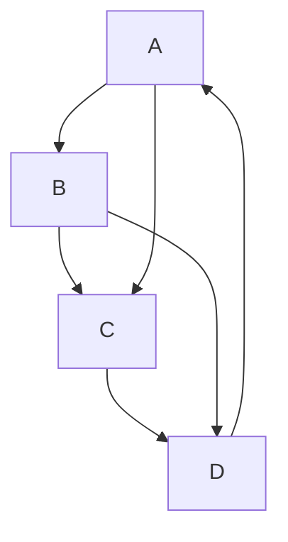
- **Undirected Graph**: An undirected graph is a type of graph where the edges have no direction. The connection between two vertices is bidirectional.

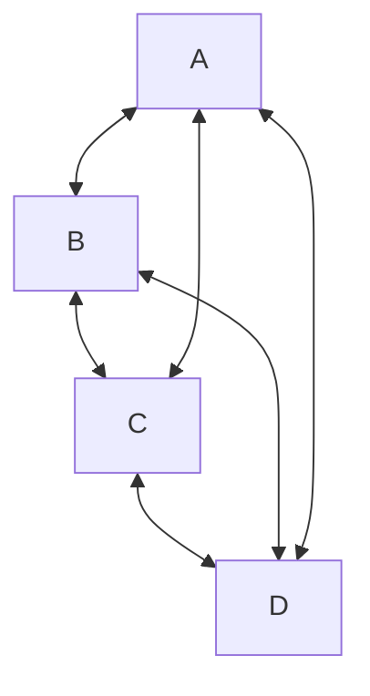
**Note: As mermaid doesn't support undirected graphs it would be represented as bidirectional edges.**

- **Weighted Graph**: A weighted graph is a graph in which each edge has an associated numerical value, called weight. This can represent cost, distance, or any other metric.
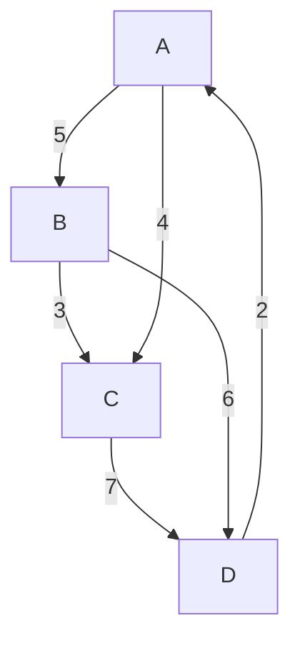

## Graph Representation

### Non-Weighted Graph
Let the graph be this:
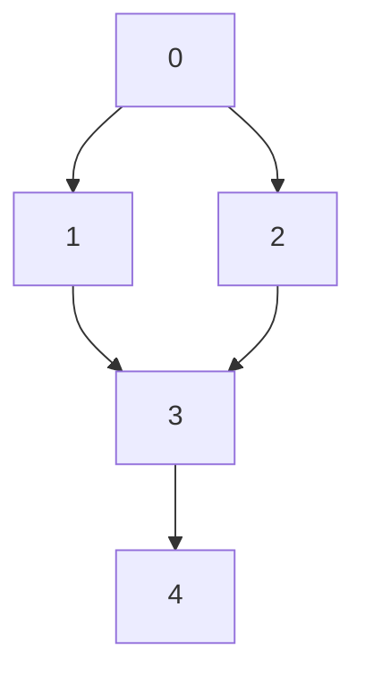
#### 1. Adjacency List
The adjacency list is a dictionary where each key represents a node, and the value is a list of nodes to which the key node has directed edges.

```python
adj_list = {  
    0: [1, 2],  
    1: [3],  
    2: [3],  
    3: [4],  
    4: []  
}
```

#### 2. Adjacency Matrix
The adjacency matrix is a 2D list (list of lists) where the element at row i and column j is 1 if there is a directed edge from node i to node j, and 0 otherwise.

```python
adj_matrix = [  
    [0, 1, 1, 0, 0],  # 0  
    [0, 0, 0, 1, 0],  # 1  
    [0, 0, 0, 1, 0],  # 2  
    [0, 0, 0, 0, 1],  # 3  
    [0, 0, 0, 0, 0]   # 4  
]
```

If the graph is weighted, the adjacency list and adjacency matrix representations will include the weights of the edges. Here is how you can represent the given graph with weights.

### Weighted Graph
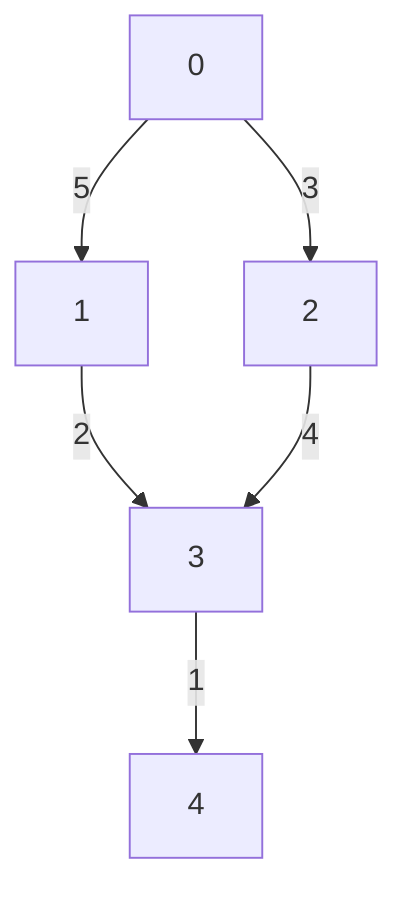

#### 1. Adjacency List
The adjacency list is a dictionary where each key represents a node, and the value is a list of tuples. Each tuple contains a node to which the key node has a directed edge and the weight of that edge.

```python
adj_list = {  
    0: [(1, 5), (2, 3)],  
    1: [(3, 2)],  
    2: [(3, 4)],  
    3: [(4, 1)],  
    4: []  
}
```

#### 2. Adjacency Matrix
The adjacency matrix is a 2D list (list of lists) where the element at row i and column j is the weight of the edge from node i to node j, and 0 if there is no edge.
```python
adj_matrix = [  
    [0, 5, 3, 0, 0],  # 0  
    [0, 0, 0, 2, 0],  # 1  
    [0, 0, 0, 4, 0],  # 2  
    [0, 0, 0, 0, 1],  # 3  
    [0, 0, 0, 0, 0]   # 4  
]
```

## Connected Components
A connected component in an undirected graph is a group of nodes such that:
- Every node in the group is connected to every other node in the group by some path.
- There are no connections between nodes in this group and any nodes outside of this group.


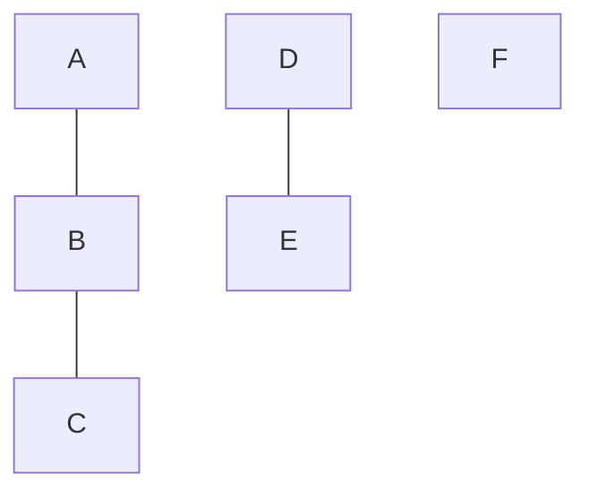

**From now on we would be only using the adjacency list mechanism for representation**.

## Traversal Techniques
### Breadth First Search
The BFS traversal explores all nodes at the present depth before moving on to nodes at the next depth level.
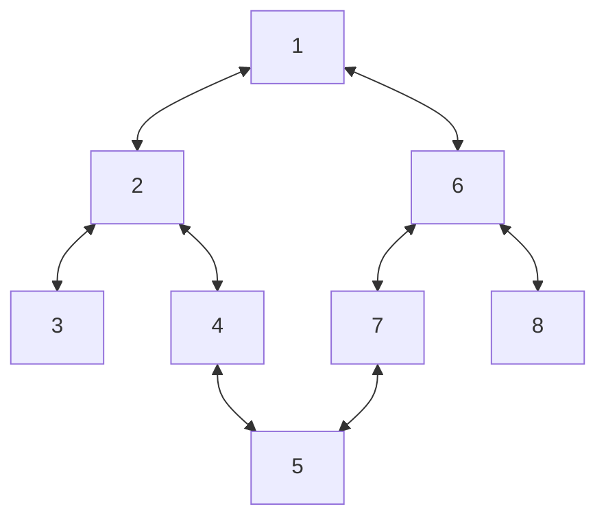
Possible BFS with starting node as `1`: [1], [2, 6], [3, 4, 7, 8], [5] - the sub-divisions are for the different levels.
Now if we change the starting node to `6`: [6], [1, 7, 8], [2, 5], [3, 4].

#### Implementation
- For the implementation of BFS we use a queue and a visited set.
- For each level we empty the queue and traverse the nodes not traversed already and add them to the result.
- The visited set is important as it helps us from revisiting the same node again and again. As soon as a node is added to the queue, it is marked as visited.

Code
```python
def bfs(n, edges):
    graph = {i: [] for i in range(n)}
    for edge in edges:
        src, dest = edge
        # for undirected graph add both
        graph[src].append(dest)
        graph[dest].append(src)
    
    # initialize queue and visited set
    visited = set()
    queue = deque()

    # add the starting node
    queue.append(0)
    visited.add(0)

    result = []
    while queue:
        temp = deque()
        # get the nodes for the current level
        while queue:
            # follow FIFO
            node = queue.popleft()
            # add to result as they are being traversed
            result.append(node)
            for adj_node in graph[node]:
                if adj_node not in visited:
                    # visit adjacent nodes for the next level traversal
                    temp.add(adj_node)
                    # add the adjacent node to the visited set
                    visited.add(adj_node)
        queue = temp
    
    return result
```

#### Complexity Analysis:

**Time Complexity: (O(V + E))**
The time complexity of BFS is `(O(V + E))`, where `(V)` is the number of vertices and `(E)` is the number of edges in the graph. Here’s a detailed breakdown of why this is the case:

- Vertex Processing:
  - Each vertex is enqueued and dequeued exactly once. Enqueuing and dequeuing a vertex takes `(O(1))` time.
  - Since there are `(V)` vertices, the total time for this step is `(O(V))`.
- Edge Processing:
  - For each vertex, the algorithm iterates over its adjacent vertices (i.e., its neighbors). This involves examining each edge at least once.
  - If we sum this operation over all vertices, we get `(O(E))` time, as each edge is considered once in an undirected graph (or exactly once in a directed graph).

Combining these steps, the total time complexity is `(O(V) + O(E) = O(V + E))`.

**Space Complexity: (O(V))**
The space complexity of BFS is `(O(V))`. Here’s a detailed breakdown:

- Queue: The queue can contain at most `(V)` vertices at any given time. Thus, the space required for the queue is `(O(V))`.
- Visited Array/Set: The visited array or set also stores `(V)` elements, one for each vertex. Thus, the space required for the visited array/set is `(O(V))`.

Combining these, the total space complexity is `(O(V))`.

**BFS is efficient for both sparse and dense graphs and is widely used in various applications, such as finding the shortest path in an unweighted graph, checking for bipartiteness, and more.**

### Depth First Search
The DFS traversal visits nodes by exploring as far as possible along each branch before backtracking.

Possible DFS with starting node as `1`: [1, 2, 3, 4, 5, 7, 6, 8].

#### Implementation
- We would be using recursion to implement DFS.
- Like in BFS we would also have a `visited` set to mark the nodes that are already visited.

Code:
```python
def traverse(n, edges):
    graph = {i: [] for i in range(n)}
    for edge in edges:
        src, dest = edge
        graph[src].append(dest)
        graph[dest].append(src)
    
    # Initialize visited set
    visited = set()
    
    result = []

    def dfs(node):
        visited.add(node)
        result.add(node)

        for adj_node in graph[node]:
            # Add only if the neighboring adjacent node is not visited
            if adj_node not in visited:
                solve(node)
    
    solve(0)
    return result
```

#### Complexity Analysis:

**Time Complexity: (O(V + E))**
The time complexity of BFS is `(O(V + E))`, where `(V)` is the number of vertices and `(E)` is the number of edges in the graph. Here’s a detailed breakdown of why this is the case:

- Vertex Processing:
  - Each vertex is visited exactly once. Marking a vertex as visited and performing any constant-time operations at each vertex takes `(O(1))` time.
  - Since there are `(V)` vertices, the total time for this step is `(O(V))`.
- Edge Processing:
  - For each vertex, the algorithm iterates over its adjacent vertices (i.e., its neighbors). This involves examining each edge at least once.
  - If we sum this operation over all vertices, we get `(O(E))` time, as each edge is considered once in an undirected graph (or exactly once in a directed graph).

Combining these steps, the total time complexity is `(O(V) + O(E) = O(V + E))`.

**Space Complexity: (O(V))**
The space complexity of BFS is `(O(V))`. Here’s a detailed breakdown:

- Stack:
  - In the worst case, the stack (whether explicit or implicit due to recursion) can contain all the vertices in the current path from the root to the deepest leaf node. In a graph with (V) vertices, the stack can thus hold up to (V) vertices. Therefore, the space required for the stack is (O(V)).
- Visited Array/Set:
  - The visited array or set also stores (V) elements, one for each vertex. Thus, the space required for the visited array/set is (O(V)).

Combining these, the total space complexity is `(O(V))`.

**DFS is useful for various applications, such as topological sorting, finding connected components, detecting cycles, and solving puzzles involving backtracking. It is particularly effective when the entire graph needs to be explored, or when the solution to a problem involves exploring all possible paths.**

#### Extension of DFS - Connected Components
For connected components, this is how the DFS logic would change.
Since we know that in one traversal all the nodes wouldn't be traversed, we would perform DFS for all the nodes if they are not visited yet.

```python
def traverse(graph)
    # Initialize visited set
    visited = set()
    result = []

    def dfs(node):
        visited.add(node)
        result.append(node)

        # This ensures that all the nodes in this group are traversed
        for adj_node in graph[node]:
            if adj_node not in visited:
                dfs(adj_node)

    for node in graph:
        # Check if the node exists
        if node not in visited:
            dfs(node)
```

#### Problems
##### Number of Provinces
There are `n` cities. Some of them are connected, while some are not. If city `a` is connected directly with city `b`, and city `b` is connected directly with city `c`, then city `a` is connected indirectly with city `c`.
A province is a group of directly or indirectly connected cities and no other cities outside of the group.
You are given an `n x n` matrix `isConnected` where `isConnected[i][j] = 1` if the `ith` city and the `jth` city are directly connected, and `isConnected[i][j] = 0` otherwise.
Return the total number of provinces.

Example
```
Input: isConnected = [[1,1,0],[1,1,0],[0,0,1]]
Output: 2
```

###### Intuition
For this either DFS or Union-Find a good algorithm to tackle this. Here we would try out the DFS approach for the solution.
- We traverse the graph for each vertex and if the vertex doesn't exist in the visited set, increase the count by 1.
- Do this until all the vertices are traversed in the graph and then return the count.

Code
```python
def find_circle_num(isConnected):
    visited = set()
    n = len(isConnected)

    def dfs(node):
        visited.add(node)
        # Iterate through all adjacent nodes
        for adj_node in range(n):
            # Check if there is a direct connection and the node is not visited
            if isConnected[node][adj_node] == 1 and adj_node not in visited:
                dfs(adj_node)
    
    count = 0
    for i in range(n):
        if i not in visited:
            count = count + 1
            dfs(i)
        
    return count
```
**This problem has also been solved later with Disjoint Set Union approach**

##### [Number of Islands](https://leetcode.com/problems/number-of-islands)
Given an `m x n` 2D binary grid grid which represents a map of '1's (land) and '0's (water), return the number of islands.
An island is surrounded by water and is formed by connecting adjacent lands horizontally or vertically. You may assume all four edges of the grid are all surrounded by water.

###### Intuition
For this either DFS or Union-Find a good algorithm to tackle this. Here we would try out the DFS approach for the solution.
- We traverse the grid element by element and if the element doesn't exist in the visited set, increase the number of islands by 1.
- Do this untill all the elements are traversed in the grid and then return the island count.
**Hint: Instead of maintaining a separate visited array just update the 1 to 0 in the grid**

Code
```python
def num_islands(grid):
    m, n = len(grid), len(grid[0])
    directions = [(-1, 0), (1, 0), (0, -1), (0, 1)]
    def dfs(row, col):
        # Mark the current cell as visited by setting it to 0
        grid[row][col] = "0"

        # Explore all four possible directions
        for direction in directions:
            n_row, n_col = row + direction[0], col + direction[1]
            # Check if the new position is within bounds and is an unvisited land ('1')
            if 0<=n_row<m and 0<=n_col<n and grid[n_row][n_col] == "1":
                dfs(n_row, n_col)
    
    islands = 0
    for row in range(m):
        for col in range(n):
            if grid[row][col] == "1":
                islands = islands + 1
                dfs(row, col)
    return islands
``` 

##### [Max Area of Island](https://leetcode.com/problems/max-area-of-island)
You are given an `m x n` binary matrix grid. An island is a group of 1's (representing land) connected 4-directionally (horizontal or vertical.) You may assume all four edges of the grid are surrounded by water.

The area of an island is the number of cells with a value 1 in the island.
Return the maximum area of an island in grid. If there is no island, return 0.

###### Intuition
This is an extension of the number of islands problem, just that here we would have to return the total area of each possible islands and return the maximum of them all.

Code
```python
def max_area_islands(grid):
    m, n = len(grid), len(grid[0])
    directions = [(-1, 0), (1, 0), (0, -1), (0, 1)]

    def dfs(row, col):
        # Mark the current cell as visited by setting it to 0
        grid[row][col] = 0
        # Initialize the area of the current island to 1 (counting the current cell)
        area = 1

        # Explore all four possible directions
        for direction in directions:
            n_row, n_col = row + direction[0], col + direction[1]
            # Check if the new position is within bounds and is an unvisited land ('1')
            if 0<=n_row<m and 0<=n_col<n and grid[n_row][n_col] == 1:
                # Add the area returned by the DFS call to the current area
                area = area + dfs(n_row, n_col)
        
        # Return the total area of the island
        return area
    
    max_area = 0
    for row in range(m):
        for col in range(n):
            # If the cell is an unvisited land (1), calculate the area of the island
            if grid[row][col] == 1:
                # Update the maximum area if the current island's area is larger
                max_area = max(max_area, dfs(row, col))

    return max_area
```

#### [Clone Graph](https://leetcode.com/problems/clone-graph)
Given a reference of a node in a connected undirected graph. Return a deep copy (clone) of the graph.
Each node in the graph contains a value (int) and a list (List[Node]) of its neighbors.
```
class Node {
    public int val;
    public List<Node> neighbors;
}
```

##### Intuition
- To solve this problem, we need to create a new graph that is structurally identical to the original graph, with new nodes and edges but the same connections.
- During the traversal, we create new nodes and maintain a mapping from the original nodes to their corresponding cloned nodes to avoid duplicating nodes and to handle cycles in the graph.

Code
```python
def clone(node):
    if node is None:
        return None
    
    clone_map = dict()

    def dfs(node):
        # If the node is already cloned, return the cloned node
        if node.val in clone_map:
            return clone_map[node.val]
        
        # Clone the node
        clone_node = Node(node.val)
        clone_map[node.val] = clone_node

        # Iterate through the neighbors to clone them
        for neighbor in node.neighbors:
            clone_node.neighbors.append(dfs(neighbor))
        
        return clone_node
    
    # Start cloning from the given node
    return dfs(node)
```

#### [Word Ladder](https://leetcode.com/problems/word-ladder)
Given two words (beginWord and endWord), and a dictionary's word list, find the length of the shortest transformation sequence from beginWord to endWord, such that:
- Only one letter can be changed at a time.
- Each transformed word must exist in the word list.

Note:
- Return 0 if there is no such transformation sequence.
- All words have the same length.
- All words contain only lowercase alphabetic characters.
- You may assume no duplicates in the word list.
- You may assume beginWord and endWord are non-empty and are not the same.

Example
```
Input:  
beginWord = "hit",  
endWord = "cog",  
wordList = ["hot", "dot", "dog", "lot", "log", "cog"]
Output: 5
Explanation: As one shortest transformation is "hit" -> "hot" -> "dot" -> "dog" -> "cog", return its length 5.
```

##### Intuition
###### Naive Approach
- Start with the `beginWord` and perform BFS by generating all possible one-letter transformations for each word.
- If a transformation matches the endWord, return the current transformation length + 1. If the transformation is in the word list, add it to the queue and remove it from the set to prevent revisits.

Code
```python
def wordLadderLength(beginWord, endWord, wordList):  
    # Convert the wordList to a set for O(1) lookups  
    wordSet = set(wordList)  
      
    # If the endWord is not in the word list, there's no valid transformation  
    if endWord not in wordSet:  
        return 0  
      
    # Queue for BFS: stores tuples of (current_word, current_length)  
    queue = deque([(beginWord, 1)])  
      
    # BFS traversal  
    while queue:  
        current_word, length = queue.popleft()  
          
        # If we reach the endWord, return the current length  
        if current_word == endWord:  
            return length  
          
        # Try changing each letter in the current word  
        for i in range(len(current_word)):  
            for c in 'abcdefghijklmnopqrstuvwxyz':  
                # Create a new word by changing the ith character to c  
                new_word = current_word[:i] + c + current_word[i+1:]  
                  
                # If the new word is in the wordSet, it is a valid transformation  
                if new_word in wordSet:  
                    # Add the new word to the queue with incremented length  
                    queue.append((new_word, length + 1))  
                    # Remove the new word from the wordSet to prevent revisiting  
                    wordSet.remove(new_word)  
      
    # If we exhaust the queue without finding the endWord, return 0  
    return 0
```
Now for each word we are performing `26 * len(word)` operations and this can be improved by using the following approach.

###### Optimized Solution
Pattern Matching:
- Instead of comparing each word with every other word, use a transformation pattern to group words.
- For example, for the word "hit", generate patterns like "it", "ht", and "hi*".
- This allows quick lookup of potential transformations.

To store this we edges from pattern to all the possible words it can link to, and we traverse each breadth-wise to ensure we always get the minimum number of steps to convert.

Code
```python
def ladderLength(begin_word, end_word, word_list):
    # If the endWord is not in the wordList, return 0 as no transformation is possible
    if end_word not in word_list:
        return 0

    # Length of each word (all words have the same length)  
    word_len = len(word_list[0]) 
    graph = defaultdict(list)

    # Populate the graph with patterns generated from each word
    for word in word_list:
        word_len = len(word)
        for i in range(word_len):
            # Create a pattern by replacing one character with '*'
            pattern = word[:i] + '*' + word[i+1:]
            graph[pattern].append(word)
    
    queue, visited = deque(), set()
    queue.append((begin_word, 1))
    visited.add(begin_word)

    while queue:
        curr, steps = queue.popleft()

        # If the current word is the endWord, return the number of steps
        if curr == end_word:
            return steps

        # Generate all possible patterns for the current word
        for i in range(word_len):
            pattern = curr[:i] + '*' + curr[i+1:]

            # Check all words that match this pattern 
            for next_word in graph[pattern]:
                if next_word not in visited:
                    visited.add(next_word)
                    queue.append((next_word, steps+1))
            
            # Clear the adjacency list for this pattern to prevent redundant processing
            graph[pattern] = []
    
    return 0
```

## Graph Algorithms
Now coming to the various algorithms of graph:

### Cycle Detection
A cycle in a graph is a path of edges and vertices wherein a vertex is reachable from itself, meaning you can start at a vertex, travel along a sequence of edges, and return to the starting vertex without traversing any edge more than once.

**Detecting Cycles**
- **Directed Graph**: Use `Depth-First Search (DFS)` with a `recursion stack` to detect back edges or `Kahn's Algorithm (BFS)` leveraging `in-degrees of nodes`.
- **Undirected Graph**: Use `DFS` or `BFS` with a `parent tracking mechanism` to ensure cycles are not **falsely detected** due to bidirectional edges.
#### Problems
#### 1. Find if Cycle Exists in a Directed Graph
Given a directed graph, check whether the graph contains a cycle or not.

#### DFS
#### Intuition
We need to modify the existing DFS implementation to check for a backedge - that can cause cycles. For this we maintain a separate `recursion_stack` set along with the existing `visited` set.

##### Why do we need a separate `recursion_stack` set, wouldn't `visited` set be enough?
No, it would be enough for an undirected graph, but for a directed graph it can give false-positives for cycles.
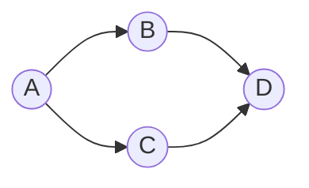
When visiting `C` and goind to it's adjacent nodes `D` already exists in the `visited` set. If we had only it, we would have wrongly judged the graph that it has a cycle.

```python
def cycle_detection(graph):
    # to check for cycles
    recursion_stack = set()
    # to check if already visited
    visited = set()

    def dfs(node):        
        recursion_stack.add(node)
        visited.add(node)

        for adj_node in graph[node]:
            # additonal check if node in recursion stack
            if adj_node in recursion_stack:
                return True
            
            # If the adjacent node is not visited and there is a cycle detected return True
            if adj_node not in visited and dfs(adj_node):
                return True
        
        # no longer, a part of the recursion stack
        recursion_stack.remove(node)
        return False
    
    # Check all nodes in the graph to handle disconnected components  
    for node in graph:  
        if node not in visited:  
            if dfs(node):  
                return True 
    return False
```

### BFS
In a directed graph, we can use a BFS approach with the help of an additional data structure called in-degree to detect cycles. The in-degree of a node is the number of edges directed towards that node. The idea is to use Kahn’s algorithm for topological sorting. If the graph contains a cycle, topological sorting is not possible.

Code
```python
def cycle_detection(graph):
    n = len(graph.keys())
    indegree_map = {i: 0 for i in range(n)}
    for node in graph:
        for neighbor in graph[node]:
            indegree_map[neighbor] = indegree_map[neighbor] + 1
    
    queue = deque()
    for node in graph:
        if indegree_map[node] == 0:
            queue.append(node)
    
    count = 0
    while queue:
        node = queue.popleft()
        count = count + 1
        for neighbor in graph[node]:
            indegree_map[neighbor] = indegree_map[neighbor] - 1
            if indegree_map[neighbor] == 0:
                queue.append(neighbor)
    
    return count == n
```

##### 2. [Graph Valid Tree](https://leetcode.com/problems/graph-valid-tree)* - Cycle Detection in Undirected Graph
Given `n` nodes labeled from `0` to `n - 1` and a list of undirected edges (each edge is a pair of nodes), write a function to check whether these edges make up a valid tree.

Example
```
Input:
n = 5
edges = [[0, 1], [0, 2], [0, 3], [1, 4]]

Output:
true
```
##### DFS
###### Intuition
If a cycle is detected it is not a valid tree - so an extension of the cycle detection problem.
- However this is an undirected graph and thus we must ensure that we don't consider the parent as a candidate for the cycle - **trivial cycle**.
- In the case of an undirected graph, the `recursion_stack` set is not needed because the `visited` set combined with the `parent` node check (prev node) is sufficient to avoid **false positives for cycles**.
- Check if the graph is a valid tree:  
  - The entire graph should be connected (all nodes visited from node 0)
  - There should be no cycles (DFS should return True)

Code
```python
def validTree(n, edges):
    graph = {i: [] for i in range(n)}
    for edge in edges:
        u, v = edge
        graph[u].append(v)
        graph[v].append(u)
    
    visited = set()

    def dfs(node, prev):
        # If the node is already visited, it means there's a cycle
        if node in visited:
            return False
        
        visited.add(node)

        for neighbor in graph[node]:
            # If the neighbor is not the previous node (to avoid trivial cycle) and  
            # a cycle is detected in the DFS traversal, return False 
            if neighbor != prev and not dfs(neighbor, node):
                return False
        
        # If no cycle is detected, return True
        return True
    
    return dfs(0, -1) and len(visited) == n
```

##### BFS
In an undirected graph, we can use a BFS approach with the help of a parent map to detect cycles. The idea is to ensure that we do not revisit the parent node during traversal, similar to the DFS approach but using a queue.

Code
```python
def isCycle(V, adj):
    queue = deque()
    queue.append((0, -1))
    visited = set()
    visited.add(0)
    
    while queue:
        node, parent = queue.popleft()
        for neighbor in adj[node]:
            if neighbor == parent:
                continue
            if neighbor in visited:
                return True
            visited.add(neighbor)
            queue.append((neighbor, node))
    
    return False
```

### Topological Sort
Topological sort is a way of arranging the nodes in a directed acyclic graph (DAG) in a linear order such that for every directed edge from node `u` to node `v`:
- Node `u` appears before node `v` in the ordering.

Think of it like scheduling tasks where some tasks must be completed before others. Topological sort gives you an order in which to complete the tasks so that all the dependencies are respected.
Example:
Consider a graph representing tasks with dependencies:
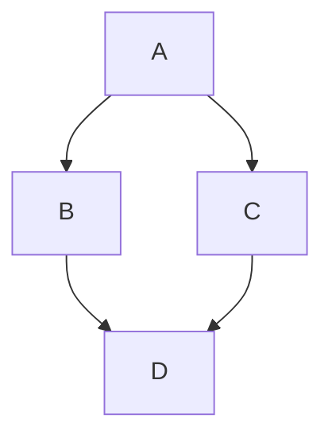
- Task A must be completed before tasks B and C.
- Tasks B and C must both be completed before task D.

A possible topological order for these tasks could be: A, B, C, D or A, C, B, D. Both orders respect the dependencies.

#### 1. Kahn's Algorithm
Kahn's Algorithm is an iterative approach to topological sorting that uses in-degree counting and a queue.
- **In-degree Counting**: Kahn's Algorithm relies on counting the in-degrees (number of incoming edges) for each node in the graph. Nodes with an in-degree of 0 (i.e., nodes with no dependencies) are initially added to the queue.
- **Iterative Process**: The algorithm processes nodes from the queue, adding them to the topological order list and decrementing the in-degrees of their neighbors. If a neighbor's in-degree becomes 0, it is added to the queue.
- **Cycle Detection**: By the end of the process, if the number of nodes in the topological order list equals the number of nodes in the graph, a valid topological order is returned. Otherwise, the graph contains a cycle, making topological sorting impossible.

Code
```python
def topological_sort(graph):
    # Calculate in-degrees of all nodes
    in_degree = defaultdict(int)

    for node in graph:
        in_degree[node] = 0
    
    for node in graph:
        for adj_node in graph[node]:
            in_degree[adj_node] = in_degree[adj_node] + 1

    # Initialize the queue with nodes that have an in-degree of 0
    queue = deque([node for node in graph if in_degree[node] == 0])
    result = []

    # Iterative Process
    while queue:
        current_node = queue.popleft()
        result.append(current_node)

        for adj_node in graph[current_node]:
            in_degree[adj_node] = in_degree[adj_node] - 1
            # Add to the queue if the neighbor indegree becomes 0
            if in_degree[adj_node] == 0:
                queue.append(adj_node)
    
    # Check for cycles
    if len(result) == len(graph):
        return result
    return [] # Graph has cycle
```

##### Complexity Analysis
Since based on BFS, the complexity remains the same.
- Time Complexity: `(O(V + E))`
- Space Complexity: `(O(V))`

#### 2. DFS based
- **Post-Order Addition**: Once all adjacent nodes of a node are visited, the node itself is added to the result list.
- **Result Reversal**: Because nodes are added to the result list only after all their dependencies are resolved, the nodes appear in reverse topological order in the result list. Therefore, reversing the list gives you the correct topological order.

Code
```python
def topological_sort(graph):
    # Set to keep track of visited nodes  
    visited = set()  
    # Set to keep track of nodes in the current recursion stack for cycle detection  
    recursion_stack = set()
    result = []

    def dfs(node):
        # Mark the current node as visited  
        visited.add(node)  
        # Add the current node to the recursion stack  
        recursion_stack.add(node)

        for adj_node in graph[node]:
            if adj_node in recursion_stack:
                return False
            if adj_node not in visited and not dfs(node):
                return False
        
        recursion_stack.remove(node)
        # Add the node to the result list after visiting all its adjacent nodes
        result.append(node)
        return True
    
    for node in graph:
        if node not in visited and not dfs(node):
            return []
    
    # Reverse the result to get the correct topological order
    result.reverse()
    return result
```

##### Complexity Analysis
Since based on DFS, the complexity remains the same.
- Time Complexity: `(O(V + E))`
- Space Complexity: `(O(V))`

#### Problems
#### [Course Schedule I](https://leetcode.com/problems/course-schedule)*
There are a total of `numCourses` courses you have to take, labeled from `0` to `numCourses - 1`. You are given an array `prerequisites` where `prerequisites[i] = [ai, bi]` indicates that you must take course `bi` first if you want to take course `ai`.
For example, the pair `[0, 1]`, indicates that to take course `0` you have to first take course `1`.
Return `true` if you can finish all courses. Otherwise, return `false`.

Example:
```
Input: numCourses = 2, prerequisites = [[1,0]]
Output: true
Explanation: There are a total of 2 courses to take. To take course 1 you should have finished course 0. So it is possible.
```

##### Intuition
- We can model this problem as a graph where each course is a node, and a directed edge from course bi to course ai indicates that bi is a prerequisite of ai. So bi must be completed before ai. 
- If we can find a topological order for this graph, then all courses can be completed. 
- Otherwise, a cycle exists, making it impossible to complete all courses.

Code
```python
def can_finish(numCourses, prerequisites):
    graph = [[] for _ in range(numCourses)]
    for course, prerequisite in prerequisites:
        # prerequisite must be completed before course
        graph[prerequisite].append(course)
    
    # Sets to keep track of visited nodes and nodes in the current recursion stack
    visited, recursion_stack = set(), set()

    def dfs(course):
        visited.add(course)
        recursion_stack.add(course)

        for next_course in graph[course]:
            # If the next course is in the recursion stack, a cycle is detected  
            if next_course in recursion_stack:  
                return False  
            # If the next course is not visited and the DFS on it returns False, return False  
            if next_course not in visited and not dfs(next_course):  
                return False
        
        recursion_stack.remove(course)
        return True
    
    for course in range(numCourses):
        # If the course is not visited and the DFS on it returns False, a cycle is detected
        if course not in visited and not dfs(course):
            return False
    
    return True
```

#### [Course Schedule II](https://leetcode.com/problems/course-schedule-ii)*
There are a total of `numCourses` courses you have to take, labeled from `0` to `numCourses - 1`. You are given an array prerequisites where `prerequisites[i] = [ai, bi]` indicates that you must take course `bi` first if you want to take course `ai`.

For example, the pair `[0, 1]`, indicates that to take course `0` you have to first take course `1`.
Return the ordering of courses you should take to finish all courses. If there are many valid answers, return any of them. If it is impossible to finish all courses, return an empty array.

Example:
```
Input: numCourses = 2, prerequisites = [[1,0]]
Output: [0,1]
Explanation: There are a total of 2 courses to take. To take course 1 you should have finished course 0. So the correct course order is [0,1].
```

##### Intuition
The code almost will remain the same, just that we have to maintain the order in result. Also ensure the following points:
- Add a course to the result after all the next courses are processed.
- Due to this post order addition the result is reverse topological order, the course having the maximum dependencies are added first. Reversing the list provides the correct topological order.

Code
```python
def find_order(numCourses, prerequisites):
    graph = [[] for _ in range(numCourses)]
    for course, prerequisite in prerequisites:
        # prerequisite must be completed before course
        graph[prerequisite].append(course)
    
    # Sets to keep track of visited nodes and nodes in the current recursion stack
    visited, recursion_stack = set(), set()

    # List to store the topological order of courses    
    order = []

    def dfs(course):
        visited.add(course)
        recursion_stack.add(course)

        for next_course in graph[course]:
            # If the next course is in the recursion stack, a cycle is detected  
            if next_course in recursion_stack:  
                return False  
            # If the next course is not visited and the DFS on it returns False, return False  
            if next_course not in visited and not dfs(next_course):  
                return False
        
        recursion_stack.remove(course)
        # Add the course to the order list after visiting all its adjacent nodes
        order.append(course)
        return True
    
    # Perform DFS on all the courses
    for course in range(numCourses):
        # If the course is not visited and the DFS on it returns False, a cycle is detected
        if course not in visited and not dfs(course):
            return []
    
    # Reverse the order to get the correct topological order
    order.reverse()
    return order
```

#### Alien Dictionary
You are given a list of words from the dictionary, where the words are sorted lexicographically by the rules of this new language. Derive the order of letters in this alien language.

Example
```
Input: ["wrt", "wrf", "er", "ett", "rftt"]
Output: "wertf"
Explanation: The correct order of characters is:
'w' comes before 'e'
'r' comes before 't'
't' comes before 'f'
```

##### Intuition
To solve this problem, we can use a topological sort since we are essentially trying to determine the order of characters based on a partial ordering given by the dictionary.

1. **Build the Graph**: Construct a directed graph where each node is a character, and there is a directed edge from character u to v if u comes before v in the dictionary.
2. **Topological Sort**: Perform a topological sort on the graph to find the order of characters.

Code
```python
def alien_order(words):
    graph = defaultdict(list)

    # Build the graph by comparing adjacent words
    for i in range(len(words)-1):
        first, second = words[i], words[i+1]
        min_length = min(len(first), len(second))
        non-matching_found = False

        # Find the first non-matching character
        for j in range(min_length):
            if first[j] != second[j]:
                graph[first[j]].append(second[j])
                non-matching_found = True
                break

        # Check for the invalid case where second word is a prefix of first word  
        if not non_matching_found and len(second) < len(first):  
            return ""
    
    visited = set()
    order = []
    recursion_stack = set()

    def dfs(char):
        visited.add(char)
        recursion_stack.add(char)

        for next_char in graph[char]:
            # If the next character is in the recursion stack - a cycle is detected 
            if next_char in recursion_stack:
                return False
            # If the character is not visiteed, the topological sort on it returns False if a cycle is detected
            if next_char not in visited and not dfs(next_char):
                return False
        
        recursion_stack.remove(char)
        # The character is added to the order after all the adjacent characters are traversed
        order.append(char)
        return True

    for word in words:
        for char in words:
            # If the character is not visiteed, the topological sort on it returns False if a cycle is detected
            if char not in visited and not dfs(char):
                return ""
    
    # Reverse the order to get the correct topological order
    order.reverse()
    return "".join(order)
```

### Flood Fill Algorithm
The Flood Fill algorithm is used to fill a contiguous region of pixels with a particular color, starting from a given seed pixel.

Code
```python
def flood_fill(grid, row, col, new_color):  
    rows, cols = len(grid), len(grid[0])  
    original_color = grid[row][col]
    # possible directions
    directions = [(-1, 0), (1, 0), (0, -1), (0, 1)]
  
    # Base case: If the new color is the same as the original color, no change is needed  
    if original_color == new_color:  
        return grid  
  
    def is_valid(row, col):
        return 0<=row<rows and 0<=col<cols

    def fill(row, col):  
        # Set the new color  
        grid[row][col] = new_color

        # Recursively fill the neighboring cells
        for direction in directions:
            n_row, n_col = row + direction[0], col + direction[1]
            if is_valid(n_row, n_col) and grid[n_row][n_col] == original_color:        
                fill(n_row, n_col)
  
    # Start the flood fill from the given starting cell  
    fill(row, col)  
    return grid
```
The recursive approach handles the issue of visiting the same cell again by marking cells with the new color as they are visited. Once a cell is changed to the new color, it will no longer match the original_color, which prevents it from being revisited.

#### Problems
##### [Rotten Oranges](https://leetcode.com/problems/rotting-oranges)
You are given an m x n grid where each cell can have one of three values:
- 0 representing an empty cell,
- 1 representing a fresh orange, or
- 2 representing a rotten orange.
Every minute, any fresh orange that is 4-directionally adjacent to a rotten orange becomes rotten.

Return the minimum number of minutes that must elapse until no cell has a fresh orange. If this is impossible, return -1.

###### Intuition
- The "rotten oranges" problem is similar to the flood fill algorithm in that it involves spreading a state (rottenness) from a source (rotten oranges) to its neighbors (fresh oranges) iteratively. 
- This problem is well-suited for a Breadth-First Search (BFS) approach because it naturally handles the layer-by-layer propagation of the rottenness, simulating the passage of time.

Code
```python
def orangesRotting(grid):
    m, n = len(grid), len(grid[0])
    queue = deque()
    fresh = 0

    # Populate the queue with initially rotten oranges and count fresh oranges
    for row in range(m):
        for col in range(n):
            if grid[row][col] == 1:
                fresh = fresh + 1
            elif grid[row][col] == 2:
                queue.append((row, col))
    
    if fresh == 0:
        return 0

    directions = [(-1, 0), (1, 0), (0, -1), (0, 1)]
    elapsed_time = 0

    while queue:
        elapsed_time = elapsed_time + 1
        for _ in range(len(queue)):
            row, col = queue.popleft()
            for direction in directions:
                n_row, n_col = row + direction[0], col + direction[1]
                if 0<=n_row<m and 0<=n_col<n and grid[n_row][n_col] == 1:
                    grid[n_row][n_col] = 2
                    fresh = fresh - 1
                    queue.append((n_row, n_col))

    # If there are still fresh oranges, return -1
    return elapsed_time - 1 if fresh == 0 else -1
```
###### Extra Points
- **Extra Increment**:
  - After processing the last batch of fresh oranges that can rot, we increment minutes_elapsed once more.
  - This results in minutes_elapsed being one more than the actual number of minutes required to rot all oranges.

#### [Pacific Atlantic Water Flow](https://leetcode.com/problems/pacific-atlantic-water-flow)
There is an `m x n` rectangular island that borders both the Pacific Ocean and Atlantic Ocean. The Pacific Ocean touches the island's left and top edges, and the Atlantic Ocean touches the island's right and bottom edges.
The island is partitioned into a grid of square cells. You are given an `m x n` integer matrix heights where heights[r][c] represents the height above sea level of the cell at coordinate `(r, c)`.
The island receives a lot of rain, and the rain water can flow to neighboring cells directly north, south, east, and west if the neighboring cell's height is less than or equal to the current cell's height. Water can flow from any cell adjacent to an ocean into the ocean.
Return a 2D list of grid coordinates `result` where `result[i] = [ri, ci]` denotes that rain water can flow from cell `(ri, ci)` to both the Pacific and Atlantic oceans.

##### Intution
To solve this problem, we need to determine which cells can reach both the Pacific and Atlantic Oceans. The key insight is that instead of trying to simulate water flow from every cell to the oceans, we can reverse the problem: simulate water flow from the oceans to the cells.
- Reverse Flow Simulation:
  - Instead of checking if water can flow from each cell to the oceans, we check if water can flow from the oceans to each cell.
  - We perform two separate flood fill operations (DFS or BFS):
  - One starting from all cells adjacent to the Pacific Ocean.
  - Another starting from all cells adjacent to the Atlantic Ocean.
- We can keep 2 sets for keeping track of the cells that can be visited from Pacific and Atlantic oceans.

Code
```python
def pacific_atlantic(heights):
    m, n = len(heights), len(heights[0])
    # Sets to keep track of the cells tracked
    atlantic, pacific = set(), set()

    directions = [(-1, 0), (1, 0), (0, -1), (0, 1)]
    def dfs(row, col, visited):
        visited.add((row, col))
        for direction in directions:
            n_row, n_col = row + direction[0], col + direction[1]
            if 0<=n_row<m and 0<=n_col<n and (n_row, n_col) not in visited and heights[n_row][n_col] >= heights[row][col]:
                dfs(n_row, n_col, visited)
    
    for row in range(m):
        # Left edge (Pacific) 
        if (row, 0) not in pacific:
            dfs(row, 0, pacific)
        # Right edge (Atlantic)
        if (row, n-1) not in atlantic:
            dfs(row, n-1, atlantic)
    
    for col in range(n):
        # Top edge (Pacific)
        if (0, col) not in pacific:
            dfs(0, col, pacific)
        # Bottom edge (Atlantic)
        if (m-1, col) not in atlantic:
            dfs(m-1, col, atlantic)
    
    return pacific & atlantic
```
#### [Surrounded Regions](https://leetcode.com/problems/surrounded-regions)
You are given an `m x n` matrix board containing letters 'X' and 'O', capture regions that are surrounded:
- **Connect**: A cell is connected to adjacent cells horizontally or vertically.
- **Region**: To form a region connect every 'O' cell.
- **Surround**: The region is surrounded with 'X' cells if you can connect the region with 'X' cells and none of the region cells are on the edge of the board.
A surrounded region is captured by replacing all 'O's with 'X's in the input matrix board.

##### Intuition
- **Identify Non-Surrounded Regions**:
  - Any 'O' connected to the border of the board cannot be surrounded, as it can potentially escape to the edge.
  - Thus, we need to identify all 'O's that are connected to the border and mark them as non-surrounded.
- **Mark and Capture Regions**:
  - After identifying the non-surrounded regions, we can safely assume that any remaining 'O' in the board is a surrounded region.
  - We can then capture these surrounded regions by converting all 'O's to 'X's.
- **Use a Temporary Marker**:
  - To differentiate between the 'O's that are part of non-surrounded regions and the ones that are surrounded, we can use a temporary marker (e.g., 'T') to mark the 'O's that are found to be non-surrounded during our traversal.

Code
```python
def surround_regions(grid):
    m, n = len(grid), len(grid[0])
    directions = [(-1, 0), (1, 0), (0, -1), (0, 1)]

    def dfs(row, col):
        # This acts as a form of marking visited - Temporary marker
        grid[row][col] = 'T'
        for direction in directions:
            n_row, n_col = row + direction[0], col + direction[1]
            if 0<=n_row<m and 0<=n_col<n and grid[n_row][n_col] == "O":
                dfs(n_row, n_col)

    # Mark all 'O's connected to the border with 'T'
    for row in range(m):
        if grid[row][0] == "O":
            dfs(row, 0)
        if grid[row][n-1] == "O":
            dfs(row, n-1)
    
    for col in range(n):
        if grid[0][col] == "O":
            dfs(0, col)
        if grid[m-1][col] == "O":
            dfs(m-1, col)
    
    # Flip all remaining 'O's to 'X' and 'T's back to 'O'
    for row in range(m):
        for col in range(n):
            if grid[row][col] == "O":
                grid[row][col] = "X"
            # Cells are visited or marked they won't be converted as they have boundary with edge
            elif grid[row][col] == "T":
                grid[row][col] = "O"
```

#### [Walls and Gates](https://leetcode.com/problems/walls-and-gates)
You are given a 2D grid representing rooms in a building. The grid contains the following values:
- -1 for a wall or an obstacle.
- 0 for a gate.
- `INF` (infinity) for an empty room.

Fill each empty room with the distance to its nearest gate. If it is impossible to reach a gate, leave the room as `INF`.

Example:
```
Input:  
rooms = [  
  [INF, -1, 0, INF],  
  [INF, INF, INF, -1],  
  [INF, -1, INF, -1],  
  [0, -1, INF, INF]  
]  
  
Output:  
rooms = [  
  [3, -1, 0, 1],  
  [2, 2, 1, -1],  
  [1, -1, 2, -1],  
  [0, -1, 3, 4]  
]
```

##### Intuition
To solve this problem, we can perform a multi-source Breadth-First Search (BFS) starting from all gates simultaneously. 
BFS is ideal for this problem because it explores all nodes at the present depth level before moving on to nodes at the next depth level, ensuring that we find the shortest path to a gate.

Code
```python
def walls_and_gates(rooms):
    if not rooms or not rooms[0]:
        return
    
    m, n = len(rooms), len(rooms[0])
    INF = 2**31 - 1 # Define the value of infinity as per the problem statement
    directions = [(1, 0), (-1, 0), (0, 1), (0, -1)]
    queue = deque()

    # Initialize queue with all gates
    for row in range(m):
        for col in range(n):
            if rooms[row][col] == 0:
                queue.append((row, col))
    
    # Perform BFS for each gate
    while queue:
        row, col = queue.popleft() # Use popleft() for BFS

        for direction in directions:
            n_row, n_col = row + direction[0], col + direction[1]
            # If the position is in-bounds and empty room
            if 0<=n_row<m and 0<=n_col<n and rooms[n_row][n_col] == INF:
                # Update the distance to the nearest gate
                rooms[n_row][n_col] = rooms[row][col] + 1
                queue.append((n_row, n_col))
```

### Shortest Path Algorithms
### 1. Single Source Shortest Path
##### Dijkstra
Dijkstra's algorithm is a graph search algorithm that solves the single-source shortest path problem for a graph with **non-negative edge weights**, producing a shortest path tree. This means it finds the shortest paths from a starting node (source) to all other nodes in the graph.

###### How it Works:
- **Initialization**: Start with a distance array, dist, where dist[source] is 0 (distance to itself) and all other distances are set to infinity.
- **Priority Queue**: Use a priority queue (min-heap) to select the node with the smallest distance.
- **Relaxation**: For each selected node, update the distances of its neighbors if a shorter path is found via the current node.
- **Repeat**: Continue until all nodes have been processed.

Code
```python
def dijkstra(start, graph):
    # map to store shortest distance
    dist = {node: float('inf') for node in graph}
    dist[start] = 0
    
    # min-heap to store the minimum distance node at the root
    priority_queue = [(0, start)]

    while priority_queue:
        current_distance, current_node = heapq.heappop(priority_queue)

        # Nodes can be added to the priority queue multiple times. We only  
        # process a node the first time we remove it from the priority queue.
        if current_node in visited:
            continue
        
        visited.add(current_node)

        for neighbor, weight in graph[current_node]:
            distance = current_distance + weight

            # Only consider this new path if it's better
            if dist[neighbor] > distance:
                dist[neighbor] = distance 
                heapq.heappush(priority_queue, (distance, neighbor))
    
    for node in graph:
        # for nodes that are not reachable from the start node
        if dist[node] == float('inf'):
            dist[node] = -1
    return dist
```

###### Complexity Analysis:

**Time Complexity: (O((V + E) * log V))**
The time complexity of Dijkstra is `(O(V + E) * log V)`, where `(V)` is the number of vertices and `(E)` is the number of edges in the graph. Here’s a detailed breakdown of why this is the case:

- Initialization:
  - Setting up the distance array takes `(O(V))`.
- Main Loop:
  - Each vertex is extracted exactly once from the priority queue. Extracting a minimum element from a binary heap takes `(O(log V))`. Since there are `(V)` vertices, the total time for extracting the minimum element is `(O(V * log V))`.
- Edge Relaxation:
  - For each vertex (u), we relax all its edges. Relaxing an edge involves checking and potentially updating the distance to a neighboring vertex (v). If an update is needed, we perform a **decrease-key operation** in the priority queue.
  - The decrease-key operation in a binary heap takes `(O(log V))` time.
  - Since each edge is relaxed exactly once, and there are `(E)` edges, the total time for edge relaxation is `(O(E * log V))`.

Combining these steps, the total time complexity is `(O(V) + O(V * log V) + O(E * log V) = O((V + E) * log V))`.

**Note: A decrease-key operation is an essential operation in priority queues, particularly in the context of algorithms like Dijkstra's and Prim's. It allows the value (or priority) of a given key (vertex) to be decreased. This is crucial for updating the shortest path estimates efficiently.**

**Space Complexity: (O(V))**
The space complexity of Dijkstra is `(O(V + E))`. Here’s a detailed breakdown:
- Distance Array: The distance array stores distances for `(V)` vertices, resulting in `(O(V))` space.
- Priority Queue: The priority queue can contain up to `(V)` vertices, resulting in `(O(V))` space.
- Adjacency List: The adjacency list stores all edges, resulting in `(O(E))` space.

Combining these, the total space complexity is `(O(V + E))`.

###### Problems
###### [Network Delay Time]()
You are given a network of `n` nodes, labeled from `1 to n`. You are also given times, a list of travel times as directed edges `times[i] = (ui, vi, wi)`, where `ui` is the source node, `vi` is the target node, and `wi` is the time it takes for a signal to travel from source to target.

We will send a signal from a given node `k`. Return the minimum time it takes for all the `n` nodes to receive the signal. If it is impossible for all the `n` nodes to receive the signal, return `-1`.

###### Intuition
The problem is a classic shortest path problem in graph theory. The objective is to find the shortest time it takes for a signal to travel from a given starting node ( k ) to all other nodes in a directed, weighted graph. 
This can be solved using **Dijkstra's algorithm**, which is well-suited for finding the shortest paths from a single source node to all other nodes in a graph with non-negative edge weights.

Code
```python
def networkDelayTime(times, n, k):
    graph = {i+1: [] for i in range(n)}
    for u, v, w in times:
        graph[u].append((v, w))
    
    # Min-heap priority queue to select the edge with the minimum cost
    min_heap = [(0, k)]

    # Dictionary to store the shortest time to reach each node, initialized to infinity 
    shortest_time = {i+1: float('inf') for i in range(n)}
    shortest_time[k] = 0

    while min_heap:
        time, u = heapq.heappop(min_heap)
        for v, w in graph[u]:
            # If a shorter path to the neighbor is found, update the shortest time
            if w + time < shortest_time[v]:
                shortest_time[v] = w + time
                heapq.heappush(min_heap, (w + time, v))
    
    # Initialize the maximum shortest time to negative infinity  
    max_shortest_time = float('-inf')  
      
    # Check the shortest time to reach each node  
    for node in shortest_time:  
        # If any node is still unreachable, return -1  
        if shortest_time[node] == float('inf'):  
            return -1  
        # Update the maximum shortest time  
        max_shortest_time = max(max_shortest_time, shortest_time[node])  
      
    # Return the maximum shortest time to reach any node  
    return max_shortest_time
```

###### [Swim in Rising Water](https://leetcode.com/problems/swim-in-rising-water)
You are given an `n x n` integer matrix grid where each value `grid[i][j]` represents the elevation at that point `(i, j)`.

The rain starts to fall. At time `t`, the depth of the water everywhere is `t`. You can swim from a square to another 4-directionally adjacent square if and only if the elevation of both squares individually are at most `t`. You can swim infinite distances in zero time. Of course, you must stay within the boundaries of the grid during your swim.

Return the least time until you can reach the bottom right square `(n - 1, n - 1)` if you start at the top left square (0, 0).

###### Intuition
- **Key Concept: Elevation as "Cost"**: In traditional shortest path problems, we often think about minimizing the distance or cost to travel from a source to a destination. In this problem, instead of distance, we are concerned with minimizing the maximum elevation encountered along the path.
- The `cost` to move into a cell is represented by the elevation of that cell. To minimize this we use the min-heap - `Dijkstra's Algorithm` to select the adjacent cell which has the minimum elevation change.

Code
```python
def swimInWater(grid):
    n = len(grid)
    elevation = [[float('inf')] * n for _ in range(n)]
    elevation[0][0] = grid[0][0]

    min_heap = [(grid[0][0], 0, 0)]
    directions = [(1, 0), (-1, 0), (0, -1), (0, 1)]

    while min_heap:
        current_elevation, row, col = heapq.heappop(min_heap)
        for direction in directions:
            n_row, n_col = row + direction[0], col + direction[1]
            if 0<=n_row<n and 0<=n_col<n and elevation[n_row][n_col] > max(grid[n_row][n_col], current_elevation):
                elevation[n_row][n_col] = max(grid[n_row][n_col], current_elevation)
                heapq.heappush(min_heap, (elevation[n_row][n_col], n_row, n_col))
    
    return elevation[n-1][n-1]
```

###### [Path with Minimum Effort](https://leetcode.com/problems/path-with-minimum-effort)
You are a hiker preparing for an upcoming hike. You are given `heights`, a 2D array of size `rows x columns`, where `heights[row][col]` represents the height of cell `(row, col)`. You are situated in the top-left cell, `(0, 0)`, and you hope to travel to the bottom-right cell, `(rows-1, columns-1)` (i.e., **0-indexed**). You can move **up**, **down**, **left**, or **right**, and you wish to find a route that requires the minimum **effort**.

A route's **effort** is the **maximum absolute difference** in heights between two consecutive cells of the route.

Return the *minimum **effort** required to travel from the top-left cell to the bottom-right cell*.

Code
```python
def minimumEffortPath(heights):
    m, n = len(heights), len(heights[0])
    dist = [[float('inf')] * n for _ in range(m)]
    dist[0][0] = 0

    min_heap = [(0, 0, 0)]
    directions = [(0, 1), (0, -1), (1, 0), (-1, 0)]

    while min_heap:
        current_effort, row, col = heapq.heappop(min_heap)
        for direction in directions:
            n_row, n_col = row + direction[0], col + direction[1]
            if 0<=n_row<m and 0<=n_col<n and dist[n_row][n_col] > max(current_effort, abs(heights[n_row][n_col] - heights[row][col])):
                dist[n_row][n_col] = max(current_effort, abs(heights[n_row][n_col] - heights[row][col])) 
                heapq.heappush(min_heap, (dist[n_row][n_col], n_row, n_col))
    
    if dist[m-1][n-1] != float('inf'):
        return dist[m-1][n-1]
    return -1
```

##### Bellman Ford
The Bellman-Ford algorithm is another algorithm for finding the shortest paths from a single source vertex to all other vertices in a weighted graph. Unlike Dijkstra's algorithm, Bellman-Ford can handle graphs with negative edge weights. It is slower but more versatile.

**Negative Weight Cycle**
A negative weight cycle in a graph is a loop where the sum of the edge weights is negative. These cycles are crucial in shortest path algorithms because they allow you to keep decreasing the path length endlessly by looping through the cycle. This makes it impossible to define a "shortest path" accurately.

###### How it Works
- **Initialization**: Start with a distance array, dist, where dist[source] i  0 (distance to itself) and all other distances are set to infinity.
- **Relaxation**: For each edge, update the distances of the two vertices if a shorter path is found.
- **Repeat**: Repeat the relaxation process for `|V| - 1` times (where `|V|` is the number of vertices).
- **Negative Cycle Check**: Perform an additional relaxation to detect negative weight cycles. If a shorter path is found, then a negative weight cycle exists.

Code
1. When the adjacency list is provided as an input
```python
def bellman_ford(start, graph):
    dist = {node: float('inf') for node in graph}
    dist[start] = 0
    n = len(graph)

    for _ in range(n - 1):
        new_dist = dist.copy()
        for node in graph:
            for neighbor, weight in graph[node]:
                if dist[node] != float('inf') and dist[node] + weight < dist[neighbor]:
                    dist[neighbor] = dist[node] + weight
        dist = new_dist
    
    # Check for negative weight cycles
    for node in graph:
        for neighbor, weight in graph[node]:
            if dist[node] != float('inf') and dist[node] + weight < dist[neighbor]:
                # graph contains a negative weight cycle
                return -1

    return dist  
```
2. When the edges are provided as an input
```python
def bellman_ford_edges(start, edges, num_vertices):  
    dist = {i: float('inf') for i in range(num_vertices)}  
    dist[start] = 0  
  
    for _ in range(num_vertices - 1):
        new_dist = dist.copy()  
        for u, v, w in edges:  
            if dist[u] != float('inf') and dist[u] + w < new_dist[v]:  
                new_dist[v] = dist[u] + w
        dist = new_dist  
  
    # Check for negative weight cycles  
    for u, v, w in edges:  
        if dist[u] != float('inf') and dist[u] + w < dist[v]:  
            # Graph contains a negative weight cycle  
            return -1  
  
    return dist
```
**Why on |V|-1 we get the result?**
Since the longest possible path without repeating any vertex in a graph with |V| vertices has |V| - 1 edges, the algorithm needs up to |V| - 1 iterations to ensure that the shortest path to each vertex is found.

Example:
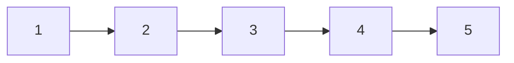

Starting with node 1, for this graph to relax till E we would need `|V| - 1` or 4 iterations.

###### Complexity Analysis:
**Time Complexity: (O(V * E))**
The time complexity of Bellman-Ford is `(O(V * E))`, where `(V)` is the number of vertices and `(E)` is the number of edges in the graph. Here's a detailed breakdown of why this is the case:
- Initialization:
  - Setting up the distance array takes `(O(V))`.
- Main Loop:
  - The algorithm iterates over all edges `(E)` for `(V - 1)` times. In each iteration, it performs edge relaxation.
- Edge Relaxation:
  - For each edge `(u, v)`, the algorithm checks and potentially updates the distance to the vertex `(v)`.
  - Since there are `(E)` edges, and we repeat this process for `(V - 1)` iterations, the total time for edge relaxation is `(O(V * E))`.

Combining these steps, the total time complexity is `(O(V) + O(V * E) = O(V * E))`.

**Space Complexity: `(O(V + E))`**
The space complexity of Bellman-Ford is `(O(V + E))`. Here’s a detailed breakdown:
- Distance Array: The distance array stores distances for `(V)` vertices, resulting in `(O(V))` space.
- Edge List: The edge list stores all edges, resulting in `(O(E))` space.

Combining these, the total space complexity is `(O(V + E))`.

###### Problems
###### [Cheapest Flights Within K Stop](https://leetcode.com/problems/cheapest-flights-within-k-stops)
There are n cities connected by some number of flights. You are given an array `flights` where `flights[i] = [fromi, toi, pricei]` indicates that there is a flight from city `fromi` to city `toi` with cost `pricei`.

You are also given three integers `src`, `dst`, and `k`, return the cheapest price from `src` to `dst` with at most `k` stops. If there is no such route, return `-1`.

Example 1:
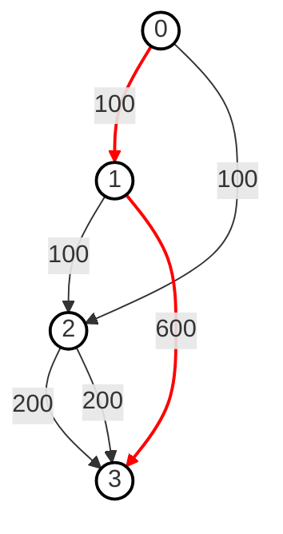
```
Input: 
n = 4 
flights = [[0,1,100],[1,2,100],[2,0,100],[1,3,600],[2,3,200]]
src = 0 
dst = 3
k = 1  

Output: 700

Explanation:
The graph is shown above. The optimal path with at most 1 stop from city 0 to 3 is marked in red and has a cost of 100 + 600 = 700. Note that the path through cities [0,1,2,3] is cheaper but is invalid because it uses 2 stops.
```

###### Intuition
- To solve this problem effectively, we need to find the cheapest price to travel from the source city (src) to the destination city (dst) with at most k stops. This could have been solved with Dijkstra but we don't get to limit the relaxations there.
- So, the Bellman-Ford algorithm is well-suited for this problem because it allows for the relaxation of edges a specified number of times, effectively considering paths with a limited number of stops. This makes it an appropriate choice for finding the cheapest price from the source to the destination with at most k stops.

Code
```python
def find_cheapest_price(n, flights, src, dest, k):
    cost = {i: float('inf') for i in range(n)}
    cost[src] = 0

    # Perform relaxation up to k + 1 times 
    for _ in range(k+1):
        # Create a copy of the current costs
        new_cost = cost.copy()
        for frm, to, price in flights:
            if cost[frm] != float('inf') and cost[frm] + price < new_cost[to]:
                new_cost[to] = cost[frm] + price
        cost = new_cost
    return cost[dst] if cost[dst] != float('inf') else -1
```

**So for single source shortest path, use Bellman Ford if there are negative weights and number of relaxations `k` is restricted.**

#### 2. Multi Source Shortest Path
##### Floyd Warshall Algorithm
The Floyd-Warshall algorithm is used to find the shortest paths between all pairs of vertices in a weighted graph. It can handle positive and negative edge weights but not negative weight cycles.

###### How it Works:
- **Initialization**: Create a distance matrix `dist` where `dist[i][j]` is the weight of the edge from vertex `i` to vertex `j`. If no such edge exists, initialize `dist[i][j]` to infinity. the diagonal elements `dist[i][i]` are set to 0.
- **Relaxation**: For each pair of vertices (i, j), update the `dist[i][j]` to be the minimum of `dist[i][k] + dist[k][j]` for each intermediate vertex k.
- **Repeat**: Repeat the relaxation for all pairs of vertices and all intermediate vertices.
- **Negative Cycle Check**: After computing the shortest paths, if the distance from a vertex to itself becomes negative (dist[i][i] < 0 for any vertex i), it indicates a negative weight cycle.

Code
```python
def floyd_warshall(graph):
    n = len(graph)
    dist = [[float('inf')] * n for _ in range(n)]

    for i in range(n):
        dist[i][i] = 0
        for j, weight in graph[i]:
            dist[i][j] = weight
    
    for k in range(n):
        for u in range(n):
            for v in range(n):
                if dist[u][k] != float('inf') and dist[k][v] 1= float('inf'):
                    if dist[u][k] + dist[k][v] < dist[u][v]:
                        dist[u][v] = dist[u][k] + dist[k][v]
    
    # check for negative weight cycles
    for i in range(n):
        if dist[i][i] < 0:
            # graph contains a negative weight cycle
            return -1
    return dist
```

###### Complexity Analysis
**Time Complexity: `(O(V^3))`**
The time complexity of the Floyd-Warshall algorithm is `(O(V^3))`, where `(V)` is the number of vertices in the graph. Here's a detailed breakdown of why this is the case:
- Main Loop:
  - The algorithm uses three nested loops, each iterating over all vertices `(V)`.
  - For each pair of vertices `(i, j)`, the algorithm checks if there is a shorter path through an intermediate vertex `k`. This involves updating the distance matrix.

Combining these steps, the total time complexity is `(O(V) * O(V) * O(V) = O(V^3))`.

**Space Complexity: `(O(V^2))`**
The space complexity of the Floyd-Warshall algorithm is `(O(V^2))`. Here’s a detailed breakdown:
- Distance Matrix:
  - The distance matrix stores the shortest distances between all pairs of vertices. This requires a 2D array of size `(V x V)`, resulting in `(O(V^2))` space.

Combining these, the total space complexity is `(O(V^2))`.

###### Problems
###### [Find the City With the Smallest Number of Neighbors at a Threshold Distance](https://leetcode.com/problems/find-the-city-with-the-smallest-number-of-neighbors-at-a-threshold-distance)
There are n cities numbered from `0` to `n-1`. Given the array `edges` where `edges[i] = [fromi, toi, weighti]` represents a bidirectional and weighted edge between cities `fromi` and `toi`, and given the integer `distanceThreshold`.

Return the city with the smallest number of cities that are reachable through some path and whose distance is **at most** `distanceThreshold`, If there are multiple such cities, return the city with the greatest number.

Notice that the distance of a path connecting cities *i* and *j* is equal to the sum of the edges' weights along that path.

###### Intuition
Here we need to find distance from between all the cities, no single source but all the cities are sources. Thus a problem where `Bellman Ford` can be used - shortest path between all vertex pairs.

Code
```python
def findTheCity(n, edges, distanceThreshold):
    dist = [[float('inf')] * n for _ in range(n)]

    for u in range(n):
        dist[u][u] = 0
    
    for edge in edges:
        u, v, weight = edge
        dist[u][v] = weight
        dist[v][u] = weight
    
    for k in range(n):
        for u in range(n):
            for v in range(n):
                if dist[u][k] != float('inf') and dist[k][v] != float('inf') and dist[u][k] + dist[k][v] < dist[u][v]:
                    dist[u][v] = dist[u][k] + dist[k][v]
    
    # Find the city with the smallest number of reachable cities within the distance threshold  
    min_count = n  
    city = -1  
        
    for u in range(n):  
        count = sum(1 for v in range(n) if u != v and dist[u][v] <= distanceThreshold)
        print(f"City {u} can reach {count} cities within distance {distanceThreshold}")
        if count <= min_count:  
            min_count = count  
            city = u  
        
    return city  
```

### Disjoint Union Set - DSU
Two sets are called disjoint if they don’t share any element; their intersection is an empty set. Also known as Union-Find as it supports the following operations:
- Merging disjoint sets into a single disjoint set using the **Union** operation.
- Finding the representative of a disjoint set using the **Find** operation.

**Union By Rank**:
The idea is to always attach the smaller tree under the root of the larger tree, thereby minimizing the maximum height of the trees. This technique is known as union by rank.

#### Find
The **Find** operation is used to determine which subset a particular element is in. This can be used to check if two elements are in the same subset.
When finding the root parent of a node, the find function updates the parent of each node in the path to point directly to the root. This step ensures that the tree remains flat and subsequent find operations are faster.

##### Example:
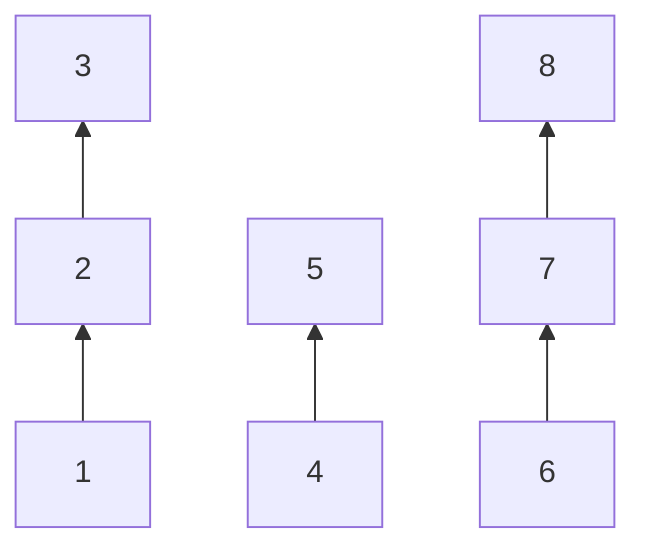
- Find(1): To find the representative of the set containing element 1, we follow the pointer from 1 to 2, and from 2 to 3. Thus, the representative for element 1 is 3.
- Find(4): To find the representative of the set containing element 4, we follow the pointer from 4 to 5. Thus, the representative for element 4 is 5.

##### Code
```python
def find(node):
    # If the node is not its own parent, recursively find the root and compress the path
    if node != parent[node]:
        parent[node] = find(parent[node]) # Path compression
    return parent[node]
```

#### Union
The Union operation is used to merge two subsets into a single subset. This is useful when you need to combine the sets containing two different elements.

##### Example
Consider the following sets represented as a forest:


Let's say we want to merge the sets containing elements 1 and 4:
- First, we find the representatives of each set:
- Find(1) returns 3.
- Find(4) returns 5.
- Then, we merge the sets by making one representative the parent of the other.

##### Code
```python
def union(node1, node2):  
    root1 = find(node1)  
    root2 = find(node2)  
    
    # If they have different root parents, union them
    if root1 != root2:  
        parent[root2] = root1  # Merge the sets
```

#### Union By Rank
The Union-Find algorithm can be optimized using the `Union by Rank` technique to keep the tree shallow, which improves the efficiency of both find and union operations.

##### Code
```python
n = 8
rank = [1] * n
def union(node1, node2):  
    parent1 = find(node1)  
    parent2 = find(node2)  
      
    # If they have different root parents, union them
    if parent1 != parent2:
        # Union by rank: attach the smaller tree under the larger tree
        if rank[parent1] >= rank[parent2]:
            parent[parent2] = parent1 # Merge the sets
            rank[parent1] = rank[parent1] + rank[parent2]
        else:  
            parent[parent1] = parent2
            rank[parent2] = rank[parent2] + rank[parent1]
```

##### Complexity Analysis
Disjoint Set Union (DSU), also known as Union-Find, is a data structure that supports two main operations efficiently:
- **Find**: Determine which subset a particular element is in. This can be used for determining if two elements are in the same subset.
- **Union**: Join two subsets into a single subset.

To achieve efficient performance, DSU typically uses two optimizations:
- **Path Compression**: This flattens the structure of the tree whenever `Find` is called, ensuring that all nodes **directly** point to the root.
- **Union by Rank/Size**: This ensures that the smaller tree is always added under the root of the larger tree, keeping the tree **shallow**.

**Time Complexity Analysis:**
**Amortized Time Complexity: `(O(α(n)))`**
The time complexity of the DSU operations with **path compression** and **union by rank/size** is **nearly constant**. The amortized time complexity for both Find and Union operations is `O(α(n))`, where `α(n)` is the `Inverse Ackermann function`. This function grows very slowly, so for all practical purposes, `O(α(n))` is considered to be almost constant time.

Here's a more detailed breakdown:
- **Find with Path Compression**: The Find operation with path compression takes `O(α(n))` time.
- **Union with Rank/Size**: The Union operation with rank/size also takes `O(α(n))` time.

Explanation of Inverse Ackermann Function (α(n)): 
The Inverse Ackermann function, `α(n)`, is an extremely slowly growing function. For all practical input sizes, `α(n)` is less than **5**. This means that DSU operations are very efficient and **close to constant time** for all reasonable input sizes.

**Space Complexity Analysis: `(O(V))`**
The space complexity of the DSU data structure is `O(V)`, where `V` is the number of vertices (or elements) in the set. Here's a detailed breakdown:
- **Parent array**: The parent array keeps track of the representative or parent of each vertex. This array requires `O(V)` space.
- **Rank/Size array**: The rank or size array helps to keep the tree shallow by ensuring that the smaller tree is always added under the root of the larger tree during union operations. This array also requires `O(V)` space.

Combining these, the total space complexity for the DSU data structure is `O(V)`.

#### Problems
##### [Number of Connected Components in an Undirected Graph](https://leetcode.com/problems/number-of-connected-components-in-an-undirected-graph)*
Given an undirected graph with n nodes and edges, find the number of connected components in the graph.
```python
def count_components(n, edges):
    parent = {i: i for i in range(n)}
    rank = [1] * n

    def find(node):
        # If the node is not its own parent, recursively find the root and compress the path
        if node != parent[node]:
            parent[node] = find(parent[node])
        return parent[node]

    def union(node1, node 2):
        parent1 = find(node1)
        parent2 = find(node2)

        # If they have different root parents, union them
        if parent1 != parent2:
            # Union by rank: attach the smaller tree under the larger tree
            if rank[parent1] >= rank[parent2]:
                parent[node2] = parent1
                rank[parent1] = rank[parent1] + rank[parent2]
            else:
                parent[node1] = parent2
                rank[parent2] = rank[parent2] + rank[parent1]

    for src, dest in edges:
        union(src, dest)

    components = set()
    for node in range(n):
        components.add(find(node))

    return len(components) 
```

##### [Number of Provinces](https://leetcode.com/problems/number-of-provinces)*
There are `n` cities. Some of them are connected, while some are not. If city `a` is connected directly with city `b`, and city `b` is connected directly with city `c`, then city `a` is connected indirectly with city `c`.
A province is a group of directly or indirectly connected cities and no other cities outside of the group.
You are given an `n x n` matrix `isConnected` where `isConnected[i][j] = 1` if the `ith` city and the `jth` city are directly connected, and `isConnected[i][j] = 0` otherwise.
Return the total number of provinces.

Example
```
Input: isConnected = [[1,1,0],[1,1,0],[0,0,1]]
Output: 2
```

###### Intuition
To solve this problem, we can use the `Union-Find (Disjoint Set Union)` data structure to efficiently manage and merge the connected cities into provinces. The idea is to initialize each city as its own parent and then union cities that are directly connected. Finally, we count the number of unique parents to determine the number of provinces.

Code
```python
def find_circle_num(isConnected):
    n = len(isConnected)
    parent = {i: i for i in range(n)}
    rank = {i: 1 for i in range(n)}

    def find(node):
        # If the node is not its own parent, recursively find the root and compress the path
        if parent[node] != node:
            parent[node] = find(parent[node]) # Path compression
        return parent[node]
    
    def union(node1, node2):
        parent1 = find(node1)
        parent2 = find(node2)

        # If they have different root parents, union them
        if parent1 != parent2:
            # Union by rank: attach the smaller tree under the larger tree
            if rank[parent1] >= rank[parent2]:
                parent[parent2] = parent1
                rank[parent1] = rank[parent1] + rank[parent2]
            else:
                parent[parent1] = parent2
                rank[parent2] = rank[parent2] + rank[parent1]
    
    # Iterate through the isConnected matrix to union directly connected cities
    for row in range(n):
        for col in range(n):
            if isConnected[row][col] == 1:
                union(row, col)
    
    # Use a set to find the number of unique provinces (unique root parents)
    provinces = set()
    for node in range(n):
        provinces.add(find(node))
    
    return len(provinces)
```

#### [Redundant Connection](https://leetcode.com/problems/redundant-connection)
In this problem, a tree is an **undirected graph** that is connected and has no cycles.
You are given a graph that started as a tree with `n` nodes labeled from `1` to `n`, with one additional edge added. The added edge has two **different** vertices chosen from `1` to `n`, and was not an edge that already existed. The graph is represented as an array `edges` of length `n` where `edges[i] = [ai, bi]` indicates that there is an edge between nodes `ai` and `bi` in the graph.

Return **an edge that can be removed so that the resulting graph is a tree of `n` nodes**. If there are multiple answers, return the answer that occurs last in the input.

Example:
```
Input: edges = [[1,2],[1,3],[2,3]]
Output: [2,3]
```

##### Intuition
The intuition for this problem is very simple, whichever edge causes a cycle can returned as a result. If multiple return the last in input.
We can utilise our knowledge of find and union to find this edge.

Code
```python
def redundant_connection(edges):
    n = len(edges)
    parent = {i: i for i in range(1, n+1)}
    rank = [1] * (n+1)
    def find(node):
        if node != parent[node]:
            parent[node] = find(parent[node])
        return parent[node]
    
    def union(node1, node2):
        parent1, parent2 = find(node1), find(node2)

        if parent1 == parent2:
            return False
        
        if parent1 != parent2:
            if rank[parent1] >= rank[parent2]:
                parent[parent2] = parent1
                rank[parent1] = rank[parent1] + rank[parent2]
            else:
                parent[parent1] = parent2
                rank[parent2] = rank[parent2] + rank[parent1]
        
        return True
    
    for u, v in edges:
        if not union(u, v):
            return [u, v]
```

#### [Accounts Merge](https://leetcode.com/problems/accounts-merge)*
Given a list of accounts where each element accounts[i] is a list of strings, where the first element accounts[i][0] is a name, and the rest of the elements are emails representing emails of the account.

Now, we would like to merge these accounts. Two accounts definitely belong to the same person if there is some common email to both accounts. Note that even if two accounts have the same name, they may belong to different people as people could have the same name. A person can have any number of accounts initially, but all of their accounts definitely have the same name.

After merging the accounts, return the accounts in the following format: the first element of each account is the name, and the rest of the elements are emails in sorted order. The accounts themselves can be returned in any order.

##### Intuition
The intuition behind solving the accounts merge problem using the Union-Find (Disjoint Set Union) approach is to efficiently group emails that belong to the same user based on their connections across different accounts. Here's the high-level logic:

- **Union-Find Data Structure**: Use the Union-Find data structure to manage the merging of emails. Each email is initially its own parent, representing a unique set.
- **Union Operation**: For each account, union all the emails in that account together. This ensures that all emails in the same account are connected through a common root.
- **Find Operation**: Use the find operation with path compression to determine the root parent of each email. This helps in efficiently finding and grouping connected emails.
- **Group Emails by Root**: After processing all accounts, group emails by their root parent. Emails with the same root parent are part of the same connected component, indicating they belong to the same user.

The core idea is to treat each email as a node and each account as an edge connecting nodes. By unioning emails within the same account, the Union-Find structure helps to identify all connected components, which represent the merged accounts.

Code
```python
def accountsMerge(accounts):
    parent = {} # This dictionary will map each email to its parent email
    rank = {}

    def find(node):
        if parent[node] != node:
            parent[node] = find(parent[node]) # Path compression
        return parent[node]
    
    def union(node1, node2):
        parent1 = find(node1)
        parent2 = find(node2)

        if parent1 != parent2:
            if rank[parent1] >= rank[parent2]:
                parent[parent2] = parent1
                rank[parent1] = rank[parent1] + rank[parent2]
            else:
                parent[parent1] = parent2
                rank[parent2] = rank[parent2] + rank[parent1]
    
    email_to_name = {}  # This dictionary maps each email to the corresponding name

    # Initialize the union-find structure and email_to_name map
    for account in accounts:
        name = account[0]
        first_email = account[1]
        for email in account[1:]:
            if email not in parent:
                parent[email] = email # Each email is its own parent initially
                rank[email] = 1
            email_to_name[email] = name
            union(first_email, email) # Union the first email with the current email
    
    # Group emails by their root parent
    groups = defaultdict(list)
    for email in parent:
        root_email = find(email)
        groups[root_email].append(email)
    
    # Format the result
    result = []
    for root_email in groups:
        merged_account_name = email_to_name[root_email]
        merged_account_emails = sorted(groups[root_email])
        result.append([merged_account_name] + merged_account_emails)
    
    return result
```

#### Minimize Malware Spread
You are given a network of n nodes represented as an n x n adjacency matrix graph, where the ith node is directly connected to the jth node if graph[i][j] == 1.

Some nodes initial are initially infected by malware. Whenever two nodes are directly connected, and at least one of those two nodes is infected by malware, both nodes will be infected by malware. This spread of malware will continue until no more nodes can be infected in this manner.

Suppose M(initial) is the final number of nodes infected with malware in the entire network after the spread of malware stops. We will remove exactly one node from initial.

Return the node that, if removed, would minimize M(initial). If multiple nodes could be removed to minimize M(initial), return such a node with the smallest index.

Note that if a node was removed from the initial list of infected nodes, it might still be infected later due to the malware spread.

Example:
```
Input: graph = [[1,1,0],[1,1,0],[0,0,1]], initial = [0,1]
Output: 0
```

##### Intuition
Using the Disjoint Set Union (DSU), also known as Union-Find, is effective for this problem because it helps efficiently manage and query the connected components of the graph. Here’s the detailed intuition:

- **Graph Representation**: The graph is given as an n x n adjacency matrix where graph[i][j] == 1 means node i is directly connected to node j.
- **Union-Find Structure**: This data structure helps in grouping nodes into connected components. Each component is treated as a single unit, which simplifies the problem of determining the impact of removing a node.
- **Component Size and Infection Count**: By identifying the size of each connected component and how many initially infected nodes are in each component, we can determine the potential impact of removing any single infected node.
- **Effect of Node Removal**: If a node is the sole infected node in its component, removing it will prevent the entire component from getting infected. The larger the component, the more beneficial it is to remove that node.
- **Optimal Node Selection**: If multiple nodes can minimize the infection equally, the node with the smallest index should be chosen.

Code
```python
def minMalwareSpread(self, graph: List[List[int]], initial: List[int]) -> int:  
    n = len(graph)  
    parent = {i: i for i in range(n)}  
    rank = [1] * n 

    def find(node):
        if node != parent[node]:
            parent[node] = find(parent[node]) # Path Compression
        return parent[node]

    def union(node1, node2):
        parent1 = find(node1)
        parent2 = find(node2)

        if parent1 != parent2:
            if rank[parent1] >= rank[parent2]:
                parent[parent2] = parent1
                rank[parent1] = rank[parent1] + rank[parent2]
            else:
                parent[parent1] = parent2
                rank[parent2] = rank[parent2] + rank[parent1]
         

    # Union nodes that are directly connected  
    for u in range(n):
        for v in range(n):
            if graph[u][v] == 1:
                union(u, v)

    # Count the number of initially infected nodes in each component  
    connected_components = defaultdict(int)
    for node in initial:
        parent_node = find(node)
        connected_components[parent_node] = connected_components[parent_node] + 1 

    # Determine the best node to remove  
    best_node = (-1, float('inf'))  # Tuple to keep track of (component_size, -node)  
    for node in initial:  
        parent_node = find(node)  
        if component_infected_count[parent_node] == 1:  # Only consider nodes that are the sole infected node in their component  
            component_size = rank[parent_node]  # Use rank as an estimate for component size  
            best_node = max(best_node, (component_size, -node))  # Maximize component size, minimize node index  

    # Return the best node to remove  
    if best_node[0] == -1:
        return min(initial) # In case all the infected nodes don't have any connected - return the one with minium value
    return -best_node[1]
```

### Minimum Spanning Tree
A Minimum Spanning Tree (MST) of a weighted, connected, undirected graph is a spanning tree that has the minimum possible total edge weight compared to all other spanning trees of the graph.
**Easy words**: A Minimum Spanning Tree connects all the vertices in a graph with the minimum possible total edge weight, ensuring no cycles are formed.

#### Characteristics
- Spanning Tree: A spanning tree of a graph is a subgraph that includes all the vertices of the original graph and is a tree (i.e., it is connected and acyclic).
- Minimum Total Edge Weight: Among all possible spanning trees, the MST has the least sum of the weights of its edges.
- Uniqueness: If all the edge weights are distinct, the MST is unique. If there are edges with equal weights, there may be multiple MSTs with the same total weight.

#### Algorithms to find MST
##### 1. Prim's Algorithm
Prim's Algorithm is a greedy algorithm that finds a Minimum Spanning Tree (MST) for a weighted, connected, undirected graph. The algorithm operates by growing the MST one vertex at a time, starting from an arbitrary vertex and repeatedly adding the smallest edge that connects a vertex in the MST to a vertex outside the MST.

**Step-by-Step Process:**
- Initialization:
  - Start with an arbitrary vertex, and mark it as part of the MST.
  - Initialize a priority queue (min-heap) to keep track of the smallest edges that connect vertices inside the MST to vertices outside the MST.
- Growing the MST:
  - While there are still vertices not included in the MST:
  - Extract the edge with the smallest weight from the priority queue.
  - Add the edge and the vertex it connects to the MST (if the vertex is not already in the MST).
  - For the newly added vertex, add all edges connecting it to vertices outside the MST to the priority queue.
- Completion:
  - The algorithm completes when all vertices are included in the MST.

Code
```python
def prim(start, graph):
    min_heap = [(0, start)]
    visited = set()
    min_cost = 0

    while min_heap:
        node_weight, node = heapq.heappop(min_heap)
        
        # If the node has already been visited, skip it
        if node in visited:  
            continue 

        visited.add(node)
        min_cost = min_cost + node_weight

        for neighbor, weight in graph[node]:
            if neighbor not in visited:
                heapq.heappush(min_heap, (weight, neighbor))
    
    return min_cost
```

###### Complexity Analysis
**Time Complexity: `(O((V + E) * log V))`**
The time complexity of the Prim's algorithm is `(O((V + E) * log V))`, where `(V)` is the number of vertices in the graph and `(E)` is the number of edges in the graph. Here's a detailed breakdown of why this is the case:
- Initialization:
  - Initializing the priority queue (min-heap) takes `(O(1))` time.
- Main Loop:
  - Each vertex is extracted exactly once from the priority queue. Extracting the minimum element from a binary heap takes `(O(log V))`. Since there are `(V)` vertices, the total time for extracting the minimum element is `(O(V * log V))`.
  - For each vertex `(u)`, we examine its adjacent edges. Relaxing an edge involves checking and potentially updating the key value of a neighboring vertex `(v)`. If an update is needed, we perform a **decrease-key operation** in the priority queue.
  - The decrease-key operation in a binary heap takes `(O(log V))` time.
  - Since each edge is relaxed exactly once, and there are `(E)` edges, the total time for edge relaxation is `(O(E * log V))`.

Combining these steps, the total time complexity is `[O(1) + O(V * log V) + O(E * log V) = O((V + E) * log V)]`

**Space Complexity: `(O(V + E))`**
The space complexity primarily depends on the storage of the graph and the heap.
- Graph storage: The graph is stored as an adjacency list, which takes O(V + E) space.
- Heap storage: The min-heap can contain up to V vertices, resulting in O(V) space.
- Visited set: The visited set stores up to V vertices, resulting in O(V) space.

Combining these, the total space complexity is `(O(V + E))`.

##### 2. Kruskal's Algorithm
Kruskal's Algorithm is another greedy algorithm for finding the Minimum Spanning Tree of a graph. It works by sorting all the edges in the graph by their weight and then adding them one by one to the MST, ensuring that no cycles are formed.

###### Step-by-Step Process
- **Initialization**:
  - Sort all edges in the graph by their weight
  - Initialize a **Disjoint Set(Union Find)** to keep track of wich vertices are which components.
- **Building the MST**:
  - For each edge in the sorted list:
    - If the edge connects 2 vertices that are not already in the same component, add the edge to the MST and join the components.
- **Completion**:
  - The algorithm completes when there are exactly `n-1` edges in the MST.

Code
```python
def kruskal(n , edges):
    parent = {i: i for i in range(n)}
    rank = [1] * n

    def find(node):
        if node != parent[node]:
            parent[node] = find(parent[node])
        return parent[node]
    
    def union(node1, node2):
        parent1 = find(node1)
        parent2 = find(node2)

        if parent1 != parent2:
            if rank[parent1] >= rank[parent2]:
                parent[parent2] = parent1
                rank[parent1] = rank[parent1] + rank[parent2]
            else:
                parent[parent1] = parent2
                rank[parent2] = rank[parent2] + rank[parent1]
    
    # edge has the structure - src, dest, weight
    edges.sort(lambda edge: edge[2])

    mst_cost = 0
    mst_edges = 0

    for edge in edges:
        src, dest, weight = edge
        if find(src) != find(dest):
            union(src, dest)
            mst_cost = mst_cost + weight
            mst_edges = mst_edges + 1
            if mst_edges == n-1:
                break
    
    return mst_cost
```

###### Complexity Analysis
**Time Complexity: `(O(E * log V))`**
The time complexity of Kruskal's algorithm is `(O(E * log V))`, where `(V)` is the number of vertices in the graph and `(E)` is the number of edges in the graph. Here's a detailed breakdown of why this is the case:
- **Sorting the edges**:
  - The first step in Kruskal's algorithm is to sort all the edges in non-decreasing order of their weights. If there are `(E)` edges, the time complexity for sorting the edges is `(O(E * log E))`.
  - Since `E` can be at most `V^2` in a dense graph, `log E` is `O(log V^2) = O(2 * log V) = O(log V)`. Therefore, `O(E * log E)` is equivalent to `O(E * log V)` for large `E`.
- **Initializing the Disjoint Set Union (DSU) data structure**:
  - Initializing the DSU data structure (with path compression and union by rank/size) for `(V)` vertices takes `(O(V))` time.
- **Processing each edge and performing union-find operations**:
  - The main loop processes each edge in the sorted order and performs union-find operations to check if the current edge forms a cycle or not.
  - For each edge, we perform the `Find` operation twice (once for each vertex of the edge) and potentially one `Union` operation.
  - The `Find` operation with **path compression** takes `(O(α(V)))` time.
  - The `Union` operation with **union by rank/size** takes `(O(α(V)))` time.
  - Since each edge is processed once, and there are `(E)` edges, the total time for union-find operations is `(O(E * α(V)))`.

Combining these steps, the total time complexity is `[O(E * log V) + O(V) + O(E * α(V))]`.

Since `α(V)` is a very slowly growing function and is **practically constant** for all reasonable input sizes, the term `(O(E * α(V)))` can be considered as `(O(E))`.

So, the overall time complexity simplifies to `O(E * log V)`.

**Space Complexity: `(O(V + E))`**
The space complexity primarily depends on the storage of the graph and the DSU data structure.
- **Graph storage**: The graph is stored as an edge list, which takes `(O(E))` space.
- **DSU storage**: The DSU data structure uses arrays to store parent and rank information for each vertex, resulting in `(O(V))` space.

Combining these, the total space complexity is `(O(V + E))`.

#### Problems
#### [Minimum Cost to Connect All Points](https://leetcode.com/problems/min-cost-to-connect-all-points)*
You are given an array `points` representing integer coordinates of some points on a 2D-plane, where `points[i] = [xi, yi]`.

The cost of connecting two points `[xi, yi]` and `[xj, yj]` is the **manhattan distance** between them: `|xi - xj| + |yi - yj|`, where `|val|` denotes the absolute value of `val`.

Return the minimum cost to make all points connected. All points are connected if there is **exactly one** simple path between any two points.

##### Intuition
- The problem is essentially about finding the Minimum Spanning Tree (MST) of a graph where the nodes are points in a 2D plane and the edges are the Manhattan distances between these points.
- We would be using the Prim's algorithm for finding the MST.

Code
```python
def min_cost_connect_points(points):
    n = len(points)

    # Priority queue to select the edge with minimum cost
    min_heap = [(0, 0)] # (cost, point_index)
    visited = set()
    total_cost, edges_used = 0, 0

    while edges_used < n:
        # Pop the edge with the smallest cost from the heap  
        cost, i = heapq.heappop(min_heap)  
          
        # If the point has already been visited, skip it  
        if i in visited:  
            continue  
          
        # Mark the point as visited  
        visited.add(i)  
          
        # Add the cost of this edge to the total cost  
        total_cost = total_cost + cost  
          
        # Iterate over all points to update the heap with edges from the newly visited point  
        for j in range(n):  
            if j not in visited:  
                # Calculate the Manhattan distance between points i and j  
                manhattan_distance = abs(points[i][0] - points[j][0]) + abs(points[i][1] - points[j][1])  
                  
                # Push the new edge to the heap  
                heapq.heappush(min_heap, (manhattan_distance, j))

    return total_cost
```

#### Reconstruct Itenary
You are given a list of airline `tickets` where `tickets[i] = [fromi, toi]` represent the departure and the arrival airports of one flight. Reconstruct the itinerary in order and return it.

All of the tickets belong to a man who departs from `"JFK"`, thus, the itinerary must begin with `"JFK"`. If there are multiple valid itineraries, you should return the itinerary that has the smallest lexical order when read as a single string.

For example, the itinerary `["JFK", "LGA"]` has a smaller lexical order than `["JFK", "LGB"]`.
You may assume all tickets form at least one valid itinerary. You must use all the tickets once and only once.

##### Example 1:
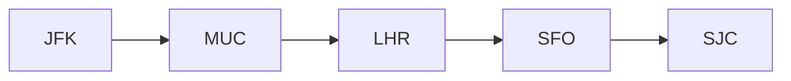
```
Input: tickets = [["MUC","LHR"],["JFK","MUC"],["SFO","SJC"],["LHR","SFO"]]
Output: ["JFK","MUC","LHR","SFO","SJC"]
```

##### Example 2:
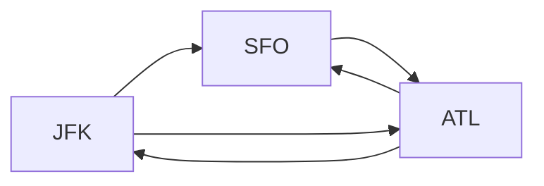
```
Input: tickets = [["JFK","SFO"],["JFK","ATL"],["SFO","ATL"],["ATL","JFK"],["ATL","SFO"]]
Output: ["JFK","ATL","JFK","SFO","ATL","SFO"]
Explanation: Another possible reconstruction is ["JFK","SFO","ATL","JFK","ATL","SFO"] but it is larger in lexical order.
```

##### Intuition
To reconstruct the itinerary, we can leverage the properties of Depth-First Search (DFS) and a priority queue (min-heap). 
- The key idea is to always visit the next airport in the smallest lexical order to ensure the correct itinerary. 
- By using a DFS approach, we can explore all possible paths, and by utilizing a min-heap, we can guarantee that we always choose the smallest lexical airport available. 
- This way, we can ensure that our final itinerary is lexicographically smallest. 
- The final step involves reversing the itinerary since airports are appended to the result after all their destinations have been visited.

Code
```python
def findItinerary(tickets):  
    # Build the graph  
    graph = defaultdict(list)  
    for departure, arrival in tickets:  
        heapq.heappush(graph[departure], arrival)  
      
    # Perform DFS  
    itinerary = []  
      
    def dfs(airport):  
        while graph[airport]:  
            next_destination = heapq.heappop(graph[airport])  
            dfs(next_destination)  
        itinerary.append(airport)  
      
    dfs("JFK")  
      
    # Reverse the itinerary to get the correct order  
    return itinerary[::-1]
```

### Bipartite Graph
A bipartite graph is a type of graph where the set of vertices can be divided into two disjoint and independent sets, U and V, such that every edge connects a vertex in U to a vertex in V. In other words, there are no edges between vertices within the same set.

Key Properties:
- **Two Sets of Vertices**: The vertices can be split into two groups, and no two vertices within the same group are adjacent.
- **Colorability**: A graph is bipartite if and only if it is 2-colorable, meaning you can color the graph using two colors such that no two adjacent vertices share the same color.
- **Cycle Property**: A graph is bipartite if and only if it does not contain any odd-length cycles.

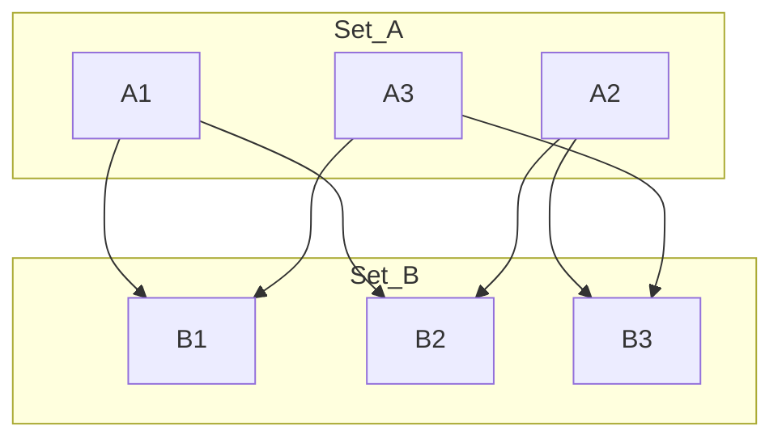

#### [Is Graph Bipartite?](https://leetcode.com/problems/is-graph-bipartite)*
There is an undirected graph with `n` nodes, where each node is numbered between `0` and `n - 1`. You are given a 2D array `graph`, where `graph[u]` is an array of nodes that node `u` is adjacent to. More formally, for each `v` in `graph[u]`, there is an undirected edge between node `u` and node `v`. 
The graph has the following properties:
- There are no self-edges (`graph[u]` does not contain `u`).
- There are no parallel edges (`graph[u]` does not contain duplicate values).
- If `v` is in `graph[u]`, then `u` is in `graph[v]` (the graph is undirected).
- The graph may not be connected, meaning there may be two nodes `u` and `v` such that there is no path between them.

A graph is **bipartite** if the nodes can be partitioned into two independent sets `A` and `B` such that every edge in the graph connects a node in set `A` and a node in set `B`.

Return true if and only if it is bipartite.

##### Intuition
To determine if a graph is bipartite, we need to check if we can color the graph using two colors such that no two adjacent nodes have the same color. This can be achieved using either Breadth-First Search (BFS) or Depth-First Search (DFS).

The basic idea is to attempt to color the graph using two colors while traversing it:
- Start from an uncolored node, color it with one color.
- Color all its adjacent nodes with the opposite color.
- Continue this process for all nodes using BFS or DFS.
- If at any point, we find an adjacent node that has the same color as the current node, the graph is not bipartite.

Since the graph may not be connected, we need to apply this process for each connected component.

Code
```python
def isBipartite(graph):  
    n = len(graph)  
    color = [-1] * n  # -1 indicates that the node has not been colored yet  
      
    def dfs(node, c):  
        color[node] = c  
        for neighbor in graph[node]:  
            if color[neighbor] == -1:  # If the neighbor is not colored, color it with the opposite color  
                if not dfs(neighbor, 1 - c):  
                    return False  
            elif color[neighbor] == color[node]:  # If the neighbor has the same color, the graph is not bipartite  
                return False  
        return True  
      
    for start in range(n):  
        if color[start] == -1:  # If the node is not colored, start a DFS  
            if not dfs(start, 0):  
                return False  
      
    return True
```
### Hamiltonian Path - Travelling Salesman Problem
### Graph Coloring
### Strongly connected components - Kosaraju's Algorithm
#### Definition
A maximal subgraph of a directed graph such that for every pair of vertices (u) and (v) in the subgraph, there is a directed path from (u) to (v) and a directed path from (v) to (u).

Example:
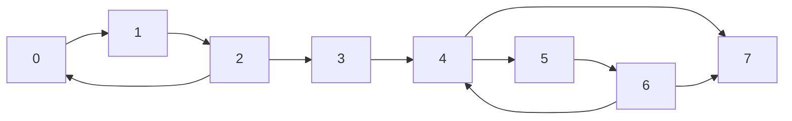

SCCs:
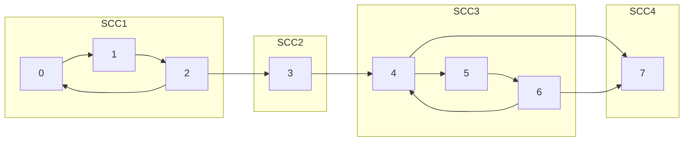

Kosaraju's Algorithm is a well-known algorithm used to find the Strongly Connected Components (SCCs) of a directed graph. A strongly connected component is a maximal subgraph where every vertex is reachable from every other vertex within the subgraph.

##### Intuition
The intuition behind Kosaraju's Algorithm for finding Strongly Connected Components (SCCs) in a directed graph leverages depth-first search (DFS) and the properties of graph transposition. The algorithm operates in two main phases and uses the concept of finish times and the reversed graph to effectively discover SCCs.

**Concepts**
- **Finish Times in DFS**:
  - When performing DFS on a graph, each vertex is assigned a finish time based on when the DFS completes exploring all vertices reachable from it.
  - Vertices with later finish times are those that are deeper in the DFS traversal, indicating that all possible paths from these vertices have been explored.
- **Graph Transposition**:
  - Transposing (reversing) a graph means reversing the direction of all its edges.
  - In the transposed graph, the direction of reachability is reversed. Paths that existed in the original graph now point in the opposite direction.
- **Order of Processing**:
  - The order in which vertices are processed in the second pass of DFS is crucial.
  - By processing vertices in the decreasing order of their finish times from the first DFS, we ensure that when we start a DFS on a vertex in the transposed graph, we capture an entire SCC in one go.

**Why this works?**
- Capturing SCCs:
  - In the transposed graph, if we start DFS from a vertex that had the highest finish time in the original graph, we are guaranteed to explore all vertices in its SCC.
  - This is because, in the transposed graph, edges point back to vertices that could reach the starting vertex in the original graph.
- Isolation of SCCs:
  - After capturing one SCC, the vertices in that SCC are marked as visited.
  - Subsequent DFS calls will start from vertices in other SCCs, as vertices in the already visited SCCs will not be revisited.
  Steps of Kosaraju's Algorithm:

**Steps**
- First Pass (Order Vertices by Finish Time):
  - Perform a DFS on the original graph, keeping track of the finish time of each vertex.
  - Store the vertices in a stack according to their finish times (i.e., push them onto the stack in the order they finish).
- Second Pass (Transpose and DFS):
  - Transpose (reverse) the graph.
  - Perform DFS on the transposed graph, processing vertices in the order defined by the stack (from the first pass).
  - Each DFS call in this pass will discover an SCC.

Code
```python
def find_sccs(graph):  
    n = len(graph)  
    visited = set()  
    stack = []  
  
    # First DFS to fill the stack with nodes in the order of their finishing times  
    def dfs(node):  
        visited.add(node)  
        for neighbor in graph[node]:  
            if neighbor not in visited:  
                dfs(neighbor)  
        stack.append(node)  
  
    # Run DFS from each node to fill the stack  
    for node in range(n):  
        if node not in visited:  
            dfs(node)  
  
    # Transpose the graph  
    transposed_graph = {i: [] for i in range(n)}  
    for node in graph:  
        for neighbor in graph[node]:  
            transposed_graph[neighbor].append(node)  
  
    # Second DFS on the transposed graph to find SCCs  
    def dfs_transposed(node):  
        visited.add(node)  
        component.add(node)  
        for neighbor in transposed_graph[node]:  
            if neighbor not in visited:  
                dfs_transposed(neighbor)  
  
    visited = set()  # Reset visited for the second pass  
    sccs = []  # List to hold all SCCs  
  
    # Process all nodes in the order defined by the stack  
    while stack:  
        node = stack.pop()  
        if node not in visited:  
            component = set()  
            dfs_transposed(node)  
            sccs.append(component)  
  
    return sccs
```

### Network Flow
#### 1. Ford-Fulkerson
#### 2. Edmonds Karp
