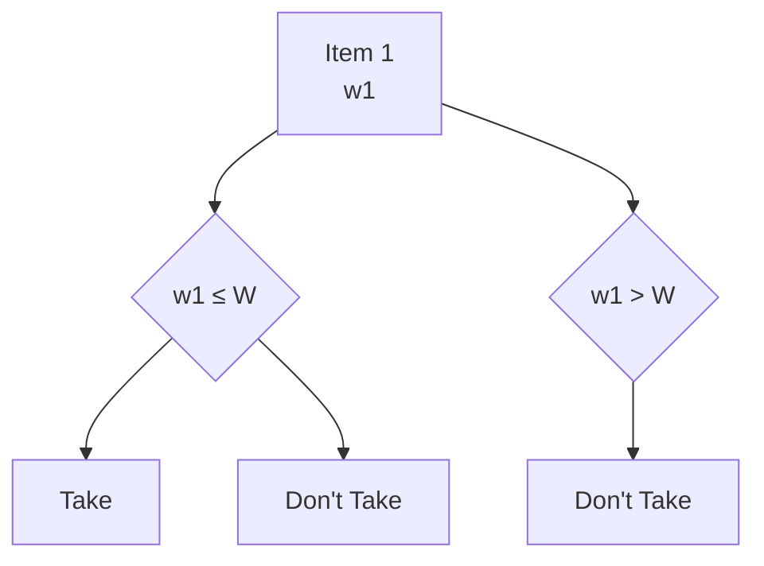
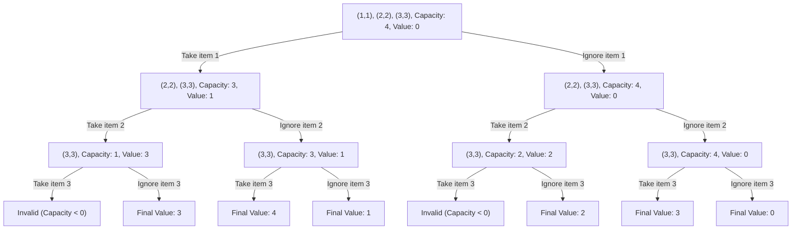
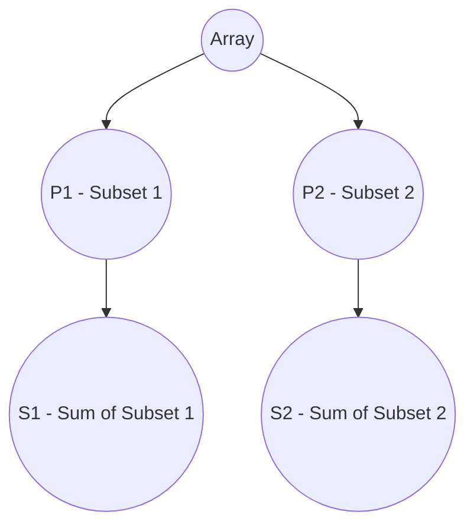
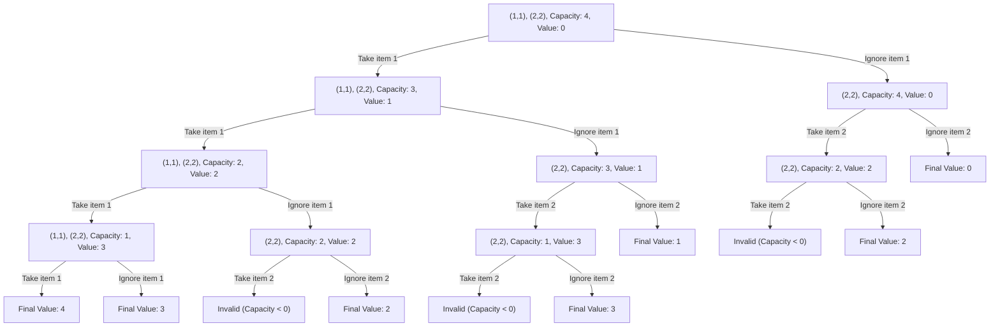
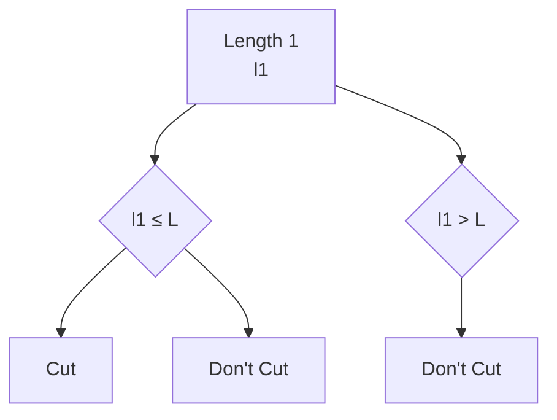
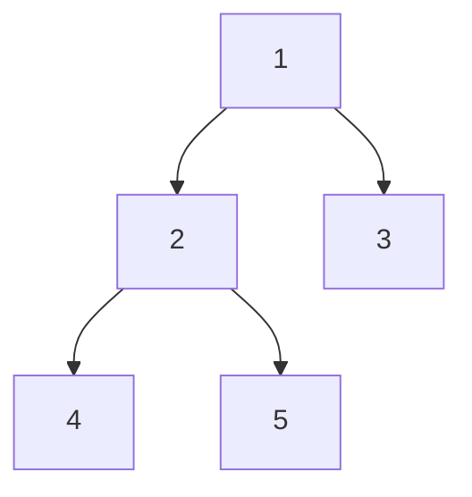

# Dynamic Programming

**Those who can't remember the past are condemned to repeat it.**

Dynamic Programming is actually **enhanced recursion**. There are some calls which are repetitive and thus can be memoized for future calls.

## Identification
- **Multiple choices in the problem** - leading to overlapping sub-problems. 
- **Optimal solution** - finding the correct choice that would lead to either maximum/minimum/optimum solution.

## Patterns
- 0-1 Knapsack
- Unbounded Knapsack
- Fibonacci
- Longest Common Subsequence
- Longest Increasing Subsequence
- Kadane's Algorithm
- Matrix Chain Multiplication
- DP on Trees
- DP on Grid

### 0-1 Knapsack
Knapsack is a bag to store items and you are given a list of items with `weight` and `value`. The bag would have a `capacity` and you would need to choose items to put in bag. No fractional items can be taken in the bag.

#### Recursive Solution:
- Choices: To take an item or ignore it. If the weight of the item is greater than the capacity then there is no choice but to ignore it.
- Base Condition: All the items are already considered.

#### Choice Diagram:

Example:


#### Recursive Code:
```python
def knapsack(weights, values, capacity):
    n = len(weights)
    def solve(index, capacity):
        if index == n or capacity == 0:
            return 0
        profit = solve(index+1, capacity)
        if weights[index] <= capacity:
            profit = max(profit, solve(index+1, capacity-weights[index]) + values[index])
        return profit
    return solve(0, capacity)
```

This solution has a time complexity of `O(2^n)` as we have 2 choices (to include the item or not) for each of the `n` items so (2 * 2 * ... n *).

So there would be overlapping sub-problems. By this we mean that while we are going through the recursive solution we would encounter the same problem for which we have solved before.
So we can memoize the answer and use it again to avoid any calculations again.

**For the memoization we can use the map or dictionary in python.**

#### Memoized solution
```python
def knapsack(weights, values, capacity):
    n = len(weights)
    mem = dict()
    def solve(index, capacity):
        if index == 0 or capacity == 0:
            return 0
        if (index, capacity) not in mem:
            profit = solve(index + 1, capacity)
            if weights[index] <= capacity:
                profit = max(profit, solve(index+1, capacity-wwights[index]) + values[index])
            mem[(index, capacity)] = profit
        return mem[(index, capacity)]
    return solve(0, capacity)
```

Time complexity now:
- In the memoized solution, we use a dictionary mem to store subproblem results, avoiding redundant calculations. 
- There are n possible indices and capacity + 1 capacity values, resulting in n * (capacity + 1) unique subproblems. Each subproblem involves constant work (comparisons and arithmetic). 
- Thus, the time complexity is O(n * capacity), a significant reduction from the exponential O(2^n) solution.

#### 6 Problems based on 0-1 Knapsack:
- Subset Sum
- Equal Sum Subset
- Count of Subset Sum
- Minimum Subset Sum Difference
- Target Sum
- Number of subset of given difference

#### Identification that these are a variation of knapsack problems
- In all of these problems there are elements to be chosen from in order to reach an optimal result complying to a certain condition.
- In case of 0-1 knapsack it items to be chosen to get the maximum value within the capacity of the bag. You will see that these 6 problems also match this pattern. 

##### Subset Sum
Given an array of numbers and a sum value. We need to find out whether a subset exists which add up to the sum value.

##### Identification as 0-1 Knapsack Pattern
- Here we are choosing elements from an array.
- We have a target sum that we want to reach, which is basically the capacity of the sack.

Code
```python
def subset_sum(nums, target):
    n = len(nums)

    def solve(index, curr):
        if curr == 0:
            return True
        if index == n:
            return False
        
        num =nums[index]
        if num <= curr:
            return solve(index+1, curr) or solve(index+1, curr - num)
        else:
            return solve(index+1, curr)
    return solve(0, target)
```
The above is the recursive solution, memoization one can be implemented easily by using a `mem` dictionary as shown earlier. 

##### Equal Sum Subset
Given an array of numbers and we need to find whether the array can be divided into equal subsets.



Here we have to divide our array into partitions of equal sum (`abs(S1 - S2) == 0`).

The solution to this would be 2-fold:
- The **sum must always be even**, otherwise it is impossible to divide into two equal sum subsets.
- The rest would be the same as the `Subset Sum` and the target would be `sum(nums) // 2`.

##### Count of Subsets Sum
Given an array of numbers and a sum value. We need to find out the number of subsets which add up to the sum value.

This problem as we can see is an extension of the `Subset Sum` problem, where now we need to maintain the count of the number of subsets that can add up to the target sum.
The solution too remains the same where instead of return boolean we would return the count value.

But the issue would be if the input array contains duplicate elements as this would result in duplicate subsets.
There are 2 possible solutions to it:
- Keep the visited subsets in memory and ensure that if the subset combination already exists - we won't consider the count. This would not be effective for time.
- We sort the given input and when we choose to ignore a particular value, we ignore all the next occurences of the same. **This is what we would go with**.

Code
```python
def count_subset_sum(nums, target):
    n = len(nums)
    nums.sort()

    def solve(index, curr):
        if curr == 0:
            return 1
        if index == n:
            return 0
        
        num = nums[index]
        result = 0

        # get all possible subsets considering the element
        if num <= curr: 
            result = result + solve(index+1, curr-num)

        # get all possible subsets ignoring the element
        while index+1 < n and nums[index] == nums[index+1]:
            index = index + 1
        result = result + solve(index+1, curr)
        return result
    
    return solve(0, target)
```

This is again the recursive code, ensure to implement memoization to improve the time-complexity.

### Minimum Subset Sum Difference
Given an array of numbers, we aim to find the minimum subset sum difference.


We need to identify the subsets such that `abs(S1 - S2)` is minimized.

#### Intuition:
- The range of possible differences is:
  - **Minimum**: `0` when subset contains no elements.
  - **Maximum**: `sum(arr)` when subset contains all the elements.
- We need to consider all possible subset sums to find the candidates that minimize the difference.
- In this range, we have both `S1` and `S2(sum(arr) - S1)`:
- We aim to minimize the difference:
  - `diff = S2 - S1`
  - `diff = sum(arr) - S1 - S1`
  - `diff = sum(arr) - 2*S1`
- In the best case, `diff` would be equal to `0`:
  - This occurs when `S1 = sum(arr) / 2`, which is the maximum value for `S1`.
- Therefore, we should find the value of `S1` that is closest to `sum(arr) / 2`. The difference then would be `sum(arr) - 2*S1`.

#### Optimized Approach:
- We can optimize the solution by considering the range of sums from `0` to `sum(arr) / 2`.
- We can check for each possible sum whether a subset exists that sums up to that particular value using the **Subset Sum** problem.

#### Example
Given an array `[1, 2, 3, 9]`:
- Total sum = `15`
- Possible subset sums are `{0, 1, 2, 3, 4, 5, 6, 9}`.
- The subset sums closest to `7.5` (which is `15 / 2`) are `6` and `9`.
- The minimum difference is `15 - 2 * 6 = 3`.

```python
def minimum_subset_sum_difference(arr):
    total = sum(arr)
    for s in range(total // 2, -1, -1):
        if subset_sum(arr, s): # already have this method defined earlier
            return total - 2*s
```
### Number of Subsets with Given Difference
Given an array and a difference as input, find out the number of subsets that have the specified difference.


We need to identify the subsets such that `abs(S1 - S2)` is always equal to a given value.
#### Intuition:
- We can use our existing knowledge from the previous problem:
  - In the subset sum range, we have both `S1` and `S2`(`sum(arr) - S1`):
  - `diff = S1 - S2`
  - `diff = S1 - (sum(arr) - S1)`
  - `diff = 2*S1 - sum(arr)`
  - `S1 = (sum(arr) + diff) / 2`

- According to this, we need to find out the number of subsets that sum up to value of `(sum(arr) + diff) / 2`.

#### Example
Given an array `[1, 1, 2, 3]` and a difference of `3`:
- Total sum = `7`
- We need to find subsets that sum up to `(7 + 3) / 2 = 5`
- Since subset sums must be integers, we are actually looking for subsets that sum up to `5`. The possible results of S1 are: `(2, 3)` and `(1, 1, 3)` - 2.
The solution involves finding the count of such subsets that satisfy this condition.

**Also there is an edge conditon where if the total of the (sum and difference) is not divisible by 2 - there are no possible solutions**

```python
def subsets_with_given_diff(arr, diff):
    total = sum(arr)
    if (total + diff) % 2:
        return 0
    target = (total + diff) / 2 # would always be divisible by 2
    return count_subset_sum(arr, target) # already solved earlier
```
##### Target Sum
Given an array and a target value. Count the number of ways to reach the target but modifying the sign of each of the array element.

This is modification of the `Subset Sum` problem, just that here we have 2 choices for selecting an element:
- Positive(+ve) value of the element
- Negative(-ve) value of the element

### Unbounded Knapsack
Knapsack is a bag to store items and you are given a list of items with `weight` and `value`. The bag would have a `capacity` and we can either select an item or ignore it. The only change from `0-1 Knapsack` would be that the items can taken any number of *.

The choice diagram remains the same:
#### Choice Diagram:


Example:


Here you can observe that if an item is taken, then also it is considered for the next choice, but if it is ignored once then is would no longer be a part of the choice space.

#### Recursive Solution:
- Choices: To take an item or ignore it. If the weight of the item is greater than the capacity then there is no choice but to ignore it.
- Base Condition: All the items are already considered.

#### Code:
```python
def knapsack(weights, values, capacity):
    n = len(weights)
    def solve(index, capacity):
        if index == n or capacity == 0:
            return 0
        if weights[index] <= capacity:
            # here would be the only change where the index is not updated if the item is considered
            return max(solve(index+1, capacity), solve(index, capacity-weights[index]) + values[index])
        return solve(index+1, capacity)
    return solve(0, capacity)
```

This is again the recursive code, ensure to implement memoization with dictionary to improve the time-complexity.

#### 3 Problems based on 0-1 Knapsack:
- Rod-Cutting Problem
- Coin Change Problem: Possible number of ways
- Coin Change Problem: Minimum number of coins

##### Rod-Cutting Problem
Given a rod of length n inches and an array of prices that includes prices of all pieces of size smaller than n. Determine the maximum value obtainable by cutting up the rod and selling the pieces.

This problem is similar to the unbounded knapsack problem where:
- length array: weights array
- prices array: values array
- length of the rod: capacity of the bag

Example:
Let's consider a rod of length (n = 4).
The prices array would be: [2, 5, 7, 8]
The corresponding lengths array would be: [1, 2, 3, 4]

Choice Diagram:
The choice diagram is similar to the Unbounded Knapsack problem:

The code too would remain the same. There can be modifications where the length array can be restricted and their prices would be provided.

##### Coin Change Problem: Possible number of ways
Given a value N, if we want to make change for N cents, and we have infinite supply of each of S = { S1, S2, .. , Sm} valued coins, how many ways can we make the change? The order of coins doesn’t matter.
Example:
for N = 4 and S = {1,2,3}, there are four solutions: {1,1,1,1},{1,1,2},{2,2},{1,3}. So output should be 4.

**This problem is another modification of the Subset Sum problem**. But till now we have performed subset sum where the same element cannot be used again. In this case we can use the same denomination multiple * so `(Unbounded + Subset Sum)`.

Similarity:
- denominations: arr
- amount: target sum 

###### Recursive Solution:
- Choices: To consider a domination or to ignore it. If the left amount is less than the current denomination, you have only one choice.
- Base Condition: The amount is already made or no more denominations are left.

Code
```python
def coin_ways(amount, denominations):
    n = len(denominations)
    def solve(index, amount):
        if amount == 0:
            return 1
        if index == n:
            return 0
        if denominations[index] <= amount:
            return solve(index+1, amount) + solve(index, amount - denominations[index])
        else:
            return solve(index+1, amount)
    return solve(0, amount)
```
This is again the recursive code, ensure to implement memoization with dictionary to improve the time-complexity.

##### Coin Change Problem: Minimum number of coins
Given a value V, if we want to make change for V cents, and we have infinite supply of each of C = { C1, C2, .. , Cm} valued coins, what is the minimum number of coins to make the change?
Example:

Input: coins[] = {25, 10, 5}, V = 30
Output: Minimum 2 coins required
We can use one coin of 25 cents and one of 5 cents.

This problem is similar to the previous problem where we have `Unbounded + Subset Sum`. The difference from the previous problem would be that we need to find out which combination of denominations awould require the minimum number.

```python
def min_coins(amount, denominations):
    n = len(denominations)
    def solve(index, coins, amount):
        if amount == 0:
            return coins
        if index == n:
            return float('inf')
        if denominations[index] <= amount:
            return min(solve(index+1, coins, amount), solve(index, coins+1, amount-denominations[index]))
        else:
            return solve(index+1, coins, amount)
    return solve(0, 0, amount)
```

This is again the recursive code, ensure to implement memoization with dictionary to improve the time-complexity.

### Longest Common Subsequence

### Matrix Chain Multiplication
Always solve using **recursion**.

#### Identification
- Input as a string or an array, and we would have an intuition that we would have to break the input into 2 problems.
- We would take in two pointers at both left and right ends: `start` and `end`.
- For `k` between `start` and `end` we would break the input array into sub-arrays of `[start... k]` and `[k... end ]`. Get answers for all of the possible sub-arrays with different values of `k`.
- Within these possible answers we would find out the optimal solution as per the question.

#### Format

##### Steps
- Find `start` and `end`
- Find Base Condition
- Find the `k` loop scheme
- Calculate answer for temporary answer and calulcate the optimised one and return

##### Code Format
```python
def solve(arr, start, end):
    # Base Condition
    if start > end:
        return
    
    # intitialise result
    result = ""

    # consider for all the possible choices for k
    for k in range(start, end+1):
        temp_result = solve(arr, start, start+k) + solve(arr, start+k+1, end)
        result = optimise(result, temp_result) # optimise can be min, max

    return result
```

#### 7 problems of MCM
- MCM
- Printing MCM
- Evaluate Expression to True/Boolean Parenthesis
- Min/max value of an Expression
- Palindrome Partitioning
- Scrambled String
- Egg Dropping Problem

#### Problems

#### Matrix Chain Mulitplication
Given a sequence of matrices, find the most efficient way to multiply these matrices together. The problem is not actually to  perform the multiplications, but merely to decide in which order to perform the multiplications.

##### Example: Matrix Chain Multiplication
You have 3 matrices:
- A: ( 5 * 10 )
- B: ( 10 * 3 )
- C: ( 3 * 12 )
The dimensions array is: ([5, 10, 3, 12])
Determine the order of matrix multiplications that minimizes the total number of scalar multiplications.

###### Possible Parenthesizations:
1. ((A * B) * C)
2. (A * (B * C))
We'll calculate the cost of scalar multiplications for each parenthesization.

###### 1. ((A * B) * C)

**First, compute ( A * B ):**
- Dimensions: ( 5 * 10 ) and ( 10 * 3 )
- Cost: ( 5 * 10 * 3 = 150 ) scalar multiplications
- Resulting matrix dimensions: ( 5 * 3 )

**Next, compute the result with ( C ):**
- Dimensions: ( 5 * 3 ) and ( 3 * 12 )
- Cost: ( 5 * 3 * 12 = 180 ) scalar multiplications

**Total cost for ((A * B) * C):**
- ( 150 + 180 = 330 ) scalar multiplications

###### 2. (A * (B * C))
**First, compute ( B * C ):**
- Dimensions: ( 10 * 3 ) and ( 3 * 12 )
- Cost: ( 10 * 3 * 12 = 360 ) scalar multiplications
- Resulting matrix dimensions: ( 10 * 12 )

**Next, compute the result with ( A ):**
- Dimensions: ( 5 * 10 ) and ( 10 * 12 )
- Cost: ( 5 * 10 * 12 = 600 ) scalar multiplications

**Total cost for (A * (B * C)):**
- ( 360 + 600 = 960 ) scalar multiplications

##### Summary of Costs:
- ((A * B) * C): 330 scalar multiplications
- (A * (B * C)): 960 scalar multiplications

The most efficient way to multiply these matrices is (((A * B) * C)) with a total cost of 330 scalar multiplications.

##### Identification
- If we take an array consisting of the dimensions of the matrices and `start` and `end` pointing to the two ends of the array.
- For different values of `k` ranging from `start+1` to `end-1`, we can calculate the cost of the multiplication. For each matrix at index `k` - (row: `k-1` and col: `k`). Thus the range values. 
- Then we can recursively call - multiply(arr, start, k) and multiply(arr, k + 1, end).

##### Format:
###### Recursive Solution
- Choices: k can have values from `start` to `end-1`. Perform Matrix Multiplication and divide into 2 groups and then break the array into - (start, k) and (k+1, end).
- Base Condition: `end` >= `start` as even if start == end - would be a single value -invalid for matrix dimensions - minimum 2 elements needed. 

```python
def matrix_chain_multiplication(arr):
    n = len(arr)
    # Matrix A[i] has dimension arr[i-1] * arr[i] - so 0 is invalid
    start, end = 1, n-1

    def solve(start, end):
        # minimum size 2
        if start >= end:
            return 0

        result = 0
        for k in range(start, end):
            temp = solve(start, k) + solve(k+1, end) + arr[start] * arr[k] * arr[end]
            result = max(result, temp)
        
        return result
    fr
    return solve(start, end)
```

###### With Memoization
We need to add a `mem` which is a dictionary storing already calculated results.
```python
def matrix_chain_multiplication(arr):
    n = len(arr)
    start, end = 1, n - 1

    mem = dict()
    def solve(start, end):
        if start >= end:
            return 0

        if (start, end) not in mem:
            result = 0
            for k in range(start, end):
                temp = solve(start, k) + solve(k+1, end) + arr[start-1] * arr[k] * arr[end]
                result = max(result, temp)

        mem[(start, end)] = result
        return mem[(start, end)]
    
    return solve(start, end)
```

For the for loop condition and the values for the further recursive calls, should be calculated. Don't memorize.

#### Palidrome Partitioning
Given a string, a partitioning of the string is a palindrome partitioning if every substring of the partition is a palindrome. 
Example: “aba|b|bbabb|a|b|aba” is a palindrome partitioning of “ababbbabbababa”.

##### Format
- `start` and `end` - 0 and n-1 where n is the length of the string
- Base Condition - start <= end: as single letter string valid.
- `k` loop scheme: k value can range from start to end. The partitions would be (start, k) and (k+1, end).
- Calculate the temporary answer - which is True if all the strings can be partitioned into a palindrome.

Code
```python
def palindrome_partition(string):
    n = len(string)
    start, end = 0, n-1

    result = []

    def solve(start, end, curr):
        if start > end:
            return result.append(cur[:])
        for k in range(start, end+1):
            if is_palindrome(start, k):
                solve(k+1, end, curr.append(string[start: k+1]))
    
    solve(start, end, [])
    return result
```
This is the recursive code, ensure to implement memoization with dictionary to improve the time-complexity.

#### Evaluate Expression To True

#### Scrambled String

#### Egg Dropping

### DP on Trees
DP can also be applied on trees to solve some specific problems.

We define functions for nodes of the trees, which we calculate recursively based on children of a nodes. One of the states in our DP usually is a node i, denoting that we are solving for the subtree of node i.

Let's solve for the problem for **Diameter of a Binary Tree**.
Given a binary tree, you need to compute the length of the diameter of the tree. The diameter of a binary tree is the length of the longest path between any two nodes in a tree. This path may or may not pass through the root.

Example:
Given a binary tree

Return 3, which is the length of the path [4,2,1,3] or [5,2,1,3].

For calculating the diameter at each node, there can be 2 choices:
- Path considering the node: 1 + height(left sub-tree) + height(right sub-tree)
- Path not considering the node: We pass the current max_height possible from this node to its callers - 1 + max(height(left sub-tree), height(right sub-tree))

Whichever is maximum amongst these would be the diameter of the tree.

We can use Dynamic Programming here to save the previous computed answers and return whenever needed.

#### General Syntax
Any recursive solution for tree follows the Base Condition-Induction-Hypothesis approach and the syntax looks like:

```python
def func(input):
    # Base Condition - exit condition
    # Hypotheisis - don't question how this works - for the left and the right subtrees
    # Induction - take the result from the hypothesis step and calculate for the current node
```

For example for finding the diameter of a binary tree:
```python
def diameter(root):
    res = 0
    def solve(root):
        # Base Condition
        if root is None:
            return 0
        # Hypothesis
        left_height = height(root.left)
        right_height = height(root.right)
        # Induction
        # considering the current node and set if maximum
        res = max(res, 1 + left_height + right_height)
        # pass to the parent as the max height, this helps in using the results for further calculations in the parent
        # this prevents duplicate calculations
        return 1 + max(left_height, right_height) 

    solve(root)
    return result
```

#### Problems
#### Diameter of a Binary Tree
Already solved above.

#### Maximum Path Sum from two leaf nodes
The implementation logic will remain the same and at each node there would be 2 choices:
- Considering the current node as root: val + path_sum(left) + path_sum(right)
- Considering the current node as another node: val + max(path_sum(left), path_sum(right))

Code
```python
def maximum_path_sum(root):
    result = float('-inf')
    def solve(root):
        if root is None:
            return 0
        left_path_sum = solve(root.left)
        right_path_sum = solve(root.right)

        result = max(result, root.val + left_path_sum + right_path_sum)
        return root.val + max(left_path_sum, right_path_sum)
    solve(root)
    return result
```

#### Maximum Path Sum from any node to any
Here, since we consider from any node to any node. The conditions here would change a bit as there can be negative nodes in the path to the leaf, then either you consider the entire path or just the current node.

The choices now become:
- Considering the current node as root: max(val, val + path_sum(left) + path_sum(right))
- Considering the current node as another node: max(val, val + max(path_sum(left), path_sum(right)))

Code:
```python
def maximum_path_sum(root):
    result = float('inf')
    def solve(root):
        if root is None:
            return 0
        left_path_sum = solve(root.left)
        right_path_sum = solve(root.right)

        result = max(result, max(root.val, root.val + left_path_sum + right_path_sum))
        return max(root.val, root.val + max(left_path_sum, right_path_sum))
```
