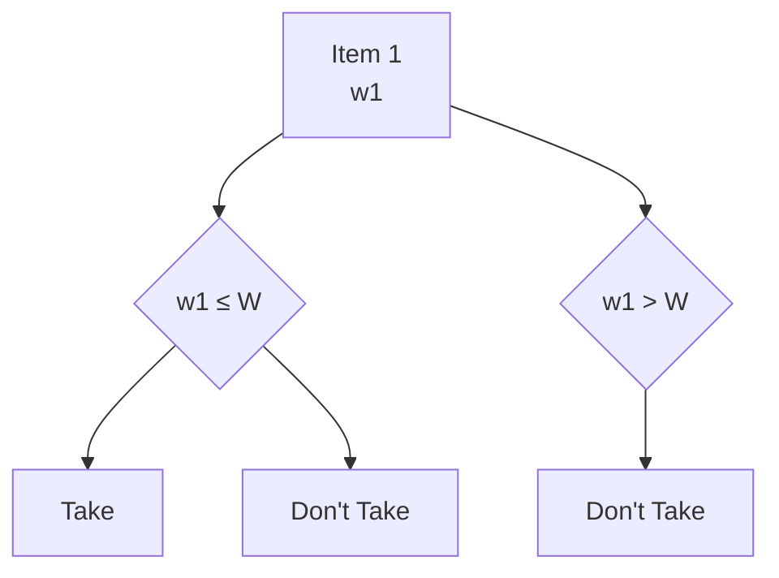
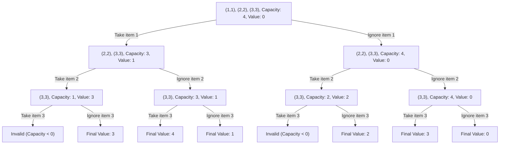
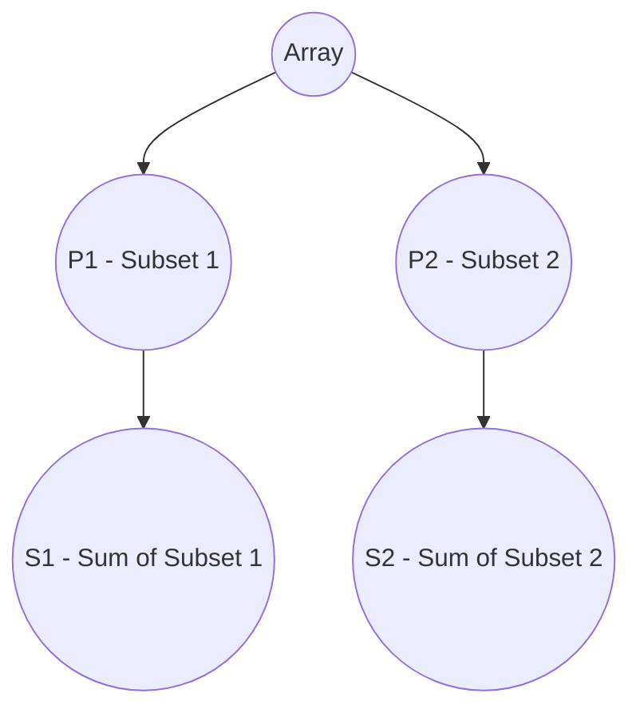
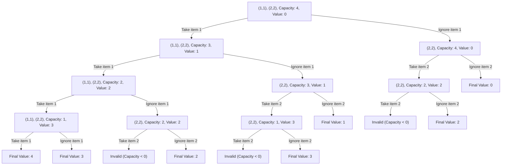
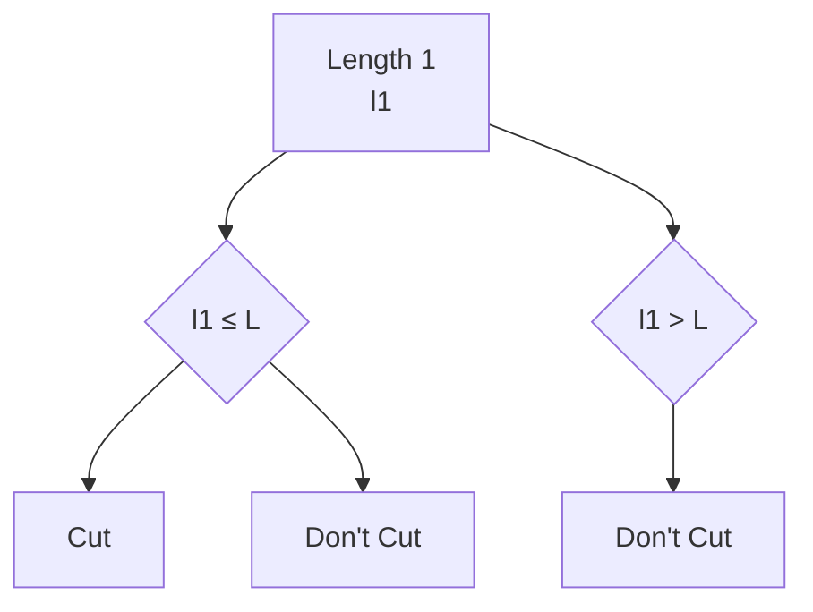
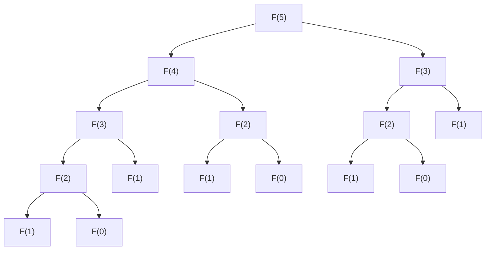
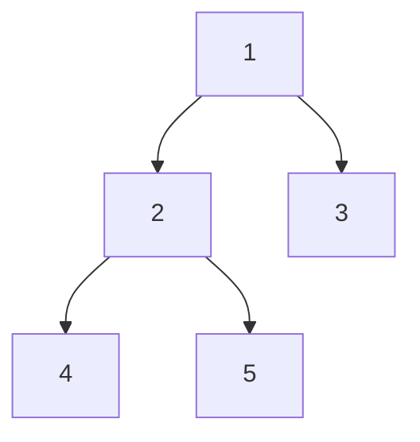

# Dynamic Programming

**Those who can't remember the past are condemned to repeat it.**

Dynamic Programming is actually **enhanced recursion**. There are some calls which are repetitive and thus can be memoized for future calls.

## Identification
- **Multiple choices in the problem** - leading to overlapping sub-problems. 
- **Optimal solution** - finding the correct choice that would lead to either maximum/minimum/optimum solution.

## Patterns
- 0-1 Knapsack
- Unbounded Knapsack
- Fibonacci
- Longest Common Subsequence
- Longest Increasing Subsequence
- Kadane's Algorithm
- Matrix Chain Multiplication
- DP on Trees
- DP on Grid

### 0-1 Knapsack
Knapsack is a bag to store items and you are given a list of items with `weight` and `value`. The bag would have a `capacity` and you would need to choose items to put in bag. No fractional items can be taken in the bag.

#### Recursive Solution:
- Choices: To take an item or ignore it. If the weight of the item is greater than the capacity then there is no choice but to ignore it.
- Base Condition: All the items are already considered.

#### Choice Diagram:

Example:


#### Recursive Code:
```python
def knapsack(weights, values, capacity):
    n = len(weights)
    def solve(index, capacity):
        if index == n or capacity == 0:
            return 0
        profit = solve(index+1, capacity)
        if weights[index] <= capacity:
            profit = max(profit, solve(index+1, capacity-weights[index]) + values[index])
        return profit
    return solve(0, capacity)
```

This solution has a time complexity of `O(2^n)` as we have 2 choices (to include the item or not) for each of the `n` items so (2 * 2 * ... n *).

So there would be overlapping sub-problems. By this we mean that while we are going through the recursive solution we would encounter the same problem for which we have solved before.
So we can memoize the answer and use it again to avoid any calculations again.

**For the memoization we can use the map or dictionary in python.**

#### Memoized solution
```python
def knapsack(weights, values, capacity):
    n = len(weights)
    mem = dict()
    def solve(index, capacity):
        if index == 0 or capacity == 0:
            return 0
        if (index, capacity) not in mem:
            profit = solve(index + 1, capacity)
            if weights[index] <= capacity:
                profit = max(profit, solve(index+1, capacity-wwights[index]) + values[index])
            mem[(index, capacity)] = profit
        return mem[(index, capacity)]
    return solve(0, capacity)
```

Time complexity now:
- In the memoized solution, we use a dictionary mem to store subproblem results, avoiding redundant calculations. 
- There are n possible indices and capacity + 1 capacity values, resulting in n * (capacity + 1) unique subproblems. Each subproblem involves constant work (comparisons and arithmetic). 
- Thus, the time complexity is O(n * capacity), a significant reduction from the exponential O(2^n) solution.

#### 6 Problems based on 0-1 Knapsack:
- Subset Sum
- Equal Sum Subset
- Count of Subset Sum
- Minimum Subset Sum Difference
- Target Sum
- Number of subset of given difference

#### Identification that these are a variation of knapsack problems
- In all of these problems there are elements to be chosen from in order to reach an optimal result complying to a certain condition.
- In case of 0-1 knapsack it items to be chosen to get the maximum value within the capacity of the bag. You will see that these 6 problems also match this pattern. 

##### Subset Sum
Given an array of numbers and a sum value. We need to find out whether a subset exists which add up to the sum value.

##### Identification as 0-1 Knapsack Pattern
- Here we are choosing elements from an array.
- We have a target sum that we want to reach, which is basically the capacity of the sack.

Code
```python
def subset_sum(nums, target):
    n = len(nums)

    def solve(index, curr):
        if curr == 0:
            return True
        if index == n:
            return False
        
        num =nums[index]
        if num <= curr:
            return solve(index+1, curr) or solve(index+1, curr - num)
        else:
            return solve(index+1, curr)
    return solve(0, target)
```
The above is the recursive solution, memoization one can be implemented easily by using a `mem` dictionary as shown earlier. 

##### Equal Sum Subset
Given an array of numbers and we need to find whether the array can be divided into equal subsets.



Here we have to divide our array into partitions of equal sum (`abs(S1 - S2) == 0`).

The solution to this would be 2-fold:
- The **sum must always be even**, otherwise it is impossible to divide into two equal sum subsets.
- The rest would be the same as the `Subset Sum` and the target would be `sum(nums) // 2`.

##### Count of Subsets Sum
Given an array of numbers and a sum value. We need to find out the number of subsets which add up to the sum value.

This problem as we can see is an extension of the `Subset Sum` problem, where now we need to maintain the count of the number of subsets that can add up to the target sum.
The solution too remains the same where instead of return boolean we would return the count value.

But the issue would be if the input array contains duplicate elements as this would result in duplicate subsets.
There are 2 possible solutions to it:
- Keep the visited subsets in memory and ensure that if the subset combination already exists - we won't consider the count. This would not be effective for time.
- We sort the given input and when we choose to ignore a particular value, we ignore all the next occurences of the same. **This is what we would go with**.

Code
```python
def count_subset_sum(nums, target):
    n = len(nums)
    nums.sort()

    def solve(index, curr):
        if curr == 0:
            return 1
        if index == n:
            return 0
        
        num = nums[index]
        result = 0

        # get all possible subsets considering the element
        if num <= curr: 
            result = result + solve(index+1, curr-num)

        # get all possible subsets ignoring the element
        while index+1 < n and nums[index] == nums[index+1]:
            index = index + 1
        result = result + solve(index+1, curr)
        return result
    
    return solve(0, target)
```

This is again the recursive code, ensure to implement memoization to improve the time-complexity.

### Minimum Subset Sum Difference
Given an array of numbers, we aim to find the minimum subset sum difference.


We need to identify the subsets such that `abs(S1 - S2)` is minimized.

#### Intuition:
- The range of possible differences is:
  - **Minimum**: `0` when subset contains no elements.
  - **Maximum**: `sum(arr)` when subset contains all the elements.
- We need to consider all possible subset sums to find the candidates that minimize the difference.
- In this range, we have both `S1` and `S2(sum(arr) - S1)`:
- We aim to minimize the difference:
  - `diff = S2 - S1`
  - `diff = sum(arr) - S1 - S1`
  - `diff = sum(arr) - 2*S1`
- In the best case, `diff` would be equal to `0`:
  - This occurs when `S1 = sum(arr) / 2`, which is the maximum value for `S1`.
- Therefore, we should find the value of `S1` that is closest to `sum(arr) / 2`. The difference then would be `sum(arr) - 2*S1`.

#### Optimized Approach:
- We can optimize the solution by considering the range of sums from `0` to `sum(arr) / 2`.
- We can check for each possible sum whether a subset exists that sums up to that particular value using the **Subset Sum** problem.

#### Example
Given an array `[1, 2, 3, 9]`:
- Total sum = `15`
- Possible subset sums are `{0, 1, 2, 3, 4, 5, 6, 9}`.
- The subset sums closest to `7.5` (which is `15 / 2`) are `6` and `9`.
- The minimum difference is `15 - 2 * 6 = 3`.

```python
def minimum_subset_sum_difference(arr):
    total = sum(arr)
    for s in range(total // 2, -1, -1):
        if subset_sum(arr, s): # already have this method defined earlier
            return total - 2*s
```
### Number of Subsets with Given Difference
Given an array and a difference as input, find out the number of subsets that have the specified difference.


We need to identify the subsets such that `abs(S1 - S2)` is always equal to a given value.
#### Intuition:
- We can use our existing knowledge from the previous problem:
  - In the subset sum range, we have both `S1` and `S2`(`sum(arr) - S1`):
  - `diff = S1 - S2`
  - `diff = S1 - (sum(arr) - S1)`
  - `diff = 2*S1 - sum(arr)`
  - `S1 = (sum(arr) + diff) / 2`

- According to this, we need to find out the number of subsets that sum up to value of `(sum(arr) + diff) / 2`.

#### Example
Given an array `[1, 1, 2, 3]` and a difference of `3`:
- Total sum = `7`
- We need to find subsets that sum up to `(7 + 3) / 2 = 5`
- Since subset sums must be integers, we are actually looking for subsets that sum up to `5`. The possible results of S1 are: `(2, 3)` and `(1, 1, 3)` - 2.
The solution involves finding the count of such subsets that satisfy this condition.

**Also there is an edge conditon where if the total of the (sum and difference) is not divisible by 2 - there are no possible solutions**

```python
def subsets_with_given_diff(arr, diff):
    total = sum(arr)
    if (total + diff) % 2:
        return 0
    target = (total + diff) / 2 # would always be divisible by 2
    return count_subset_sum(arr, target) # already solved earlier
```
##### Target Sum
Given an array and a target value. Count the number of ways to reach the target but modifying the sign of each of the array element.

This is modification of the `Subset Sum` problem, just that here we have 2 choices for selecting an element:
- Positive(+ve) value of the element
- Negative(-ve) value of the element

### Unbounded Knapsack
Knapsack is a bag to store items and you are given a list of items with `weight` and `value`. The bag would have a `capacity` and we can either select an item or ignore it. The only change from `0-1 Knapsack` would be that the items can taken any number of *.

The choice diagram remains the same:
#### Choice Diagram:


Example:


Here you can observe that if an item is taken, then also it is considered for the next choice, but if it is ignored once then is would no longer be a part of the choice space.

#### Recursive Solution:
- Choices: To take an item or ignore it. If the weight of the item is greater than the capacity then there is no choice but to ignore it.
- Base Condition: All the items are already considered.

#### Code:
```python
def knapsack(weights, values, capacity):
    n = len(weights)
    def solve(index, capacity):
        if index == n or capacity == 0:
            return 0
        if weights[index] <= capacity:
            # here would be the only change where the index is not updated if the item is considered
            return max(solve(index+1, capacity), solve(index, capacity-weights[index]) + values[index])
        return solve(index+1, capacity)
    return solve(0, capacity)
```

This is again the recursive code, ensure to implement memoization with dictionary to improve the time-complexity.

#### 3 Problems based on 0-1 Knapsack:
- Rod-Cutting Problem
- Coin Change Problem: Possible number of ways
- Coin Change Problem: Minimum number of coins

##### Rod-Cutting Problem
Given a rod of length n inches and an array of prices that includes prices of all pieces of size smaller than n. Determine the maximum value obtainable by cutting up the rod and selling the pieces.

This problem is similar to the unbounded knapsack problem where:
- length array: weights array
- prices array: values array
- length of the rod: capacity of the bag

Example:
Let's consider a rod of length (n = 4).
The prices array would be: [2, 5, 7, 8]
The corresponding lengths array would be: [1, 2, 3, 4]

Choice Diagram:
The choice diagram is similar to the Unbounded Knapsack problem:

The code too would remain the same. There can be modifications where the length array can be restricted and their prices would be provided.

##### Coin Change Problem: Possible number of ways
Given a value N, if we want to make change for N cents, and we have infinite supply of each of S = { S1, S2, .. , Sm} valued coins, how many ways can we make the change? The order of coins doesn’t matter.
Example:
for N = 4 and S = {1,2,3}, there are four solutions: {1,1,1,1},{1,1,2},{2,2},{1,3}. So output should be 4.

**This problem is another modification of the Subset Sum problem**. But till now we have performed subset sum where the same element cannot be used again. In this case we can use the same denomination multiple * so `(Unbounded + Subset Sum)`.

Similarity:
- denominations: arr
- amount: target sum 

###### Recursive Solution:
- Choices: To consider a domination or to ignore it. If the left amount is less than the current denomination, you have only one choice.
- Base Condition: The amount is already made or no more denominations are left.

Code
```python
def coin_ways(amount, denominations):
    n = len(denominations)
    def solve(index, amount):
        if amount == 0:
            return 1
        if index == n:
            return 0
        if denominations[index] <= amount:
            return solve(index+1, amount) + solve(index, amount - denominations[index])
        else:
            return solve(index+1, amount)
    return solve(0, amount)
```
This is again the recursive code, ensure to implement memoization with dictionary to improve the time-complexity.

##### Coin Change Problem: Minimum number of coins
Given a value V, if we want to make change for V cents, and we have infinite supply of each of C = { C1, C2, .. , Cm} valued coins, what is the minimum number of coins to make the change?

Example:
Input: coins[] = {25, 10, 5}, V = 30
Output: Minimum 2 coins required
We can use one coin of 25 cents and one of 5 cents.

This problem is similar to the previous problem where we have `Unbounded + Subset Sum`. The difference from the previous problem would be that we need to find out which combination of denominations awould require the minimum number.

```python
def min_coins(amount, denominations):
    n = len(denominations)
    def solve(index, coins, amount):
        if amount == 0:
            return coins
        if index == n:
            return float('inf')
        if denominations[index] <= amount:
            return min(solve(index+1, coins, amount), solve(index, coins+1, amount-denominations[index]))
        else:
            return solve(index+1, coins, amount)
    return solve(0, 0, amount)
```

This is again the recursive code, ensure to implement memoization with dictionary to improve the time-complexity.

### Fibonacci Numbers
In this pattern, you'll notice that the problem is being solved by repeatedly calculating the same sub-problems. This redundant computation can be avoided by using memoization.

#### Problems
#### Fibonacci Number
The Fibonacci sequence is a series of numbers where each number is the sum of the two preceding ones, usually starting with 0 and 1. The sequence goes: 0, 1, 1, 2, 3, 5, 8, 13, 21, and so forth. The problem is to find the `nth` Fibonacci number.

##### Naive Approach - Recursive Solution
The naive approach to solving the Fibonacci problem is to use a simple recursive function.

Code
```python
def fib(n):
    if n<=1:
        return n
    return fib(n-1) + fib(n-2)
```

However, this approach has an exponential time complexity of `O(2^n)` because it recalculates the same values multiple times.

##### Recrusion Call Graph

In the graph, you can see that F(3), F(2), F(1), and F(0) are computed multiple times. Using memoization, we store the results of these computations.

##### Intuition
- We can see that the same sub-problems are being solved multiple times, thus we calculate it once and store the results.
- Thus **Dynamic Programming**, although this is not related to choices but this is avoiding redundant calculations.

###### Memoization
Code 
```python
def fib(n):
    mem = dict()
    def solve(n):
        if n <= 1:
            return n
        if n not in mem:
            mem[n] = fib(n-1) + fib(n-2)
        return mem[n]     

    return solve(n)
```

Dynamic programming approach that stores intermediate results to avoid redundant calculations, reducing the time complexity to `O(n)`.

#### Climbing Stairs
You are climbing a staircase. It takes n steps to reach the top. Each time you can either climb 1 or 2 steps. In how many distinct ways can you climb to the top?

##### Intuition
- The total number of possible ways would be to sum the possible ways with both 1 step and 2 step.

##### Recursive Solution
Code
```python
def climbing_stairs(n):
    if n <= 1:
        return n
    return climbing_stairs(n-1) + climbing_stairs(n-2)
```
This is again the recursive code, ensure to implement memoization with dictionary to improve the time-complexity.

#### Minimum Cost Climbing Stairs
You are given an integer array `cost` where `cost[i]` is the cost of `ith` step on a staircase. Once you pay the cost, you can either climb one or two steps.
You can either start from the step with index `0`, or the step with index `1`.
Return the minimum cost to reach the top of the floor.

##### Intuition
- Almost similar as the previous problem, just that here we calculate the minimum cost to climb the stairs instead of the possible ways.

Code
```python
def min_cost_climbing_stairs(cost):
    n = len(cost)

    def solve(index):
        if index >= n:
            return 0
        return cost[index] + min(solve(index+1), solve(index+2))
    
    return min(solve(0), solve(1))
```
This is again the recursive code, ensure to implement memoization with dictionary to improve the time-complexity.

#### House Robber
You are a professional robber planning to rob houses along a street. Each house has a certain amount of money stashed. All houses at this place are arranged in a circle. That means the first house is the neighbor of the last one. Meanwhile, adjacent houses have a security system connected, and it will automatically contact the police if two adjacent houses were broken into on the same night. Given an integer array `nums` representing the amount of money of each house, return the maximum amount of money you can rob tonight without alerting the police.  

##### Parent problem
For the same house robber, let's first try to solve when the houses are not in a circle but in a straight line. The first and the last house are not adjacent, this makes it easier to calculate.

##### Intuition
- Choices: Find the maximum between either choosing the current house or the adjacent house.
- Base Condition: When we reach the end of the houses row.

##### Recursive Solution
Code
```python
def house_robber(houses):
    n = len(houses)
    def solve(index):
        if index >= n:
            return 0
        return max(houses[index] + solve(index+2), solve(index+1))
    return solve(0)
```

This is again the recursive code, ensure to implement memoization with dictionary to improve the time-complexity.

The circular houses robbery (**House Robber II**) would just be a modification where either the first house or the last house can be robbed. So we can extend the previous house robber problem into:
- Pass all the houses apart from the first one
- Pass all the houses apart form the last one
- The maximum between these 2 would be giving the optimal solution of the maximum amount that can be robbed.

#### Maximum Alternating Subsequence Sum
Given an array of numbers, find the maximum sum of an alternating subsequence, where the difference between consecutive elements in the subsequence is strictly positive or strictly negative.

##### Intuition
- Choices: Either choose the element or not choose it. Along with it we also have to consider the operation that we would be performing - (add/subtract).
- Base Condition: The end of the array.

##### Recursive Solution
Code
```python
def maximum_alternative_subsequence_sum(arr):
    n = len(arr)
    def solve(index, is_positive):
        if index == n:
            return 0
        val = arr[index]
        if not is_positive:
            val = -val
        return max(solve(index+1, is_positive), val + solve(index+1, not is_positive))
    return solve(0, True)
```

##### Memoized Solution
Now for the memoization, only the index as the key wouldn't suffice as you would also have the sign of the value as a part of the sub-problem.

Code
```python
def maximum_alternative_subsequence_sum(arr):
    n = len(arr)
    mem = dict()
    def solve(index, is_positive):
        if index == n:
            return 0
        if (index, is_positive) not in mem:
            val = arr[index]
            if not is_positive:
                val = -val
            mem[(index, is_positive)] max(solve(index+1, is_positive), val + solve(index+1, not is_positive))
        return mem[(index, is_positive)]
    return solve(0, True)
```

### Longest Common Subsequence
Given two sequences, find the length of longest subsequence present in both of them. 

**Subsequence**: A subsequence is a sequence that appears in the same relative order, but not necessarily contiguous. 
For example, “abc”,  “abg”, “bdf”, “aeg”,  ‘”acefg”, .. etc are subsequences of “abcdefg”.

#### Recursive Solution:
- **Choices**: To consider the two characters in both of the strings. Now the behavior would vary on the basis of their comparison result:
  - **Equal**: We proceed to the next characters in both
  - **Not equal**: We have two choices:
    - Consider the current character of the first string and go to the next character of the second string.
    - Consider the next character of the first string and go to the current character of the second string.
- **Base Condition**: Either of the string reaches its end.

Code
```python
def longest_common_subsequence(string1, string2):
    m, n = len(string1), len(string2)
    def solve(index1, index2):
        if index1 == m or index2 == n:
            return 0
        if string1[index1] == string2[index2]:
            return 1 + solve(index1 + 1, index2 + 1)
        else:
            return max(solve(index1 + 1, index2), solve(index1, index2+1))
    return solve(0, 0)
```

#### Memoized Solution:
We know that this can be memoized and the complexity can be imporoved as there are multiple choices possible - think of them as sub-problems. There is a possibility that the same sub-problem might have happened earlier and re-compute can be avoided by saving their result somewhere. This is where **memoization** comes into play.
In this case too, if the characters do not match - there are 2 possible choices and can be memoized to solve faster.

```python
def longest_common_subsequence(string1, string2):
    m, n = len(string1), len(string2):
    mem = dict()

    def solve(index1, index2):
        if index1 == m or index2 == n:
            return 0
        if (index1, index2) not in mem:
            if string1[index1] == string2[index2]:
                mem[(index1, index2)] = 1 + solve(index1+1, index2+1)
            else:
                mem[(index1, index2)] = max(solve(index, index2+1), solve(index+1, index2))
        return mem[(index1, index2)]
    
    return solve(0, 0)
```

#### Problems based on Longest Common Subsequence:
- Print Longest Common Subsequence
- Longest Common Substring
- Shortest Common Supersequence
- Minimum number of Insertion and Deletion to convert string a to string b
- Longest Palindromic Subsequence
- Print Shortest Common Supersequence
- Longest repeating subsequence
- Sequence Pattern Matching
- Minimum number of Insertion to make a string palindrome 


#### Print Longest Common Subsequence between 2 Strings
Given two sequences, find the length of longest subsequence present in both of them. 

We have already seen the problem to calculate the length of the longest common subsequence in 2 strings. This would be a modification on the same.

##### Intuition
- Add a character to the result if they are equal
- If not equal, update the grid position to whichever is the maximum.

Code
```python
def print_lcs(mem, string1, string2):
    result = []
    n1, n2 = len(string1), len(string2)

    index1, index2 = 0, 0

    while index1 < n1 and index2 < n2:
        if string1[index1] == string2[index2]:
            result.append(string1[index1])
            index1 = index1 + 1
            index2 = index2 + 1
        else:
            if mem(index1+1, index2) >= mem(index1, index2+1): # index lookup out-of-bound and key error can be resolved by using default dict
                index1= index1 + 1
            else:
                index2 = index2 + 1 

    return "".join(result) 
```

#### Longest Common Substring
In LCS(Longest Common Subsequence), it was possible to select non-contiguous sequence. But in this case we can only take in sub-strings so the intuition for the solution would be as follows:

##### Intuition
For LCS since we could take any part of the string for both of the strings we could traverse through both of the strings together. Here in addition to the logic of LCS we would have the explore for all possible index combinations as starting positions as:
- Contiguous Requirement: Because we are looking for contiguous matches, once a mismatch occurs, the current substring is invalidated, and we need to start a new search.
- Localized Nature: Since we are looking for the longest contiguous match, the problem is more localized, and we need to consider different starting points in both strings to ensure we find the longest contiguous match.
- By exploring all starting positions, we ensure that all possible contiguous substrings are considered.

##### Recursive Solution
- **Choices**: Now along with the indexes we also pass the result.
  - **Equal**: We add the character to the result and increase both the index
  - **Not Equal**: For strings starting at index `index1` and `index2` respectively, this would be the longest possible common substring.
- **Base Condition**: When we reach the end of the either of hte strings.

We can notice that this can just be a modification in the existing LCS solution.

```python
def longest_common_substring(string1, string2):
    m, n = len(string1), len(string2)
    result = 0

    for solve(index1, index2):
        if index1 == m or index2 == n:
            return 0
        if string1[index1] == string2[index2]:
            return 1 + solve(index1+1, solve(index2+1))
        else:
            return 0
    
    for index1 in range(m):
        for index2 in range(n):
            result = max(result, solve(index1, index2))

    return result
```

#### Shortest Common Supersequence
Given two strings str1 and str2, find the length of the shortest string that has both str1 and str2 as subsequences.
Examples:

Input:   str1 = "geek",  str2 = "eke"
Output: "geeke"

##### Intution
- In this we need both the strings in the resultant string, but we need to ensure that it is in the same order (although may not be contiguous).
- We already know how to calculate the LCS from both the strings, if you take the other characters count from both of them we would get the shortest super length as we have alreay considered the common ones (LCS).
- `SCS = len(string1) + len(string2) - LCS` - since LCS would occur twice.

#### Minimum number of Insertion and Deletion to convert string a to string b
Given two strings ‘str1’ and ‘str2’ of size m and n respectively. The task is to remove/delete and insert minimum number of characters from/in str1 so as to transform it into str2. It could be possible that the same character needs to be removed/deleted from one point of str1 and inserted to some another point.

Example:
Input: str1 = "geeksforgeeks", str2 = "geeks"
Output: Minimum Deletion = 8, Minimum Insertion = 0 

##### Intuition
From out knowledge we know how to use LCS - compare the characters of the 2 strings and take choices. Here too if you observe when we encounter characters from each string we have the following choices:
- **Equal** - no addition needed, we move forward for both the strings
- **Not Equal**
  - add the character to string a - add 1, increase the index in b
  - remove the character from string a - add 1, increase the index in a

From the choices when characters not equal, we have to minimise the operations.

#### Longest Palindromic Subsequence
Given a sequence, find the length of the longest palindromic subsequence in it.
Example :
Input:"bbbab"
Output:4

##### Intuition
Palindrome is a string which same from front as well as back.
In order to find the LPS, we can reverse the string and treat it as the second string. The LCS between both odf them would be the LPS.

#### Minimum number of Deletion to make a string palindrome
Given a string of size ‘n’. The task is to remove or delete minimum number of characters from the string so that the resultant string is palindrome.
Examples :

Input : aebcbda
Output : 2
Remove characters 'e' and 'd'. Resultant string will be 'abcba' which is a palindromic string

##### Intuition
- We already know `Longest Palindromic Subsequence`, and delete the rest of the characters.
- `len(string)- LPS` - would give us the minimum deletions.

#### Minimum number of Insertion to make a string palindrome
Given a string, find the minimum number of characters to be inserted to form Palindrome string out of given string.

Examples:
- ab: Number of insertions required is 1. bab
- aa: Number of insertions required is 0. aa

##### Intution
- With our knowledge of finding out `Longest Palindromic Subsequence`, the characters that we would need to add is the ones that are missing from it.
- `len(string)- LPS` - would give us the minimum insertions.
- Same as minimum number of deletions.

#### Print Shortest Common Supersequence
Given two strings str1 and str2, find the shortest string that has both str1 and str2 as subsequences.

##### Intuition
We are already solved the print LCS problem earlier and there is only a slight modification in it. In LCs we used to add to the result only if they were equal, here we would add in either case - for the option we are not going with.

Code
```python
def print_scs(mem, string1, string2):
    n1, n2 = len(string1), len(string2)
    index1, index2 = 0, 0
    result = []

    while index1 < n1 and index2 < n2:
        if string1[index1] == string2[index2]:
            result.append(string1[index1])
            index1 = index1 + 1
            index2 = index2 + 1
        else:
            if mem(index1+1, index2) >= mem(index1, index2+1):
                result.append(string1[index1])
                index1 = index1 + 1
            else:
                result.append(string2[index2])
                index2 = index2 + 1
        
    while index1 < n1:
        result.append(string1[index1])
        index1 = index1 + 1
    
    while index2 < n2:
        result.append(string2[index2])
        index2 = index2 + 1
    
    return "".join(result)
```

#### Longest repeating subsequence
Given a string, print the longest repeating subsequence such that the two subsequence don’t have same string character at same position, i.e., any i’th character in the two subsequences shouldn’t have the same index in the original string.

Example:
Input: str = "aab"
Output: "a"
The two subsequence are 'a'(first) and 'a' (second). Note that 'b' cannot be considered as part of subsequence as it would be at same index in both.

##### Intuition
This problem is basically LCS with the same string as the second string. The only catch is that we can't consider the same index for matching. If the different index matches as we traverse, we are sure that the sequence is maintained as well as the character is a different character.

Only the matching condition now changes to:
```python
if index1 != index2 and string1[index1] == string2[index2]:
    return 1 + solve(index1+1, index2+1)
```

#### Sequence Pattern Matching
Given two strings s and t, return true if s is a subsequence of t, or false otherwise.

A subsequence of a string is a new string that is formed from the original string by deleting some (can be none) of the characters without disturbing the relative positions of the remaining characters. (i.e., "ace" is a subsequence of "abcde" while "aec" is not).

Example 1:
Input: s = "abc", t = "ahbgdc"
Output: true

Example 2:
Input: s = "axc", t = "ahbgdc"
Output: false

##### Intuition
The LCS of both the strings should be equal to the `s`. Only the length calculation would be fine, need not find the exact LCS because it can never be equal to length of `s` without being equal to `s`.

What if it is not specified that `s` would be a subsequence and either can be a subsequence of each other. Then the return condtion would be:
```python
return lcs == min(len(s), len(t))
```

#### Interleaving String
Given strings `s1`, `s2`, and `s3`, find whether `s3` is formed by an interleaving of `s1` and `s2`.
An interleaving of two strings `s` and `t` is a configuration where `s` and `t` are divided into `n` and `m` substrings respectively, such that:
- `s = s1 + s2 + ... + sn`
- `t = t1 + t2 + ... + tm`
- `|n - m| <= 1`
- The **interleaving** is `s1 + t1 + s2 + t2 + s3 + t3 + ...` or `t1 + s1 + t2 + s2 + t3 + s3 + ...`
  
**Note**: a + b is the concatenation of strings a and b.

Example:
```
Input: s1 = "aabcc", s2 = "dbbca", s3 = "aadbbcbcac"
Output: true
Explanation: One way to obtain s3 is:
Split s1 into s1 = "aa" + "bc" + "c", and s2 into s2 = "dbbc" + "a".
Interleaving the two splits, we get "aa" + "dbbc" + "bc" + "a" + "c" = "aadbbcbcac".
Since s3 can be obtained by interleaving s1 and s2, we return true.
```

##### Intuition
For this problem, we need to determine if `s3` can be formed by interleaving `s1` and `s2`. The interleaving condition implies that characters from `s1` and `s2` appear in `s3` in the same order they appear in their respective strings. Here are the key points for the intuition:

- **Choices**: At each step, we have two choices. We can either take the current character from `s1` or from `s2` and check if it matches the current character in `s3`.
- **Recursive Exploration**: We recursively explore both choices:
  - If we take a character from `s1`, we move to the next character in `s1` and the next character in `s3`.
  - If we take a character from `s2`, we move to the next character in `s2` and the next character in `s3`.
- **Base Conditions**: The base conditions for our recursion are:
  - If we have exhausted all characters in `s3`, we return True if we have also exhausted both `s1` and `s2`.
  - If we have exhausted either `s1` or `s2` but not `s3`, we return False.

Code
```python
def is_interleave(s1, s2, s3):
    if len(s1) + len(s2) != len(s3):
        return False
    
    def solve(i, j, k):
        # Base condition: If we have processed all characters in s3  
        if k == len(s3):  
            return i == len(s1) and j == len(s2)
        
        # Check if we can take the next character from s1  
        if i < len(s1) and s1[i] == s3[k] and interleave(i+1, j, k+1):  
            return True  
          
        # Check if we can take the next character from s2  
        if j < len(s2) and s2[j] == s3[k] and interleave(i, j+1, k+1):   
            return True
        
        return False
    
    return solve(0, 0, 0)
```

#### Distinct Subsequences
Given two strings `s` and `t`, return the number of distinct subsequences of `s` which equals `t`.

##### Intuition
For the recursive solution:
- **Choices**: To consider the two characters in both of the strings. Now the behavior would vary on the basis of their comparison result:
  - **Equal**: We have two choices:
    - Move to the next character for for both `s` and `t`.
    - Move to the next character for for `s` in order to account for another possible subsequence.
  - **Not equal**: Move to the next character for `s`, to check if a subsequence is possible.
- **Base Condition**: The end of `t`.

Code
```python
def num_distinct(s, t):
    m, n = len(s), len(t)
    def solve(i, j):
        if j == n:
            return 1
        if i == m:
            return 0
        
        if s[i] == t[j]:
            return solve(i+1, j+1) + solve(i+1, j)
        else:
            return solve(i+1, j)
    
    return solve(0, 0)
```

#### Edit Distance
Given two strings word1 and word2, return the minimum number of operations required to convert word1 to word2.
You have the following three operations permitted on a word:
- Insert a character
- Delete a character
- Replace a character
```
Input: word1 = "horse", word2 = "ros"
Output: 3
Explanation: 
horse -> rorse (replace 'h' with 'r')
rorse -> rose (remove 'r')
rose -> ros (remove 'e')
```

##### Intuition
For the recursive solution:
- **Choices**: To consider the two characters in both of the words. Now the behavior would vary on the basis of their comparison result:
  - **Equal**: Move to the next character for for both `word1` and `word2`.
  - **Not equal**: We have 3 choices here but all would add an operation. The 3 choices are:
    - **Addition**: Move to the next character for `word2`, assuming that the character was added to `word1`.
    - **Deletion**: Move to the next character for `word1`, assuming that the character was deleted from `word1`.
    - **Replace**: Move to the next character for both `word1` and `word2`.
- **Base Condition**: The end of `word1` or `word2`, the number of operations would be the remaining characters of the other word (need to be deleted).

Code
```python
def min_distance(word1, word2):
    m, n = len(word1), len(word2)
    def solve(index1, index2):
        # base condition takes care of deletions
        if index1 == m:
            return n - index2
        if index2 == n:
            return m - index1
        if word1[index1] == word2[index2]:
            # No operation needed
            return solve(index1+1, index2+1)
        else:
            # Add one operation - insertion, deletion, replacement
            return 1 + min(solve(index1, index2+1), solve(index1+1, index2), solve(index1+1, index2+1))
    return solve(0, 0)
```

### Longest Increasing Subsequence
The Longest Increasing Subsequence problem is a classic dynamic programming problem that asks for the length of the longest subsequence in a given array such that all elements of the subsequence are sorted in increasing order.

#### Problem
Given an array of integers, find the length of the longest subsequence such that all elements of the subsequence are in increasing order.

##### Intuition
We would have to track the longest subsequence ending at each postion by comparing with the previous elements. By comparing with the previous element we can decide whether we want to extend the subsequence or not.

##### Recursive Solution
- **Choices**: For each element we have 2 choices:
  - **Include** the element in the subsequence if:
    - current subsequence is empty
    - value of the element is greater than the previous element and forms an increasing sequence.
  - **Exclude** and move to the next element
- **Base Condition** - End of the array.

Code
```python
def longest_increasing_subsequence(nums):
    n = len(nums)

    def solve(current, prev):
        if current == n:
            return 0
        
        # exclude
        exclude = solve(current+1, prev)

        # include
        include = 0
        if prev == -1 or nums[prev] < nums[current]:
            include = 1 + solve(current + 1, current)
        
        return max(include, exclude)
    
    return solve(0, -1)
```

##### Memoization
To optimize the recursive solution and avoid redundant calculations, we'll use memoization to store the results of subproblems with the key for the memoization would be the current index and the previous index combination.

Code
```python
def longest_increasing_subsequence(nums):
    n = len(nums)
    mem = dict()

    def solve(current, prev):
        if current == n:
            return 0
        
        if (current, prev) not in mem:
            # exclude
            exclude = solve(current+1, prev)

            # include
            include = 0
            if prev == -1 or nums[prev] < nums[current]:
                include = 1 + solve(current + 1, current)
            
            mem[(current, prev)] = max(exclude, include)
        return mem[(current, prev)]
    
    return solve(0, -1)
```

### Kadane's Algorithm
Kadane's algorithm is a famous algorithm used to solve the `Maximum Subarray Problem` in linear time.

#### Problem
The problem is to find the contiguous subarray within a one-dimensional array of numbers - **both positive and negative numbers** - that has the largest sum.

#### Intuition
Kadane's Algorithm makes a greedy choice at each step by selecting the option that maximizes the sum up to the current element. This choice ensures that the local maximum is always the best option for achieving the global maximum.

##### Working:
- The algorithm keeps track of two key pieces of information: the maximum sum of the subarray that ends at the current position and the maximum sum of any subarray encountered so far.
- As you iterate through the array, for each element, you decide whether to include it in the current subarray or to start a new subarray with this element. This decision is based on which option yields a higher sum.
  - If including the element in the current subarray results in a higher sum, you continue with the current subarray.
  - If starting a new subarray with the current element results in a higher sum, you start a new subarray.
- Compare this value with the global maximum and update if needed.

Code
```python
def maximum_subarray_problem(nums):
    max_ending_here = nums[0]
    max_subarray = nums[0]

    for num in nums[1:]:
        max_ending_here = max(num, max_ending_here + num)
        max_subarray = max(max_subarray, max_ending_here)
    
    return max_subarray
```

#### Problems based on Kadane's Algorithm
- Maximum Product Subarray

#### Maximum Product Subarray
Given an array of integers, find the contiguous subarray within the array that has the largest product.

##### Intuition
The intuition behind the Maximum Product Subarray is similar to Kadane's Algorithm, but with a twist as the product of two negative numbers is positive, you need to keep track of both the maximum and minimum products upto the current position.

##### Working
- The algorithm keeps track of three key pieces of information:
  - The maximum product of the subarray that ends in the current position
  - The minimum product of the subarray that ends in the current position
  - The maximum product subarray encountered so far.
- As you iterate through the array, for each element: 
  - Swap the current max and current min if the element is negative
  - Update them by considering the current element and their product with the current element.
  - Update the global maximum if needed.

Code
```python
def maximum_product_subarray(nums):
    max_product = min_product = result = nums[0]

    for num in nums[1:]:
        if num < 0:
            # TWIST: negative multiplied by negative is positive
            max_product, min_product = min_product, max_product
        
        # same old same old
        max_product = max(num, max_product * num)
        min_product = max(num, min_product * num)

        result = max(result, max_product)
```

### Matrix Chain Multiplication
Always solve using **recursion**.

#### Identification
- Input as a string or an array, and we would have an intuition that we would have to break the input into 2 problems.
- We would take in two pointers at both left and right ends: `start` and `end`.
- For `k` between `start` and `end` we would break the input array into sub-arrays of `[start... k]` and `[k... end ]`. Get answers for all of the possible sub-arrays with different values of `k`.
- Within these possible answers we would find out the optimal solution as per the question.

#### Format
##### Steps
- Find `start` and `end`
- Find Base Condition
- Find the `k` loop scheme
- Calculate answer for temporary answer and calulcate the optimised one and return

##### Code Format
```python
def solve(arr, start, end):
    # Base Condition
    if start > end:
        return
    
    # Intitialise result
    result = ""

    # Consider for all the possible choices for k
    for k in range(start, end+1):
        temp_result = solve(arr, start, start+k) + solve(arr, start+k+1, end)
        result = optimise(result, temp_result) # optimise can be min, max

    return result
```

#### 7 problems of MCM
- MCM
- Printing MCM
- Evaluate Expression to True/Boolean Parenthesis
- Min/max value of an Expression
- Palindrome Partitioning
- Scrambled String
- Egg Dropping Problem

#### Problems
#### Matrix Chain Mulitplication
Given a sequence of matrices, find the most efficient way to multiply these matrices together. The problem is not actually to  perform the multiplications, but merely to decide in which order to perform the multiplications.

##### Example: Matrix Chain Multiplication
You have 3 matrices:
- A: ( 5 * 10 )
- B: ( 10 * 3 )
- C: ( 3 * 12 )
The dimensions array is: ([5, 10, 3, 12])
Determine the order of matrix multiplications that minimizes the total number of scalar multiplications.

###### Possible Parenthesizations:
1. ((A * B) * C)
2. (A * (B * C))
We'll calculate the cost of scalar multiplications for each parenthesization.

###### 1. ((A * B) * C)

**First, compute ( A * B ):**
- Dimensions: ( 5 * 10 ) and ( 10 * 3 )
- Cost: ( 5 * 10 * 3 = 150 ) scalar multiplications
- Resulting matrix dimensions: ( 5 * 3 )

**Next, compute the result with ( C ):**
- Dimensions: ( 5 * 3 ) and ( 3 * 12 )
- Cost: ( 5 * 3 * 12 = 180 ) scalar multiplications

**Total cost for ((A * B) * C):**
- ( 150 + 180 = 330 ) scalar multiplications

###### 2. (A * (B * C))
**First, compute ( B * C ):**
- Dimensions: ( 10 * 3 ) and ( 3 * 12 )
- Cost: ( 10 * 3 * 12 = 360 ) scalar multiplications
- Resulting matrix dimensions: ( 10 * 12 )

**Next, compute the result with ( A ):**
- Dimensions: ( 5 * 10 ) and ( 10 * 12 )
- Cost: ( 5 * 10 * 12 = 600 ) scalar multiplications

**Total cost for (A * (B * C)):**
- ( 360 + 600 = 960 ) scalar multiplications

##### Summary of Costs:
- ((A * B) * C): 330 scalar multiplications
- (A * (B * C)): 960 scalar multiplications

The most efficient way to multiply these matrices is (((A * B) * C)) with a total cost of 330 scalar multiplications.

##### Identification
- If we take an array consisting of the dimensions of the matrices and `start` and `end` pointing to the two ends of the array.
- For different values of `k` ranging from `start+1` to `end-1`, we can calculate the cost of the multiplication. For each matrix at index `k` - (row: `k-1` and col: `k`). Thus the range values. 
- Then we can recursively call - multiply(arr, start, k) and multiply(arr, k + 1, end).

##### Format:
###### Recursive Solution
- Choices: k can have values from `start` to `end-1`. Perform Matrix Multiplication and divide into 2 groups and then break the array into - (start, k) and (k+1, end).
- Base Condition: `end` >= `start` as even if start == end - would be a single value -invalid for matrix dimensions - minimum 2 elements needed. 

```python
def matrix_chain_multiplication(arr):
    n = len(arr)
    # Matrix A[i] has dimension arr[i-1] * arr[i] - so 0 is invalid
    start, end = 1, n-1

    def solve(start, end):
        # minimum size 2
        if start >= end:
            return 0

        result = 0
        for k in range(start, end):
            temp = solve(start, k) + solve(k+1, end) + arr[start] * arr[k] * arr[end]
            result = max(result, temp)
        
        return result
    fr
    return solve(start, end)
```

###### With Memoization
We need to add a `mem` which is a dictionary storing already calculated results.
```python
def matrix_chain_multiplication(arr):
    n = len(arr)
    start, end = 1, n - 1

    mem = dict()
    def solve(start, end):
        if start >= end:
            return 0

        if (start, end) not in mem:
            result = 0
            for k in range(start, end):
                temp = solve(start, k) + solve(k+1, end) + arr[start-1] * arr[k] * arr[end]
                result = max(result, temp)

        mem[(start, end)] = result
        return mem[(start, end)]
    
    return solve(start, end)
```

For the for loop condition and the values for the further recursive calls, should be calculated. Don't memorize.

#### Palidrome Partitioning
Given a string, a partitioning of the string is a palindrome partitioning if every substring of the partition is a palindrome. 
Example: “aba|b|bbabb|a|b|aba” is a palindrome partitioning of “ababbbabbababa”.

##### Format
- `start` and `end` - 0 and n-1 where n is the length of the string
- Base Condition - start <= end: as single letter string valid.
- `k` loop scheme: k value can range from start to end. The partitions would be (start, k) and (k+1, end).
- Calculate the temporary answer - which is True if all the strings can be partitioned into a palindrome.

Code
```python
def palindrome_partition(string):
    n = len(string)
    start, end = 0, n-1

    result = []

    def solve(start, end, curr):
        if start > end:
            return result.append(curr[:])
        for k in range(start, end+1):
            if is_palindrome(start, k):
                curr.append(string[start: k+1])
                solve(k+1, end, curr)
                curr.pop()
    
    solve(start, end, [])
    return result
```
This is the recursive code, ensure to implement memoization with dictionary to improve the time-complexity.

#### Evaluate Expression To True

#### Scrambled String

#### Egg Dropping

#### Burst Balloons
You are given `n` balloons, indexed from `0` to `n - 1`. Each balloon is painted with a number on it represented by an array `nums`. You are asked to burst all the balloons.
If you burst the `ith` balloon, you will get `nums[i - 1] * nums[i] * nums[i + 1]` coins. If `i - 1` or `i + 1` goes out of bounds of the array, then treat it as if there is a balloon with a `1` painted on it.
Return the **maximum coins you can collect by bursting the balloons** wisely.

Example:
```
Input: nums = [3,1,5,8]
Output: 167
Explanation:
nums = [3,1,5,8] --> [3,5,8] --> [3,8] --> [8] --> []
coins =  3*1*5    +   3*5*8   +  1*3*8  +  1*8*1 = 167
```

##### Intuition
###### Recursive Solution
- **Add Boundary Balloons**: Add 1 at both ends of the nums array to handle edge cases.
- **Choices**: k can have values from start+1 to end-1. Burst balloon k last, then divide into two groups and break the array into (start, k) and (k, end).
- **Base Condition**: end - start <= 1 because if start == end - 1, it means no balloons are left to burst between them.

Code
```python
def maxCoins(nums):
    # Add 1 at the beginning and end of the nums array  
    nums = [1] + nums + [1]
    n = len(nums)

    def solve(left, right):
        if left + 1 == right:
            return 0
        max_coins = 0

        # Try bursting each balloon in the current subarray last
        for k in range(left+1, right):
            # coins by bursting the kth balloon last  
            coins = nums[left] * nums[k] * nums[right]

            # add coins from subproblems
            coins = coins + solve(left, k) + solve(k, right)
            
            # update max coins
            max_coins = max(max_coins, coins)
        return max_coins
    
    return solve(0, n-1)
```

### DP on Trees
DP can also be applied on trees to solve some specific problems.

We define functions for nodes of the trees, which we calculate recursively based on children of a nodes. One of the states in our DP usually is a node i, denoting that we are solving for the subtree of node i.

Let's solve for the problem for **Diameter of a Binary Tree**.
Given a binary tree, you need to compute the length of the diameter of the tree. The diameter of a binary tree is the length of the longest path between any two nodes in a tree. This path may or may not pass through the root.

Example:
Given a binary tree

Return 3, which is the length of the path [4,2,1,3] or [5,2,1,3].

For calculating the diameter at each node, there can be 2 choices:
- Path considering the node: 1 + height(left sub-tree) + height(right sub-tree)
- Path not considering the node: We pass the current max_height possible from this node to its callers - 1 + max(height(left sub-tree), height(right sub-tree))

Whichever is maximum amongst these would be the diameter of the tree.

We can use Dynamic Programming here to save the previous computed answers and return whenever needed.

#### General Syntax
Any recursive solution for tree follows the Base Condition-Induction-Hypothesis approach and the syntax looks like:

```python
def func(input):
    # Base Condition - exit condition
    # Hypotheisis - don't question how this works - for the left and the right subtrees
    # Induction - take the result from the hypothesis step and calculate for the current node
```

For example for finding the diameter of a binary tree:
```python
def diameter(root):
    res = 0
    def solve(root):
        # Base Condition
        if root is None:
            return 0
        # Hypothesis
        left_height = height(root.left)
        right_height = height(root.right)
        # Induction
        # considering the current node and set if maximum
        res = max(res, 1 + left_height + right_height)
        # pass to the parent as the max height, this helps in using the results for further calculations in the parent
        # this prevents duplicate calculations
        return 1 + max(left_height, right_height) 

    solve(root)
    return result
```

#### Problems
#### Diameter of a Binary Tree
Already solved above.

#### Maximum Path Sum from two leaf nodes
The implementation logic will remain the same and at each node there would be 2 choices:
- Considering the current node as root: val + path_sum(left) + path_sum(right)
- Considering the current node as another node: val + max(path_sum(left), path_sum(right))

Code
```python
def maximum_path_sum(root):
    result = float('-inf')
    def solve(root):
        if root is None:
            return 0
        left_path_sum = solve(root.left)
        right_path_sum = solve(root.right)

        result = max(result, root.val + left_path_sum + right_path_sum)
        return root.val + max(left_path_sum, right_path_sum)
    solve(root)
    return result
```

#### Maximum Path Sum from any node to any
Here, since we consider from any node to any node. The conditions here would change a bit as there can be negative nodes in the path to the leaf, then either you consider the entire path or just the current node.

The choices now become:
- Considering the current node as root: max(val, val + path_sum(left) + path_sum(right))
- Considering the current node as another node: max(val, val + max(path_sum(left), path_sum(right)))

Code:
```python
def maximum_path_sum(root):
    result = float('inf')
    def solve(root):
        if root is None:
            return 0
        left_path_sum = solve(root.left)
        right_path_sum = solve(root.right)

        result = max(result, max(root.val, root.val + left_path_sum + right_path_sum))
        return max(root.val, root.val + max(left_path_sum, right_path_sum))
```

### DP on Grid
Dynamic Programming (DP) on grids is a common topic in algorithmic problem-solving. These problems typically involve finding paths, sums, or counts on a 2D grid (matrix) while adhering to certain constraints.

#### Problems on DP on Grid
- Unique Paths
- Unique Paths (with Obstacles)
- Minimum Path Sum
- Longest Increasing Path in a Matrix

#### Unique Paths
Given an m x n grid, find the number of possible unique paths from the top-left corner to the bottom-right corner. You can only move either down or right at any point in time.

##### Recursive Solution
- **Choices**- At each index in the matrix you have 2 choices: right or bottom (if valid index). sum all possible ways you can reach the end of the matix from that index would give you answer.
- **Base Condition**- At the bottom right corner - satisfied the condition  return 1. We wont reach any invalid index in the base condition as they are not treated as valid inputs.

Code
```python
def unique_paths(grid):
    m, n = len(grid), len(grid[0])
    directions = [(1, 0), (0, 1)]

    def is_valid(row, col):
        if 0<=row<m and 0<=col<m
    
    def solve(row, col):
        if row == m-1 and col == n-1:
            return 1
        result = 0
        for direction in directions:
            n_row, n_col = n_row + direction[0], n_col + direction[1]
            if is_valid(n_row, n_col):
                result = result + solve(n_row, n_col)
        return result
    
    return solve(0, 0)
```

#### Unique Paths(With Obstacles)
Given an m x n grid with obstacles (represented by 1s), find the number of unique paths from the top-left corner to the bottom-right corner.

##### Hint:
The only change from the previous problem would be the condition for traversion to the next index:

```python
for direction in directions:
    n_row, n_col = n_row + direction[0], n_col + direction[1]
    if is_valid(n_row, n_col) and grid[n_row][n_col] != 1:
        # if valid and not an obstacle
        result = result + solve(n_row, n_col)
```

#### Minimum Path Sum
Given an m x n grid filled with non-negative numbers, find a path from the top-left corner to the bottom-right corner which minimizes the sum of all numbers along its path.

##### Hint
The only change again from `Unique Paths` would be just the way the result is being calculated, here we would consider both the paths and take the minimum and return the same.

```python
result = float('inf') # maximum possible value
for direction in directions:
    n_row, n_col = n_row + direction[0], n_col + direction[1]
    if is_valid(n_row, n_col):
        result = min(result, grid[row][col] + solve(n_row, n_col))
return result
```

#### Longest Increasing Path in a Matrix
Given an m x n matrix of integers, find the length of the longest increasing path in the matrix. You can move in four directions: up, down, left, and right.
