# Dynamic Programming

**Those who can't remember the past are condemned to repeat it.**

Dynamic Programming is actually **enhanced recursion**. There are some calls which are repetitive and thus can be memoized for future calls.

## Identification
- **Multiple choices in the problem** - leading to overlapping sub-problems. 
- **Optimal solution** - finding the correct choice that would lead to either maximum/minimum/optimum solution.

## Patterns
- 0-1 Knapsack
- Unbounded Knapsack
- Fibonacci
- Longest Common Subsequence
- Longest Increasing Subsequence
- Kadane's Algorithm
- Matrix Chain Multiplication
- DP on Trees
- DP on Grid

### 0-1 Knapsack
Knapsack is a bag to store items and you are given a list of items with `weight` and `value`. The bag would have a `capacity` and you would need to choose items to put in bag. No fractional items can be taken in the bag.

#### Recursive Solution:
- Choices: To take an item or ignore it. If the weight of the item is greater than the capacity then there is no choice but to ignore it.
- Base Condition: All the items are already considered.

#### Choice Diagram:

```mermaid
graph TD  
    A[Item 1<br/>w1] --> B{w1 ≤ W}  
    A --> C{w1 > W}  
    B --> D[Take]  
    B --> E[Don't Take]  
    C --> F[Don't Take]  
```

Example:


#### Recursive Code:
```python
def knapsack(weights, values, capacity):
    n = len(weights)
    def solve(index, capacity):
        if index == n or capacity == 0:
            return 0
        profit = solve(index+1, capacity)
        if weights[index] <= capacity:
            profit = max(profit, solve(index+1, capacity-weights[index]) + values[index])
        return profit
    return solve(0, capacity)
```

This solution has a time complexity of `O(2^n)` as we have 2 choices (to include the item or not) for each of the `n` items so (2 * 2 * ... n times).

So there would be overlapping sub-problems. By this we mean that while we are going through the recursive solution we would encounter the same problem for which we have solved before.
So we can memoize the answer and use it again to avoid any calculations again.

**For the memoization we can use the map or dictionary in python.**

#### Memoized solution
```python
def knapsack(weights, values, capacity):
    n = len(weights)
    mem = dict()
    def solve(index, capacity):
        if index == 0 or capacity == 0:
            return 0
        if (index, capacity) not in mem:
            profit = solve(index + 1, capacity)
            if weights[index] <= capacity:
                profit = max(profit, solve(index+1, capacity-wwights[index]) + values[index])
            mem[(index, capacity)] = profit
        return mem[(index, capacity)]
    return solve(0, capacity)
```

Time complexity now:
- In the memoized solution, we use a dictionary mem to store subproblem results, avoiding redundant calculations. 
- There are n possible indices and capacity + 1 capacity values, resulting in n * (capacity + 1) unique subproblems. Each subproblem involves constant work (comparisons and arithmetic). 
- Thus, the time complexity is O(n * capacity), a significant reduction from the exponential O(2^n) solution.

#### 6 Problems based on 0-1 Knapsack:
- Subset Sum
- Equal Sum Subset
- Count of Subset Sum
- Minimum Subset Sum Difference
- Target Sum
- Number of subset of given difference

#### Identification that these are a variation of knapsack problems
- In all of these problems there are elements to be chosen from in order to reach an optimal result complying to a certain condition.
- In case of 0-1 knapsack it items to be chosen to get the maximum value within the capacity of the bag. You will see that these 6 problems also match this pattern. 

##### Subset Sum
Given an array of numbers and a sum value. We need to find out whether a subset exists which add up to the sum value.

##### Identification as 0-1 Knapsack Pattern
- Here we are choosing elements from an array.
- We have a target sum that we want to reach, which is basically the capacity of the sack.

Code
```python
def subset_sum(nums, target):
    n = len(nums)

    def solve(index, curr):
        if curr == 0:
            return True
        if index == n:
            return False
        
        num =nums[index]
        if num <= curr:
            return solve(index+1, curr) or solve(index+1, curr - num)
        else:
            return solve(index+1, curr)
    return solve(0, target)
```
The above is the recursive solution, memoization one can be implemented easily by using a `mem` dictionary as shown earlier. 

##### Equal Sum Subset
Given an array of numbers and we need to find whether the array can be divided into equal subsets.


Here we have to divide our array into partitions of equal sum (`abs(S1 - S2) == 0`).

The solution to this would be 2-fold:
- The **sum must always be even**, otherwise it is impossible to divide into two equal sum subsets.
- The rest would be the same as the `Subset Sum` and the target would be `sum(nums) // 2`.

##### Count of Subsets Sum
Given an array of numbers and a sum value. We need to find out the number of subsets which add up to the sum value.

This problem as we can see is an extension of the `Subset Sum` problem, where now we need to maintain the count of the number of subsets that can add up to the target sum.
The solution too remains the same where instead of return boolean we would return the count value.

But the issue would be if the input array contains duplicate elements as this would result in duplicate subsets.
There are 2 possible solutions to it:
- Keep the visited subsets in memory and ensure that if the subset combination already exists - we won't consider the count. This would not be effective for time.
- We sort the given input and when we choose to ignore a particular value, we ignore all the next occurences of the same. **This is what we would go with**.

Code
```python
def count_subset_sum(nums, target):
    n = len(nums)
    nums.sort()

    def solve(index, curr):
        if curr == 0:
            return 1
        if index == n:
            return 0
        
        num = nums[index]
        result = 0

        # get all possible subsets considering the element
        if num <= curr: 
            result = result + solve(index+1, curr-num)

        # get all possible subsets ignoring the element
        while index+1 < n and nums[index] == nums[index+1]:
            index = index + 1
        result = result + solve(index+1, curr)
        return result
    
    return solve(0, target)
```

This is again the recursive code, ensure to implement memoization to improve the time-complexity.

### Minimum Subset Sum Difference
Given an array of numbers, we aim to find the minimum subset sum difference.


We need to identify the subsets such that `abs(S1 - S2)` is minimized.

#### Intuition:
- The range of possible differences is:
  - **Minimum**: `0` when subset contains no elements.
  - **Maximum**: `sum(arr)` when subset contains all the elements.
- We need to consider all possible subset sums to find the candidates that minimize the difference.
- In this range, we have both `S1` and `S2(sum(arr) - S1)`:
- We aim to minimize the difference:
  - `diff = S2 - S1`
  - `diff = sum(arr) - S1 - S1`
  - `diff = sum(arr) - 2*S1`
- In the best case, `diff` would be equal to `0`:
  - This occurs when `S1 = sum(arr) / 2`, which is the maximum value for `S1`.
- Therefore, we should find the value of `S1` that is closest to `sum(arr) / 2`. The difference then would be `sum(arr) - 2*S1`.

#### Optimized Approach:
- We can optimize the solution by considering the range of sums from `0` to `sum(arr) / 2`.
- We can check for each possible sum whether a subset exists that sums up to that particular value using the **Subset Sum** problem.

#### Example
Given an array `[1, 2, 3, 9]`:
- Total sum = `15`
- Possible subset sums are `{0, 1, 2, 3, 4, 5, 6, 9}`.
- The subset sums closest to `7.5` (which is `15 / 2`) are `6` and `9`.
- The minimum difference is `15 - 2 * 6 = 3`.

```python
def minimum_subset_sum_difference(arr):
    total = sum(arr)
    for s in range(total // 2, -1, -1):
        if subset_sum(arr, s): # already have this method defined earlier
            return total - 2*s
```
### Number of Subsets with Given Difference
Given an array and a difference as input, find out the number of subsets that have the specified difference.


We need to identify the subsets such that `abs(S1 - S2)` is always equal to a given value.
#### Intuition:
- We can use our existing knowledge from the previous problem:
  - In the subset sum range, we have both `S1` and `S2`(`sum(arr) - S1`):
  - `diff = S1 - S2`
  - `diff = S1 - (sum(arr) - S1)`
  - `diff = 2*S1 - sum(arr)`
  - `S1 = (sum(arr) + diff) / 2`

- According to this, we need to find out the number of subsets that sum up to value of `(sum(arr) + diff) / 2`.

#### Example
Given an array `[1, 1, 2, 3]` and a difference of `3`:
- Total sum = `7`
- We need to find subsets that sum up to `(7 + 3) / 2 = 5`
- Since subset sums must be integers, we are actually looking for subsets that sum up to `5`. The possible results of S1 are: `(2, 3)` and `(1, 1, 3)` - 2.
The solution involves finding the count of such subsets that satisfy this condition.

**Also there is an edge conditon where if the total of the (sum and difference) is not divisible by 2 - there are no possible solutions**

```python
def subsets_with_given_diff(arr, diff):
    total = sum(arr)
    if (total + diff) % 2:
        return 0
    target = (total + diff) / 2 # would always be divisible by 2
    return count_subset_sum(arr, target) # already solved earlier
```
##### Target Sum
Given an array and a target value. Count the number of ways to reach the target but modifying the sign of each of the array element.

### Unbounded Knapsack
