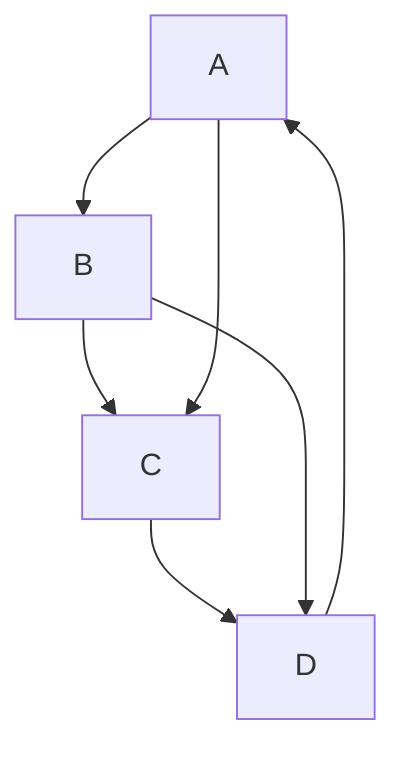
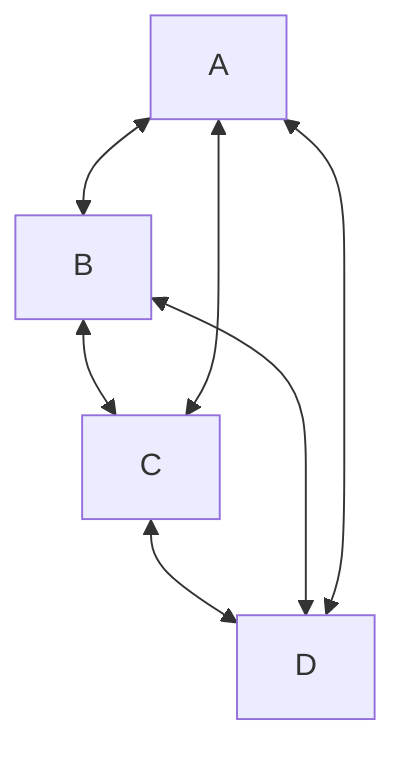
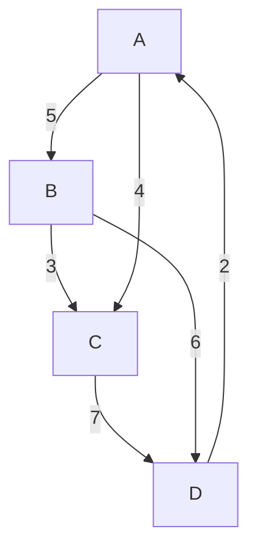
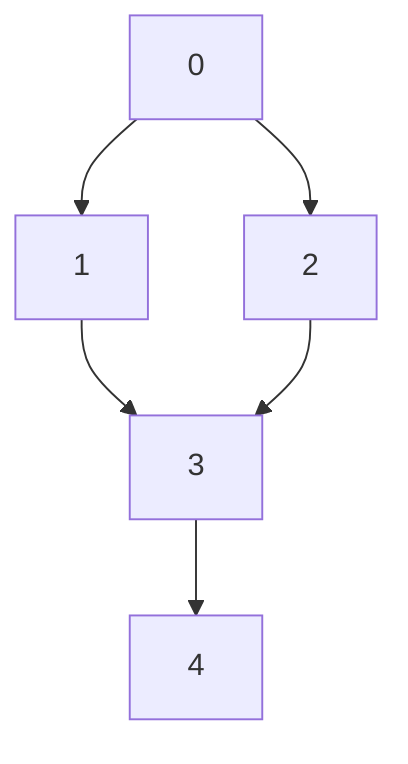
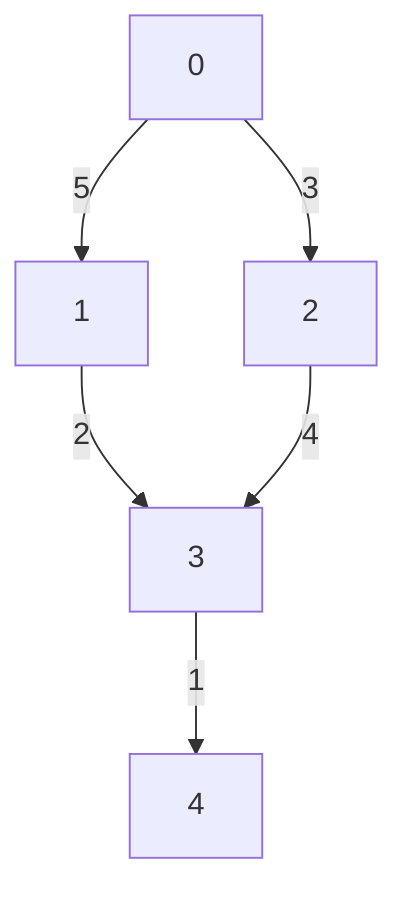
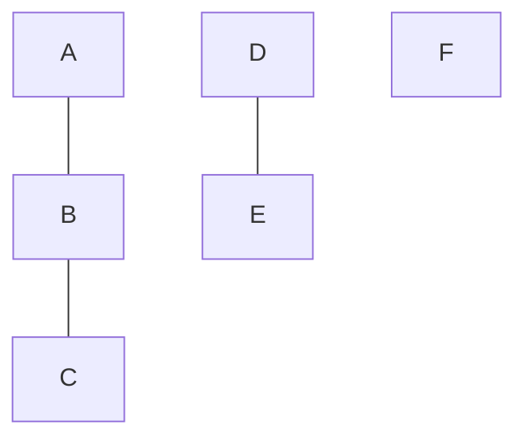
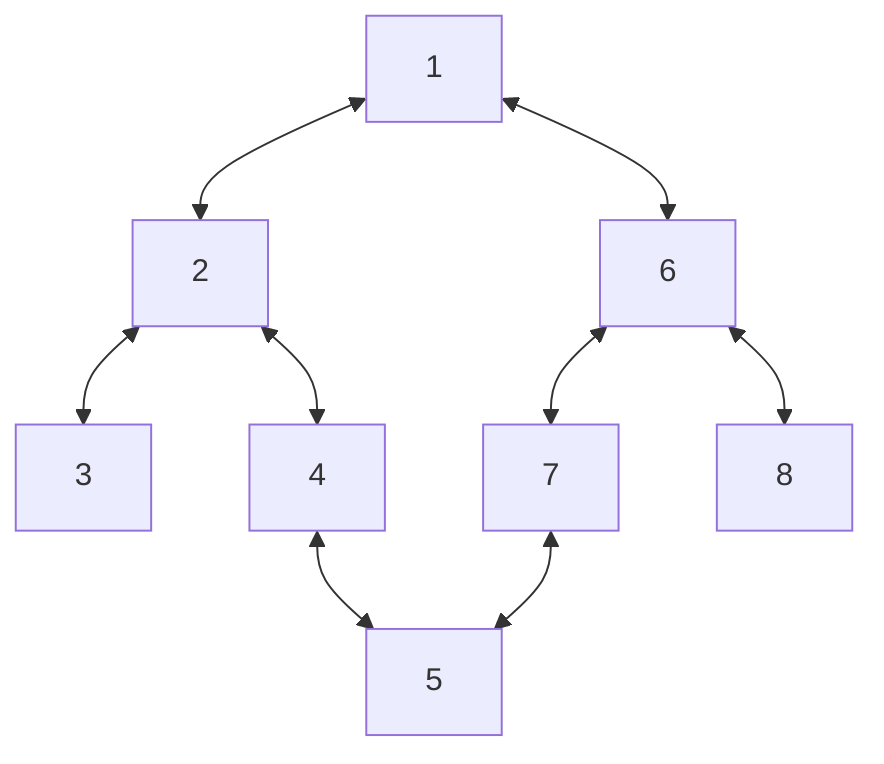
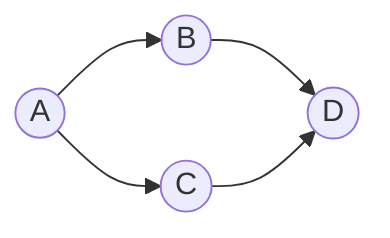
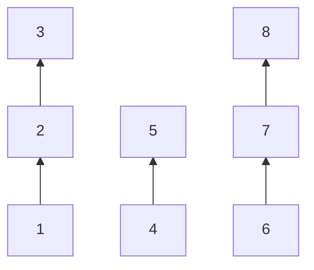

# Graph
A graph is a collection of nodes, also called vertices, and the connections between them, called edges.

## Important Terminologies
- **Vertex**: A vertex (or node) is a fundamental part of a graph. It can represent any entity, such as a location, a person, or an object. In diagrams, vertices are often represented as circles or dots.
- **Edge**: An edge (or arc) is a connection between two vertices in a graph. It can represent a relationship or a path between the entities represented by the vertices.
- **Directed Graph**: A directed graph is a type of graph where the edges have a direction. Each edge points from one vertex to another.

- **Undirected Graph**: An undirected graph is a type of graph where the edges have no direction. The connection between two vertices is bidirectional.


**As mermaid doesn't support undirected graphs it would be represented as bidirectional edges.**

- **Weighted Graph**: A weighted graph is a graph in which each edge has an associated numerical value, called weight. This can represent cost, distance, or any other metric.


## Graph Representation

### Non-Weighted Graph
Let the graph be this:

#### 1. Adjacency List
The adjacency list is a dictionary where each key represents a node, and the value is a list of nodes to which the key node has directed edges.

```python
adj_list = {  
    0: [1, 2],  
    1: [3],  
    2: [3],  
    3: [4],  
    4: []  
}
```

#### 2. Adjacency Matrix
The adjacency matrix is a 2D list (list of lists) where the element at row i and column j is 1 if there is a directed edge from node i to node j, and 0 otherwise.

```python
adj_matrix = [  
    [0, 1, 1, 0, 0],  # 0  
    [0, 0, 0, 1, 0],  # 1  
    [0, 0, 0, 1, 0],  # 2  
    [0, 0, 0, 0, 1],  # 3  
    [0, 0, 0, 0, 0]   # 4  
]
```

If the graph is weighted, the adjacency list and adjacency matrix representations will include the weights of the edges. Here is how you can represent the given graph with weights.

### Weighted Graph


#### 1. Adjacency List
The adjacency list is a dictionary where each key represents a node, and the value is a list of tuples. Each tuple contains a node to which the key node has a directed edge and the weight of that edge.

```python
adj_list = {  
    0: [(1, 5), (2, 3)],  
    1: [(3, 2)],  
    2: [(3, 4)],  
    3: [(4, 1)],  
    4: []  
}
```

#### 2. Adjacency Matrix
The adjacency matrix is a 2D list (list of lists) where the element at row i and column j is the weight of the edge from node i to node j, and 0 if there is no edge.
```python
adj_matrix = [  
    [0, 5, 3, 0, 0],  # 0  
    [0, 0, 0, 2, 0],  # 1  
    [0, 0, 0, 4, 0],  # 2  
    [0, 0, 0, 0, 1],  # 3  
    [0, 0, 0, 0, 0]   # 4  
]
```

## Connected Components
A connected component in an undirected graph is a group of nodes such that:
- Every node in the group is connected to every other node in the group by some path.
- There are no connections between nodes in this group and any nodes outside of this group.




**From now on we would be only using the adjacency list mechanism for representation**.

## Traversal Techniques
### Breadth First Search
The BFS traversal explores all nodes at the present depth before moving on to nodes at the next depth level.

Possible BFS with starting node as `1`: [1], [2, 6], [3, 4, 7, 8], [5] - the sub-divisions are for the different levels.
Now if we change the starting node to `6`: [6], [1, 7, 8], [2, 5], [3, 4].

#### Implementation
- For the implementation of BFS we use a queue and a visited set.
- For each level we empty the queue and traverse the nodes not traversed already and add them to the result.
- The visited set is important as it helps us from revisiting the same node again and again. As soon as a node is added to the queue, it is marked as visited.

Code
```python
def bfs(n, edges):
    graph = {i: [] for i in range(n)}
    for edge in edges:
        src, dest = edge
        graph[src].append(dest)
        graph[dest].append(src)
    
    # initialize queue and visited set
    visited = set()
    queue = deque()

    # add the starting node
    queue.append(0)
    visited.add(0)

    result = []
    while queue:
        temp = deque()
        # get the nodes for the current level
        while queue:
            # follow FIFO
            node = queue.popleft()
            # add to result as they are being traversed
            result.append(node)
            for adj_node in graph[node]:
                if adj_node not in visited:
                    # visit adjacent nodes for the next level traversal
                    temp.add(adj_node)
                    # add the adjacent node to the visited set
                    visited.add(adj_node)
        queue = temp
    
    return result
```

### Depth First Search
The DFS traversal visits nodes by exploring as far as possible along each branch before backtracking.

Possible DFS with starting node as `1`: [1, 2, 3, 4, 5, 7, 6, 8].

#### Implementation
- We would be using recursion to implement DFS.
- Like in BFS we would also have a `visited` set to mark the nodes that are already visited.

Code:
```python
def traverse(n, edges):
    graph = {i: [] for i in range(n)}
    for edge in edges:
        src, dest = edge
        graph[src].append(dest)
        graph[dest].append(src)
    
    # initialize visited set
    visited = set()
    
    result = []

    def dfs(node):
        visited.add(node)
        result.add(node)
        for adj_node in graph[node]:
            if adj_node not in visited:
                solve(node)
    
    solve(0)
    return result
```

#### Extension of DFS - Connected Components
For connected components, this is how the dfs logic would change.
Since we know that in one traversal all the nodes wouldn't be traversed, we would perform dfs for all the nodes if they are not visited yet.

```python
def traverse(graph)
    # initialize visited set
    visited = set()
    result = []

    def dfs(node):
        visited.add(node)
        result.append(node)

        # this ensures that all the nodes in this group are traversed
        for adj_node in graph[node]:
            if adj_node not in visited:
                dfs(adj_node)

    for node in graph:
        # check if the node exists
        if node not in visited:
            dfs(node)
```

Related problems:
- Number of Provinces
- Number of Islands

Now coming to the various algorithms of graph:

### Cycle Detection
Given a directed graph, check whether the graph contains a cycle or not.
This can be done using the DFS method.
We need to modify the existing DFS implementation to check for a backedge - that can cause cycles. For this we maintain a separate `rec_stack` set along with the existing `visited` set.

#### Why do we need a separate `rec_stack` set, wouldn't `visited` set be enough?
No, it would be enough for an undirected graph, but for a directed graph it can give false-positives for cycles.

When visiting `C` and goind to it's adjacent nodes `D` already exists in the `visited` set. If we had only it, we would have wrongly judged the graph that it has a cycle.

```python
def cycle_detection(graph):
    # to check for cycles
    rec_stack = set()
    # to check if already visited
    visited = set()

    def dfs(node):        
        rec_stack.add(node)
        visited.add(node)

        for adj_node in graph[node]:
            # additonal check if node in recursion stack
            if adj_node in rec_stack:
                return True
            
            if adj_node not in visited:
                dfs(adj_node)
        
        # no longer, a part of the recursion stack
        rec_stack.remove(node)
        return False
    
    # Check all nodes in the graph to handle disconnected components  
    for node in graph:  
        if node not in visited:  
            if dfs(node):  
                return True 
    return False
```


### Topological Sort
Topological sort is a way of arranging the nodes in a directed acyclic graph (DAG) in a linear order such that for every directed edge from node `u` to node `v`:
- Node `u` appears before node `v` in the ordering.

Think of it like scheduling tasks where some tasks must be completed before others. Topological sort gives you an order in which to complete the tasks so that all the dependencies are respected.
Example:
Consider a graph representing tasks with dependencies:

- Task A must be completed before tasks B and C.
- Tasks B and C must both be completed before task D.

A possible topological order for these tasks could be: A, B, C, D or A, C, B, D. Both orders respect the dependencies.

#### 1. Kahn's Algorithm
#### 2. DFS based
We add a node to the result only when all the adjacent nodes are already traversed.
This would be an extesnion of the existing `DFS` where along with the traversal we also empty the outgoing edges adjacency list.

Code
```python
def topological_sort(graph):
    visited = set()
    # for detecting cycles
    rec_stack = set()
    result = []

    def dfs(node):
        visited.add(node)
        rec_stack.add(node)

        for adj_node in graph[node]:
            if adj_node in rec_stack:
                return False
            if adj_node not in visited:
                if not dfs(node):
                    return False
        
        rec_stack.remove(node)
        result.append(node)
        return True
    
    for node in graph:
        if node not in visited:
            if not dfs(node):
                return []
    
    result.reverse()
    return result
```

### Flood Fill Algorithm
### Shortest Path Algorithms
#### 1. Single Source Shortest Path - Dijkstra
Dijkstra's algorithm is a graph search algorithm that solves the single-source shortest path problem for a graph with **non-negative edge weights**, producing a shortest path tree. This means it finds the shortest paths from a starting node (source) to all other nodes in the graph.

##### How it Works:
- **Initialization**: Start with a distance array, dist, where dist[source] is 0 (distance to itself) and all other distances are set to infinity.
- **Priority Queue**: Use a priority queue (min-heap) to select the node with the smallest distance.
- **Relaxation**: For each selected node, update the distances of its neighbors if a shorter path is found via the current node.
- **Repeat**: Continue until all nodes have been processed.

Code
```python
def dijkstra(start, graph):
    # map to store shortest distance
    dist = {}
    # min-heap to store the minimum distance node at the root
    priority_queue = [(0, start)]

    while priority_queue:
        current_distance, current_node = heapq.heappop(priority_queue)

        # Nodes can be added to the priority queue multiple times. We only  
        # process a node the first time we remove it from the priority queue.
        if current_node in dist:
            continue

        dist[current_node] = current_distance

        for neighbor, weight in graph[current_node]:
            distance = current_distance + weight

            # Only consider this new path if it's better
            if neighbor not in dist:
                dist[neighbor] = distance 
                heapq.heappush(priority_queue, (distance, neighbor))
    
    for node in graph:
        if node not in dist:
            dist[node] = -1
    return dist
```

#### 2. Multi Source Shortest Path
### Disjoint Union Set - DSU
Two sets are called disjoint if they don’t share any element; their intersection is an empty set. Also known as Union-Find as it supports the following operations:
- Merging disjoint sets into a single disjoint set using the **Union** operation.
- Finding the representative of a disjoint set using the **Find** operation.

**Union By Rank**:
The idea is to always attach the smaller tree under the root of the larger tree, thereby minimizing the maximum height of the trees. This technique is known as union by rank.

#### Find
The **Find** operation is used to determine which subset a particular element is in. This can be used to check if two elements are in the same subset.

##### Example:

- Find(1): To find the representative of the set containing element 1, we follow the pointer from 1 to 2, and from 2 to 3. Thus, the representative for element 1 is 3.
- Find(4): To find the representative of the set containing element 4, we follow the pointer from 4 to 5. Thus, the representative for element 4 is 5.

##### Code
```python
def find(node):
    if node != parent[node]:
        parent[node] = find(parent[node]) #path compression
    return parent[node]
```

#### Union
The Union operation is used to merge two subsets into a single subset. This is useful when you need to combine the sets containing two different elements.

##### Example
Consider the following sets represented as a forest:


Let's say we want to merge the sets containing elements 1 and 4:
- First, we find the representatives of each set:
- Find(1) returns 3.
- Find(4) returns 5.
- Then, we merge the sets by making one representative the parent of the other.

##### Code
```python
def union(node1, node2):  
    root1 = find(node1)  
    root2 = find(node2)  
      
    if root1 != root2:  
        parent[root2] = root1  # Merge the sets
```

#### Union By Rank
The Union-Find algorithm can be optimized using the `Union by Rank` technique to keep the tree shallow, which improves the efficiency of both find and union operations.

##### Code
```python
n = 8
rank = [1] * n
def union(node1, node2):  
    parent1 = find(node1)  
    parent2 = find(node2)  
      
    if parent1 != parent2:
        if rank[parent1] >= rank[parent2]:
            parent[parent2] = parent1 # Merge the sets
            rank[parent1] = rank[parent1] + rank[parent2]
        else:  
            parent[parent1] = parent2
            rank[parent2] = rank[parent2] + rank[parent1]
```

#### Problems
##### Number of Connected Components in an Undirected Graph
Given an undirected graph with n nodes and edges, find the number of connected components in the graph.
```python
def count_components(n, edges):
    parent = {i: i for i in range(n)}
    rank = [1] * n

    def find(node):
        if node != parent[node]:
            parent[node] = find(parent[node])
        return parent[node]

    def union(node1, node 2):
        parent1 = find(node1)
        parent2 = find(node2)

        if parent1 != parent2:
            if rank[parent1] >= rank[parent2]:
                parent[node2] = parent1
                rank[parent1] = rank[parent1] + rank[parent2]
            else:
                parent[node1] = parent2
                rank[parent2] = rank[parent2] + rank[parent1]

    for src, dest in edges:
        union(src, dest)

    components = set()
    for node in range(n):
        components.add(find(node))

    return len(components) 
```

### Minimum Spanning Tree
#### 1. Prim's
#### 2. Kruskal's
### Hamiltonian Path - Travelling Salesman Problem
### Graph Coloring
### Strongly connected components - Kosaraju's Algorithm
### Network Flow
#### 1. Ford-Fulkerson
#### 2. Edmonds Karp
