# Graph
A graph is a collection of nodes, also called vertices, and the connections between them, called edges.

## Important Terminologies
- **Vertex**: A vertex (or node) is a fundamental part of a graph. It can represent any entity, such as a location, a person, or an object. In diagrams, vertices are often represented as circles or dots.
- **Edge**: An edge (or arc) is a connection between two vertices in a graph. It can represent a relationship or a path between the entities represented by the vertices.
- **Directed Graph**: A directed graph is a type of graph where the edges have a direction. Each edge points from one vertex to another.
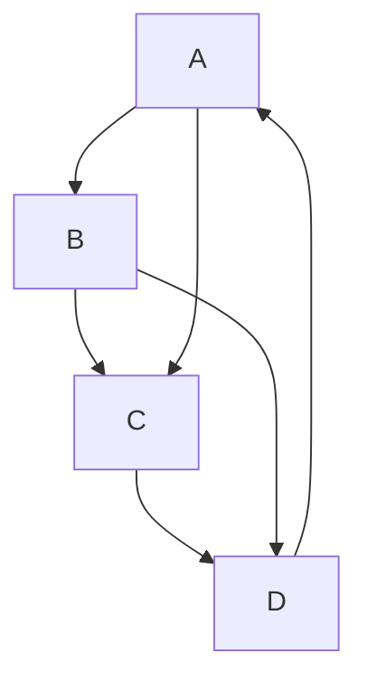
- **Undirected Graph**: An undirected graph is a type of graph where the edges have no direction. The connection between two vertices is bidirectional.

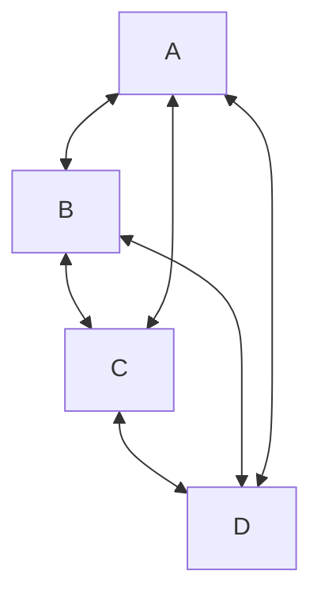
**As mermaid doesn't support undirected graphs it would be represented as bidirectional edges.**

- **Weighted Graph**: A weighted graph is a graph in which each edge has an associated numerical value, called weight. This can represent cost, distance, or any other metric.
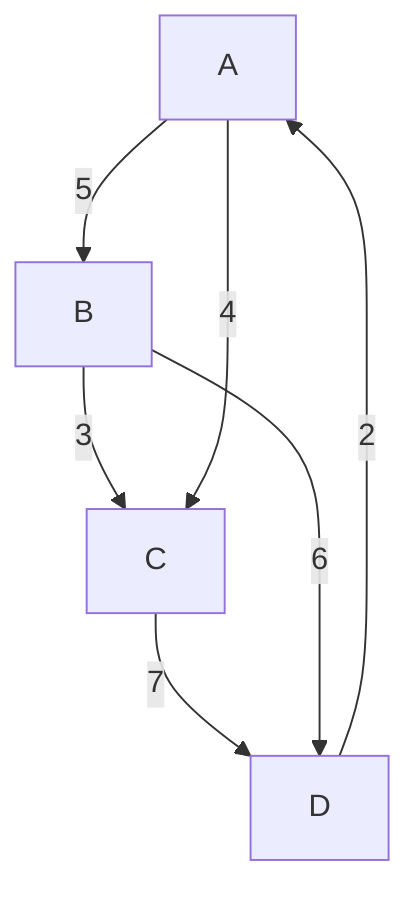

## Graph Representation

### Non-Weighted Graph
Let the graph be this:
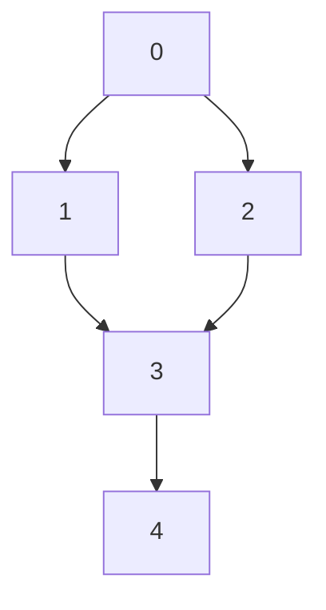
#### 1. Adjacency List
The adjacency list is a dictionary where each key represents a node, and the value is a list of nodes to which the key node has directed edges.

```python
adj_list = {  
    0: [1, 2],  
    1: [3],  
    2: [3],  
    3: [4],  
    4: []  
}
```

#### 2. Adjacency Matrix
The adjacency matrix is a 2D list (list of lists) where the element at row i and column j is 1 if there is a directed edge from node i to node j, and 0 otherwise.

```python
adj_matrix = [  
    [0, 1, 1, 0, 0],  # 0  
    [0, 0, 0, 1, 0],  # 1  
    [0, 0, 0, 1, 0],  # 2  
    [0, 0, 0, 0, 1],  # 3  
    [0, 0, 0, 0, 0]   # 4  
]
```

If the graph is weighted, the adjacency list and adjacency matrix representations will include the weights of the edges. Here is how you can represent the given graph with weights.

### Weighted Graph
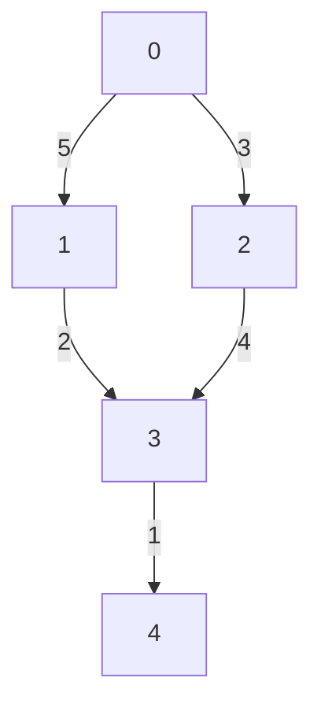

#### 1. Adjacency List
The adjacency list is a dictionary where each key represents a node, and the value is a list of tuples. Each tuple contains a node to which the key node has a directed edge and the weight of that edge.

```python
adj_list = {  
    0: [(1, 5), (2, 3)],  
    1: [(3, 2)],  
    2: [(3, 4)],  
    3: [(4, 1)],  
    4: []  
}
```

#### 2. Adjacency Matrix
The adjacency matrix is a 2D list (list of lists) where the element at row i and column j is the weight of the edge from node i to node j, and 0 if there is no edge.
```python
adj_matrix = [  
    [0, 5, 3, 0, 0],  # 0  
    [0, 0, 0, 2, 0],  # 1  
    [0, 0, 0, 4, 0],  # 2  
    [0, 0, 0, 0, 1],  # 3  
    [0, 0, 0, 0, 0]   # 4  
]
```

## Connected Components
A connected component in an undirected graph is a group of nodes such that:
- Every node in the group is connected to every other node in the group by some path.
- There are no connections between nodes in this group and any nodes outside of this group.


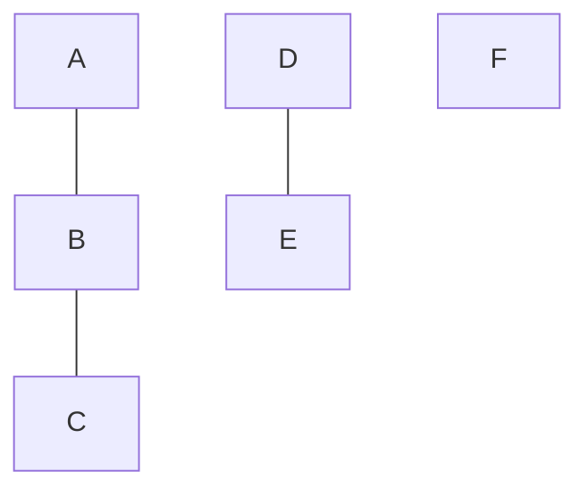

**From now on we would be only using the adjacency list mechanism for representation**.

## Traversal Techniques
### Breadth First Search
The BFS traversal explores all nodes at the present depth before moving on to nodes at the next depth level.
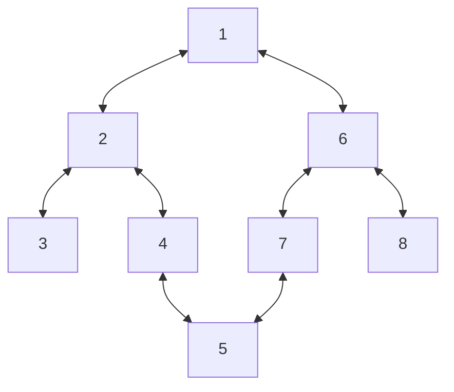
Possible BFS with starting node as `1`: [1], [2, 6], [3, 4, 7, 8], [5] - the sub-divisions are for the different levels.
Now if we change the starting node to `6`: [6], [1, 7, 8], [2, 5], [3, 4].

#### Implementation
- For the implementation of BFS we use a queue and a visited set.
- For each level we empty the queue and traverse the nodes not traversed already and add them to the result.
- The visited set is important as it helps us from revisiting the same node again and again. As soon as a node is added to the queue, it is marked as visited.

Code
```python
def bfs(n, edges):
    graph = {i: [] for i in range(n)}
    for edge in edges:
        src, dest = edge
        graph[src].append(dest)
        graph[dest].append(src)
    
    # initialize queue and visited set
    visited = set()
    queue = deque()

    # add the starting node
    queue.append(0)
    visited.add(0)

    result = []
    while queue:
        temp = deque()
        # get the nodes for the current level
        while queue:
            # follow FIFO
            node = queue.popleft()
            # add to result as they are being traversed
            result.append(node)
            for adj_node in graph[node]:
                if adj_node not in visited:
                    # visit adjacent nodes for the next level traversal
                    temp.add(adj_node)
                    # add the adjacent node to the visited set
                    visited.add(adj_node)
        queue = temp
    
    return result
```

### Depth First Search
The DFS traversal visits nodes by exploring as far as possible along each branch before backtracking.

Possible DFS with starting node as `1`: [1, 2, 3, 4, 5, 7, 6, 8].

#### Implementation
- We would be using recursion to implement DFS.
- Like in BFS we would also have a `visited` set to mark the nodes that are already visited.

Code:
```python
def traverse(n, edges):
    graph = {i: [] for i in range(n)}
    for edge in edges:
        src, dest = edge
        graph[src].append(dest)
        graph[dest].append(src)
    
    # initialize visited set
    visited = set()
    
    result = []

    def dfs(node):
        visited.add(node)
        result.add(node)
        for adj_node in graph[node]:
            if adj_node not in visited:
                solve(node)
    
    solve(0)
    return result
```

#### Extension of DFS - Connected Components
For connected components, this is how the dfs logic would change.
Since we know that in one traversal all the nodes wouldn't be traversed, we would perform dfs for all the nodes if they are not visited yet.

```python
def traverse(graph)
    # initialize visited set
    visited = set()
    result = []

    def dfs(node):
        visited.add(node)
        result.append(node)

        # this ensures that all the nodes in this group are traversed
        for adj_node in graph[node]:
            if adj_node not in visited:
                dfs(adj_node)

    for node in graph:
        # check if the node exists
        if node not in visited:
            dfs(node)
```

#### Problems
##### Number of Provinces
```
TODO
```
##### Number of Islands
Given an `m x n` 2D binary grid grid which represents a map of '1's (land) and '0's (water), return the number of islands.
An island is surrounded by water and is formed by connecting adjacent lands horizontally or vertically. You may assume all four edges of the grid are all surrounded by water.

###### Intuition
For this either DFS or Union-Find a good algorithm to tackle this. Here we would try out the DFS approach for the solution.
- We traverse the grid element by element and if the element doesn't exist in the visited set, increase the number of islands by 1.
- Do this untill all the elements are traversed in the grid and then return the island count.
**Hint: Instead of maintaining a separate visited array just update the 1 to 0 in the grid**

Code
```python
def num_islands(grid):
    m, n = len(grid), len(grid[0])
    directions = [(-1, 0), (1, 0), (0, -1), (0, 1)]
    def dfs(row, col):
        # Mark the current cell as visited by setting it to 0
        grid[row][col] = "0"

        # Explore all four possible directions
        for direction in directions:
            n_row, n_col = row + direction[0], col + direction[1]
            # Check if the new position is within bounds and is an unvisited land ('1')
            if 0<=n_row<m and 0<=n_col<n and grid[n_row][n_col] == "1":
                dfs(n_row, n_col)
    
    islands = 0
    for row in range(m):
        for col in range(n):
            if grid[row][col] == "1":
                islands = islands + 1
                dfs(row, col)
    return islands
``` 

##### Max Area of Island
You are given an `m x n` binary matrix grid. An island is a group of 1's (representing land) connected 4-directionally (horizontal or vertical.) You may assume all four edges of the grid are surrounded by water.

The area of an island is the number of cells with a value 1 in the island.
Return the maximum area of an island in grid. If there is no island, return 0.

###### Intuition
This is an extension of the number of islands problem, just that here we would have to return the total area of each possible islands and return the maximum of them all.

Code
```python
def max_area_islands(grid):
    m, n = len(grid), len(grid[0])
    directions = [(-1, 0), (1, 0), (0, -1), (0, 1)]

    def dfs(row, col):
        # Mark the current cell as visited by setting it to 0
        grid[row][col] = 0
        # Initialize the area of the current island to 1 (counting the current cell)
        area = 1

        # Explore all four possible directions
        for direction in directions:
            n_row, n_col = row + direction[0], col + direction[1]
            # Check if the new position is within bounds and is an unvisited land ('1')
            if 0<=n_row<m and 0<=n_col<n and grid[n_row][n_col] == 1:
                # Add the area returned by the DFS call to the current area
                area = area + dfs(n_row, n_col)
        
        # Return the total area of the island
        return area
    
    max_area = 0
    for row in range(m):
        for col in range(n):
            # If the cell is an unvisited land (1), calculate the area of the island
            if grid[row][col] == 1:
                # Update the maximum area if the current island's area is larger
                max_area = max(max_area, dfs(row, col))

    return max_area
```

#### Clone Graph
Given a reference of a node in a connected undirected graph. Return a deep copy (clone) of the graph.
Each node in the graph contains a value (int) and a list (List[Node]) of its neighbors.
```
class Node {
    public int val;
    public List<Node> neighbors;
}
```

##### Intuition
- To solve this problem, we need to create a new graph that is structurally identical to the original graph, with new nodes and edges but the same connections.
- During the traversal, we create new nodes and maintain a mapping from the original nodes to their corresponding cloned nodes to avoid duplicating nodes and to handle cycles in the graph.

Code
```python
def clone(node):
    if node is None:
        return None
    
    clone_map = dict()

    def dfs(node):
        # If the node is already cloned, return the cloned node
        if node.val in clone_map:
            return clone_map[node.val]
        
        # Clone the node
        clone_node = Node(node.val)
        clone_map[node.val] = clone_node

        # Iterate through the neighbors to clone them
        for neighbor in node.neighbors:
            clone_node.neighbors.append(dfs(neighbor))
        
        return clone_node
    
    # Start cloning from the given node
    return dfs(node)
```

#### Word Ladder
Given two words (beginWord and endWord), and a dictionary's word list, find the length of the shortest transformation sequence from beginWord to endWord, such that:
- Only one letter can be changed at a time.
- Each transformed word must exist in the word list.

Note:
- Return 0 if there is no such transformation sequence.
- All words have the same length.
- All words contain only lowercase alphabetic characters.
- You may assume no duplicates in the word list.
- You may assume beginWord and endWord are non-empty and are not the same.

Example
```
Input:  
beginWord = "hit",  
endWord = "cog",  
wordList = ["hot", "dot", "dog", "lot", "log", "cog"]
Output: 5
Explanation: As one shortest transformation is "hit" -> "hot" -> "dot" -> "dog" -> "cog", return its length 5.
```

##### Intuition
###### Naive Approach
- Start with the `beginWord` and perform BFS by generating all possible one-letter transformations for each word.
- If a transformation matches the endWord, return the current transformation length + 1. If the transformation is in the word list, add it to the queue and remove it from the set to prevent revisits.

Code
```
def wordLadderLength(beginWord, endWord, wordList):  
    # Convert the wordList to a set for O(1) lookups  
    wordSet = set(wordList)  
      
    # If the endWord is not in the word list, there's no valid transformation  
    if endWord not in wordSet:  
        return 0  
      
    # Queue for BFS: stores tuples of (current_word, current_length)  
    queue = deque([(beginWord, 1)])  
      
    # BFS traversal  
    while queue:  
        current_word, length = queue.popleft()  
          
        # If we reach the endWord, return the current length  
        if current_word == endWord:  
            return length  
          
        # Try changing each letter in the current word  
        for i in range(len(current_word)):  
            for c in 'abcdefghijklmnopqrstuvwxyz':  
                # Create a new word by changing the ith character to c  
                new_word = current_word[:i] + c + current_word[i+1:]  
                  
                # If the new word is in the wordSet, it is a valid transformation  
                if new_word in wordSet:  
                    # Add the new word to the queue with incremented length  
                    queue.append((new_word, length + 1))  
                    # Remove the new word from the wordSet to prevent revisiting  
                    wordSet.remove(new_word)  
      
    # If we exhaust the queue without finding the endWord, return 0  
    return 0
```
Now for each word we are performing `26 * len(word)` operations and this can be improved by using the following approach.

###### Optimized Solution
Pattern Matching:
- Instead of comparing each word with every other word, use a transformation pattern to group words.
- For example, for the word "hit", generate patterns like "it", "ht", and "hi*".
- This allows quick lookup of potential transformations.

To store this we edges from pattern to all the possible words it can link to, and we traverse each breadth-wise to ensure we always get the minimum number of steps to convert.

Code
```python
def ladderLength(begin_word, end_word, word_list):
    # If the endWord is not in the wordList, return 0 as no transformation is possible
    if end_word not in word_list:
        return 0

    # Length of each word (all words have the same length)  
    word_len = len(word_list[0]) 
    graph = defaultdict(list)

    # Populate the graph with patterns generated from each word
    for word in word_list:
        word_len = len(word)
        for i in range(word_len):
            # Create a pattern by replacing one character with '*'
            pattern = word[:i] + '*' + word[i+1:]
            graph[pattern].append(word)
    
    queue, visited = deque(), set()
    queue.append((begin_word, 1))
    visited.add(begin_word)

    while queue:
        curr, steps = queue.popleft()

        # If the current word is the endWord, return the number of steps
        if curr == end_word:
            return steps

        # Generate all possible patterns for the current word
        for i in range(word_len):
            pattern = curr[:i] + '*' + curr[i+1:]

            # Check all words that match this pattern 
            for next_word in graph[pattern]:
                if next_word not in visited:
                    visited.add(next_word)
                    queue.append((next_word, steps+1))
            
            # Clear the adjacency list for this pattern to prevent redundant processing
            graph[pattern] = []
    
    return 0
```

## Graph Algorithms
Now coming to the various algorithms of graph:

### Cycle Detection
Given a directed graph, check whether the graph contains a cycle or not.
This can be done using the DFS method.
We need to modify the existing DFS implementation to check for a backedge - that can cause cycles. For this we maintain a separate `recursion_stack` set along with the existing `visited` set.

#### Why do we need a separate `recursion_stack` set, wouldn't `visited` set be enough?
No, it would be enough for an undirected graph, but for a directed graph it can give false-positives for cycles.
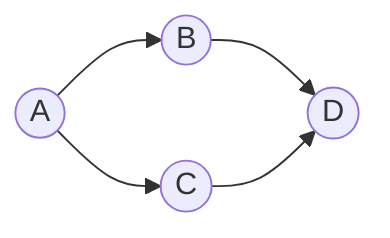
When visiting `C` and goind to it's adjacent nodes `D` already exists in the `visited` set. If we had only it, we would have wrongly judged the graph that it has a cycle.

```python
def cycle_detection(graph):
    # to check for cycles
    recursion_stack = set()
    # to check if already visited
    visited = set()

    def dfs(node):        
        recursion_stack.add(node)
        visited.add(node)

        for adj_node in graph[node]:
            # additonal check if node in recursion stack
            if adj_node in recursion_stack:
                return True
            
            if adj_node not in visited:
                dfs(adj_node)
        
        # no longer, a part of the recursion stack
        recursion_stack.remove(node)
        return False
    
    # Check all nodes in the graph to handle disconnected components  
    for node in graph:  
        if node not in visited:  
            if dfs(node):  
                return True 
    return False
```

#### Problems
##### Graph Valid Tree
Given `n` nodes labeled from `0` to `n - 1` and a list of undirected edges (each edge is a pair of nodes), write a function to check whether these edges make up a valid tree.

Example
```
Input:
n = 5
edges = [[0, 1], [0, 2], [0, 3], [1, 4]]

Output:
true
```

###### Intuition
If a cycle is detected it is not a valid tree - so an extension of the cycle detection problem.
- However this is an undirected graph and thus we must ensure that we don't consider the parent as a candidate for the cycle - **trivial cycle**.
- Check if the graph is a valid tree:  
  - The entire graph should be connected (all nodes visited from node 0)
  - There should be no cycles (DFS should return True)

Code
```python
def validTree(n, edges):
    graph = {i: [] for i in range(n)}
    for edge in edges:
        u, v = edge
        graph[u].append(v)
        graph[v].append(u)
    
    visited = set()

    def dfs(node, prev):
        # If the node is already visited, it means there's a cycle
        if node in visited:
            return False
        
        visited.add(node)

        for neighbor in graph[node]:
            # If the neighbor is not the previous node (to avoid trivial cycle) and  
            # a cycle is detected in the DFS traversal, return False 
            if neighbor != prev and not dfs(neighbor, node):
                return False
        
        # If no cycle is detected, return True
        return True
    
    return dfs(0, -1) and len(visited) == n
```

### Topological Sort
Topological sort is a way of arranging the nodes in a directed acyclic graph (DAG) in a linear order such that for every directed edge from node `u` to node `v`:
- Node `u` appears before node `v` in the ordering.

Think of it like scheduling tasks where some tasks must be completed before others. Topological sort gives you an order in which to complete the tasks so that all the dependencies are respected.
Example:
Consider a graph representing tasks with dependencies:

- Task A must be completed before tasks B and C.
- Tasks B and C must both be completed before task D.

A possible topological order for these tasks could be: A, B, C, D or A, C, B, D. Both orders respect the dependencies.

#### 1. Kahn's Algorithm
#### 2. DFS based
- **Post-Order Addition**: Once all adjacent nodes of a node are visited, the node itself is added to the result list.
- **Result Reversal**: Because nodes are added to the result list only after all their dependencies are resolved, the nodes appear in reverse topological order in the result list. Therefore, reversing the list gives you the correct topological order.

Code
```python
def topological_sort(graph):
    # Set to keep track of visited nodes  
    visited = set()  
    # Set to keep track of nodes in the current recursion stack for cycle detection  
    recursion_stack = set()
    result = []

    def dfs(node):
        # Mark the current node as visited  
        visited.add(node)  
        # Add the current node to the recursion stack  
        recursion_stack.add(node)

        for adj_node in graph[node]:
            if adj_node in recursion_stack:
                return False
            if adj_node not in visited and not dfs(node):
                return False
        
        recursion_stack.remove(node)
        # Add the node to the result list after visiting all its adjacent nodes
        result.append(node)
        return True
    
    for node in graph:
        if node not in visited and not dfs(node):
            return []
    
    # Reverse the result to get the correct topological order
    result.reverse()
    return result
```

#### Problems
#### Course Schedule I
There are a total of `numCourses` courses you have to take, labeled from `0` to `numCourses - 1`. You are given an array `prerequisites` where `prerequisites[i] = [ai, bi]` indicates that you must take course `bi` first if you want to take course `ai`.
For example, the pair `[0, 1]`, indicates that to take course `0` you have to first take course `1`.
Return `true` if you can finish all courses. Otherwise, return `false`.

Example:
```
Input: numCourses = 2, prerequisites = [[1,0]]
Output: true
Explanation: There are a total of 2 courses to take. To take course 1 you should have finished course 0. So it is possible.
```

##### Intuition
- We can model this problem as a graph where each course is a node, and a directed edge from course bi to course ai indicates that bi is a prerequisite of ai. So bi must be completed before ai. 
- If we can find a topological order for this graph, then all courses can be completed. 
- Otherwise, a cycle exists, making it impossible to complete all courses.

Code
```python
def can_finish(numCourses, prerequisites):
    graph = [[] for _ in range(numCourses)]
    for course, prerequisite in prerequisites:
        # prerequisite must be completed before course
        graph[prerequisite].append(course)
    
    # Sets to keep track of visited nodes and nodes in the current recursion stack
    visited, recursion_stack = set(), set()

    def dfs(course):
        visited.add(course)
        recursion_stack.add(course)

        for next_course in graph[course]:
            # If the next course is in the recursion stack, a cycle is detected  
            if next_course in recursion_stack:  
                return False  
            # If the next course is not visited and the DFS on it returns False, return False  
            if next_course not in visited and not dfs(next_course):  
                return False
        
        recursion_stack.remove(course)
        return True
    
    for course in range(numCourses):
        # If the course is not visited and the DFS on it returns False, a cycle is detected
        if course not in visited and not dfs(course):
            return False
    
    return True
```

#### Course Schedule II
There are a total of `numCourses` courses you have to take, labeled from `0` to `numCourses - 1`. You are given an array prerequisites where `prerequisites[i] = [ai, bi]` indicates that you must take course `bi` first if you want to take course `ai`.

For example, the pair `[0, 1]`, indicates that to take course `0` you have to first take course `1`.
Return the ordering of courses you should take to finish all courses. If there are many valid answers, return any of them. If it is impossible to finish all courses, return an empty array.

Example:
```
Input: numCourses = 2, prerequisites = [[1,0]]
Output: [0,1]
Explanation: There are a total of 2 courses to take. To take course 1 you should have finished course 0. So the correct course order is [0,1].
```

##### Intuition
The code almost will remain the same, just that we have to maintain the order in result. Also ensure the following points:
- Add a course to the result after all the next courses are processed.
- Due to this post order addition the result is reverse topological order, the course having the maximum dependencies are added first. Reversing the list provides the correct topological order.

Code
```python
def find_order(numCourses, prerequisites):
    graph = [[] for _ in range(numCourses)]
    for course, prerequisite in prerequisites:
        # prerequisite must be completed before course
        graph[prerequisite].append(course)
    
    # Sets to keep track of visited nodes and nodes in the current recursion stack
    visited, recursion_stack = set(), set()

    # List to store the topological order of courses    
    order = []

    def dfs(course):
        visited.add(course)
        recursion_stack.add(course)

        for next_course in graph[course]:
            # If the next course is in the recursion stack, a cycle is detected  
            if next_course in recursion_stack:  
                return False  
            # If the next course is not visited and the DFS on it returns False, return False  
            if next_course not in visited and not dfs(next_course):  
                return False
        
        recursion_stack.remove(course)
        # Add the course to the order list after visiting all its adjacent nodes
        order.append(course)
        return True
    
    # Perform DFS on all the courses
    for course in range(numCourses):
        # If the course is not visited and the DFS on it returns False, a cycle is detected
        if course not in visited and not dfs(course):
            return []
    
    # Reverse the order to get the correct topological order
    order.reverse()
    return order
```

#### Alien Dictionary
You are given a list of words from the dictionary, where the words are sorted lexicographically by the rules of this new language. Derive the order of letters in this alien language.

Example
```
Input: ["wrt", "wrf", "er", "ett", "rftt"]
Output: "wertf"
Explanation: The correct order of characters is:
'w' comes before 'e'
'r' comes before 't'
't' comes before 'f'
```

##### Intuition
To solve this problem, we can use a topological sort since we are essentially trying to determine the order of characters based on a partial ordering given by the dictionary.

1. **Build the Graph**: Construct a directed graph where each node is a character, and there is a directed edge from character u to v if u comes before v in the dictionary.
2. **Topological Sort**: Perform a topological sort on the graph to find the order of characters.

Code
```python
def alien_order(words):
    graph = defaultdict(list)

    # Build the graph by comparing adjacent words
    for i in range(len(words)-1):
        first, second = words[i], words[i+1]
        min_length = min(len(first), len(second))
        non-matching_found = False

        # Find the first non-matching character
        for j in range(min_length):
            if first[j] != second[j]:
                graph[first[j]].append(second[j])
                non-matching_found = True
                break

        # Check for the invalid case where second word is a prefix of first word  
        if not non_matching_found and len(second) < len(first):  
            return ""
    
    visited = set()
    order = []
    recursion_stack = set()

    def dfs(char):
        visited.add(char)
        recursion_stack.add(char)

        for next_char in graph[char]:
            # If the next character is in the recursion stack - a cycle is detected 
            if next_char in recursion_stack:
                return False
            # If the character is not visiteed, the topological sort on it returns False if a cycle is detected
            if next_char not in visited and not dfs(next_char):
                return False
        
        recursion_stack.remove(char)
        # The character is added to the order after all the adjacent characters are traversed
        order.append(char)
        return True

    for word in words:
        for char in words:
            # If the character is not visiteed, the topological sort on it returns False if a cycle is detected
            if char not in visited and not dfs(char):
                return ""
    
    # Reverse the order to get the correct topological order
    order.reverse()
    return "".join(order)
```

### Flood Fill Algorithm
The Flood Fill algorithm is used to fill a contiguous region of pixels with a particular color, starting from a given seed pixel.

Code
```python
def flood_fill(grid, row, col, new_color):  
    rows, cols = len(grid), len(grid[0])  
    original_color = grid[row][col]
    # possible directions
    directions = [(-1, 0), (1, 0), (0, -1), (0, 1)]
  
    # Base case: If the new color is the same as the original color, no change is needed  
    if original_color == new_color:  
        return grid  
  
    def is_valid(row, col):
        return 0<=row<rows and 0<=col<cols

    def fill(row, col):  
        # Set the new color  
        grid[row][col] = new_color

        # Recursively fill the neighboring cells
        for direction in directions:
            n_row, n_col = row + direction[0], col + direction[1]
            if is_valid(n_row, n_col) and grid[n_row][n_col] == original_color:        
                fill(n_row, n_col)
  
    # Start the flood fill from the given starting cell  
    fill(row, col)  
    return grid
```
The recursive approach handles the issue of visiting the same cell again by marking cells with the new color as they are visited. Once a cell is changed to the new color, it will no longer match the original_color, which prevents it from being revisited.

#### Problems
##### Rotten Oranges
You are given an m x n grid where each cell can have one of three values:
- 0 representing an empty cell,
- 1 representing a fresh orange, or
- 2 representing a rotten orange.
Every minute, any fresh orange that is 4-directionally adjacent to a rotten orange becomes rotten.

Return the minimum number of minutes that must elapse until no cell has a fresh orange. If this is impossible, return -1.

###### Intuition
- The "rotten oranges" problem is similar to the flood fill algorithm in that it involves spreading a state (rottenness) from a source (rotten oranges) to its neighbors (fresh oranges) iteratively. 
- This problem is well-suited for a Breadth-First Search (BFS) approach because it naturally handles the layer-by-layer propagation of the rottenness, simulating the passage of time.

Code
```python
def orangesRotting(grid):
    m, n = len(grid), len(grid[0])
    queue = deque()
    fresh = 0

    # Populate the queue with initially rotten oranges and count fresh oranges
    for row in range(m):
        for col in range(n):
            if grid[row][col] == 1:
                fresh = fresh + 1
            elif grid[row][col] == 2:
                queue.append((row, col))
    
    if fresh == 0:
        return 0

    directions = [(-1, 0), (1, 0), (0, -1), (0, 1)]
    elapsed_time = 0

    while queue:
        elapsed_time = elapsed_time + 1
        for _ in range(len(queue)):
            row, col = queue.popleft()
            for direction in directions:
                n_row, n_col = row + direction[0], col + direction[1]
                if 0<=n_row<m and 0<=n_col<n and grid[n_row][n_col] == 1:
                    grid[n_row][n_col] = 2
                    fresh = fresh - 1
                    queue.append((n_row, n_col))

    # If there are still fresh oranges, return -1
    return elapsed_time - 1 if fresh == 0 else -1
```
###### Extra Points
- **Extra Increment**:
  - After processing the last batch of fresh oranges that can rot, we increment minutes_elapsed once more.
  - This results in minutes_elapsed being one more than the actual number of minutes required to rot all oranges.

#### Pacific Atlantic Water Flow
There is an `m x n` rectangular island that borders both the Pacific Ocean and Atlantic Ocean. The Pacific Ocean touches the island's left and top edges, and the Atlantic Ocean touches the island's right and bottom edges.
The island is partitioned into a grid of square cells. You are given an `m x n` integer matrix heights where heights[r][c] represents the height above sea level of the cell at coordinate `(r, c)`.
The island receives a lot of rain, and the rain water can flow to neighboring cells directly north, south, east, and west if the neighboring cell's height is less than or equal to the current cell's height. Water can flow from any cell adjacent to an ocean into the ocean.
Return a 2D list of grid coordinates `result` where `result[i] = [ri, ci]` denotes that rain water can flow from cell `(ri, ci)` to both the Pacific and Atlantic oceans.

##### Intution
To solve this problem, we need to determine which cells can reach both the Pacific and Atlantic Oceans. The key insight is that instead of trying to simulate water flow from every cell to the oceans, we can reverse the problem: simulate water flow from the oceans to the cells.
- Reverse Flow Simulation:
  - Instead of checking if water can flow from each cell to the oceans, we check if water can flow from the oceans to each cell.
  - We perform two separate flood fill operations (DFS or BFS):
  - One starting from all cells adjacent to the Pacific Ocean.
  - Another starting from all cells adjacent to the Atlantic Ocean.
- We can keep 2 sets for keeping track of the cells that can be visited from Pacific and Atlantic oceans.

Code
```python
def pacific_atlantic(heights):
    m, n = len(heights), len(heights[0])
    # Sets to keep track of the cells tracked
    atlantic, pacific = set(), set()

    directions = [(-1, 0), (1, 0), (0, -1), (0, 1)]
    def dfs(row, col, visited):
        visited.add((row, col))
        for direction in directions:
            n_row, n_col = row + direction[0], col + direction[1]
            if 0<=n_row<m and 0<=n_col<n and (n_row, n_col) not in visited and heights[n_row][n_col] >= heights[row][col]:
                dfs(n_row, n_col, visited)
    
    for row in range(m):
        # Left edge (Pacific) 
        if (row, 0) not in pacific:
            dfs(row, 0, pacific)
        # Right edge (Atlantic)
        if (row, n-1) not in atlantic:
            dfs(row, n-1, atlantic)
    
    for col in range(n):
        # Top edge (Pacific)
        if (0, col) not in pacific:
            dfs(0, col, pacific)
        # Bottom edge (Atlantic)
        if (m-1, col) not in atlantic:
            dfs(m-1, col, atlantic)
    
    return pacific & atlantic
```
#### Surrounded Regions
You are given an `m x n` matrix board containing letters 'X' and 'O', capture regions that are surrounded:
- **Connect**: A cell is connected to adjacent cells horizontally or vertically.
- **Region**: To form a region connect every 'O' cell.
- **Surround**: The region is surrounded with 'X' cells if you can connect the region with 'X' cells and none of the region cells are on the edge of the board.
A surrounded region is captured by replacing all 'O's with 'X's in the input matrix board.

##### Intuition
- **Identify Non-Surrounded Regions**:
  - Any 'O' connected to the border of the board cannot be surrounded, as it can potentially escape to the edge.
  - Thus, we need to identify all 'O's that are connected to the border and mark them as non-surrounded.
- **Mark and Capture Regions**:
  - After identifying the non-surrounded regions, we can safely assume that any remaining 'O' in the board is a surrounded region.
  - We can then capture these surrounded regions by converting all 'O's to 'X's.
- **Use a Temporary Marker**:
  - To differentiate between the 'O's that are part of non-surrounded regions and the ones that are surrounded, we can use a temporary marker (e.g., 'T') to mark the 'O's that are found to be non-surrounded during our traversal.

Code
```python
def surround_regions(grid):
    m, n = len(grid), len(grid[0])
    directions = [(-1, 0), (1, 0), (0, -1), (0, 1)]

    def dfs(row, col):
        # This acts as a form of marking visited - Temporary marker
        grid[row][col] = 'T'
        for direction in directions:
            n_row, n_col = row + direction[0], col + direction[1]
            if 0<=n_row<m and 0<=n_col<n and grid[n_row][n_col] == "O":
                dfs(n_row, n_col)

    # Mark all 'O's connected to the border with 'T'
    for row in range(m):
        if grid[row][0] == "O":
            dfs(row, 0)
        if grid[row][n-1] == "O":
            dfs(row, n-1)
    
    for col in range(n):
        if grid[0][col] == "O":
            dfs(0, col)
        if grid[m-1][col] == "O":
            dfs(m-1, col)
    
    # Flip all remaining 'O's to 'X' and 'T's back to 'O'
    for row in range(m):
        for col in range(n):
            if grid[row][col] == "O":
                grid[row][col] = "X"
            # Cells are visited or marked they won't be converted as they have boundary with edge
            elif grid[row][col] == "T":
                grid[row][col] = "O"
```

#### Walls and Gates
You are given a 2D grid representing rooms in a building. The grid contains the following values:
- -1 for a wall or an obstacle.
- 0 for a gate.
- `INF` (infinity) for an empty room.

Fill each empty room with the distance to its nearest gate. If it is impossible to reach a gate, leave the room as `INF`.

Example:
```
Input:  
rooms = [  
  [INF, -1, 0, INF],  
  [INF, INF, INF, -1],  
  [INF, -1, INF, -1],  
  [0, -1, INF, INF]  
]  
  
Output:  
rooms = [  
  [3, -1, 0, 1],  
  [2, 2, 1, -1],  
  [1, -1, 2, -1],  
  [0, -1, 3, 4]  
]
```

##### Intuition
To solve this problem, we can perform a multi-source Breadth-First Search (BFS) starting from all gates simultaneously. 
BFS is ideal for this problem because it explores all nodes at the present depth level before moving on to nodes at the next depth level, ensuring that we find the shortest path to a gate.

Code
```python
def walls_and_gates(rooms):
    if not rooms or not rooms[0]:
        return
    
    m, n = len(rooms), len(rooms[0])
    INF = 2**31 - 1 # Define the value of infinity as per the problem statement
    directions = [(1, 0), (-1, 0), (0, 1), (0, -1)]
    queue = deque()

    # Initialize queue with all gates
    for row in range(m):
        for col in range(n):
            if rooms[row][col] == 0:
                queue.append((row, col))
    
    # Perform BFS for each gate
    while queue:
        row, col = queue.popleft() # Use popleft() for BFS

        for direction in directions:
            n_row, n_col = row + direction[0], col + direction[1]
            # If the position is in-bounds and empty room
            if 0<=n_row<m and 0<=n_col<n and rooms[n_row][n_col] == INF:
                # Update the distance to the nearest gate
                rooms[n_row][n_col] = rooms[row][col] + 1
                queue.append((n_row, n_col))
```

### Shortest Path Algorithms
### 1. Single Source Shortest Path
##### Dijkstra
Dijkstra's algorithm is a graph search algorithm that solves the single-source shortest path problem for a graph with **non-negative edge weights**, producing a shortest path tree. This means it finds the shortest paths from a starting node (source) to all other nodes in the graph.

###### How it Works:
- **Initialization**: Start with a distance array, dist, where dist[source] is 0 (distance to itself) and all other distances are set to infinity.
- **Priority Queue**: Use a priority queue (min-heap) to select the node with the smallest distance.
- **Relaxation**: For each selected node, update the distances of its neighbors if a shorter path is found via the current node.
- **Repeat**: Continue until all nodes have been processed.

Code
```python
def dijkstra(start, graph):
    # map to store shortest distance
    dist = {node: float('inf') for node in graph}
    dist[start] = 0
    
    # min-heap to store the minimum distance node at the root
    priority_queue = [(0, start)]

    while priority_queue:
        current_distance, current_node = heapq.heappop(priority_queue)

        # Nodes can be added to the priority queue multiple times. We only  
        # process a node the first time we remove it from the priority queue.
        if current_node in visited:
            continue
        
        visited.add(current_node)

        for neighbor, weight in graph[current_node]:
            distance = current_distance + weight

            # Only consider this new path if it's better
            if dist[neighbor] > distance:
                dist[neighbor] = distance 
                heapq.heappush(priority_queue, (distance, neighbor))
    
    for node in graph:
        # for nodes that are not reachable from the start node
        if dist[node] == float('inf'):
            dist[node] = -1
    return dist
```
###### Problems
###### Network Delay Time
You are given a network of `n` nodes, labeled from `1 to n`. You are also given times, a list of travel times as directed edges `times[i] = (ui, vi, wi)`, where `ui` is the source node, `vi` is the target node, and `wi` is the time it takes for a signal to travel from source to target.

We will send a signal from a given node `k`. Return the minimum time it takes for all the `n` nodes to receive the signal. If it is impossible for all the `n` nodes to receive the signal, return `-1`.

###### Intuition
The problem is a classic shortest path problem in graph theory. The objective is to find the shortest time it takes for a signal to travel from a given starting node ( k ) to all other nodes in a directed, weighted graph. 
This can be solved using **Dijkstra's algorithm**, which is well-suited for finding the shortest paths from a single source node to all other nodes in a graph with non-negative edge weights.

Code
```python
def networkDelayTime(times, n, k):
    graph = {i+1: [] for i in range(n)}
    for u, v, w in times:
        graph[u].append((v, w))
    
    # Min-heap priority queue to select the edge with the minimum cost
    min_heap = [(0, k)]

    # Dictionary to store the shortest time to reach each node, initialized to infinity 
    shortest_time = {i+1: float('inf') for i in range(n)}
    shortest_time[k] = 0

    while min_heap:
        time, u = heapq.heappop(min_heap)
        for v, w in graph[u]:
            # If a shorter path to the neighbor is found, update the shortest time
            if w + time < shortest_time[v]:
                shortest_time[v] = w + time
                heapq.heappush(min_heap, (w + time, v))
    
    # Initialize the maximum shortest time to negative infinity  
    max_shortest_time = float('-inf')  
      
    # Check the shortest time to reach each node  
    for node in shortest_time:  
        # If any node is still unreachable, return -1  
        if shortest_time[node] == float('inf'):  
            return -1  
        # Update the maximum shortest time  
        max_shortest_time = max(max_shortest_time, shortest_time[node])  
      
    # Return the maximum shortest time to reach any node  
    return max_shortest_time
```

###### Swim in Rising Water
You are given an `n x n` integer matrix grid where each value `grid[i][j]` represents the elevation at that point `(i, j)`.

The rain starts to fall. At time `t`, the depth of the water everywhere is `t`. You can swim from a square to another 4-directionally adjacent square if and only if the elevation of both squares individually are at most `t`. You can swim infinite distances in zero time. Of course, you must stay within the boundaries of the grid during your swim.

Return the least time until you can reach the bottom right square `(n - 1, n - 1)` if you start at the top left square (0, 0).

###### Intuition
- **Key Concept: Elevation as "Cost"**: In traditional shortest path problems, we often think about minimizing the distance or cost to travel from a source to a destination. In this problem, instead of distance, we are concerned with minimizing the maximum elevation encountered along the path.
- The `cost` to move into a cell is represented by the elevation of that cell. To minimize this we use the min-heap - `Dijkstra's Algorithm` to select the adjacent cell which has the minimum elevation change.

Code
```python
def swim_in_water(grid):
    n = len(grid)
    directions = [(-1, 0), (1, 0), (0, -1), (0, 1)]

    # Min-heap priority queue, starting with the top-left corner
    min_heap = [(grid[0][0], 0, 0)]
    visited = set()
    max_elevation = grid[0][0]

    while min_heap:
        elevation, row, col = heapq.heappop(min_heap)

        if (row, col) in visited:
            continue

        max_elevation = max(max_elevation, elevation)
        visited.add((row, col))

        # If we reached the bottom-right corner, return the max elevation
        if row == n-1 and col == n-1:
            return max_elevation
        
        # Explore the neighbors
        for direction in directions:
            n_row, n_col = row + direction[0], col + direction[1]
            if 0<=n_row<n and 0<=n_col<n and (n_row, n_col) not in visited:
                heapq.heappush(min_heap, (grid[n_row][n_col], n_row, n_col))
    
    return -1
```

##### Bellman Ford
The Bellman-Ford algorithm is another algorithm for finding the shortest paths from a single source vertex to all other vertices in a weighted graph. Unlike Dijkstra's algorithm, Bellman-Ford can handle graphs with negative edge weights. It is slower but more versatile.

**Negative Weight Cycle**
A negative weight cycle in a graph is a loop where the sum of the edge weights is negative. These cycles are crucial in shortest path algorithms because they allow you to keep decreasing the path length endlessly by looping through the cycle. This makes it impossible to define a "shortest path" accurately.

###### How it Works
- **Initialization**: Start with a distance array, dist, where dist[source] i  0 (distance to itself) and all other distances are set to infinity.
- **Relaxation**: For each edge, update the distances of the two vertices if a shorter path is found.
- **Repeat**: Repeat the relaxation process for `|V| - 1` times (where `|V|` is the number of vertices).
- **Negative Cycle Check**: Perform an additional relaxation to detect negative weight cycles. If a shorter path is found, then a negative weight cycle exists.

Code
1. When the adjacency list is provided as an input
```python
def bellman_ford(start, graph):
    dist = {node: float('inf') for node in graph}
    dist[start] = 0
    n = len(graph)

    for _ in range(n - 1):
        new_dist = dist.copy()
        for node in graph:
            for neighbor, weight in graph[node]:
                if dist[node] != float('inf') and dist[node] + weight < dist[neighbor]:
                    dist[neighbor] = dist[node] + weight
        dist = new_dist
    
    # Check for negative weight cycles
    for node in graph:
        for neighbor, weight in graph[node]:
            if dist[node] != float('inf') and dist[node] + weight < dist[neighbor]:
                # graph contains a negative weight cycle
                return -1

    return dist  
```
2. When the edges are provided as an input
```python
def bellman_ford_edges(start, edges, num_vertices):  
    dist = {i: float('inf') for i in range(num_vertices)}  
    dist[start] = 0  
  
    for _ in range(num_vertices - 1):
        new_dist = dist.copy()  
        for u, v, w in edges:  
            if dist[u] != float('inf') and dist[u] + w < dist[v]:  
                dist[v] = dist[u] + w
        dist = new_dist  
  
    # Check for negative weight cycles  
    for u, v, w in edges:  
        if dist[u] != float('inf') and dist[u] + w < dist[v]:  
            # Graph contains a negative weight cycle  
            return -1  
  
    return dist
```
**Why on |V|-1 we get the result?**
Since the longest possible path without repeating any vertex in a graph with |V| vertices has |V| - 1 edges, the algorithm needs up to |V| - 1 iterations to ensure that the shortest path to each vertex is found.

Example:
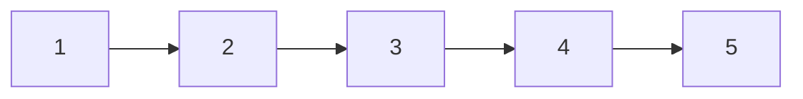

Starting with node 1, for this graph to relax till E we would need `|V| - 1` or 4 iterations.

###### Problems
###### Cheapest Flights Within K Stop
There are n cities connected by some number of flights. You are given an array `flights` where `flights[i] = [fromi, toi, pricei]` indicates that there is a flight from city `fromi` to city `toi` with cost `pricei`.

You are also given three integers `src`, `dst`, and `k`, return the cheapest price from `src` to `dst` with at most `k` stops. If there is no such route, return `-1`.

Example 1:
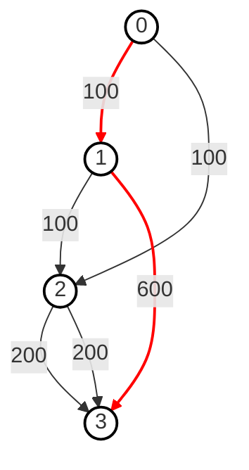
```
Input: 
n = 4 
flights = [[0,1,100],[1,2,100],[2,0,100],[1,3,600],[2,3,200]]
src = 0 
dst = 3
k = 1  

Output: 700

Explanation:
The graph is shown above. The optimal path with at most 1 stop from city 0 to 3 is marked in red and has a cost of 100 + 600 = 700. Note that the path through cities [0,1,2,3] is cheaper but is invalid because it uses 2 stops.
```

###### Intuition
- To solve this problem effectively, we need to find the cheapest price to travel from the source city (src) to the destination city (dst) with at most k stops. This could have been solved with Dijkstra but we don't get to limit the relaxations there.
- So, the Bellman-Ford algorithm is well-suited for this problem because it allows for the relaxation of edges a specified number of times, effectively considering paths with a limited number of stops. This makes it an appropriate choice for finding the cheapest price from the source to the destination with at most k stops.

Code
```python
def find_cheapest_price(n, flights, src, dest, k):
    cost = {i: float('inf') for i in range(n)}
    cost[src] = 0

    # Perform relaxation up to k + 1 times 
    for _ in range(k):
        # Create a copy of the current costs
        new_cost = cost.copy()
        for frm, to, price in flights:
            if cost[frm] != float('inf') and cost[frm] + price < new_cost[to]:
                new_cost[to] = cost[frm] + price
        cost = new_cost
    return cost[dst] if cost[dst] != float('inf') else -1
```

**So for single source shortest path, use Bellman Ford if there are negative weights and number of relaxations `k` is restricted.**

#### 2. Multi Source Shortest Path
##### Floyd Warshall Algorithm
The Floyd-Warshall algorithm is used to find the shortest paths between all pairs of vertices in a weighted graph. It can handle positive and negative edge weights but not negative weight cycles.

###### How it Works:
- **Initialization**: Create a distance matrix `dist` where `dist[i][j]` is the weight of the edge from vertex `i` to vertex `j`. If no such edge exists, initialize `dist[i][j]` to infinity. the diagonal elements `dist[i][i]` are set to 0.
- **Relaxation**: For each pair of vertices (i, j), update the `dist[i][j]` to be the minimum of `dist[i][k] + dist[k][j]` for each intermediate vertex k.
- **Repeat**: Repeat the relaxation for all pairs of vertices and all intermediate vertices.
- **Negative Cycle Check**: After computing the shortest paths, if the distance from a vertex to itself becomes negative (dist[i][i] < 0 for any vertex i), it indicates a negative weight cycle.

Code
```python
def floyd_warshall(graph):
    n = len(graph)
    dist = [[float('inf')] * n for _ in range(n)]

    for i in range(n):
        dist[i][i] = 0
        for j, weight in graph[i]:
            dist[i][j] = weight
    
    for k in range(n):
        for i in range(n):
            for j in range(n):
                dist[i][j] = min(dist[i][j], dist[i][k] + dist[k][j])
    
    # check for negative weight cycles
    for i in range(n):
        if dist[i][i] < 0:
            # graph contains a negative weight cycle
            return -1
    return dist
```

### Disjoint Union Set - DSU
Two sets are called disjoint if they don’t share any element; their intersection is an empty set. Also known as Union-Find as it supports the following operations:
- Merging disjoint sets into a single disjoint set using the **Union** operation.
- Finding the representative of a disjoint set using the **Find** operation.

**Union By Rank**:
The idea is to always attach the smaller tree under the root of the larger tree, thereby minimizing the maximum height of the trees. This technique is known as union by rank.

#### Find
The **Find** operation is used to determine which subset a particular element is in. This can be used to check if two elements are in the same subset.

##### Example:
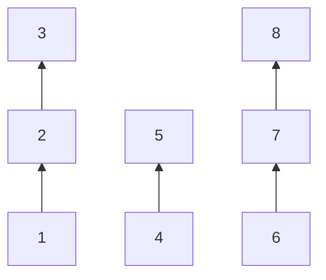
- Find(1): To find the representative of the set containing element 1, we follow the pointer from 1 to 2, and from 2 to 3. Thus, the representative for element 1 is 3.
- Find(4): To find the representative of the set containing element 4, we follow the pointer from 4 to 5. Thus, the representative for element 4 is 5.

##### Code
```python
def find(node):
    if node != parent[node]:
        parent[node] = find(parent[node]) #path compression
    return parent[node]
```

#### Union
The Union operation is used to merge two subsets into a single subset. This is useful when you need to combine the sets containing two different elements.

##### Example
Consider the following sets represented as a forest:


Let's say we want to merge the sets containing elements 1 and 4:
- First, we find the representatives of each set:
- Find(1) returns 3.
- Find(4) returns 5.
- Then, we merge the sets by making one representative the parent of the other.

##### Code
```python
def union(node1, node2):  
    root1 = find(node1)  
    root2 = find(node2)  
      
    if root1 != root2:  
        parent[root2] = root1  # Merge the sets
```

#### Union By Rank
The Union-Find algorithm can be optimized using the `Union by Rank` technique to keep the tree shallow, which improves the efficiency of both find and union operations.

##### Code
```python
n = 8
rank = [1] * n
def union(node1, node2):  
    parent1 = find(node1)  
    parent2 = find(node2)  
      
    if parent1 != parent2:
        if rank[parent1] >= rank[parent2]:
            parent[parent2] = parent1 # Merge the sets
            rank[parent1] = rank[parent1] + rank[parent2]
        else:  
            parent[parent1] = parent2
            rank[parent2] = rank[parent2] + rank[parent1]
```

#### Problems
##### Number of Connected Components in an Undirected Graph
Given an undirected graph with n nodes and edges, find the number of connected components in the graph.
```python
def count_components(n, edges):
    parent = {i: i for i in range(n)}
    rank = [1] * n

    def find(node):
        if node != parent[node]:
            parent[node] = find(parent[node])
        return parent[node]

    def union(node1, node 2):
        parent1 = find(node1)
        parent2 = find(node2)

        if parent1 != parent2:
            if rank[parent1] >= rank[parent2]:
                parent[node2] = parent1
                rank[parent1] = rank[parent1] + rank[parent2]
            else:
                parent[node1] = parent2
                rank[parent2] = rank[parent2] + rank[parent1]

    for src, dest in edges:
        union(src, dest)

    components = set()
    for node in range(n):
        components.add(find(node))

    return len(components) 
```

#### Redundant Connection
In this problem, a tree is an **undirected graph** that is connected and has no cycles.
You are given a graph that started as a tree with `n` nodes labeled from `1` to `n`, with one additional edge added. The added edge has two **different** vertices chosen from `1` to `n`, and was not an edge that already existed. The graph is represented as an array `edges` of length `n` where `edges[i] = [ai, bi]` indicates that there is an edge between nodes `ai` and `bi` in the graph.

Return **an edge that can be removed so that the resulting graph is a tree of `n` nodes**. If there are multiple answers, return the answer that occurs last in the input.

Example:
```
Input: edges = [[1,2],[1,3],[2,3]]
Output: [2,3]
```

##### Intuition
The intuition for this problem is very simple, whichever edge causes a cycle can returned as a result. If multiple return the last in input.
We can utilise our knowledge of find and union to find this edge.

Code
```python
def redundant_connection(edges):
    n = len(edges)
    parent = {i: i for i in range(1, n+1)}
    rank = [1] * (n+1)
    def find(node):
        if node != parent[node]:
            parent[node] = find(parent[node])
        return parent[node]
    
    def union(node1, node2):
        parent1, parent2 = find(node1), find(node2)

        if parent1 == parent2:
            return False
        
        if parent1 != parent2:
            if rank[parent1] >= rank[parent2]:
                parent[parent2] = parent1
                rank[parent1] = rank[parent1] + rank[parent2]
            else:
                parent[parent1] = parent2
                rank[parent2] = rank[parent2] + rank[parent1]
        
        return True
    
    for u, v in edges:
        if not union(u, v):
            return [u, v]
```

### Minimum Spanning Tree
A Minimum Spanning Tree (MST) of a weighted, connected, undirected graph is a spanning tree that has the minimum possible total edge weight compared to all other spanning trees of the graph.
**Easy words**: A Minimum Spanning Tree connects all the vertices in a graph with the minimum possible total edge weight, ensuring no cycles are formed.

#### Characteristics
- Spanning Tree: A spanning tree of a graph is a subgraph that includes all the vertices of the original graph and is a tree (i.e., it is connected and acyclic).
- Minimum Total Edge Weight: Among all possible spanning trees, the MST has the least sum of the weights of its edges.
- Uniqueness: If all the edge weights are distinct, the MST is unique. If there are edges with equal weights, there may be multiple MSTs with the same total weight.

#### Algorithms to find MST
##### 1. Prim's
Prim's Algorithm is a greedy algorithm that finds a Minimum Spanning Tree (MST) for a weighted, connected, undirected graph. The algorithm operates by growing the MST one vertex at a time, starting from an arbitrary vertex and repeatedly adding the smallest edge that connects a vertex in the MST to a vertex outside the MST.

**Step-by-Step Process:**
- Initialization:
  - Start with an arbitrary vertex, and mark it as part of the MST.
  - Initialize a priority queue (min-heap) to keep track of the smallest edges that connect vertices inside the MST to vertices outside the MST.
- Growing the MST:
  - While there are still vertices not included in the MST:
  - Extract the edge with the smallest weight from the priority queue.
  - Add the edge and the vertex it connects to the MST (if the vertex is not already in the MST).
  - For the newly added vertex, add all edges connecting it to vertices outside the MST to the priority queue.
- Completion:
  - The algorithm completes when all vertices are included in the MST.

Code
```python
def prim(start, graph):
    min_heap = [(0, start)]
    visited = set()
    min_cost = 0

    while min_heap:
        node_weight, node = heapq.heappop(min_heap)
        
        # If the node has already been visited, skip it
        if node in visited:  
            continue 

        visited.add(node)
        min_cost = min_cost + node_weight

        for neighbor, weight in graph[node]:
            if neighbor not in visited:
                heapq.heappush(min_heap, (weight, neighbor))
    
    return min_cost
```
##### 2. Kruskal's
Kruskal's Algorithm is another greedy algorithm for finding the Minimum Spanning Tree of a graph. It works by sorting all the edges in the graph by their weight and then adding them one by one to the MST, ensuring that no cycles are formed.

###### Step-by-Step Process
- **Initialization**:
  - Sort all edges in the graph by their weight
  - Initialize a **Disjoint Set(Union Find)** to keep track of wich vertices are which components.
- **Building the MST**:
  - For each edge in the sorted list:
    - If the edge connects 2 vertices that are not already in the same component, add the edge to the MST and join the components.
- **Completion**:
  - The algorithm completes when there are exactly `n-1` edges in the MST.

Code
```python
def kruskal(n , edges):
    parent = {i: i for i in range(n)}
    rank = [1] * n

    def find(node):
        if node != parent[node]:
            parent[node] = find(parent[node])
        return parent[node]
    
    def union(node1, node2):
        parent1 = find(node1)
        parent2 = find(node2)

        if parent1 != parent2:
            if rank[parent1] >= rank[parent2]:
                parent[parent2] = parent1
                rank[parent1] = rank[parent1] + rank[parent2]
            else:
                parent[parent1] = parent2
                rank[parent2] = rank[parent2] + rank[parent1]
    
    # edge has the structure - src, dest, weight
    edges.sort(lambda edge: edge[2])

    mst_cost = 0
    mst_edges = 0

    for edge in edges:
        src, dest, weight = edge
        if find(src) != find(dest):
            union(src, dest)
            mst_cost = mst_cost + weight
            mst_edges = mst_edges + 1
            if mst_edges == n-1:
                break
    
    return mst_cost
```

#### Problems
#### Reconstruct Itenary
You are given a list of airline `tickets` where `tickets[i] = [fromi, toi]` represent the departure and the arrival airports of one flight. Reconstruct the itinerary in order and return it.

All of the tickets belong to a man who departs from `"JFK"`, thus, the itinerary must begin with `"JFK"`. If there are multiple valid itineraries, you should return the itinerary that has the smallest lexical order when read as a single string.

For example, the itinerary `["JFK", "LGA"]` has a smaller lexical order than `["JFK", "LGB"]`.
You may assume all tickets form at least one valid itinerary. You must use all the tickets once and only once.

##### Example 1:

```
Input: tickets = [["MUC","LHR"],["JFK","MUC"],["SFO","SJC"],["LHR","SFO"]]
Output: ["JFK","MUC","LHR","SFO","SJC"]
```

##### Example 2:
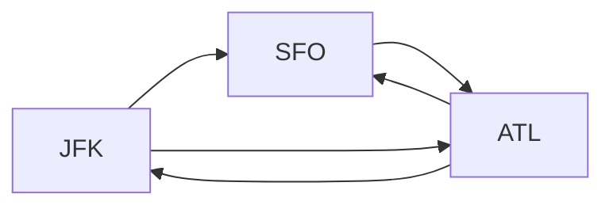
```
Input: tickets = [["JFK","SFO"],["JFK","ATL"],["SFO","ATL"],["ATL","JFK"],["ATL","SFO"]]
Output: ["JFK","ATL","JFK","SFO","ATL","SFO"]
Explanation: Another possible reconstruction is ["JFK","SFO","ATL","JFK","ATL","SFO"] but it is larger in lexical order.
```

##### Intuition
To reconstruct the itinerary, we can leverage the properties of Depth-First Search (DFS) and a priority queue (min-heap). 
- The key idea is to always visit the next airport in the smallest lexical order to ensure the correct itinerary. 
- By using a DFS approach, we can explore all possible paths, and by utilizing a min-heap, we can guarantee that we always choose the smallest lexical airport available. 
- This way, we can ensure that our final itinerary is lexicographically smallest. 
- The final step involves reversing the itinerary since airports are appended to the result after all their destinations have been visited.

Code
```python
def findItinerary(tickets):  
    # Build the graph  
    graph = defaultdict(list)  
    for departure, arrival in tickets:  
        heapq.heappush(graph[departure], arrival)  
      
    # Perform DFS  
    itinerary = []  
      
    def dfs(airport):  
        while graph[airport]:  
            next_destination = heapq.heappop(graph[airport])  
            dfs(next_destination)  
        itinerary.append(airport)  
      
    dfs("JFK")  
      
    # Reverse the itinerary to get the correct order  
    return itinerary[::-1]
```

#### Min Cost to Connect All Points
You are given an array `points` representing integer coordinates of some points on a 2D-plane, where `points[i] = [xi, yi]`.

The cost of connecting two points `[xi, yi]` and `[xj, yj]` is the **manhattan distance** between them: `|xi - xj| + |yi - yj|`, where `|val|` denotes the absolute value of `val`.

Return the minimum cost to make all points connected. All points are connected if there is **exactly one** simple path between any two points.

##### Intuition
- The problem is essentially about finding the Minimum Spanning Tree (MST) of a graph where the nodes are points in a 2D plane and the edges are the Manhattan distances between these points.
- We would be using the Prim's algorithm for finding the MST.

Code
```python
def min_cost_connect_points(points):
    n = len(points)

    # Priority queue to select the edge with minimum cost
    min_heap = [(0, 0)] # (cost, point_index)
    visited = set()
    total_cost, edges_used = 0, 0

    while edges_used < n:
        # Pop the edge with the smallest cost from the heap  
        cost, i = heapq.heappop(min_heap)  
          
        # If the point has already been visited, skip it  
        if i in visited:  
            continue  
          
        # Mark the point as visited  
        visited.add(i)  
          
        # Add the cost of this edge to the total cost  
        total_cost = total_cost + cost  
          
        # Iterate over all points to update the heap with edges from the newly visited point  
        for j in range(n):  
            if j not in visited:  
                # Calculate the Manhattan distance between points i and j  
                manhattan_distance = abs(points[i][0] - points[j][0]) + abs(points[i][1] - points[j][1])  
                  
                # Push the new edge to the heap  
                heapq.heappush(min_heap, (manhattan_distance, j))

    return total_cost
```

### Hamiltonian Path - Travelling Salesman Problem
### Graph Coloring
### Strongly connected components - Kosaraju's Algorithm
#### Definition
A maximal subgraph of a directed graph such that for every pair of vertices (u) and (v) in the subgraph, there is a directed path from (u) to (v) and a directed path from (v) to (u).

Example:
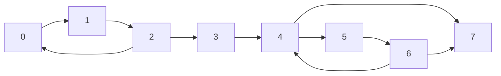

SCCs:
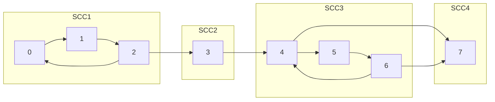
### Network Flow
#### 1. Ford-Fulkerson
#### 2. Edmonds Karp
