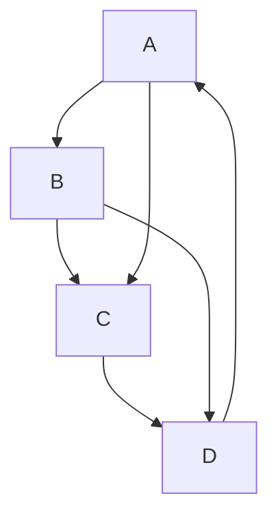
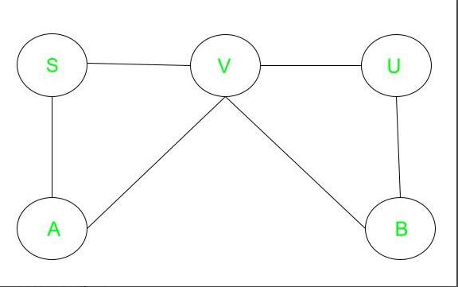
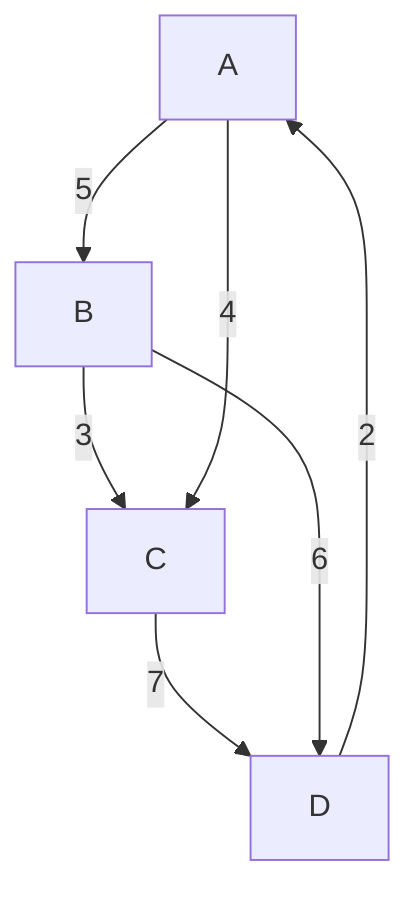
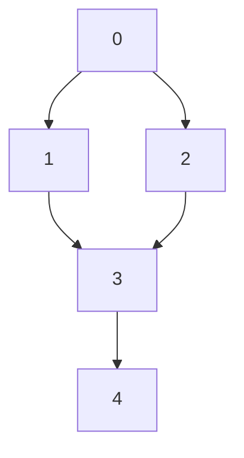
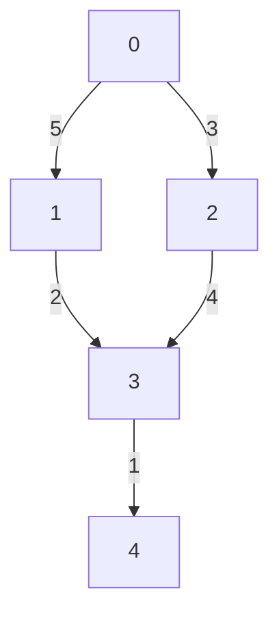
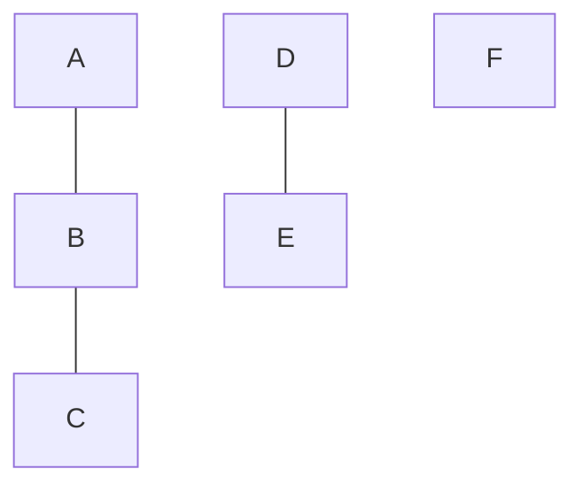

# Graph
A graph is a collection of nodes, also called vertices, and the connections between them, called edges.

## Important Terminologies
- **Vertex**: A vertex (or node) is a fundamental part of a graph. It can represent any entity, such as a location, a person, or an object. In diagrams, vertices are often represented as circles or dots.
- **Edge**: An edge (or arc) is a connection between two vertices in a graph. It can represent a relationship or a path between the entities represented by the vertices.
- **Directed Graph**: A directed graph is a type of graph where the edges have a direction. Each edge points from one vertex to another.

- **Undirected Graph**: An undirected graph is a type of graph where the edges have no direction. The connection between two vertices is bidirectional.



- **Weighted Graph**: A weighted graph is a graph in which each edge has an associated numerical value, called weight. This can represent cost, distance, or any other metric.


## Graph Representation

### Non-Weighted Graph
Let the graph be this:

#### 1. Adjacency List
The adjacency list is a dictionary where each key represents a node, and the value is a list of nodes to which the key node has directed edges.

```python
adj_list = {  
    0: [1, 2],  
    1: [3],  
    2: [3],  
    3: [4],  
    4: []  
}
```

#### 2. Adjacency Matrix
The adjacency matrix is a 2D list (list of lists) where the element at row i and column j is 1 if there is a directed edge from node i to node j, and 0 otherwise.

```python
adj_matrix = [  
    [0, 1, 1, 0, 0],  # 0  
    [0, 0, 0, 1, 0],  # 1  
    [0, 0, 0, 1, 0],  # 2  
    [0, 0, 0, 0, 1],  # 3  
    [0, 0, 0, 0, 0]   # 4  
]
```

If the graph is weighted, the adjacency list and adjacency matrix representations will include the weights of the edges. Here is how you can represent the given graph with weights.

### Weighted Graph


#### 1. Adjacency List
The adjacency list is a dictionary where each key represents a node, and the value is a list of tuples. Each tuple contains a node to which the key node has a directed edge and the weight of that edge.

```python
adj_list = {  
    0: [(1, 5), (2, 3)],  
    1: [(3, 2)],  
    2: [(3, 4)],  
    3: [(4, 1)],  
    4: []  
}
```

#### 2. Adjacency Matrix
The adjacency matrix is a 2D list (list of lists) where the element at row i and column j is the weight of the edge from node i to node j, and 0 if there is no edge.
```python
adj_matrix = [  
    [0, 5, 3, 0, 0],  # 0  
    [0, 0, 0, 2, 0],  # 1  
    [0, 0, 0, 4, 0],  # 2  
    [0, 0, 0, 0, 1],  # 3  
    [0, 0, 0, 0, 0]   # 4  
]
```

## Connected Components
A connected component in an undirected graph is a group of nodes such that:
- Every node in the group is connected to every other node in the group by some path.
- There are no connections between nodes in this group and any nodes outside of this group.



