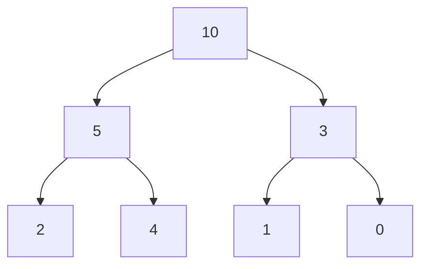
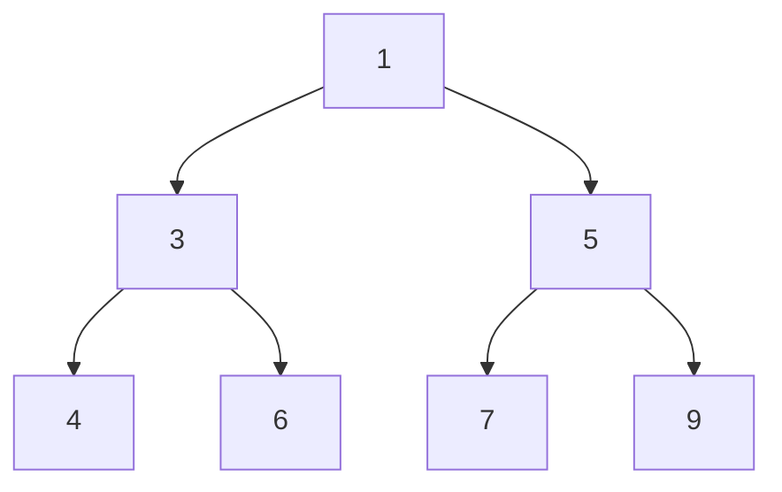

# Heap
A heap is a tree-based data structure following the heap property.
The heap-property is of 2 types:
- **Max heap**: Every parent node is greater than or equal to its children.


- **Min heap**: Every parent node is less than or equal to its children.


Heaps can be implemented using arrays. For our easier understanding, since heap already have implementations in each language. We would think of it as a stack providing the feature that the top would be min or max depending on the type of heap.

**Time complexity**
For n being the size of the heap.
Insertion: `O(log n)`
Deletion: `O(log n)`

## Identification
1) k is mentioned in the problem
2) Along with smallest/largest

The first intuition is to sort the input and return the result but this would `O(n * log n )`.
That is where heap is to be used which is `O(n * log k)`.

### Now which heap to choose
- **k+smallest**: max heap
  - here we keep only k elements in the heap
  - keep popping if the size exceeds k as we remove the larger elements
  - now the maximum of these k smallest elements would be the kth smallest 
- **k+largest**: min heap
  -  same logic as the max heap and we keep popping the smaller elements
  -  the heap only has the largest k elements and the minimum of these would be the kth largest

## Problems
### Kth Largest Element
We would be using the `heapq` module of python collections. As discussed we would be requiring a min heap in this case.
The top of the heap is in the `0th` index unlike stack.
```python
import heapq

def kth_largest(nums, k):  
    heap = []  
    for num in nums:  
        heapq.heappush(heap, num)  
        if len(heap) > k:  
            heapq.heappop(heap)
    return heap[0]
```
Another variant of these problems would be return `k largest elements` - same thing - just return the heap as the result.

### Kth Smallest Element
As discussed above this would be a max-heap, but since python doesn't support this by default we would be adding values with `-ve` to the heap.
```python
import heapq

def kth_smallest(nums, k):
    heap = []
    for num in nums:
        # now the top of the heap signify the largest, since -ve it is the smallest
        heapq.heappush(-num)
        if len(heap) > k:
            heapq.heapop(heap)
    return -heap[0]
```

### Sort a K sorted array

### K Closest Number
Given an array of numbers and a value `val` and we need to find the `k` closest numbers to the `val`.
- This problem is just a modification of the earlier solved problem `k smallest numbers`.
- Subtract all the elements in the array by `val` and create a max-heap of `k` elements with (element, difference).  

### Top K Frequent Numbers
Given an array of numbers, we need to find k most frequent elements.
- As soon as you see most - the solution would need min heap - as we want to remove the less occuring ones which are there in the root.
- We maintain a count of the elements in the array store them as a tuple - `(count , element)` - this ensures that the heap logic would be dependent on count and then the element.
- Now the code remains the same as `k largest elements`.

### Frequency Sort
Given an array of numbers, sort them by their frequency.
The implementation would be the same as the previous problem, just there would be no popping of elements when the size crosses `k`.

### K Closest Point to Origin
Given an array of coordinates and we need to return `k` coordinates which are closest to the origin.
- When we see `k closest` or `k smallest` we must think of max-heap as when popping, we would want to remove the bigger values.
- In this problem, for each co-ordinate we calculate the distance from the origin and maintain in heap as - `(distance, co-ordinate)`. 
- We keep popping the larger distance coordinates when the size of heap exceeds `k`.
- The end heap would be containing the `k co-ordinates` which are closest to the origin.

### Connect Ropes to Minimise the Cost
Given an array containing the lengths of ropes, we need to find out the minimum cost of joining the ropes. The cost of joining two ropes is equal to the sum length of first rope and second rope being joined.
The logic for solving this problem is keep joining the minimum length ropes and we would be getting the minimum cost.
In this heap would be especially helpful as a min-heap would always give the minimum element at the top.

Code
```python
def min_cost(arr):
    min_heap = heapq.heapify(arr)
    total_cost = 0
    while len(min_heap) > 1:
        rope_1, rope_2 = heapq.heappop(min_heap), heapq.heappop(min_heap)
        cost = rope_1 + rope_2
        heapq.heappush(min_heap, cost)
        total_cost = total_cost + cost
    return total_cost
```

### Sum of Elements between k1 smallest and k2 smallest in array
Given an array return the sum of elements between the `k1 th` and `k2 th` smallest numbers in the array.
- This would be a similar problem to `kth smallest` number problem, do the same for the 2 values of k1 and k2.
- Now we can traverse the input array and find the elements between these values and calculate their sum.
