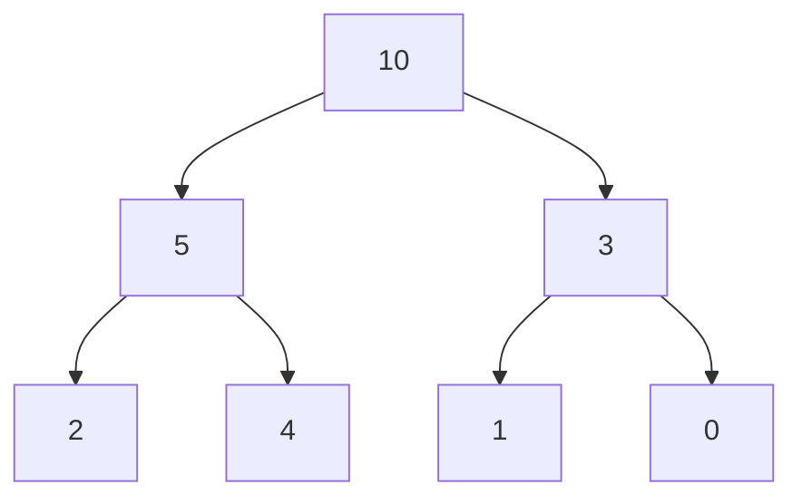
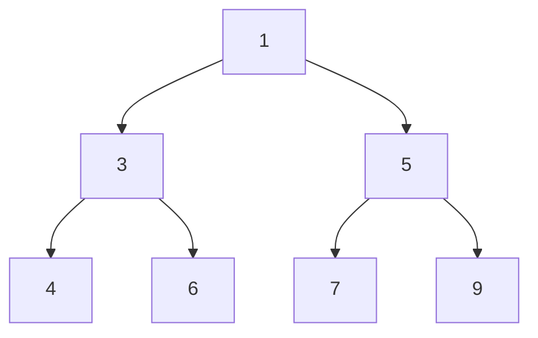

# Heap
A heap is a tree-based data structure following the heap property.
The heap-property is of 2 types:
- **Max heap**: Every parent node is greater than or equal to its children.


- **Min heap**: Every parent node is less than or equal to its children.


Heaps can be implemented using arrays. For our easier understanding, since heap already have implementations in each language. We would think of it as a stack providing the feature that the top would be min or max depending on the type of heap.

**Time complexity**
For n being the size of the heap.
Insertion: `O(log n)`
Deletion: `O(log n)`

## Identification
1) k is mentioned in the problem
2) Along with smallest/largest

The first intuition is to sort the input and return the result but this would `O(n * log n )`.
That is where heap is to be used which is `O(n * log k)`.

### Now which heap to choose
- **k+smallest**: max heap
  - here we keep only k elements in the heap
  - keep popping if the size exceeds k as we remove the larger elements
  - now the maximum of these k smallest elements would be the kth smallest 
- **k+largest**: min heap
  -  same logic as the max heap and we keep popping the smaller elements
  -  the heap only has the largest k elements and the minimum of these would be the kth largest

## Problems
### Kth Largest Element*
We would be using the `heapq` module of python collections. As discussed we would be requiring a min heap in this case.
The top of the heap is in the `0th` index unlike stack.
```python
import heapq

def kth_largest(nums, k):  
    heap = []  
    for num in nums:  
        heapq.heappush(heap, num)  
        if len(heap) > k:  
            heapq.heappop(heap)
    return heap[0]
```
Another variant of these problems would be return `k largest elements` - same thing - just return the heap as the result.

### Kth Smallest Element
As discussed above this would be a max-heap, but since python doesn't support this by default we would be adding values with `-ve` to the heap.
```python
import heapq

def kth_smallest(nums, k):
    heap = []
    for num in nums:
        # now the top of the heap signify the largest, since -ve it is the smallest
        heapq.heappush(-num)
        if len(heap) > k:
            heapq.heapop(heap)
    return -heap[0]
```

### Sort a K sorted array

### K Closest Number
Given an array of numbers and a value `val` and we need to find the `k` closest numbers to the `val`.
- This problem is just a modification of the earlier solved problem `k smallest numbers`.
- Subtract all the elements in the array by `val` and create a max-heap of `k` elements with (element, difference).  

### Top K Frequent Numbers
Given an array of numbers, we need to find k most frequent elements.
- As soon as you see most - the solution would need min heap - as we want to remove the less occuring ones which are there in the root.
- We maintain a count of the elements in the array store them as a tuple - `(count , element)` - this ensures that the heap logic would be dependent on count and then the element.
- Now the code remains the same as `k largest elements`.

### Frequency Sort
Given an array of numbers, sort them by their frequency.
The implementation would be the same as the previous problem, just there would be no popping of elements when the size crosses `k`.

### K Closest Point to Origin*
Given an array of coordinates and we need to return `k` coordinates which are closest to the origin.
- When we see `k closest` or `k smallest` we must think of max-heap as when popping, we would want to remove the bigger values.
- In this problem, for each co-ordinate we calculate the distance from the origin and maintain in heap as - `(distance, co-ordinate)`. 
- We keep popping the larger distance coordinates when the size of heap exceeds `k`.
- The end heap would be containing the `k co-ordinates` which are closest to the origin.

### Connect Ropes to Minimise the Cost
Given an array containing the lengths of ropes, we need to find out the minimum cost of joining the ropes. The cost of joining two ropes is equal to the sum length of first rope and second rope being joined.
The logic for solving this problem is keep joining the minimum length ropes and we would be getting the minimum cost.
In this heap would be especially helpful as a min-heap would always give the minimum element at the top.

Code
```python
def min_cost(arr):
    min_heap = heapq.heapify(arr)
    total_cost = 0
    while len(min_heap) > 1:
        rope_1, rope_2 = heapq.heappop(min_heap), heapq.heappop(min_heap)
        cost = rope_1 + rope_2
        heapq.heappush(min_heap, cost)
        total_cost = total_cost + cost
    return total_cost
```

### Sum of Elements between k1 smallest and k2 smallest in array
Given an array return the sum of elements between the `k1 th` and `k2 th` smallest numbers in the array.
- This would be a similar problem to `kth smallest` number problem, do the same for the 2 values of k1 and k2.
- Now we can traverse the input array and find the elements between these values and calculate their sum.

### Kth Largest Element in a Stream**
You are part of a university admissions office and need to keep track of the `kth` highest test score from applicants in real-time. This helps to determine cut-off marks for interviews and admissions dynamically as new applicants submit their scores.

You are tasked to implement a class which, for a given integer `k`, maintains a stream of test scores and continuously returns the `kth` highest test score **after** a new score has been submitted. More specifically, we are looking for the kth highest score in the sorted list of all scores.

Implement the KthLargest class:
- `KthLargest(int k, int[] nums)` Initializes the object with the integer k and the stream of test scores nums.
- `int add(int val)` Adds a new test score val to the stream and returns the element representing the kth largest element in the pool of test scores so far.
 

Example 1:
```
Input:
["KthLargest", "add", "add", "add", "add", "add"]
[[3, [4, 5, 8, 2]], [3], [5], [10], [9], [4]]

Output: [null, 4, 5, 5, 8, 8]

Explanation:
KthLargest kthLargest = new KthLargest(3, [4, 5, 8, 2]);
kthLargest.add(3); // return 4
kthLargest.add(5); // return 5
kthLargest.add(10); // return 5
kthLargest.add(9); // return 8
kthLargest.add(4); // return 8
```

#### Intuition
- We can use a `min-heap` and keep popping elements from the heap if the size exceeds the size `k`. The top of the `min heap` of size k would always give us `kth` largest element. 
- This problem has heap written all over it.

Code
```python
class KthLargest:
    def __init__(self, k, nums):
        self.heap = nums
        self.k = k
        heapq.heapify(self.heap)
        while len(self.heap) > self.k:
            heapq.heappop(self.heap)
    
    def add(self, val):
        heapq.heappush(self.heap, val)
        if len(self.heap) > self.k:
            heapq.heappop(self.heap)

        # the first element in the heap is the maximum for a max heap
        return self.heap[0]
```

### Last Stone Weight*
You are given an array of integers stones where stones[i] is the weight of the ith stone.
We are playing a game with the stones. On each turn, we choose the heaviest two stones and smash them together. Suppose the heaviest two stones have weights x and y with x <= y. The result of this smash is:
- If x == y, both stones are destroyed, and
- If x != y, the stone of weight x is destroyed, and the stone of weight y has new weight y - x.
- At the end of the game, there is at most one stone left.
Return the weight of the last remaining stone. If there are no stones left, return 0.

Example:
```
Input: stones = [2,7,4,1,8,1]
Output: 1

Explanation: 
We combine 7 and 8 to get 1 so the array converts to [2,4,1,1,1] then,
we combine 2 and 4 to get 2 so the array converts to [2,1,1,1] then,
we combine 2 and 1 to get 1 so the array converts to [1,1,1] then,
we combine 1 and 1 to get 0 so the array converts to [1] then that's the value of the last stone.
```

#### Intuition
We store the stones and the result of their smash in a `max-heap`, such that we can get the heaviest stones from the top of heap.

Code
```python
def lastStoneWeight(stones):
    # turn the values into negative for max-heap
    stones = [-stone for stone in stones]
    heapq.heapify(stones)

    while len(stones) > 1:
        y, x = heapq.heappop(stones), heapq.heappop(stones)
        heapq.heappush(stones, y - x) # we need not handle signs anymore as y is already a bigger negative number
    
    return -stones[0]
```

### Task Scheduler*
You are given an array of CPU tasks, each labeled with a letter from A to Z, and a number n. Each CPU interval can be idle or allow the completion of one task. Tasks can be completed in any order, but there's a constraint: there has to be a gap of at least n intervals between two tasks with the same label.

Return the minimum number of CPU intervals required to complete all tasks.

Example:
```
Input: tasks = ["A","A","A","B","B","B"], n = 2
Output: 8
Explanation: A possible sequence is: A -> B -> idle -> A -> B -> idle -> A -> B.

After completing task A, you must wait two intervals before doing A again. The same applies to task B. In the 3rd interval, neither A nor B can be done, so you idle. By the 4th interval, you can do A again as 2 intervals have passed.
```

#### Intuition
- The task with the maximum frequency would be defining the structure of the schedule, we schedule them first. Then we identify the next time the task can execute considering the cooling period. 
- So we need to maintain two values:
  - **Max Heap**: For getting the most frequent task that can be executed at current time.
  - **Queue**: For the next set of tasks with their frequencies along with the time when they are going to be available.
- Continue till both the heap and the queue is empty by simulating the CPU intervals.

```python
def leastInterval(tasks, n):
    # Count the frequency of each task
    task_counts = defaultdict(int)
    for task in tasks:
        task_counts[task] = task_counts[task] + 1
    
    # Max heap on the basis of the frequency of tasks
    max_heap = [-count for count in task_counts.values()]
    heapq.heapify(max_heap)
    # Queue for maintaining the future tasks 
    queue = deque()

    time = 0
    while max_heap or queue:
        time = time + 1

        # Check if there is are tasks possible to executed in this time slot
        if max_heap:
            task_frequency = -heapq.heappop(max_heap)

            # update it as the task is executed
            task_frequency = task_frequency - 1
            if task_frequency != 0:
                queue.append((task_frequency, time + n))
        
        # Add to the heap if any of the tasks are available for execution
        if queue and queue[0][1] == time:
            heapq.heappush(max_heap, -queue.popleft()[0])
        
    return time
```

### Design Twitter*
Design a simplified version of Twitter where users can post tweets, follow/unfollow another user, and is able to see the 10 most recent tweets in the user's news feed.

Implement the Twitter class:
- Twitter() Initializes your twitter object.
- void postTweet(int userId, int tweetId) Composes a new tweet with ID tweetId by the user userId. Each call to this function will be made with a unique tweetId.
- List<Integer> getNewsFeed(int userId) Retrieves the 10 most recent tweet IDs in the user's news feed. Each item in the news feed must be posted by users who the user followed or by the user themself. Tweets must be **ordered from most recent to least recent**.
- void follow(int followerId, int followeeId) The user with ID followerId started following the user with ID followeeId.
- void unfollow(int followerId, int followeeId) The user with ID followerId started unfollowing the user with ID followeeId.
 

Example 1:
```
Input
["Twitter", "postTweet", "getNewsFeed", "follow", "postTweet", "getNewsFeed", "unfollow", "getNewsFeed"]
[[], [1, 5], [1], [1, 2], [2, 6], [1], [1, 2], [1]]

Output
[null, null, [5], null, null, [6, 5], null, [5]]

Explanation
Twitter twitter = new Twitter();
twitter.postTweet(1, 5); // User 1 posts a new tweet (id = 5).
twitter.getNewsFeed(1);  // User 1's news feed should return a list with 1 tweet id -> [5]. return [5]
twitter.follow(1, 2);    // User 1 follows user 2.
twitter.postTweet(2, 6); // User 2 posts a new tweet (id = 6).
twitter.getNewsFeed(1);  // User 1's news feed should return a list with 2 tweet ids -> [6, 5]. Tweet id 6 should precede tweet id 5 because it is posted after tweet id 5.
twitter.unfollow(1, 2);  // User 1 unfollows user 2.
twitter.getNewsFeed(1);  // User 1's news feed should return a list with 1 tweet id -> [5], since user 1 is no longer following user 2.
```

#### Operations:
- Post: Maintain a map `user_tweets` that keeps track of the tweets by the user. Ensure that the timestamp/order is also stored along with the tweet.
- Follow/Unfollow: Map for users to the users they follow.
- News Feed: Using the max heap find the most recent tweets(followees and themselves) and send as a result the top 10.

Code
```python
class Twitter:  
    def __init__(self):  
        """  
        Initialize your data structure here.  
        """  
        self.user_tweets = defaultdict(list)  
        self.followers = defaultdict(set)
        self.timestamp = 0
    
    def postTweet(self, userId, tweetId):
        """
        Compose a new tweet.
        """
        self.user_tweets[userId].append((self.timestamp, tweetId))
        self.timestamp = self.timestamp + 1
    
    def getNewsFeed(self, userId):
        """
        Retrieve the 10 most recent tweet ids in the user's news feed.  
        Each item in the news feed must be posted by users who the user followed or by the user themselves.  
        Tweets must be ordered from most recent to least recent.  
        """
        max_heap = []
        news_feed = []

        # Add user's own tweets
        for timestamp, tweetId in self.user_tweets[userId]:
            heapq.heappush(max_heap, (-timestamp, tweetId))
        
        # Add followees' tweets to the heap
        for followee in self.followers[userId]:
            for timestamp, tweetId in self.user_tweets[followee]:
                heapq.heappush(max_heap, (-timestamp, tweetId))
        
        for _ in range(10):
            if max_heap:
                news_feed.append(heapq.heappop(max_heap)[1])
        
        return news_feed
    
    def follow(self, followerId, followeeId):  
        """  
        Follower follows a followee.  
        """  
        if followerId != followeeId:  
            self.followers[followerId].add(followeeId)  
  
    def unfollow(self, followerId, followeeId):  
        """  
        Follower unfollows a followee.  
        """  
        if followeeId in self.followers[followerId]:  
            self.followers[followerId].remove(followeeId)
```

### Find Median from Data Stream*
The median is the middle value in an ordered integer list. If the size of the list is even, there is no middle value, and the median is the mean of the two middle values.

For example, for `arr = [2,3,4]`, the median is 3.
For example, for `arr = [2,3]`, the median is (2 + 3) / 2 = 2.5.

Implement the MedianFinder class:
- `MedianFinder()` initializes the MedianFinder object.
- `void addNum(int num)` adds the integer num from the data stream to the data structure.
- `double findMedian()` returns the median of all elements so far. Answers within `10^-5` of the actual answer will be accepted.

Example:
```
Input
["MedianFinder", "addNum", "addNum", "findMedian", "addNum", "findMedian"]
[[], [1], [2], [], [3], []]
Output
[null, null, null, 1.5, null, 2.0]

Explanation
MedianFinder medianFinder = new MedianFinder();
medianFinder.addNum(1);    // arr = [1]
medianFinder.addNum(2);    // arr = [1, 2]
medianFinder.findMedian(); // return 1.5 (i.e., (1 + 2) / 2)
medianFinder.addNum(3);    // arr[1, 2, 3]
medianFinder.findMedian(); // return 2.0
```

#### Intuition
To efficiently find the median in data stream, we need to maintain a dynamic data-structure that can handle frequent insertions and still allow quick access to the median value. The median splits the data into two halves, so we can use two heaps (a max-heap and a min-heap) to maintain this properly.

1. **Max-Heap**: To store the smaller half of the data.
2. **Min-Heap**: To store the larger half of the data.

By ensuring that the max-heap always contains the smaller half of the numbers and the min-heap contains the larger half, the median can be found easily.

- If the total number of elements is odd, the median is the root of the max-heap.
- If the total number of elements is even, the median is the average of both the heaps.

Code
```python
class MedianFinder:
    def __init__(self):
        self.max_heap = []  # max-heap to store the smaller half of the data 
        self.min_heap = []  # min-heap to store the larger half of the data

    def addNum(self, num: int) -> None:
        # add to the max heap (store -ve)
        heapq.heappush(self.max_heap, -num)

        # balance the heaps
        if self.min_heap and self.max_heap and (-self.max_heap[0] > self.min_heap[0]):
            val = -heapq.heappop(self.max_heap)
            heapq.heappush(self.min_heap, val)
        
        # ensure that max-heaph as equal or 1 greater element
        if len(self.min_heap) > len(self.max_heap):
            val = heapq.heappop(self.min_heap)
            heapq.heappush(self.max_heap, -val)
        elif len(self.max_heap) > len(self.min_heap) + 1:
            val = -heapq.heappop(self.max_heap)
            heapq.heappush(self.min_heap, val) 

    def findMedian(self) -> float:
        total_len = len(self.min_heap) + len(self.max_heap)
        if total_len % 2:
            return -self.max_heap[0]
        else:
            return (-self.max_heap[0] + self.min_heap[0]) / 2
```
