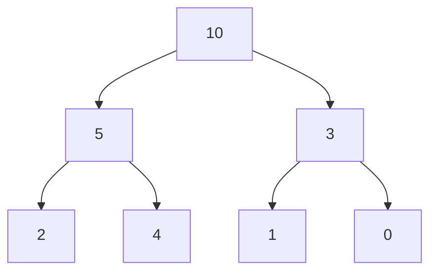
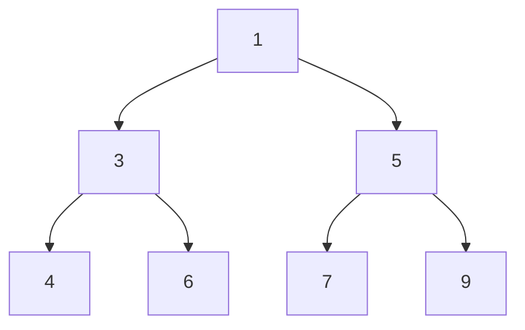

# Heap
A heap is a tree-based data structure following the heap property.
The heap-property is of 2 types:
- **Max heap**: Every parent node is greater than or equal to its children.


- **Min heap**: Every parent node is less than or equal to its children.


Heaps can be implemented using arrays. For our easier understanding, since heap already have implementations in each language. We would think of it as a stack providing the feature that the top would be min or max depending on the type of heap.

**Time complexity**
For n being the size of the heap.
Insertion: `O(log n)`
Deletion: `O(log n)`

## Identification
1) k is mentioned in the problem
2) Along with smallest/largest

The first intuition is to sort the input and return the result but this would `O(n * log n )`.
That is where heap is to be used which is `O(n * log k)`.

### Now which heap to choose
- **k+smallest**: max heap
  - here we keep only k elements in the heap
  - keep popping if the size exceeds k as we remove the larger elements
  - now the maximum of these k smallest elements would be the kth smallest 
- **k+largest**: min heap
  -  same logic as the max heap and we keep popping the smaller elements
  -  the heap only has the largest k elements and the minimum of these would be the kth largest

## Problems
### Kth Largest Element
We would be using the `heapq` module of python collections. As discussed we would be requiring a min heap in this case.
The top of the heap is in the `0th` index unlike stack.
```
import heapq

def kth_largest(nums):
    heap = []
    for num in nums:
        # check and remove the smaller elements, if the current is already small than the top - ignore
        if num > heap[0]:
            heapq.heappop(heap)
            heapq.heappush(heap, num)
    return heap[0]
```
### Kth Smallest Element
As discussed above this would be a max-heap, but since python doesn't support this by default we would be adding values with `-ve` to the heap.
```
import heapq

def kth_smallest(nums):
    heap = []
    for num in nums:
        # now the top of the heap signify the largest, since -ve it is the smallest
        if num < -heap[0]:
            heapq.heapop(heap)
            heapq.heappush(heap, -num)
    return -heap[0]
```
Another variant of these problems would be return `k largest elements` - same thing - just return the heap as the result.

### Sort a K sorted array

### Top K Frequent Numbers

### Frequency Sort

### K Closest Point to Origin

### Connect Ropes to Minimise the Cost

### Sum of Elements between k1 smallest and k2 smallest in array
