# Intervals
An interval is a range of values typically defined by a start and an end point. Intervals are used to represent a continuous sequence of numbers or events. They are commonly represented as pairs ([start, end]) where:
- start is the beginning of the interval.
- end is the end of the interval.

Intervals are particulary useful in scheduling, intervals represent time slots for events such as meetings or tasks. Common problems include finding available time slots, merging overlapping meetings, and detecting conflicts.

## Example
You have a list of meetings with start and end times. You need to merge overlapping meetings to find the total time occupied by meetings.

Intervals:
```
([09:00, 10:00])
([09:30, 11:30])
([12:00, 13:00])
([14:00, 16:00])
```

Visualization:

```mermaid
gantt  
    dateFormat  HH:mm  
    title       Meeting Schedule  
    section Meetings  
    Meeting 1   :a1, 09:00, 1h  
    Meeting 2   :a2, 09:30, 2h  
    Meeting 3   :a3, 12:00, 1h  
    Meeting 4   :a4, 14:00, 2h  
```


Merged Intervals:
```
([09:00, 11:30])
([12:00, 13:00])
([14:00, 16:00])
```

Here are the problems that are linked to `intervals`.

## Problems

### Merge Intervals
Given a collection of intervals, merge all overlapping intervals.

### Example
Input: `[[1,3], [2,6], [8,10], [15,18]]`
Output: `[[1,6], [8,10], [15,18]]`

### Intuition
The key idea is to:
- **Sort the Intervals**: Sort intervals by their start times to make it easier to find overlapping intervals.
- **Iterate and Merge**: Traverse the sorted list and merge intervals that overlap i.e. the current interval has a start time greater than the end time of last interval.

Code
```python
def merge_intervals(intervals):
    if not intervals:
        return []
    
    intervals.sort(key=lambda interval: interval[0])

    merged = [intervals[0]]

    for current in intervals[1:]:
        last = merged[-1]

        if current[0] > last[1]:
            last[1] = max(last[1], current[1])
        else:
            merged.append(current)
    
    return merged
```

### Non Overlapping Intervals
Given a collection of intervals, find the minimum number of intervals you need to remove to make the rest of the intervals non-overlapping.

#### Intuition
- Sort intervals by end time: Sorting by `end-time` would help in maximizing the number of non-overlap intervals. The greedy strategy is to always pick the `interval that finishes first`, thereby leaving the `most room for future intervals`.
- Iterate and count removals: Traverse the sorted intervals, count the number of intervals that overlap with the previous interval i.e. have an end time greater than the start of the previous one.


##### Why sort by end time?
Consider the intervals: `[[1, 10], [2, 3], [4, 5], [6, 7], [8, 9]]`.

###### Sorting by End Time
If we sort by end time, we get: `[[2, 3], [4, 5], [6, 7], [8, 9], [1, 10]]`.
Start with the first interval [2, 3].
1. The next interval [4, 5] does not overlap with [2, 3], so we keep it.
2. The next interval [6, 7] does not overlap with [4, 5], so we keep it.
3. The next interval [8, 9] does not overlap with [6, 7], so we keep it.
4. The last interval [1, 10] overlaps with all the previous intervals, so we remove it.

###### Result
By sorting by end time, we removed 1 interval: [1, 10].

###### Sorting by Start Time
If we sort by start time, we get: `[[1, 10], [2, 3], [4, 5], [6, 7], [8, 9]]`.
1. Start with the first interval [1, 10].
2. The next interval [2, 3] overlaps with [1, 10], so we remove [2, 3].
3. The next interval [4, 5] overlaps with [1, 10], so we remove [4, 5].
4. The next interval [6, 7] overlaps with [1, 10], so we remove [6, 7].
5. The next interval [8, 9] overlaps with [1, 10], so we remove [8, 9].

###### Result
By sorting by start time, we removed 4 intervals: [2, 3], [4, 5], [6, 7], and [8, 9].

In this example, sorting by end time results in fewer interval removals compared to sorting by start time. This demonstrates why sorting by end time is more effective.

Code
```python
def non_overlapping_intervals(intervals):
    # Sort the intervals by their end times
    intervals.sort(key=lambda interval: interval[1])

    removals = 0
    prev_end = intervals[0][1]

    for curr in intervals[1:]:
        if curr[0] < prev_end:
            # Overlapping interval found, increment removal count
            removals = removals + 1
        else:
            # No overlap, update the end of the last non-overlapping interval
            prev_end = curr[1]
    
    return removals
```

### Meeting Rooms
Given an array of meeting time intervals, determine if a person could attend all meetings.

#### Intuition
- **Sort Intervals by Start Time**: Sorting by the start time helps in easily checking for overlaps.
- **Check for Overlaps**: Iterate through the sorted intervals and check if any interval overlaps with the previous one i.e. end time of previous is greater than start time of current. If so return `False`.

Similar to the merge intervals problem.

### Meeting Rooms II
Given an array of meeting time intervals, find the minimum number of conference rooms required.

#### Intuition
The key idea is to determine the maximum number of overlapping intervals at any point in time. This represents the minimum number of meeting rooms required since each overlap represents a need for an additional room.

- **Separate Start and End Times**: By separating the start and end times of the meetings, we can independently track the arrival and departure of meetings. This helps us to efficiently determine the number of concurrent meetings at any given time.
- **Sort the Times**: Sorting the start and end times helps us to process the events (starting and ending of meetings) in chronological order. This way, we can keep track of the number of ongoing meetings by simply moving through the timeline.
- **User Two Pointers**: Using two pointers, one for the start times and one for the end times, allows us to efficiently determine the number of ongoing meetings:
  - **Start Pointer**: Advances when a new meeting starts.
  - **End Pointer**: Advances when a meeting ends.
- The number of rooms needed would be calculated using the following logic:
  - If the next meeting starts before the earliest ending meeting finishes (i.e., `start_times[start_pointer] < end_times[end_pointer]`), it means we need an **additional room**. Increment `rooms_needed` and move the `start_pointer`.
  - If the next meeting starts after or exactly when the earliest ending meeting finishes (i.e., `start_times[start_pointer] >= end_times[end_pointer]`), it means a room has become **free**. Decrement `rooms_needed` and move the `end_pointer`.

Code
```
def meeting_rooms(intervals):
    n = len(intervals)

    starting_times = sorted([interval[0] for interval in intervals])
    ending_times = sorted([interval[1] for interval in intervals])

    start = 0, end = 0
    rooms_needed = 0
    max_rooms = 0

    while start < n:
        if starting_times[start] < ending_times[end]:
            rooms_needed = rooms_needed + 1
            start = start + 1
        else:
            rooms_needed = rooms_needed - 1
            end = end + 1
        max_rooms = max(max_rooms, rooms_needed)
    
    return max_rooms
```

### Minimum Interval to Include Each Query
Given a list of intervals and a list of queries, for each query, find the minimum interval that includes the query.

#### Intuition
- **Sort Intervals by Start Time**: Sorting by the start time helps in efficiently finding the minimum interval for each query.
- **Use a Priority Queue**: Use a priority queue (min-heap) to keep track of the smallest intervals that can cover each query. For each query, add intervals to the heap that can cover the query, and remove intervals from the heap that cannot cover the query.

##### Why to sort the queries?
Incremental Processing:
- When we sort the queries, we can process them in increasing order. This allows us to add intervals that start before or at the current query to the heap in a single pass.
- We only need to add each interval once, and as we move to the next query, we don't need to reprocess intervals that have already been considered.

Code
```python
def min_interval_to_include_each_query(intervals, queries):
    m, n = len(intervals), len(queries)
    intervals.sort(key=lambda interval: interval[0])
    sorted_queries = sorted((query, index) for index, query in enumerate(queries))

    result = [-1] * n
    min_heap = []
    interval_index = 0

    for query, original_index in enumerate(queries):
        # Add intervals that have a start less than query - they can cover the query
        while interval_index < m and intervals[interval_index][0] <= query:
            start, end = intervals[interval_index]
            heapq.heappush(min_heap, (end - start + 1, end))
            interval_index = interval_index + 1 

        # Now we check for the minimum intervals which contains the query, by checking if the end is greater than the query
        while min_heap and min_heap[0][1] < query:
            heapq.heappop(min_heap)

        # Get the smallest interval that can cover the query
        if min_heap:
            result[original_index] = min_heap[0][0]
    
    return result
```
