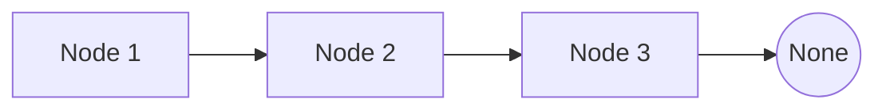
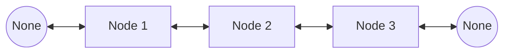
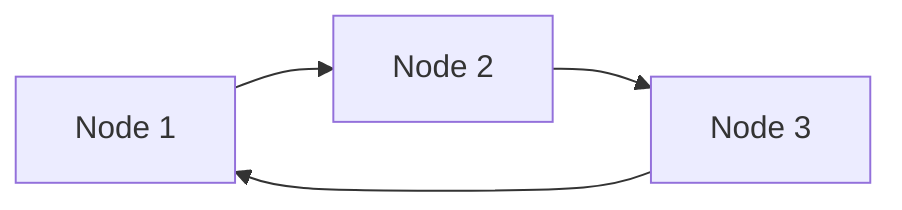
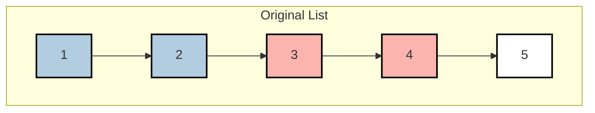
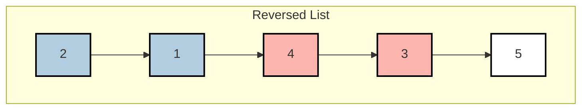
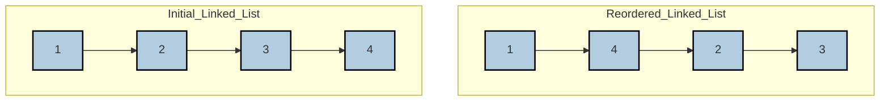

# Linked List
## Introduction
A linked list is a linear data structure where each element, called a node, contains a data part and a reference (or link) to the next node in the sequence.

## Types of Linked List
### Singly Linked List
In a singly linked list, each node points to the next node in the sequence and the last node points to `None`.


### Doubly Linked List
In a doubly linked list, each node contains two links: one pointing to the next node and one pointing to the previous node.


### Circular Linked List
In a circular linked list, the last node points back to the first node, forming a circular structure.


## Representation
A linked list node is represented in the following manner:
```python
class Node:
    def __init__(self, val):
        self.val = val
        self.next = None
```

## Operations on Linked List
### Insertion
Insertion involves adding a new node to the linked list. This can be done at the beginning, end, or at any given position.
```python
class LinkedList:
    def __init__(self):
        self.head = None
    
    def insert_at_end(self, val):
        node = Node(val)
        temp = self.head

        if temp is None:
            self.head = node
        else:
            while temp.next is not None:
                temp = temp.next
            temp.next = node
    
    def insert_at_start(self, val):
        node = Node(val)
        node.next = self.head
        self.head = node
```

### Traversal
Traversal involves visiting each node in the linked list in a sequential manner.
```python
class LinkedList:
    def __init__(self):
        self.head = None
    
    def traverse(self):
        temp = self.head

        while temp:
            print(temp.val, end="->")
            temp = temp.next
        print("None")
```

### Deletion
Deletion involves removing a node from the linked list. Like insertion, this can be done at the beginning, end, or any given position.
```python
class LinkedList:
    def __init__(self):
        self.head = None
    
    def delete(self, key):
        temp = self.head
        if temp and temp.val == key:
            self.head = temp.next
            temp = None
            return
        prev = None
        while temp and temp.val != key:
            prev = temp
            temp = temp.next
        if temp is None:
            return
        prev.next = temp.next
        temp = None
```

## Problems
### Reverse a Linked List*
Given the head of a singly linked list, reverse the list and return the new head.

#### Intuition
- To reverse a singly linked list, we need to reverse the direction of the pointers between the nodes. Instead of each node pointing to the next node, it should point to the previous node. 
- This requires us to traverse the list while keeping track of the previous node, the current node, and the next node.
- For each node, save the next node as `next_node`. Reverse the next pointer of the current node to point to the previous node.
- Move the `prev` and `current` pointers one step forward (i.e., `prev` becomes the `current` node, and `current` becomes the next node).

Code
```python
def reverse_list(head):
    prev = None
    current = head

    while current:
        next = current.next
        current.next = prev
        prev = current
        current = next
    
    return prev # Prev will be the new head of the reversed list 
```

### Detect a Cycle in a Linked List*
Given a linked list, determine if it has a cycle in it.

#### Intuition
- To detect a cycle in a linked list, you can use the `Floyd's Cycle-Finding Algorithm`, also known as `Tortoise and Hare` algorithm. 
- The idea is to use two pointers, one movice twice as fast as the other.
- If there is a cycle, they will eventually meet.
- Otherwise, the fast pointer will reach the end of the list.

```python
def detect_cycle(head):
    slow, fast = head, head

    while fast and fast.next:
        slow = slow.next
        fast = fast.next.next

        if slow == fast:
            return True
    
    return False
```
#### Extension: Find the Node where Cycle Began
To extend the solution to not only detect a cycle but also find the node where the cycle begins, you can modify the Floyd's Cycle-Finding Algorithm as follows:
- Use two pointers (slow and fast) to detect if a cycle exists.
- Once a cycle is detected (i.e., slow equals fast), initialize another pointer (finder) at the head of the list.
- Move both the finder and slow pointers one step at a time. The point at which they meet is the start of the cycle.

```python
def detect_cycle(head):  
    slow, fast = head, head  
    
    # Step 1: Detect if there is a cycle  
    while fast and fast.next:  
        slow = slow.next  
        fast = fast.next.next  
        if slow == fast:  
            break  
    else:  
        return None  # No cycle detected  

    # Step 2: Find the start of the cycle  
    finder = head  
    while finder != slow:  
        finder = finder.next  
        slow = slow.next  
      
    return finder  # The node where the cycle begins
```
##### Explanation:
###### Cycle Detection:
When slow and fast pointers meet, both are inside the cycle. Let's denote:
- L as the distance from the head of the linked list to the start of the cycle.
- C as the length of the cycle.
- x as the distance from the start of the cycle to the point where slow and fast meet.
##### Distance Analysis:
- When the slow pointer and fast pointer meet, the slow pointer has traveled L + x steps. 
- The fast pointer has traveled 2(L + x) steps because it moves twice as fast as the slow pointer. 
- Both pointers are within the cycle when they meet, so the distance traveled by fast minus the distance traveled by slow must be a multiple of the cycle length C.

Therefore, we have: `2(L + x) = L + x + nC`  (where n is the number of cycles fast has completed).
Simplifying this equation, we get: `L + x = nC`

##### Finding the Start of the Cycle:
From the equation `L + x = nC`, we can deduce that if we move another pointer finder from the head of the list and slow from their meeting point, both will meet at the start of the cycle after L steps.
This is because finder needs to travel `L` steps to reach the start of the cycle, while slow needs to travel `C - x` steps to complete the cycle and reach the start again. Since `C - x` is equivalent to the remaining distance `L` in the cycle, **they will meet at the start of the cycle**.

Similar Problem: **Find the Duplicate Number***

### Merge 2 Sorted Linked List*
Merge two sorted linked lists and return it as a new sorted list.

#### Intuition
- The idea is to merge the 2 sorted linked into one sorted linked list.
- we can achieve this through going through each list one by one and comparing the nodes one by one, attaching the smaller node to the new list we're forming.
- We use a dummy node to simplyfy the process of attaching the nodes to the new list.

Code
```python
def merge_listS(head1, head2):
    dummy = Node(0)
    temp = dummy

    while head1 and head2:
        if head1.val <= head2.val:
            temp.next = head1
            head1 = head1.next
        else:
            temp.next = head2
            head2 = head2.next
        temp = temp.next
    
    if head1:
        temp.next = head1
    if head2:
        temp.next = head2
    
    return dummy.next
```

#### Similar Problem - Merge K Sorted Linked Lists*
You are given an array of k linked-lists lists, each linked-list is sorted in ascending order.
Merge all the linked-lists into one sorted linked-list and return it.

Example:
```
Input: lists = [[1,4,5],[1,3,4],[2,6]]
Output: [1,1,2,3,4,4,5,6]
Explanation: The linked-lists are:
[
  1->4->5,
  1->3->4,
  2->6
]
merging them into one sorted list:
1->1->2->3->4->4->5->6
```

##### Intuition
- This is almost the same problem as the last one just that here we have `k` sorted lists.
- So we take 2 lists at a time join them and store the merged list in the result till the result contains only 1 list.
- We could have also merged lists one by one but that would have been computationally intensive more as the list size would keep on growing.

Code
```python
def mergeKLists(lists):
    # Keep merging the lists until only 1 remains
    while len(lists) > 1:
        result = []
        n = len(lists)
        # Take 2 lists at a time
        for i in range(0, n, 2):
            # If only one list is remaining at the end of the loop
            if i+1 > n-1:
                result.append(lists[i])
                break
            
            # Merge the current two list and store in the result
            result.append(mergeTwoLists(lists[i], lists[i+1]))
        # Update the lists with the new merged lists
        lists = result[:]
    return lists[0]
```

### Palindrome Linked List
Given a singly linked list, determine if it is a palindrome.

#### Intuition
- To detemine if a linked list is a palindrome, we need to if the list reads forward same as backwards. But for reading backwards we don't have any links unless it is a `doubly linked-list`.
- The strategy would be to find out the middle of the list, reversing the second half and then comparing both halves traversing from each end.
- Here we would also tackle how to find the `middle of the linked list` in an efficient manner.
- How do we handle odd length lists? - We only compare for the elements in the second half and thus the middle extra element is automatically skipped.

Code
```python
def is_palindrome(head):
    def find_middle(head):
        slow, fast = head, head
        while fast and fast.next:
            slow = slow.next
            fast = fast.next.next
        return slow

    def reverse_list(head):
        prev = None
        current = head

        while current:
            next_node = current.next
            current.next = prev
            prev = current
            current = next_node
        
        return prev

    middle = find_middle(head)
    tail = reverse_list(middle.next)

    while tail:
        if head.val != tail.val:
            return False
        head = head.next
        tail = tail.next
    
    # if the list is to be restored, keep the pointers in temp variables
    # call the reverse again on tail and set the next of middle to the result
    return True
```

### Copy List with Random Pointer*
A linked list is given such that each node contains an additional random pointer which could point to any node in the list or null. Return a deep copy of the list.

#### Intuition
- To create a deep copy of a linked list with random pointers, we need to ensure that both the `next` and the `random` pointers in the new list correctly replicate those in the original list.
- We can use a hashmap to store the copy of the node and in the second pass we set the pointers using the hashmap tp find the corresponding copied nodes.

Code
```python
def copy_random_list(head):
    if not head:
        return None
    
    old_to_new = {}

    # First pass: Create all nodes and store them in the hash map 
    current = head
    while current:
        old_to_new[current] = Node(current.val)
        current = current.next
    
    # Second pass: Set next and random pointers
    current = head
    while current:
        if current.next:
            old_to_new[current].next = old_to_new[current.next]
        if current.random:
            old_to_new[current].random = old_to_new[current.random]
        current = current.next
    
    return old_to_new[head]
```

### Remove Nth Node from the End of List*
Given the head of a linked list, remove the n-th node from the end of the list and return its head.

#### Intuition
To remove the n-th node from the end of a linked list, a straightforward approach would be to first traverse the the list to find its length, then calcluate the position of the node from the beginning. However, this approach requires **two passes** through the list.

We can use a modification of the `fast and slow pointer` technique that we have already used in order to accomplish this in a single pass. Working:

- We maintian two pointers, fast and slow and we move just the fast pointer `n+1` steps ahead creating a gap of `n` nodes between fast and slow pointers.
- Now on moving both the pointers till fast reaches the end of the list, the slow pointer points to the node that needs to be removed.

Code
```python
def remove_nth_from_end(head):
    dummy = Node(0, head)
    fast = dummy
    slow = dummy

    # Move the fast pointer n + 1 steps ahead - n nodes in between
    for _ in range(n+1):
        fast = fast.next
    
    # Move both pointers until fast reaches the end
    while fast:
        fast = fast.next
        slow = slow.next
    
    # Skip the node to be renewed
    slow.next = slow.next.next

    # Return the head of the modified list
    return dummy.next
```

### LRU Cache*
The Least Recently Used (LRU) cache is a popular caching strategy that evicts the least recently accessed item when the cache reaches its capacity. The LRU cache should support the following operations:
- get(key): Retrieve the value of the key if the key exists in the cache, otherwise return -1.
- put(key, value): Update the value of the key if the key exists. Otherwise, add the key-value pair to the cache. 

If the number of keys exceeds the capacity from this operation, evict the least recently used key.

#### Intuition
- Hash Map: The hash map allows for O(1) access to the cache items by key.
- Doubly Linked List: The doubly linked list maintains the order of access, with the most recently accessed item at the head and the least recently accessed item at the tail. This allows for O(1) addition and removal of nodes.

##### Operations
- get(key):
  - If the key exists in the hash map, we move the corresponding node to the head of the doubly linked list (indicating it was recently accessed) and return its value.
  - If the key does not exist, we return -1.
- put(key, value):
  - If the key exists, we update the value and move the corresponding node to the head of the doubly linked list.
  - If the key does not exist, we add a new node to the head of the doubly linked list. If the cache exceeds its capacity, we remove the node at the tail of the doubly linked list (the least recently used item) and update the hash map accordingly.

Code
```python
class Node:  
    def __init__(self, key, value):  
        self.key = key  
        self.value = value  
        self.prev = None  
        self.next = None  
  
class LRUCache:  
    def __init__(self, capacity: int):  
        self.capacity = capacity  
        self.cache = {}  # Hash map to store key-node pairs  
        self.head = Node(0, 0)  # Dummy head node  
        self.tail = Node(0, 0)  # Dummy tail node  
        self.head.next = self.tail  
        self.tail.prev = self.head  
  
    def _remove(self, node):  
        """Remove node from the doubly linked list."""  
        prev = node.prev  
        next = node.next  
        prev.next = next  
        next.prev = prev  
  
    def _add(self, node):  
        """Add node right after the head."""  
        node.prev = self.head  
        node.next = self.head.next
        # assign prev to the current first node  
        self.head.next.prev = node  
        self.head.next = node  
  
    def get(self, key: int) -> int:  
        if key in self.cache:  
            node = self.cache[key]  
            self._remove(node)  
            self._add(node)  
            return node.value  
        return -1  
  
    def put(self, key: int, value: int) -> None:  
        if key in self.cache:  
            self._remove(self.cache[key])  
        node = Node(key, value)  
        self._add(node)  
        self.cache[key] = node
        # If the cache is exceeding the capacity we would have to reduce the size  
        if len(self.cache) > self.capacity:  
            # Remove from the tail  
            lru = self.tail.prev  
            self._remove(lru)  
            del self.cache[lru.key]
```

### Reverse Node in k-Group*
Given the head of a linked list, reverse the nodes of the list `k` at a time, and return the modified list.

`k` is a positive integer and is less than or equal to the length of the linked list. If the number of nodes is not a multiple of `k` then left-out nodes, in the end, should remain as it is.

You may not alter the values in the list's nodes, only nodes themselves may be changed.

Example 1: k = 2
Intitial Linked List

Reversed in k-groups


#### Intuition
The problem of reversing nodes in k-group can be broken down into several steps:
- Traverse the List: First, traverse the list to check if there are at least k nodes to reverse.
- Reverse k Nodes: If there are k nodes, reverse these k nodes.
- Update Pointers: After reversing, update the next pointers to link the reversed part to the rest of the list.
- Repeat: Continue this process until there are fewer than k nodes left in the list.

#### Hint
Use a dummy node to handle edge cases easily, such as when the head of the list changes after reversing the first group.

```python
def reverse_k_group(head, k):
    def reverse_linked_list(head, k):
        prev, curr = None, head
        while k:
            next_node = curr.next
            curr.next = prev
            prev = curr
            curr = next_node
            k = k - 1
        return prev # Prev will be the new head of the reversed list

    dummy = ListNode(0, head)
    curr, prev_tail = head, dummy

    while True:
        count = 0
        # prev_tail points to tail of the previous group
        curr = prev_tail.next

        # Check if there are at least k nodes left to reverse  
        while curr and count < k:  
            curr = curr.next  
            count = count + 1
        # After this curr will either point to the next group or end of list
        # There are k nodes to reverse
        if count == k:
            # The current group's tail after reversal
            tail = prev_tail.next

            # Reverse k nodes and connect the previous group to the newly reversed group
            prev_tail.next = reverse_linked_list(prev_tail.next, k)

            # Connect the tail of the reversed group to the next part of the list
            tail.next = curr

            # Move prev_tail to the end of the reversed group
            prev_tail = tail
        else:
            break
    
    return dummy.next
```

### Reorder List*
You are given the head of a singly linked-list. The list can be represented as:
`L0 -> L1 -> ... -> Ln-1 -> Ln`
Reorder the list to be of the following form:
`L0 -> Ln -> L1 -> Ln-1 -> L2 -> Ln-2 -> ...`
You may not modify the values in the list's nodes. Only nodes themselves may be changed.

Example:
Input: head = [1, 2, 3, 4]
Output: [1, 4, 2, 3]



#### Intuition
To reorder the linked list as described, we can break down the problem into several steps:
- **Find the Middle**: Use the slow and fast pointer technique to find the middle of the linked list.
- **Reverse the Second Half**: Reverse the second half of the linked list.
- **Merge the Two Halves**: Merge the first half and the reversed second half alternately.

```python
def reorder_list(head):
    if not head or not head.next:  
        return 
    # Find the middle of the linked list
    slow, fast = head, head
    while fast and fast.next:
        slow = slow.next
        fast = fast.next.next

    # Reverse the second half
    prev, curr = None, slow
    while curr:
        next_node = curr.next
        curr.next = prev
        prev = curr
        curr = next_node

    # Merge the two halves
    first, second = head, prev
    while second.next:
        temp1, temp2 = first.next, second.next
        first.next = second
        second.next = temp1
        first, second = temp1, temp2
```

### Add Two Numbers*
You are given two non-empty linked lists representing two non-negative integers. The digits are stored in reverse order, and each of their nodes contains a single digit. Add the two numbers and return the sum as a linked list.

You may assume the two numbers do not contain any leading zero, except the number 0 itself.

Example:
Input: l1 = [2,4,3], l2 = [5,6,4]
Output: [7,0,8]
Explanation: 342 + 465 = 807.

#### Intuition
- Traverse each node one by one add them and store the value in a new node.
- Also maintain `carry` for summations greater than 9.

```python
def add_two_numbers(l1, l2):
    dummy = ListNode(0)
    current = dummy
    carry = 0

    while l1 or l2:
        val1 = l1.val if l1 else 0
        val2 = l2.val if l2 else 0
        total = val1 + val2 + carry

        # Update carry
        carry = total // 10

        current.next = ListNode(total % 10)
        current = current.next

        if l1:
            l1 = l1.next
        if l2:
            l2 = l2.next
    
    if carry > 0:
        current.next = ListNode(carry)

    return dummy.next 
```
