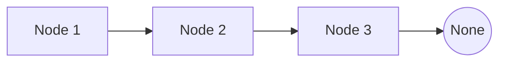
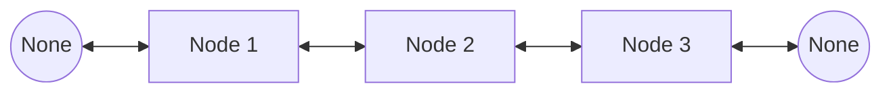
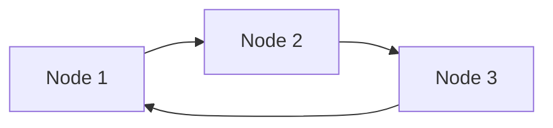

# Linked List
## Introduction
A linked list is a linear data structure where each element, called a node, contains a data part and a reference (or link) to the next node in the sequence.

## Types of Linked List
### Singly Linked List
In a singly linked list, each node points to the next node in the sequence and the last node points to `None`.


### Doubly Linked List
In a doubly linked list, each node contains two links: one pointing to the next node and one pointing to the previous node.


### Circular Linked List
In a circular linked list, the last node points back to the first node, forming a circular structure.


## Representation
A linked list node is represented in the following manner:
```python
class Node:
    def __init__(self, val):
        self.val = val
        self.next = None
```

## Operations on Linked List
### Insertion
Insertion involves adding a new node to the linked list. This can be done at the beginning, end, or at any given position.
```python
class LinkedList:
    def __init__(self):
        self.head = None
    
    def insert_at_end(self, val):
        node = Node(val)
        temp = self.head

        if temp is None:
            self.head = node
        else:
            while temp.next is not None:
                temp = temp.next
            temp.next = node
    
    def insert_at_start(self, val):
        node = Node(val)
        node.next = self.head
        self.head = node
```

### Traversal
Traversal involves visiting each node in the linked list in a sequential manner.
```python
class LinkedList:
    def __init__(self):
        self.head = None
    
    def traverse(self):
        temp = self.head

        while temp:
            print(temp.val, end="->")
            temp = temp.next
        print("None")
```

### Deletion
Deletion involves removing a node from the linked list. Like insertion, this can be done at the beginning, end, or any given position.
```python
class LinkedList:
    def __init__(self):
        self.head = None
    
    def delete(self, key):
        temp = self.head
        if temp and temp.val == key:
            self.head = temp.next
            temp = None
            return
        prev = None
        while temp and temp.val != key:
            prev = temp
            temp = temp.next
        if temp is None:
            return
        prev.next = temp.next
        temp = None
```

## Problems
### Reverse a Linked List
Given the head of a singly linked list, reverse the list and return the new head.

#### Intuition
- To reverse a singly linked list, we need to reverse the direction of the pointers between the nodes. Instead of each node pointing to the next node, it should point to the previous node. 
- This requires us to traverse the list while keeping track of the previous node, the current node, and the next node.
- For each node, save the next node as `next_node`. Reverse the next pointer of the current node to point to the previous node.
- Move the `prev` and `current` pointers one step forward (i.e., `prev` becomes the `current` node, and `current` becomes the next node).

Code
```python
def reverse_list(head):
    prev = None
    current = head

    while current:
        next = current.next
        current.next = prev
        prev = current
        current = next
    
    return prev # Prev will be the new head of the reversed list 
```

### Detect a Cycle in a Linked List
Given a linked list, determine if it has a cycle in it.

#### Intuition
- To detect a cycle in a linked list, you can use the `Floyd's Cycle-Finding Algorithm`, also known as `Tortoise and Hare` algorithm. 
- The idea is to use two pointers, one movice twice as fast as the other.
- If there is a cycle, they will eventually meet.
- Otherwise, the fast pointer will reach the end of the list.

```python
def detect_cycle(head):
    slow, fast = head, head

    while fast and fast.next:
        slow = slow.next
        fast = fast.next.next

        if slow == fast:
            return True
    
    return False
```

### Merge 2 Sorted Linked List
Merge two sorted linked lists and return it as a new sorted list.

#### Intuition
- The idea is to merge the 2 sorted linked into one sorted linked list.
- we can achieve this through going through each list one by one and comparing the nodes one by one, attaching the smaller node to the new list we're forming.
- We use a dummy node to simplyfy the process of attaching the nodes to the new list.

Code
```python
def merge_listS(head1, head2):
    dummy = Node(0)
    temp = dummy

    while head1 and head2:
        if head1.val <= head2.val:
            temp.next = head1
            head1 = head1.next
        else:
            temp.next = head2
            head2 = head2.next
        temp = temp.next
    
    if head1:
        temp.next = head1
    if head2:
        temp.next = head2
    
    return dummy.next
```

### Palindrome Linked List
Given a singly linked list, determine if it is a palindrome.

#### Intuition
- To detemine if a linked list is a palindrome, we need to if the list reads forward same as backwards. But for reading backwards we don't have any links unless it is a `doubly linked-list`.
- The strategy would be to find out the middle of the list, reversing the second half and then comparing both halves traversing from each end.
- Here we would also tackle how to find the `middle of the linked list` in an efficient manner.
- How do we handle odd length lists? - We only compare for the elements in the second half and thus the middle extra element is automatically skipped.

Code
```python
def is_palindrome(head):
    def find_middle(head):
        slow, fast = head, head
        while fast and fast.next:
            slow = slow.next
            fast = fast.next.next
        return slow

    def reverse_list(head):
        prev = None
        current = head

        while current:
            next_node = current.next
            current.next = prev
            prev = current
            current = next_node
        
        return prev

    middle = find_middle(head)
    tail = reverse_list(middle.next)

    while tail:
        if head.val != tail.val:
            return False
        head = head.next
        tail = tail.next
    
    # if the list is to be restored, keep the pointers in temp variables
    # call the reverse again on tail and set the next of middle to the result
    return True
```

### Copy List with Random Pointer
A linked list is given such that each node contains an additional random pointer which could point to any node in the list or null. Return a deep copy of the list.

#### Intuition
- To create a deep copy of a linked list with random pointers, we need to ensure that both the `next` and the `random` pointers in the new list correctly replicate those in the original list.
- We can use a hashmap to store the copy of the node and in the second pass we set the pointers using the hashmap tp find the corresponding copied nodes.

Code
```python
def copy_random_list(head):
    if not head:
        return None
    
    old_to_new = {}

    # First pass: Create all nodes and store them in the hash map 
    current = head
    while current:
        old_to_new[current] = Node(current.val)
        current = current.next
    
    # Second pass: Set next and random pointers
    current = head
    while current:
        if current.next:
            old_to_new[current].next = old_to_new[current.next]
        if current.random:
            old_to_new[current].random = old_to_new[current.random]
        current = current.next
    
    return old_to_new[head]
```

### Remove Nth Node from the End of List
Given the head of a linked list, remove the n-th node from the end of the list and return its head.

#### Intuition
To remove the n-th node from the end of a linked list, a straightforward approach would be to first traverse the the list to find its length, then calcluate the position of the node from the beginning. However, this approach requires **two passes** through the list.

We can use a modification of the `fast and slow pointer` technique that we have already used in order to accomplish this in a single pass. Working:

- We maintian two pointers, fast and slow and we move just the fast pointer `n+1` steps ahead creating a gap of `n` nodes between fast and slow pointers.
- Now on moving both the pointers till fast reaches the end of the list, the slow pointer points to the node that needs to be removed.

Code
```python
def remove_nth_from_end(head):
    dummy = Node(0, head)
    fast = dummy
    slow = dummy

    # Move the fast pointer n + 1 steps ahead - n nodes in between
    for _ in range(n+1):
        fast = fast.next
    
    # Move both pointers until fast reaches the end
    while fast:
        fast = fast.next
        slow = slow.next
    
    # Skip the node to be renewed
    slow.next = slow.next.next

    # Return the head of the modified list
    return dummy.next
```

### LRU Cache
The Least Recently Used (LRU) cache is a popular caching strategy that evicts the least recently accessed item when the cache reaches its capacity. The LRU cache should support the following operations:
- get(key): Retrieve the value of the key if the key exists in the cache, otherwise return -1.
- put(key, value): Update the value of the key if the key exists. Otherwise, add the key-value pair to the cache. 

If the number of keys exceeds the capacity from this operation, evict the least recently used key.

#### Intuition
- Hash Map: The hash map allows for O(1) access to the cache items by key.
- Doubly Linked List: The doubly linked list maintains the order of access, with the most recently accessed item at the head and the least recently accessed item at the tail. This allows for O(1) addition and removal of nodes.
