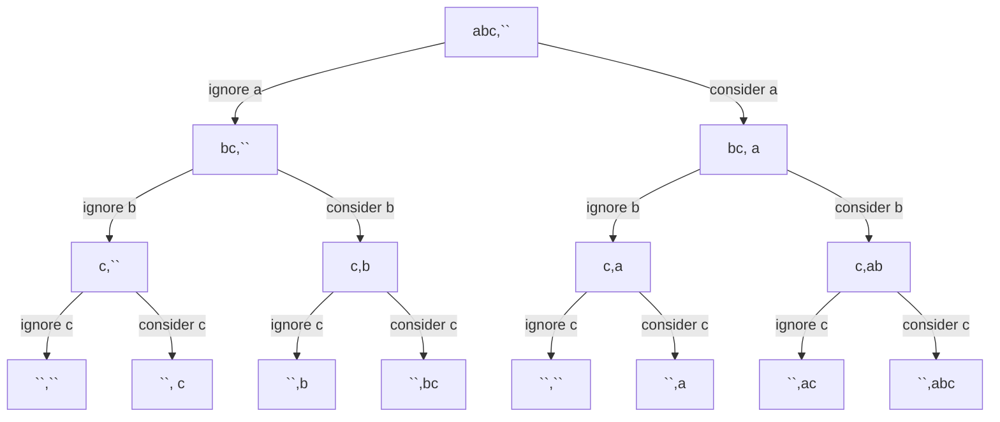
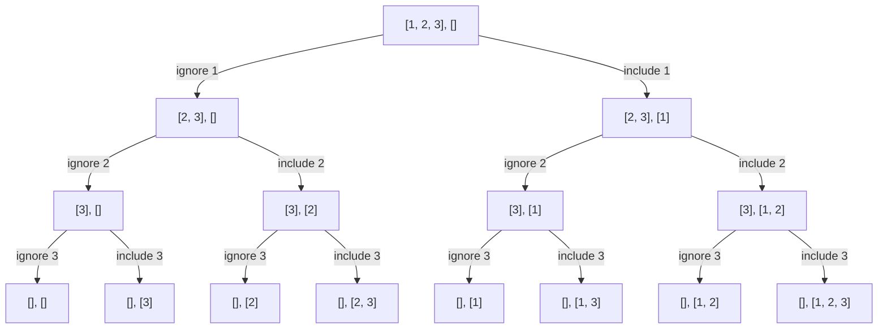
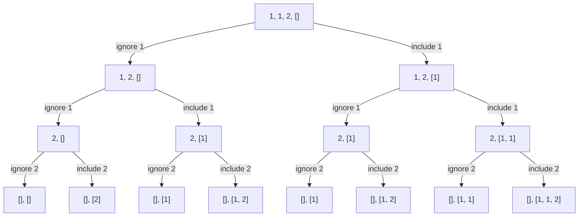
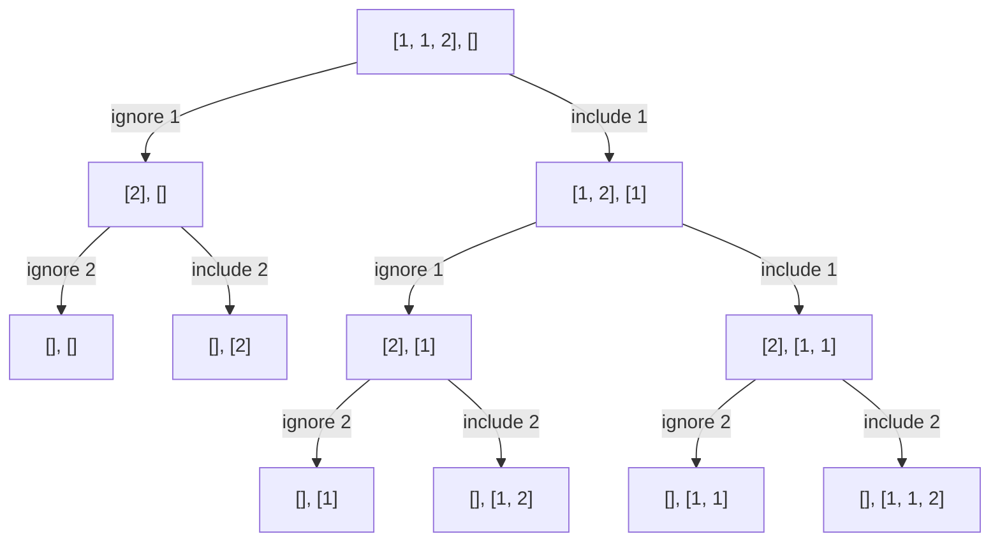
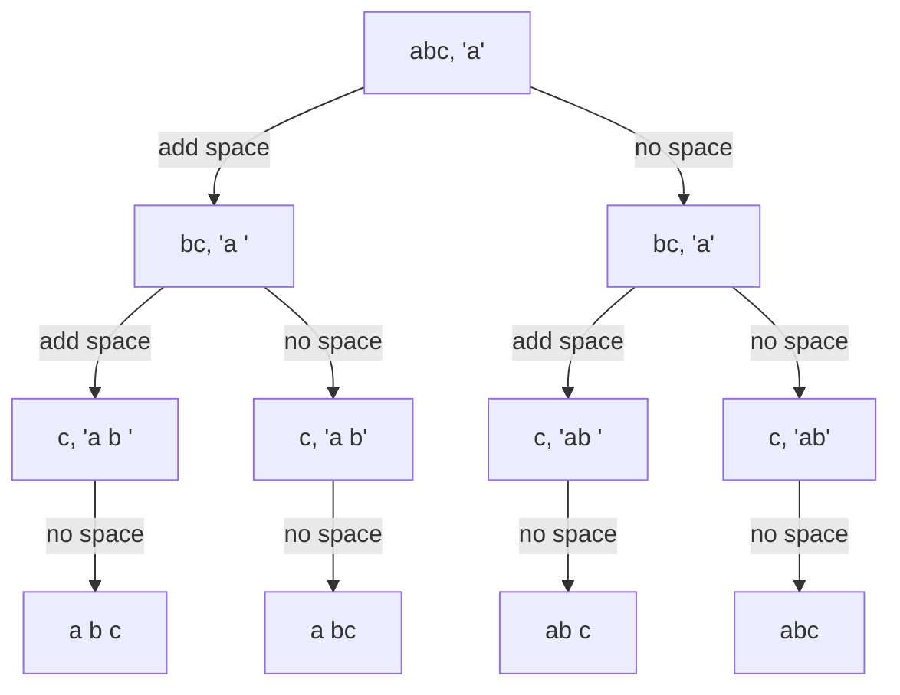
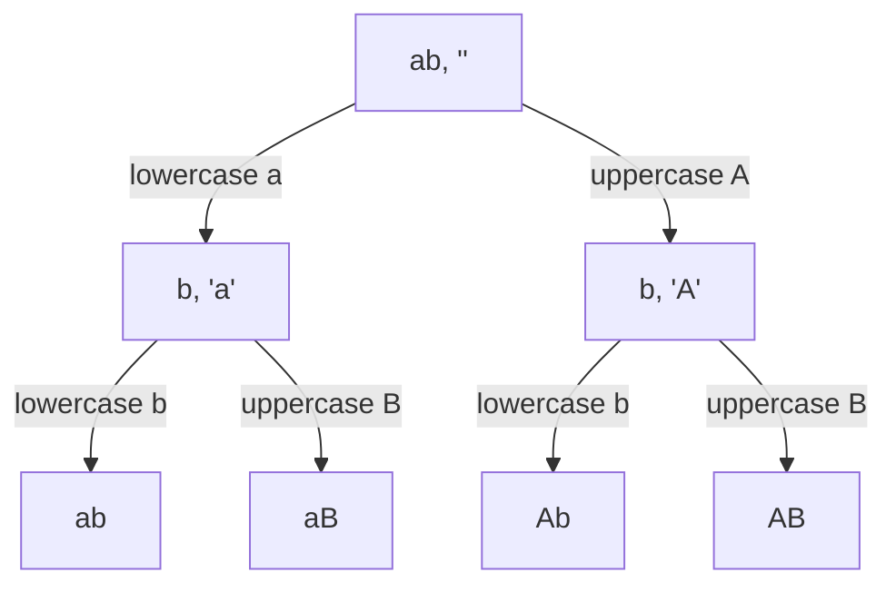
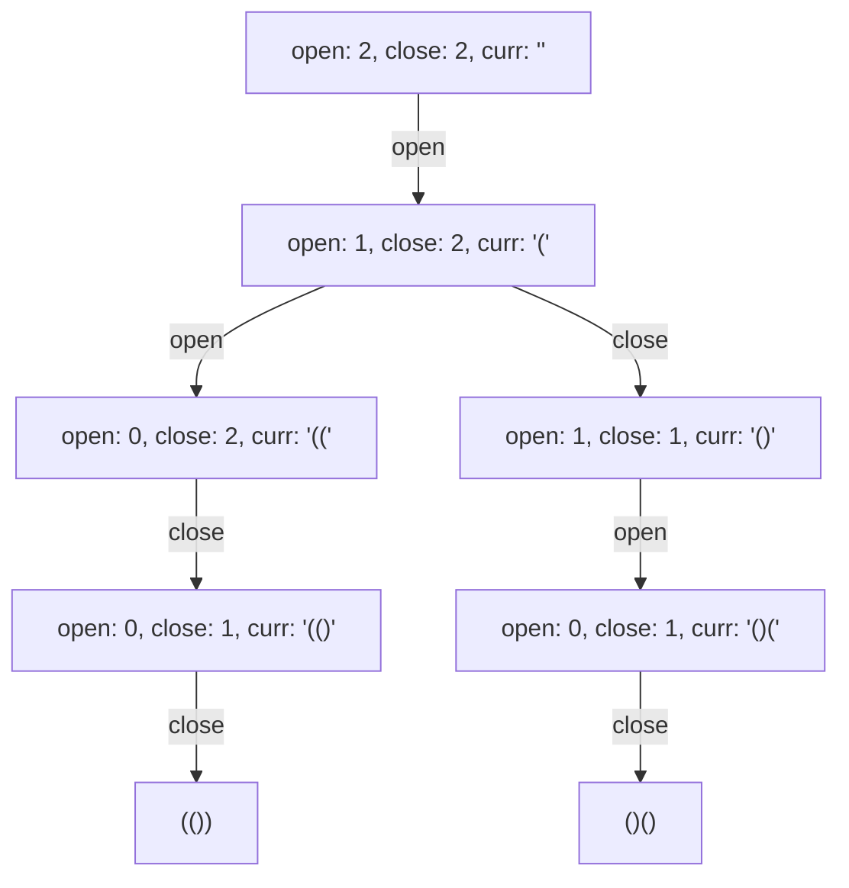
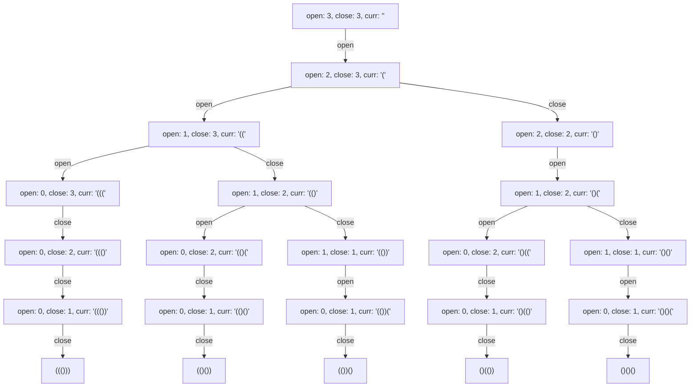

# Recursion
- Based on choices and decision which modify the input.
- We choose recursion when we notice that there is a decision space. 
- If you can draw a recursive tree for the problem, coding is the easy part.

## Recursion is everywhere
- Tree and Graph is based on recursion
- Recursion has multiple implementation:
  - Dynamic Programming
  - Backtracking
  - Divide and Conquer

## Approaches to solve recursive problems
1) Base Condition - Induction - Hypothesis (Making input smaller)
2) Recursive Tree - Input-Output Method (Taking Decisions)
3) Choice Diagram

### 1. Base Condition - Induction - Hypothesis (IBH) - For problems where decisions is not intuitive - reduce the input size
- Useful in Tree and Linked List problems
- Steps:
  - Design the hypothesis - that the function would work for a reduced/smaller input
  - Perform the induction step - perform the necessary step for the current input - through which hypothesis would become true
  - Base condition is the smallest valid input or largest invalid input

**Print from 1 to n**
- Hypothesis - the function works for (n-1)
- Induction - print n to the output
- Base Condition - if the value reaches 0 - return as this is the largest invalid input

```python
def solve(n):
    if n == 0: # Base condition
        return
    solve(n-1) # Hypothesis - would print from 1..n-1
    print(n) # Induction - print n
```
- Could we use recursive tree in this? the tree would be unbalanced

### 2. Recursive Tree - Input-Output Method:
- Start the tree by passing the input and output
- After taking a decision modify the input and pass to the next level with the output of the decision
- In a recursive tree: **number of branches = number of choices**

**Find all possible substrings**

Here we get all the possible substrings as the leaf-nodes of the recursive tree.

## Problems
### Induction-Base-Hypothesis
#### Height of a binary tree
- Hypothesis: On calling the function for any of the child node it would return the height of the child sub-tree
- Induction: The height would be - 1(for the current node) + max(left subtree, right subtree)
- Base Condition: When the node is None

```python
def height(root):
    if root is None: # Base condition
        return 0
    left_subtree_height = height(root.left) # Hypothesis
    right_subtree_height = height(root.right)
    return 1 + max(left_subtree_height, right_subtree_height)
```
#### Sort a stack
- Hypothesis: Calling the sort function after removing the top element - would return it sorted
- Induction: Insert the current element in the correct position in the stack and push the elements greater after it
- Base Condition: The stack has a single element
```python
def sort(stack):
    # Base Condition
    if len(stack) <= 1:
        return
    
    # Reduce Input
    top = stack.pop()

    # Hypothesis
    sort(stack)

    # Induction
    temp_stack = []
    while stack[-1] > top:
        temp_stack.append(stack.pop())
    stack.append(top)
    while temp_stack:
        stack.append(temp_stack.pop())
```
#### Delete middle element of stack
-  Hypothesis:
-  Induction:
-  Base Condition:
```python
``` 
#### Reverse stack
-  Hypothesis:
-  Induction:
-  Base Condition:
```python
``` 
#### [Kth Symbol in Grammar](https://leetcode.com/problems/k-th-symbol-in-grammar)
-  Hypothesis: For input (n+1) we hypothise that we would get the answer, k remains constant
-  Induction: Generate the string for n and pass as the one of the parameter for hypothesis call
-  Base Condition: When we reach `nth` row, return `kth` element 
```python
def solve(n, k):
    def helper(row, k, curr):
        # Base Condition
        if row == n:
            return curr[k]
        # Induction
        next = []
        for char in curr:
            if char == "0":
                next.append("01")
            else:
                next.append("10")
        next = "".join(next)
        # Hypothesis
        return helper(row+1, k, next) 
    return helper(1, k, "0")
``` 
**Another approach:**
-  Hypothesis: For smaller input for row `n-1` and any k value we would get the result.
-  Induction: On observation we could state:
   -  the first half of elements in row `n` is equal to the elements in row `n-1` - if k < mid - call with k
   -  the second half of elements in row `n` is equal to the complement of elements in row `n-1` - if k >= mid call with k-mid and complement the answer 
-  Base Condition: When row == 1 and k == 1 return 0
```python
def solve(n, k):
    if n == 1 and k == 1:
        return 0
    length = 2 ** n
    mid = length // 2
    if k <= mid:
        return solve(n-1, k)
    else:
        return not solve(n-1, k-mid)
``` 
#### Tower of Hanoi
-  Hypothesis: Move `n-1` plates from `s` to `h`
-  Induction: Move nth plate from `s` to `d` and `n-1` plate from `h` to `d`
-  Base Condition: When n reaches 1 move from `s` to `d`
-  Remember that the source, helper and the destination are being used interchangeably. Before each call you need to decide what would be assigned what role.
   -  For induction - source `s`, helper `d`, destination `h` - such that we can move the biggest plate to the destination
   -  For the hypothesis
      -  Moving the last plate from s - source `s`, helper `h`, destination `d` - same as the problem
      -  Moving the `n-1` plates to destination - source `h`, helper `s`, destination `d`
```python
source = 's'
helper = 'h'
destination = 'd'
def solve(source, helper, destination, n):
    # Base condition
    if n==1:
        print(f"Plate moved from {source} to {destination}")
        return
    # Hypothesis
    solve(source, destination, helper, n-1)
    # Induction
    print(f"Plate moved from {source} to {destination}")
    solve(helper, destination, source, n-1)
``` 
### Recursive Tree - Input/Output Method
#### Print all subsets
- **Decision space**: For each element either we include in the result space or not.
- Base condition: When all the elements of the input are already consider and index goes out of bounds. We add the current subset as one of the possible results.

Recursive tree

Code
```python
def subsets(nums):
    result = []
    n = len(nums)
    def solve(index, curr):
        if index == n:
            result.append(curr[:])
            return
        # Ignore
        solve(index+1, curr)
        # Include
        curr.append(nums[index])
        solve(index+1, curr)
        curr.pop()
    solve(0, [])
    return result
```
#### Subset Duplicates + Other variants
If there are duplicate elements in the subset, the recursive tree would look like:

As you observe in the leaf nodes there are duplicate subsets in the answer.
Solution:
- Store the subsets as a set and thus the duplicates would be automatically removed. But still computation is wasted as all the subtrees are computed.
- The issue is not with considering the element, just that when we are ignoring an element, ensure that we escape all the occurences of that particular element.



Code
```python
def distinct_subsets(nums):
    nums.sort()
    result = []
    n = len(nums)
    def solve(index, curr):
        if index == n:
            result.append(curr[:])
            return
        # consider
        curr.append(nums[index])
        solve(index+1, curr)
        curr.pop()

        # ignore
        while index+1 < n and nums[index] == nums[index+1]:
            index = index + 1
        solve(index+1, curr)
    solve(0, [])
    return result
```

##### Variants:
- Print powerset - same as get all subsets
- Print subsequence- Almost same as subset with order of input being maintained.
  - There are 3 concepts:
    - Substring: the subpart must be contiguous in nature
    - Subset: Choose elements in any order
    - Subsequence: The elements combination added to the result set may not be contiguous in nature
  - So the sort logic that we applied for subsets won't work, but the rest of the logic would remain the same.

#### Permutation with spaces
Choice: To add a space after the current element or not
Base Condition: When all the elements of the input is considered and the index goes out of bound.

Code:
```python
def permutations_space(s):
    n = len(s)
    result = []
    def solve(index, curr):
        if index == n-1:
            curr.append(s[index])
            result.append("".join(curr))
            curr.pop()
            return
        curr.append(s[index])

        # no space
        solve(index + 1, curr)
        # add space
        curr.append(" ")
        solve(index + 1, curr)
        curr.pop()

        curr.pop()
    solve(index + 1, [])
    return result
```
#### Permutation with case change
Choice: In the given input for each character we have 2 choices: uppercase or lowercase.
Base condition: When the index is out of bound or the end of the input string is reached.

Code: Here we would use another approach of handling strings permutations
```python
def permutation_case_change(s):
    n = len(s)
    result = []
    def solve(index, curr):
        if index == n :
            result.append(curr)
            return
        solve(index + 1, curr + s[index].lower())
        solve(index + 1, curr + s[index].upper())
    solve(0, "")
    return result
```
#### Generate all balanced parenthesis
- Base Condition: When both open and close reach 0, the current result is added to the response.
- Choices:
    - If the number of open brackets is greater than zero, we can add an open bracket (.
    - If the number of open brackets is less than the number of close brackets, we can add a close bracket ).

Recursive Tree:
- **n=2**


- **n=3**

Code
```python
def generateParenthesis(n):
    result = []
    def solve(open, close, curr):
        if open == 0 and close == 0:
            result.append(curr)
            return

        if open > 0:
            solve(open-1, close, curr+"(")
        
        if open < close:
            solve(open, close-1, curr+")")

    solve(n, n, "") 
    return result   
```
#### Josephus problem
