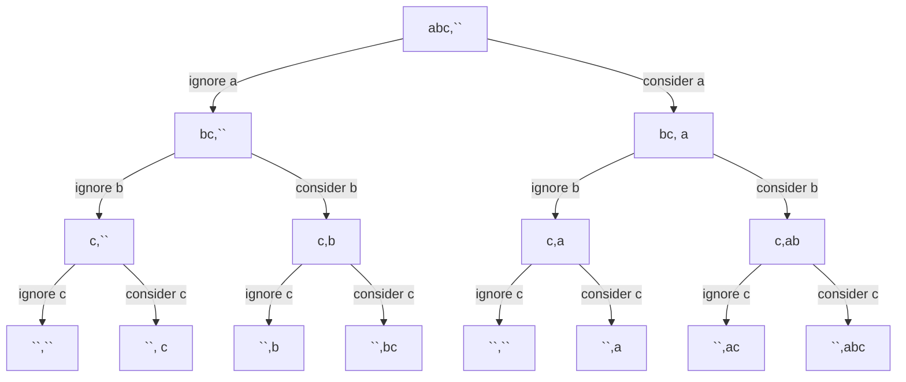

# Recursion
- Based on choices and decision which modify the input.
- We choose recursion when we notice that there is a decision space. 
- If you can draw a recursive tree for the problem, coding is the easy part.

**Remember: [Recursion = Choice + Decision]**

## Recursion is everywhere
- Tree and Graph is based on recursion
- Recursion has multiple implementation:
  - Dynamic Programming
  - Backtracking
  - Divide and Conquer

## Approaches to solve recursive problems
1) Base Condition - Induction - Hypothesis (Making input smaller)
2) Recursive Tree - Input-Output Method
3) Choice Diagram

### 1. Base Condition - Induction - Hypothesis (IBH) - For easy problems - Linked List, Tree
- Useful in Tree and Linked List problems
- Steps:
  - Design the hypothesis - that the function would work for a reduced/smaller input
  - Perform the induction step - perform the necessary step for the current input
  - Base condition is the smallest valid input or largest invalid input

**Print from 1 to n**
- Hypothesis - the function works for (n-1)
- Induction - print n to the output
- Base Condition - if the value reaches 0 - return as this is the largest invalid input

```
def solve(n):
    if n == 0: # Base condition
        return
    solve(n-1) # Hypothesis - would print from 1..n-1
    print(n) # Induction - print n
```
- Could we use recursive tree in this? the tree would be unbalanced

### 2. Recursive Tree - Input-Output Method:
- Start the tree by passing the input and output
- After taking a decision modify the input and pass to the next level with the output of the decision
- In a recursive tree: **number of branches = number of choices**

**Find all possible substrings**

Here we get all the possible substrings as the leaf-nodes of the recursive tree.

## Problems
### Induction-Base-Hypothesis
#### Height of a binary tree
- Hypothesis: On calling the function for any of the child node it would return the height of the child sub-tree
- Induction: The height would be - 1(for the current node) + max(left subtree, right subtree)
- Base Condition: When the node is None

```
def height(root):
    if root is None: # Base condition
        return 0
    left_subtree_height = height(root.left) # Hypothesis
    right_subtree_height = height(root.right)
    return 1 + max(left_subtree_height, right_subtree_height)
```
#### Sort an array using recursion
#### Sort a stack
#### Delete middle element of stack
#### Reverse stack
#### Kth Symbol in Grammar
#### Tower of Hanoi

### Recursive Tree - Input/Output Method