# Trees
A binary tree is a data structure in which each node has at most two children, referred to as the left child and the right child. 
Binary trees are used in various applications, such as searching, sorting, and hierarchical data structures like file systems.

## Terminologies
- **Node**: An element in the tree.
- **Root**: The top node of the tree.
- **Leaf**: The node with no children.
- **Edge**: The connection between two nodes.

Example:
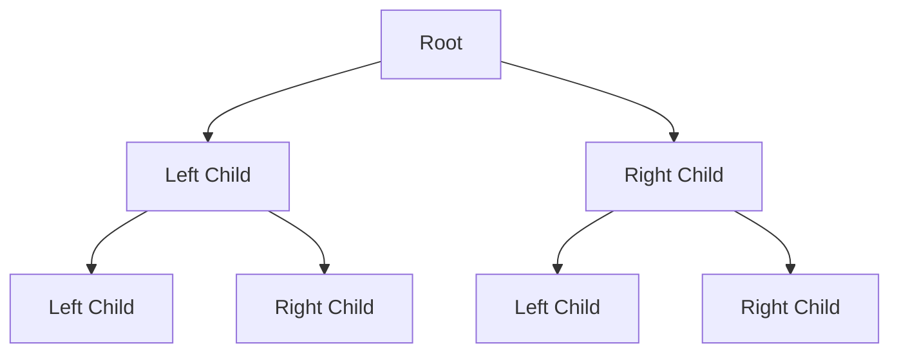

## Types:
### Full Binary Tree
Every node has either 0 or 2 children.
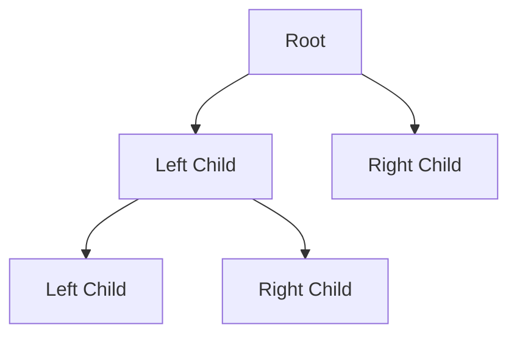

### Complete Binary Tree
All levels are completely filled except possibly the last level, which is filled from left to right.
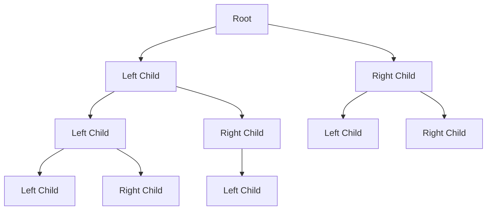

### Perfect Binary Tree
All the internal nodes have two children, and all leaves are at the same level.


### Balanced Binary Tree
The height of the left and right subtrees of any node differ by atmost one.
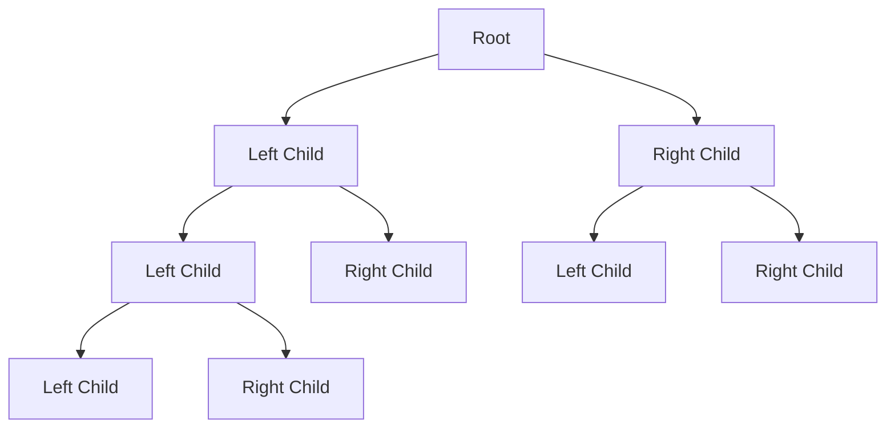

### Binary Search Tree
A binary tree in which each node has a key, and every node's key is greater than the keys in its left subtree and less than the keys in its right subtree.
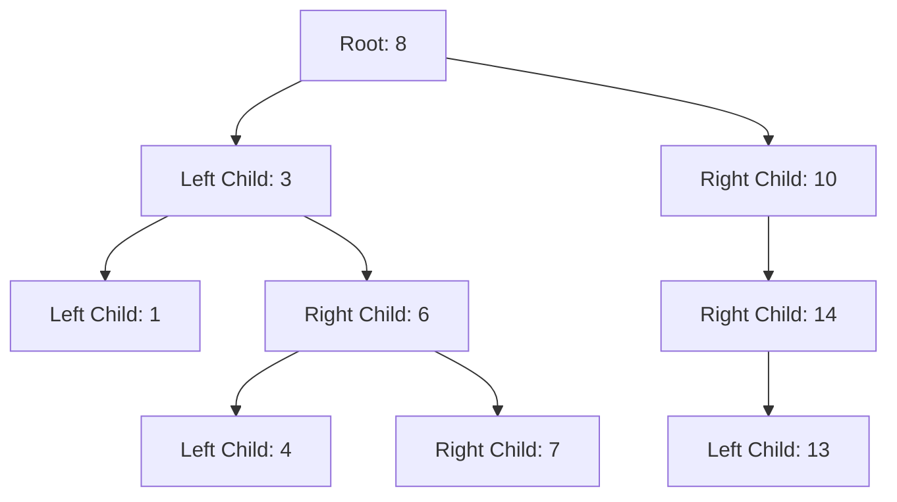

## Basic Structure
### Node class
Each node in the binary tree is represented by an instance of the `Node` class.
```python
class Node:
    def __init__(self, val):
        self.val = val
        self.left = None
        self.right = None
```

### Traversals
For the graph:
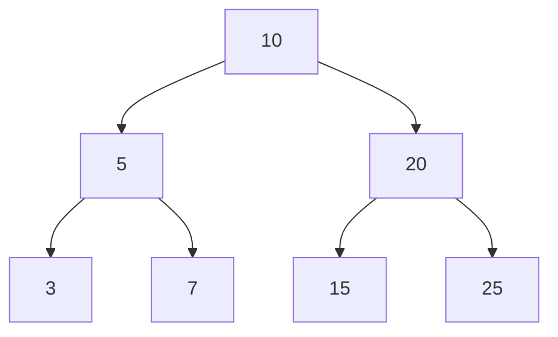
There are following traversals:
- **In-order Traversal**: Order(Left, Root, Right) - 3, 5, 7, 10, 15, 20, 25
- **Pre-order Traversal**: Order(Root, Left, Right) - 10, 5, 3, 7,20, 15, 25
- **Post-order Traversal**: Order(Left, Right, Root) - 3, 7, 5, 15, 25, 20, 10
- **Level-order Traversal**: Nodes level by level from left to right - 10, 5, 20, 3, 7, 15, 25

Code
```python
class BinaryTree:
    def __init__(self):
        self.root = None
    
    # In-order Traversal 
    def in_order_traversal(self, root):
        if root:
            self.in_order_traversal(root.left)
            print(root.val, end=', ')
            self.in_order_traversal(root.right)
    
    # Pre-order Traversal
    def pre_order_traversal(self, root):
        if root:
            print(root.val, end=', ')
            self.pre_order_traversal(root.left)
            self.pre_order_traversal(root.right)
    
    # Post-order Traversal
    def post_order_traversal(self, root):
        if root:
            self.post_order_traversal(root.left)
            self.post_order_traversal(root.right)
            print(root.val, end = ', ')
    
    # Level-order Traversal
    def level_order_traversal(self, root):
        if root is None:
            return
        queue = deque()
        queue.append(root)

        while queue:
            node = queue.popleft()
            print(node.val, end=', ')
            if node.left:
                queue.append(node.left)
            if node.right:
                queue.append(node.right)
```
**Fact: Inorder Traversal of a BST is always ordered.**

## Problems
### Invert Binary Tree
Given the root of a binary tree, invert the tree, and return its root.
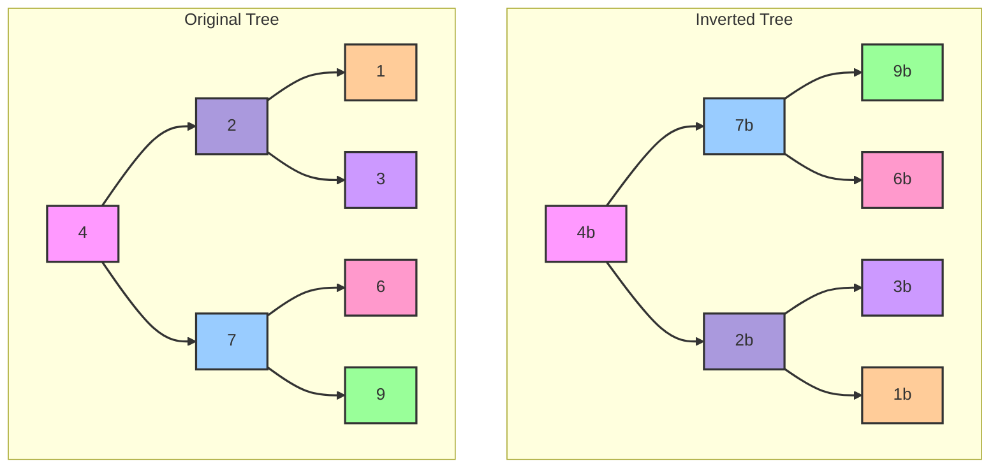

### Intuition
- We have to swap the children of the current node
- We we have recursively swap the left and right subtrees.

Code
```python
def invertTree(root):  
    # Base case: if the node is null, return null  
    if root is None:  
        return None  
      
    # Recursive case:  
    # Swap the left and right children  
    root.left, root.right = root.right, root.left  
      
    # Recursively invert the left and right subtrees  
    invertTree(root.left)  
    invertTree(root.right)  
      
    # Return the root node (which now represents the inverted tree)  
    return root
```

### Maximum Depth of Binary Tree
Given the root of a binary tree, return its maximum depth.

A binary tree's maximum depth is the number of nodes along the longest path from the root node down to the farthest leaf node.

#### Intuition
Check the height of both left and right subtree and choose the maximum one for the current node and do this recursively.

Code
```python
def max_depth(root):
    # Base condition: if root is None return 0 - tree empty
    if root is None:
        return 0
    return 1 + max(max_depth(root.left), max_depth(root.right))
```

### Diameter of Binary Tree
Given the root of a binary tree, return the length of the diameter of the tree.
The diameter of a binary tree is the length of the longest path between any two nodes in a tree. This path may or may not pass through the root.
The length of a path between two nodes is represented by the number of edges between them.

Example:
```
Input: root = [1, 2, 3, 4, 5]
Output: 3
```
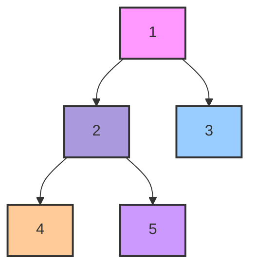
Explanation: Diameter: 4->2->1->3 = 3

#### Intuition
The diameter of a binary tree is the length of the longest path between any two nodes. This path may or may not pass through the root. To solve this problem, we need to consider the following:
- The longest path might pass through the root.
- The longest path might be entirely within the left subtree.
- The longest path might be entirely within the right subtree.

To find the longest path passing through any node, we can use the height (or depth) of the subtrees. The longest path through any node is the sum of the heights of its left and right subtrees.

```python
def diameter_binary_tree(root):
    # initialize maximum diameter
    max_diameter = [0]

    def depth(root):
        if not root:
            return 0
        
        # Recursively get the height of the left and the right subtrees
        left_height = depth(root.left)
        right_height = depth(root.right)

        # The diameter passign through this node is left_height + right_height
        max_diameter[0] = max(max_diameter[0], left_height + right_height)

        # Return the height of the current node
        return max(left_height, right_height) + 1
    
    depth(root)
    return max_diameter[0]
```

### Balanced Binary Tree
Given a binary tree, determine if it is height-balanced.
`height-balanced`: A height-balanced binary tree is a binary tree in which the depth of the two subtrees of every node never differs by more than one.

Example 1:
```
Input: root = [3, 9, 20, null, null, 15, 7]
Output: true
```
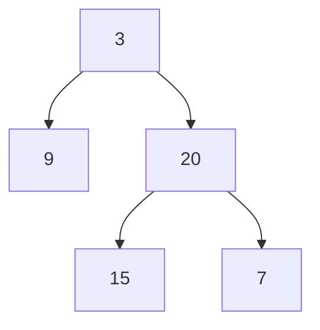

Example 2:
Input: root = [1, 2, 2, 3, 3, null, null, 4, 4]
Output: False
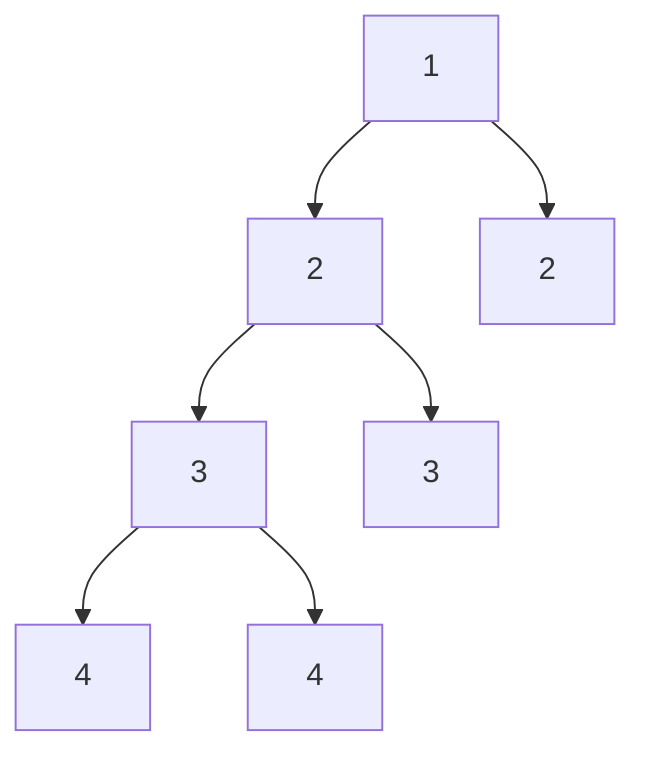
Explanation: The difference between the height of left and right subtree at root is: |3 - 1| = 2 (which is greater than 1, thus it is not balanced).

#### Intuition
- Compare the height of the left and the right subtree and check if the `absolute difference` is lesser than 1.
- Also we need to keep track if any of the subtrees are imbalanced as that would also mean that the entire tree as a whole is not balanced.

Code
```python
def is_balanced(root):
    def solve(root):
        if root is None:
            return (True, 0) # we use a tuple to pass both the height as well the balance status

        is_left_balanced, left_height = solve(root.left)
        is_right_balanced, right_height = solve(root.right)

        # Tree would be balanced only if left is balanced, right is balanced and the height difference of the left and right subtree is less than equal to 1  
        is_balanced = is_left_balanced and is_right_balanced and abs(left_height - right_height) <= 1

        return (is_balanced, 1 + max(left_height, right_height))
```
### Same Tree
Given the roots of two binary trees p and q, write a function to check if they are the same or not.

Two binary trees are considered the same if they are structurally identical, and the nodes have the same value.

Example 1:
```
Input: p = [1, 2, 3], q = [1, 2, 3]
Output: true
``` 

#### Intuition
- Check for the node by node for both the graph.
- Recursively traverse to both the subtrees and check if both the left subtrees are same and both the right subtrees are same.

Code
```python
def is_same_tree(p, q):
    if p is None and q is None:
        return True
    if p is None or q is None:
        return False
    if p.val != q.val:
        return False
    return is_same_tree(p.left, q.left) and is_same_tree(p.right, q.right)
```

### Subtree of Another Tree
Given the roots of two binary trees root and subRoot, return true if there is a subtree of root with the same structure and node values of subRoot and false otherwise.

A subtree of a binary tree tree is a tree that consists of a node in tree and all of this node's descendants. The tree tree could also be considered as a subtree of itself.

Explanation:
```
Input: root = [3, 4, 5, 1, 2], subRoot = [4, 1, 2]
Output: True
```
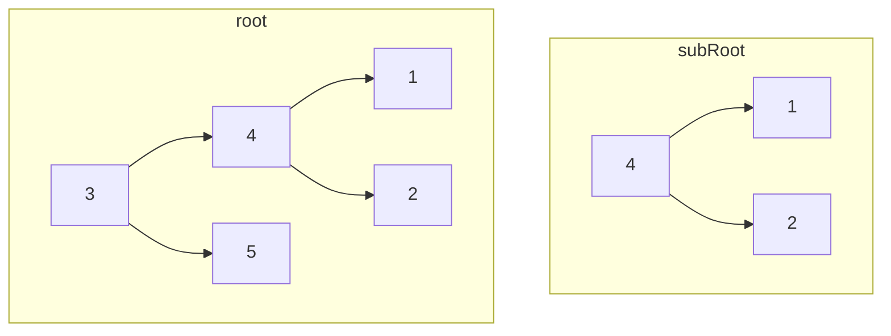

#### Intuition
- If the nodes match - we can do the `isSameTree` match that we have already seen earlier - taking node from the main graph and root from the subRoot
- Else, try with the left and the right subtree.

```python
def isSubTree(root, subRoot):
    if root is None:
        return False

    if root.val == subRoot.val and isSameTree(root, subRoot):
        return True
    return isSubTree(root.left, subRoot) and isSubTree(root.right, subRoot) 
```

### Lowest Common Ancestor of a Binary Search Tree
Given a binary search tree (BST), find the lowest common ancestor (LCA) node of two given nodes in the BST.

According to the definition of LCA on Wikipedia: “The lowest common ancestor is defined between two nodes p and q as the lowest node in T that has both p and q as descendants (where we allow a node to be a descendant of itself).”

Example:
```
Input: root = [6,2,8,0,4,7,9,null,null,3,5], p = 2, q = 8
Output: 6
```
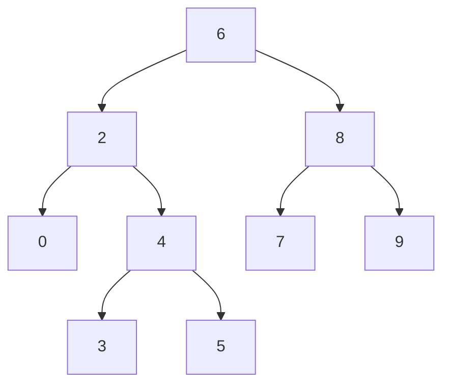
Explanation: The LCA of nodes 2 and 8 is 6.

#### Intuition
- **Binary Search Tree Property**:
  - In a BST, the left subtree of a node contains only nodes with values less than the node's value.
  - The right subtree of a node contains only nodes with values greater than the node's value.
- **Navigating the Tree**:
  - If both nodes p and q are greater than the current node, then the LCA must be in the right subtree.
  - If both nodes p and q are less than the current node, then the LCA must be in the left subtree.
  - If one node is on one side (left) and the other node is on the other side (right) of the current node, then the current node is the LCA.

Code
```python
def lca(root, p, q):
    if p.val < root.val and q.val < root.val:
        return lca(root.left, p, q)
    if p.val > root.val and q.val > root.val:
        return lca(root.right, p, q)
    return root
```

### Binary Tree Level Order Traversal
Given the root of a binary tree, return the level order traversal of its nodes' values. (i.e., from left to right, level by level).

Example:

```
Input: root = [3,9,20,null,null,15,7]
Output: [[3],[9,20],[15,7]]
```
#### Intuition
- This would be similar to the BFS or level-order traversal that we have seen earlier.
- The only difference would be that we would empty the queue for at once for each level and populate it with the children.

Code
```python
def level_order(root):
    if root is None:
        return []
    
    queue = deque()
    queue.append(root)
    result = []

    while queue:
        level_nodes = []
        level_size = len(queue)

        for _ in range(level_size):
            node = queue.popleft()
            level_nodes.append(node.val)
            if node.left:
                queue.append(node.left)
            if node.right:
                queue.append(node.right)
        
        results.append(level_nodes)

    return result
```

### Binary Tree Right Side View
Given the root of a binary tree, imagine yourself standing on the right side of it, return the values of the nodes you can see ordered from top to bottom.

Example:

```
Input: root = [3,9,20,null,null,15,7]
Output: [3, 20, 7]
```

#### Intuition
This would be a small modification on the existing level order traversal, where for each level we have to just add the last node to the result.

```python
def rightSideView(root):
    if root is None:
        return []
    
    result = []
    queue = deque()
    queue.append(root)

    while queue:
        level_size = len(queue)

        for i in range(level_size):
            node = queue.popleft()

            # Add to the result for the last node in the level
            if i == level_size - 1:
                result.append(node.val)
            if node.left:
                queue.append(node.left)
            if node.right:
                queue.append(node.right)
    
    return result
```

### Cound Good Nodes in Binary Tree
Given a binary tree `root`, a node `X` in the tree is named **good** if in the path from root to `X` there are no nodes with a value greater than `X`.

Return the number of **good** nodes in the binary tree.

Example:
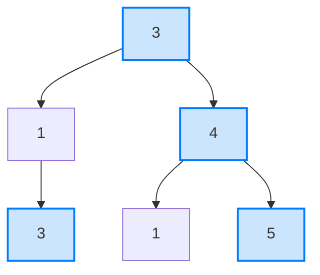
```
Input: root = [3,1,4,3,null,1,5]
Output: 4

Explanation: Nodes in blue are good.
Root Node (3) is always a good node.
Node 4 -> (3,4) is the maximum value in the path starting from the root.
Node 5 -> (3,4,5) is the maximum value in the path
Node 3 -> (3,1,3) is the maximum value in the path.
```

#### Intuition
A node in a binary tree is considered "good" if the value of the node is greater than or equal to the maximum value encountered on the path from the root to that node. The root node is always considered a good node since there are no other nodes on the path from the root to itself.

To find all the good nodes in a binary tree, we can use Depth-First Search (DFS) to traverse the tree while keeping track of the maximum value encountered along the path. At each node, if the node's value is greater than or equal to the maximum value so far, it's considered a good node.

Code
```python
def goodNodes(root: TreeNode) -> int:
    def dfs(node, max_val):  
        if not node:  
            return 0
            
        # Check if the current node is a good node  
        is_good = node.val >= max_val  
        count = 1 if is_good else 0  
            
        # Update the maximum value for the path  
        new_max_val = max(max_val, node.val)  
            
        # Recur for left and right subtrees  
        count = count + dfs(node.left, new_max_val)  
        count = count + dfs(node.right, new_max_val)  
            
        return count  
    
    return dfs(root, root.val)
```

### Validate Binary Search Tree
Given the root of a binary tree, determine if it is a valid binary search tree (BST).

A valid BST is defined as follows:
- The left subtree of a node contains only nodes with keys less than the node's key.
- The right subtree of a node contains only nodes with keys greater than the node's key.
- Both the left and right subtrees must also be binary search trees.

#### Intuition
- To validate if a binary tree is a BST, we need to ensure that for every node, all nodes in its left subtree are less than the node's value, and all nodes in its right subtree are greater than the node's value. 
- We can achieve this by using a recursive approach where we pass down the allowable range for node values.

For each node, we:
- Check if the node’s value is within the allowable range.
- Recursively validate the left subtree with an updated range where the upper bound is the current node’s value.
- Recursively validate the right subtree with an updated range where the lower bound is the current node’s value.

Code
```python
def is_valid_BST(root):
    def validate(root, low, high):
        # An empty tree is a valid BST
        if not root:
            return True

        # The current node's value must be between low and high  
        if not (low < node.val < high):
            return False
        
        # The left and right subtree must also be valid
        return validate(node.left, low, node.val) and validate(node.right, node.val, high)
    
    # For the root the boundary would be the maximum possible
    return validate(root, float('-inf'), float('inf'))
```

### Kth Smallest Element in BST
Given the root of a binary search tree, and an integer k, return the kth smallest value (1-indexed) of all the values of the nodes in the tree.

Example:
```
Input: root = [3,1,4,null,2], k = 1
Output: 1
```
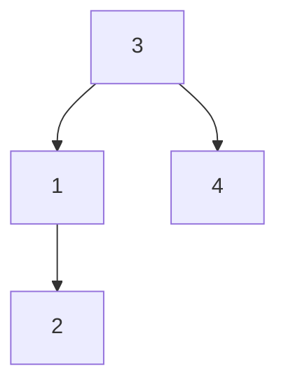

#### Intuition
- To find the kth smallest element in a BST, we can take advantage of the in-order traversal property of BSTs. **In-order traversal of a BST visits the nodes in ascending order**. 
- Therefore, performing an in-order traversal and keeping track of the count of nodes visited will allow us to find the kth smallest element.

Code
```python
def kthSmallest(root, k):
    # Helper function to perform in-order traversal  
    def in_order_traversal(node):  
        if node is None:  
            return []  
  
        # Traverse the left subtree, then the current node, and finally the right subtree  
        return in_order_traversal(node.left) + [node.val] + in_order_traversal(node.right)  
      
    # Perform in-order traversal to get all elements in sorted order  
    sorted_elements = in_order_traversal(root)  
      
    # Return the k-1th element since k is 1-indexed  
    return sorted_elements[k-1]
```

##### Iterative In-Order Traversal
The solution can be made more efficient by avoiding the need to store the entire in-order traversal in a list. Instead, using an iterative approach with a stack to perform the in-order traversal and stop as soon as you reach the kth smallest element. 

```python
def kthSmallest(root: TreeNode, k: int) -> int:  
    stack = []  
    current = root  
    count = 0  
      
    while stack or current:  
        # Go to the leftmost node  
        while current:  
            stack.append(current)  
            current = current.left  
          
        # Process the node  
        current = stack.pop()  
        count = count + 1  
          
        # If we've reached the kth node  
        if count == k:  
            return current.val  
          
        # Go to the right subtree  
        current = current.right
```

### Construct Binary Tree from Preorder and Inorder Traversal
Given two integer arrays preorder and inorder where preorder is the preorder traversal of a binary tree and inorder is the inorder traversal of the same tree, construct and return the binary tree.

Example:
```
Input: preorder = [3,9,20,15,7], inorder = [9,3,15,20,7]
Output: [3,9,20,null,null,15,7]
```


```
TODO
```

### Binary Tree Maximum Path Sum
Refer DP on Trees in Dynamic Programming

### Serialize and Deserialize Binary Tree
Serialization is the process of converting a data structure or object into a sequence of bits so that it can be stored in a file or memory buffer, or transmitted across a network connection link to be reconstructed later in the same or another computer environment.

Design an algorithm to serialize and deserialize a binary tree. There is no restriction on how your serialization/deserialization algorithm should work. You just need to ensure that a binary tree can be serialized to a string and this string can be deserialized to the original tree structure.

Clarification: The input/output format is the same as how LeetCode serializes a binary tree. You do not necessarily need to follow this format, so please be creative and come up with different approaches yourself.

Example:
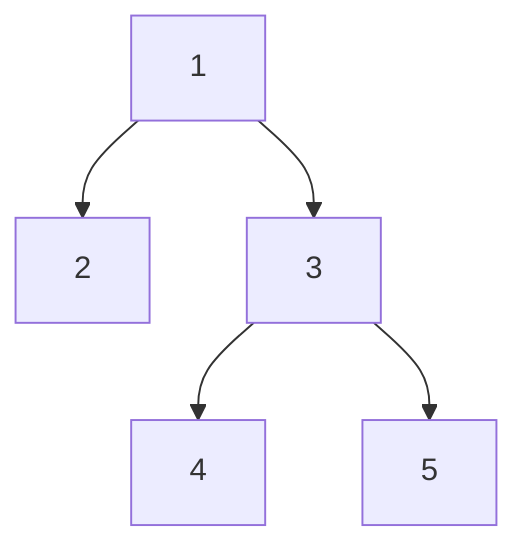
```
Input: root = [1,2,3,null,null,4,5]
Output: [1,2,3,null,null,4,5]
```
```
TODO
```
