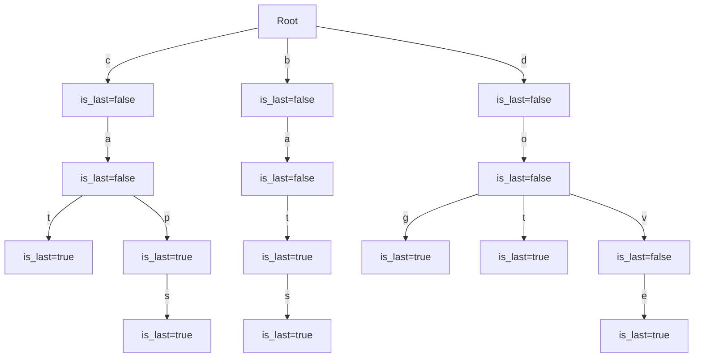

# Tries
A Trie (pronounced as "try") is a type of search tree—an ordered data structure used to store a dynamic set or associative array where the keys are usually strings. 

## Components of Trie:
- **Node**:
  - dictionary to store the children from this node 
  - flag to mark whether it is the last character of an input
  - doesn't store the actual character
- **Edges**:
  - each edge represents the transition from current character to the next possible one in the string.
  - the edge is labelled with a character from the input
- **Children**:
  - store the character as key and the child node as value possible from the current node.
- **Root**:
  - Empty node with the children declared marking the starting of the inputs.

## Diagram:
Here's an example of a Mermaid diagram for a trie containing the words "cat," "cap," and "bat":



## Identification
Look at the following keywords in the problem:
- dictionary
- prefix tree
- word search

## Code
The node definition for a trie would look like:
```python
class TrieNode:
    def __init__(self, is_last=False):
        # flag to check if this node represents the end of a word 
        self.is_last = is_last
        # dictionary to store children nodes where the key is a character and the value is another TrieNode
        self.characters = dict()
```

The code for a Trie with insertion and search would look like:
```python
class Trie:
    def __init__(self):
        self.root = TrieNode()
    
    def insert(self, word):
        node = self.root

        for char in word:
            # if the character is not already a child of the current node, add it 
            if char not in node.characters:
                node[char] = TrieNode()
            node = node.characters[char]
        
        # mark the last node as the end of the word
        node.is_last = True
    
    def search(self, word):
        node = self.root

        for char in word:
            # if the character is not found among the children of the current node, the word doesn't exist
            if char not in node.characters:
                return False
            node = node.characters[char]
        
        # check if the last node marks the end of a word 
        return node.is_last
    
    def prefix_search(self, prefix):
        node = self.root

        for char in prefix:
            # if the character is not found among the children of the current node, the prefix doesn't exist  
            if char not in node.characters:
                return False
            node = node.characters[char]
        
        # if we successfully traverse the prefix, it exists in the trie
        return True
```

## Problems

### [Word Search II](https://leetcode.com/problems/word-search-ii)
Given an  `mxn` board of characters and a list of strings `words`, return *all words* on the board.

#### Intuition
- We can consider `trie` as a graph and we perform **DFS** for all possible strings in the board i.e. for each (row, col) combination we can traverse the trie.
- Add the words that exist in the trie in the result.

### Longest word with all prefixes
Given an array of `words` and another array of `prefixes`. Return the longest word with all its prefixes available.

#### Intuition
- We already know that using `trie` we can check for the prefix, if the word exists in the trie.
- We can modify the structure of the `trie` to add a field called `has_prefix`and for each prefix we set it as `true`.
- Now we again go through the `trie` for each word and return the longest one.
